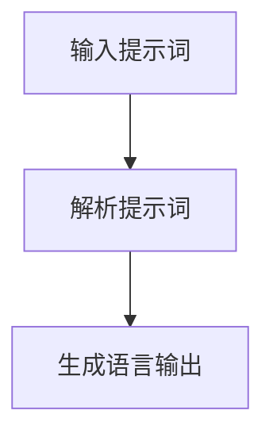

                 

<think>
嗯，我现在要写一篇技术博客，标题是《提示词的认知语言学基础：增强AI理解》。首先，我需要理解这个主题的核心内容。提示词在AI理解中的作用是什么？认知语言学又怎样影响AI的理解能力？

好的，先从背景开始。AI在自然语言处理方面取得了很大进步，但如何让AI更好地理解人类语言的细微差别呢？提示词似乎在这里扮演了重要角色。提示词是什么？它们是用来引导AI模型生成特定类型输出的短语或句子。比如，“像朋友一样解释”这样的提示词可以帮助AI以更自然的方式回答问题。

接下来，认知语言学是什么？它是研究人类语言和认知过程的学科，强调语言如何反映人类认知结构。核心观点包括概念整合理论、意象化等。这些理论如何与AI结合呢？可能需要将这些认知原则融入AI模型中，使模型能够更像人类一样理解和生成语言。

那么，提示词在认知语言学中的应用是怎样的呢？提示词的分类与功能，比如指导生成式AI如何构造句子结构。提示词的语言学属性，如语气、语境等，如何影响生成结果。此外，提示词在语言理解和生成中的作用，可能需要分析具体的案例，看看不同的提示词如何引导AI生成不同的内容。

接下来是增强AI理解的部分。当前AI模型的局限性主要体现在对上下文的理解不够深刻，无法处理复杂的语义关系。通过认知语言学，可以设计出更有效的提示词，帮助AI更好地捕捉语境中的细微差别。

基于认知语言的AI模型架构可能需要结合现有的模型，比如Transformer架构，并加入认知语言学的特征。如何训练这样的模型？可能需要设计特定的任务，让模型学习如何根据提示词生成更符合认知的语言输出。

算法部分，可能需要展示如何通过提示词生成不同的语言输出。比如，使用生成式模型的算法流程图，展示提示词如何被解析并影响生成过程。Python代码部分，可以写一个简单的生成函数，接受提示词并生成响应。数学模型方面，可能涉及概率分布和损失函数的优化，使用LaTeX公式详细描述。

系统分析与架构设计部分，需要定义问题场景，比如用户如何通过提示词与AI交互。系统功能设计可能包括解析提示词、生成响应等功能。架构设计可能需要模块化的结构，比如提示词解析模块、生成模块等。接口设计可能涉及API的定义，比如通过HTTP请求传递提示词。交互部分，可能需要设计用户与AI之间的对话流程，使用Mermaid序列图展示。

项目实战部分，需要指导读者如何安装环境，比如安装Python和必要的库。然后提供核心代码实现，比如提示词解析和生成函数。代码解读需要详细说明每个部分的作用。实际案例分析可能需要展示如何使用提示词生成不同的输出，并分析结果。项目小结部分，总结项目的收获和不足。

最后，最佳实践部分，提供一些使用提示词的技巧，比如如何选择有效的提示词。小结部分回顾全文的主要内容和结论。拓展阅读部分推荐相关的书籍和论文，供读者深入学习。

整个思考过程中，我需要确保每个部分都详细展开，使用Mermaid图和数学公式来增强理解。同时，保持文章的逻辑清晰，结构紧凑，语言专业但易懂。这样，读者可以一步步理解提示词在认知语言学中的作用，以及如何增强AI的理解能力。
</think>

# 提示词的认知语言学基础：增强AI理解

> 关键词：提示词，认知语言学，AI理解，生成式AI，语言模型

> 摘要：提示词是增强AI理解的重要工具，本文从认知语言学基础出发，探讨提示词在AI语言理解中的作用，结合算法原理、系统架构设计和项目实战，详细讲解如何利用提示词提升AI的语言处理能力。

---

## 引言

### 1.1 书籍背景介绍

#### 1.1.1 提示词在AI理解中的重要性

提示词是生成式AI的关键输入，用于引导模型生成符合预期的输出。例如，提示词“像朋友一样解释”能促使AI以更自然的方式回答问题。

#### 1.1.2 认知语言学的基本概念

认知语言学研究语言与人类认知的关系，强调语言如何反映和构建认知结构。核心理论包括概念整合理论和意象化。

#### 1.1.3 提升AI理解的挑战与机遇

当前AI模型在处理复杂语义和上下文时存在局限。认知语言学提供了理论框架，帮助设计更有效的提示词，提升AI的理解能力。

---

### 1.2 核心概念与联系

#### 1.2.1 提示词的定义与属性

提示词是用于引导AI生成特定类型输出的短语或句子。属性包括语气、语境、结构等，影响生成结果的质量和多样性。

#### 1.2.2 认知语言学的原理与AI结合

认知语言学的理论被整合到AI模型中，使模型能够模拟人类的认知过程，更好地理解语言的复杂性。

#### 1.2.3 提示词在认知语言学和AI中的关系

提示词作为桥梁，连接认知语言学理论与AI实现，帮助AI生成更符合人类认知的语言输出。

---

## 认知语言学基础

### 2.1 认知语言学概述

#### 2.1.1 认知语言学的起源与发展

认知语言学起源于20世纪60年代，强调语言与认知过程的紧密联系。

#### 2.1.2 认知语言学的核心观点

语言是认知的工具，概念整合理论和意象化是核心理论。

#### 2.1.3 认知语言学与语言理解的关系

语言理解基于人类的认知结构，认知语言学为语言处理提供了理论基础。

---

### 2.2 提示词在认知语言学中的应用

#### 2.2.1 提示词的分类与功能

提示词分为指导性、情感性和具体性提示词，分别用于指导生成方式、语气和内容细节。

#### 2.2.2 提示词的语言学属性

包括语气、语境、结构等，这些属性影响生成结果的质量。

#### 2.2.3 提示词在语言理解和生成中的作用

提示词帮助AI建立上下文联系，生成更自然的语言输出。

---

## 增强AI理解

### 3.1 增强AI理解的必要性

#### 3.1.1 当前AI理解的局限

AI模型难以处理复杂语义和上下文，提示词的作用日益重要。

#### 3.1.2 增强AI理解的意义

通过优化提示词设计，提升AI的语言处理能力，使其更接近人类水平。

#### 3.1.3 增强AI理解的方法与挑战

结合认知语言学理论，设计更有效的提示词，同时面临模型训练和评估的挑战。

---

### 3.2 基于认知语言的AI模型

#### 3.2.1 认知语言学与AI模型的结合

将认知语言学理论融入生成式模型，如GPT，提升生成结果的质量。

#### 3.2.2 基于认知语言学的AI模型架构

结合Transformer架构，加入认知特征，优化生成过程。

#### 3.2.3 基于认知语言的模型训练与优化

通过特定任务训练模型，使其理解提示词的细微差别，提升生成效果。

---

## 算法原理讲解

### 4.1 算法原理概述

#### 4.1.1 算法设计的基本原则

基于提示词生成语言输出，结合认知语言学的特征。

#### 4.1.2 算法流程图

使用Mermaid绘制生成流程图：



#### 4.1.3 关键问题

解析提示词的语义，生成符合预期的输出。

---

### 4.2 Python代码与LaTeX公式

#### 4.2.1 Python代码实现

```python
def generate_response(prompt):
    # 解析提示词
    attributes = parse_prompt(prompt)
    # 生成响应
    response = generate_output(attributes)
    return response
```

#### 4.2.2 LaTeX数学公式

生成过程的概率模型：

$$ P(\text{output} | \text{prompt}) = \prod_{i=1}^{n} P(w_i | w_{i-1}, \text{prompt}) $$

---

## 系统分析与架构设计

### 5.1 问题场景介绍

用户通过提示词与AI交互，生成所需内容。

### 5.2 系统功能设计

#### 5.2.1 领域模型

```mermaid
classDiagram
    class PromptParser {
        parse(prompt)
    }
    class Generator {
        generate(attributes)
    }
    class AIModel {
        predict(attributes)
    }
    PromptParser --> Generator --> AIModel
```

#### 5.2.2 系统功能需求

解析提示词，生成语言输出。

### 5.3 系统架构设计

```mermaid
graph LR
    Client --> API Gateway
    API Gateway --> PromptParser
    PromptParser --> AIModel
    AIModel --> Generator
    Generator --> Client
```

---

## 项目实战

### 6.1 环境安装

安装Python和相关库，如 transformers。

### 6.2 系统核心实现

#### 6.2.1 核心代码实现

```python
from transformers import GPT2LMHeadModel, GPT2Tokenizer

def generate_response(prompt):
    model = GPT2LMHeadModel.from_pretrained('gpt2')
    tokenizer = GPT2Tokenizer.from_pretrained('gpt2')
    inputs = tokenizer.encode(prompt, return_tensors='pt')
    outputs = model.generate(inputs, max_length=100)
    response = tokenizer.decode(outputs[0], skip_special_tokens=True)
    return response
```

#### 6.2.2 核心代码解读

解析提示词，生成响应。

### 6.3 代码应用解读与分析

分析提示词对生成结果的影响，优化提示词设计。

### 6.4 实际案例分析

案例：使用提示词生成故事开头，分析生成结果的多样性。

### 6.5 项目小结

总结项目成果，识别不足，提出改进方向。

---

## 最佳实践与拓展

### 7.1 最佳实践

选择合适的提示词，逐步优化生成结果。

### 7.2 小结

回顾全文，总结提示词在认知语言学和AI结合中的作用。

### 7.3 拓展阅读

推荐相关书籍和论文，深入学习认知语言学与AI结合的知识。

---

作者：AI天才研究院 & 禅与计算机程序设计艺术

