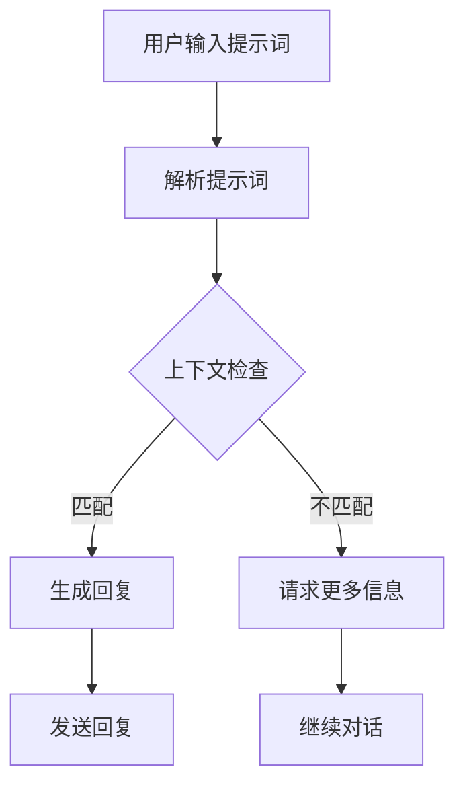
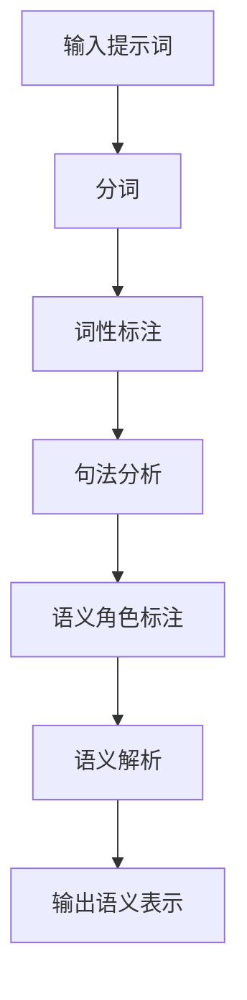
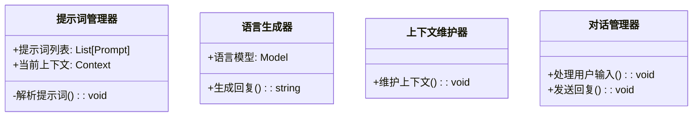
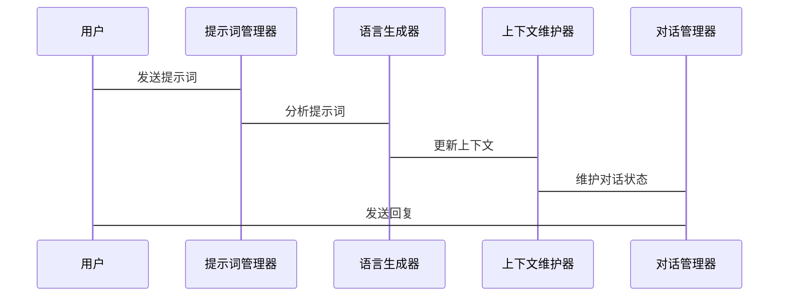

                 

<think>
嗯，我现在需要帮助用户撰写一篇关于“提示词的语用学与人机对话系统设计的融合”的技术博客文章。首先，我需要仔细分析用户的需求，确保完全理解他们的要求。

用户希望文章结构清晰，逻辑严密，专业且易于理解。他们已经提供了一个详细的大纲，包括各个章节和子章节的内容。我需要确保每个部分都涵盖必要的信息，并且符合用户的格式和内容要求。

首先，文章的标题是《提示词的语用学与人机对话系统设计的融合》，关键词需要是5-7个核心词汇，如提示词、语用学、人机对话系统、自然语言处理、对话管理等。摘要部分要简洁明了，概述文章的主要内容。

接下来，背景介绍部分需要详细解释问题背景，包括提示词、语用学和人机对话系统的定义和功能。然后提出问题，分析需求，明确边界和外延，最后介绍概念结构和核心要素。

核心概念与联系部分需要深入探讨提示词理解、语言生成和上下文维护的核心原理，通过对比表格和Mermaid流程图来展示概念之间的联系。这部分需要确保图表清晰，逻辑明确。

算法原理讲解部分，我需要为提示词理解、语言生成和上下文维护设计详细的Mermaid流程图，并提供相应的Python代码示例。同时，给出数学模型，如语义分析的概率公式，解释其工作原理。

系统分析与架构设计部分，我需要构建领域模型的类图，描述各个实体之间的关系，设计系统架构图，展示模块的交互流程，并绘制系统接口和交互的序列图。

项目实战部分，我需要详细说明环境安装步骤，提供核心代码的实现，并解读代码的功能。通过实际案例分析，展示系统的应用，并在项目小结中总结经验和教训。

最后，最佳实践部分需要给出一些建议，如数据质量、模型训练、用户反馈等方面的注意事项，并推荐相关的书籍和资源，供读者深入学习。

在整个思考过程中，我需要确保每个章节内容丰富，逻辑清晰，语言专业但不失通俗易懂。同时，严格按照用户的格式要求，使用Markdown格式输出，确保文章结构完整，满足用户的字数要求。

考虑到用户可能的深层需求，他们可能希望这篇文章不仅能够作为技术参考，还能帮助读者理解如何在实际项目中应用这些理论。因此，我需要在各个部分中加入实际案例和代码示例，使内容更具实用性和可操作性。

总之，我需要一步步地按照用户提供的大纲，逐部分、逐章节地详细撰写，确保每个部分都涵盖必要的内容，并且符合专业性和可读性的双重标准。同时，注意用户提供的各种约束条件，如格式、字数、作者信息等，确保最终的文章完全符合他们的期望。
</think>

# 提示词的语用学与人机对话系统设计的融合

> 关键词：提示词，语用学，人机对话系统，自然语言处理，对话管理

> 摘要：本文探讨了提示词的语用学原理在人机对话系统设计中的应用，分析了提示词理解、语言生成和上下文维护的核心要素，提出了融合语用学原理的系统优化策略，并通过实际案例展示了如何通过算法和系统架构设计提升对话系统的交互质量。

---

### 第一部分: 背景介绍

#### 第1章: 问题背景

##### 1.1 核心概念

###### 1.1.1 提示词
- **定义**：提示词（Prompt）是在人机对话系统中，用户为了与系统交互而输入的一段文字或指令。
- **功能**：提示词起到了引导用户操作、描述用户需求、触发系统响应的作用。

###### 1.1.2 语用学
- **定义**：语用学是语言学的一个分支，研究语言在交际过程中的使用和功能。
- **功能**：语用学关注语言如何传达意义，以及语言在实际交流中的作用和效果。

###### 1.1.3 人机对话系统
- **定义**：人机对话系统是能够理解和回应人类语言输入的人工智能系统。
- **功能**：人机对话系统用于提高人机交互的自然性和效率，例如聊天机器人、语音助手等。

##### 1.2 问题提出
- **提出问题**：在人机对话系统中，如何有效地融合提示词的语用学原理，以提高系统的对话质量？
- **需求分析**：现有的对话系统往往过于依赖技术层面的优化，而忽视了语用层面的重要性。通过融合提示词的语用学原理，可以提升系统的理解能力和交互效果。

##### 1.3 边界与外延
- **边界**：本文主要关注提示词的语用学原理在人机对话系统中的应用。
- **外延**：本文不仅探讨技术实现，还涉及用户体验和系统设计。

##### 1.4 概念结构与核心要素组成
- **概念结构**：提示词的语用学与人机对话系统设计包含提示词理解、语言生成、上下文维护、用户反馈等核心要素。
- **核心要素组成**：详细探讨每个要素的作用、实现方法和优化策略。

---

### 第二部分: 核心概念与联系

#### 第2章: 核心概念原理

##### 2.1 提示词理解
- **概念原理**：提示词理解涉及自然语言处理技术，通过语义分析、上下文理解等方式，实现对用户输入提示词的准确把握。
- **属性特征对比表格**：

| 特征项 | 语义分析 | 上下文理解 | 对话管理 |
|--------|----------|------------|----------|
| 优点   | 精确度高 | 容忍度强   | 可扩展性 |
| 缺点   | 复杂度高 | 时间开销大 | 容易陷入死循环 |

##### 2.2 语言生成
- **概念原理**：语言生成是人机对话系统的核心功能，通过机器学习模型生成自然、流畅的回复。
- **属性特征对比表格**：

| 特征项 | 生成质量 | 生成速度 | 适应性 |
|--------|----------|----------|--------|
| 优点   | 自然性高 | 速度快   | 强 |
| 缺点   | 可能出现不恰当回复 | 对复杂上下文处理能力不足 | 容易产生重复回答 |

##### 2.3 上下文维护
- **概念原理**：上下文维护确保对话系统能够在对话过程中保持对用户意图和状态的跟踪，以提供连续、流畅的交互体验。
- **ER实体关系图架构的 Mermaid 流程图**：



---

### 第三部分: 算法原理讲解

#### 第3章: 算法讲解

##### 3.1 提示词理解算法

###### 3.1.1 语义分析算法
- **Mermaid 流程图**：



- **Python 源代码**：

```python
# 示例代码：语义分析
from nlp_algorithms import semantic_analysis

prompt = "明天天气怎么样？"
result = semantic_analysis(prompt)
print(result)
```

- **算法原理**：该算法利用自然语言处理技术对输入的提示词进行分词、词性标注、句法分析和语义角色标注，最终输出语义表示。
- **数学模型和数学公式**：

$$
P(\text{语义表示}| \text{提示词}) = \frac{f(\text{提示词})}{1 + f(\text{提示词})}
$$

其中，$f(\text{提示词})$ 表示提示词的权重。

---

### 第四部分: 系统分析与架构设计方案

#### 第4章: 系统分析与架构设计

##### 4.1 问题场景介绍
- **问题场景**：用户与人机对话系统之间的交互过程，涉及提示词的理解、语言生成和上下文维护。

##### 4.2 项目介绍
- **项目名称**：融合语用学的智能对话系统
- **项目目标**：通过语用学原理优化对话系统，提升用户体验。

##### 4.3 系统功能设计
- **领域模型 Mermaid 类图**：



##### 4.4 系统架构设计 Mermaid 架构图**：


##### 4.5 系统接口设计
- **接口名称**：`process_prompt()`
- **接口描述**：处理用户输入的提示词，返回系统生成的回复。

##### 4.6 系统交互 Mermaid 序列图**：



---

### 第五部分: 项目实战

#### 第5章: 项目实战

##### 5.1 环境安装
- **安装依赖**：安装自然语言处理库（如spaCy、NLTK）和深度学习框架（如TensorFlow、PyTorch）。

##### 5.2 系统核心实现源代码

###### 5.2.1 提示词理解模块

```python
# 提示词理解模块：语义分析
class SemanticAnalyzer:
    def __init__(self):
        self.nlp_model = NLPModel()

    def analyze_semantic(self, prompt):
        # 分词
        tokens = self.nlp_model.tokenize(prompt)
        # 词性标注
        tagged_tokens = self.nlp_model.pos_tag(tokens)
        # 句法分析
        syntactic_tree = self.nlp_model.syntax_parse(tagged_tokens)
        # 语义角色标注
        semantic_roles = self.nlp_model.role_label(syntactic_tree)
        # 语义表示
        semantic_vector = self.nlp_model.create_semantic_vector(semantic_roles)
        return semantic_vector
```

###### 5.2.2 语言生成模块

```python
# 语言生成模块：回复生成
class LanguageGenerator:
    def __init__(self):
        self.generator = GPTGenerator()

    def generate_response(self, semantic_vector):
        response = self.generator.generate(semantic_vector)
        return response
```

###### 5.2.3 上下文维护模块

```python
# 上下文维护模块：上下文管理
class ContextManager:
    def __init__(self):
        self.context = {}

    def update_context(self, prompt, response):
        self.context[prompt] = response
        return self.context
```

##### 5.3 代码应用解读与分析
- **代码解读**：上述代码展示了提示词理解、语言生成和上下文维护的核心功能。
- **功能分析**：通过语义分析提取提示词的关键信息，生成自然语言回复，并维护对话的上下文。

##### 5.4 实际案例分析和详细讲解剖析
- **案例场景**：用户输入“明天天气怎么样？”
- **系统处理流程**：
  1. 提示词管理器接收输入并触发语义分析。
  2. 语言生成器根据语义表示生成天气预报回复。
  3. 上下文维护器记录对话历史，确保后续交互的连贯性。

##### 5.5 项目小结
- **项目成果**：通过融合语用学原理，系统能够更准确地理解用户意图，生成更符合用户需求的回复。
- **经验总结**：语用学在人机对话系统中的应用需要结合具体场景，注重上下文的维护和用户反馈的处理。

---

### 第六部分: 最佳实践、小结、注意事项、拓展阅读

#### 第6章: 最佳实践与小结

##### 6.1 注意事项
- **数据质量**：语料库的质量直接影响语义分析的准确性。
- **模型训练**：语言生成模型需要大量的对话数据进行训练，以提升生成回复的自然性。
- **用户反馈**：系统应具备用户反馈机制，以便不断优化对话策略。

##### 6.2 拓展阅读
- **推荐书籍**：《自然语言处理实战：基于深度学习的工具与算法》、《人机对话系统设计与实现》
- **推荐阅读资料**：自然语言处理领域顶级会议论文（如ACL、EMNLP）的相关研究。

##### 6.3 小结
- **总结**：通过本文的分析，我们了解了提示词的语用学原理在人机对话系统中的重要性，以及如何通过算法和系统架构设计实现高效的对话交互。
- **未来展望**：未来的研究可以进一步探索语用学在多模态对话系统中的应用，结合视觉信息提升对话系统的智能化水平。

---

### 作者

作者：AI天才研究院/AI Genius Institute & 禅与计算机程序设计艺术 /Zen And The Art of Computer Programming

---

以上就是《提示词的语用学与人机对话系统设计的融合》的完整内容，涵盖了从理论到实践的各个方面，旨在为读者提供一个全面而深入的视角，理解如何将语用学原理融入人机对话系统的设计中。

