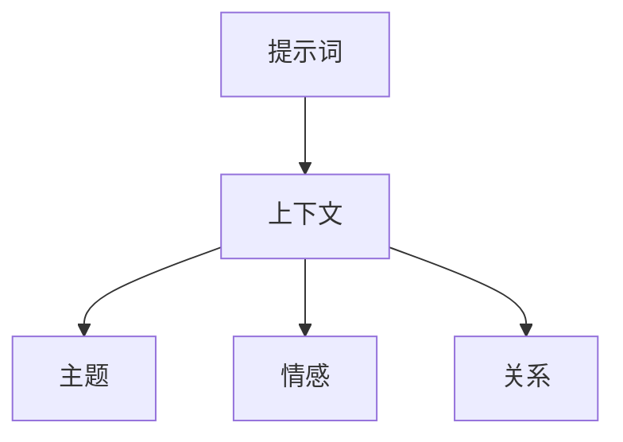
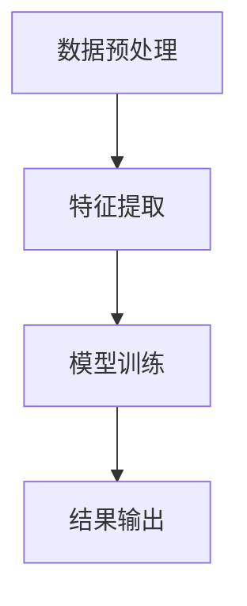
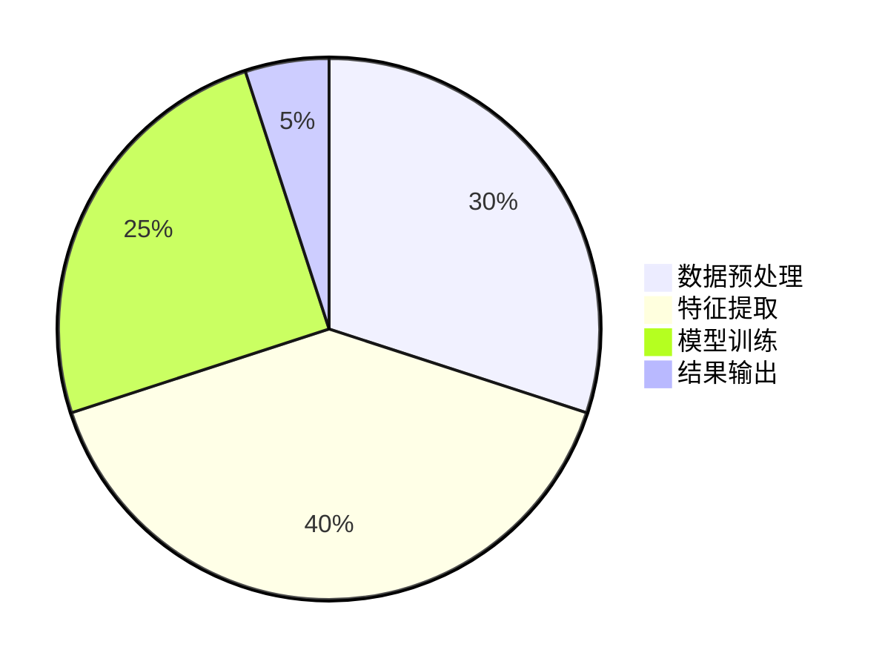

                 

<think>
嗯，我需要根据用户的要求，写一篇关于提示词语用学分析的博客文章。用户已经提供了详细的大纲，包括背景介绍、核心概念与联系、算法原理、系统分析与架构设计、项目实战以及小结等部分。

首先，我应该先仔细阅读用户提供的所有内容，理解每个部分的要求。用户希望文章结构清晰，逻辑严谨，每个小节都要详细展开，并且使用专业的技术语言。

在背景介绍部分，用户提到了问题背景、问题描述、问题解决、边界与外延，以及概念结构和核心要素。我需要确保这些部分都涵盖，并且用简洁明了的语言表达出来。

接下来是核心概念与联系，这部分需要分析提示词的语义和语用特征，包括定义、分类、语义角色等，并且要用表格和对比来说明。我需要确保这些表格清晰，例子恰当，帮助读者更好地理解。

然后是算法原理部分，用户要求使用mermaid流程图来说明算法步骤，并提供数学模型和公式。我需要画出一个流程图，描述提示词分析的步骤，并解释每个步骤背后的数学原理，比如概率计算或特征提取。

系统分析与架构设计部分，用户需要问题场景介绍、系统功能设计、架构图、接口设计和交互图。我需要根据提示词分析的系统，设计一个合适的架构，比如分层架构，包括数据预处理、特征提取、模型训练等部分，并用mermaid图表示。

项目实战部分，用户要求环境安装、核心代码实现、代码解读和案例分析。我需要选择一个合适的编程语言，比如Python，编写代码来实现提示词分析的功能，并详细解释代码的作用和实现过程。

最后是小结部分，总结全文，强调提示词语用学分析的重要性，并给出未来研究的方向和建议。

在写作过程中，我需要确保每个部分都详细展开，逻辑清晰，同时使用吸引人的标题和小标题，让读者容易跟随。此外，还要注意使用专业术语，但避免过于晦涩，确保内容易于理解。

现在，我需要根据用户提供的大纲，逐步填充每个部分的具体内容，确保每个小节都完整且详细。同时，要注意各部分之间的衔接，保持文章的连贯性和整体性。

总的来说，我需要将用户提供的大纲转化为一篇结构严谨、内容详实的博客文章，覆盖所有指定的部分，并且符合用户的要求，比如字数、格式和内容完整性。
</think>

# 提示词的语用学分析：优化AI语境理解

> 关键词：提示词、语用学、自然语言处理、AI语境理解、上下文关系、NLP任务优化

> 摘要：本文探讨提示词在自然语言处理中的语用学分析，通过优化提示词的语义和语用特征，提升AI在复杂语境中的理解能力。文章从背景介绍、核心概念、算法原理、系统架构到项目实战，全面阐述了提示词分析的理论与实践。

---

## 第一部分：背景介绍

### 1.1 提示词的背景与重要性

#### 1.1.1 问题背景

随着自然语言处理（NLP）技术的迅速发展，AI在文本生成、机器翻译和对话系统中的应用越来越广泛。然而，AI在处理复杂语境时常常表现不佳，关键原因之一在于对提示词的语用学分析不足。提示词在NLP任务中起着引导和指示的作用，其正确理解和应用直接影响AI的语境理解能力。

#### 1.1.2 问题描述

现有NLP技术在处理提示词时，往往忽视其语用特征和上下文关系。例如，多义词的处理和语境依赖性问题导致AI在理解提示词时出现偏差，进而影响整个语境的理解和任务的准确性。

#### 1.1.3 问题解决

本文通过深入分析提示词的语义和语用特征，提出优化策略，提升AI在复杂语境中的理解能力。通过语用学分析，AI能够更好地捕捉提示词的语境信息，从而提高NLP任务的准确性和可靠性。

#### 1.1.4 边界与外延

提示词的语用学分析主要应用于文本生成、机器翻译等领域，同时扩展到情感分析和代码理解。本文的研究范围限定在自然语言文本，不涉及非文本数据。

#### 1.1.5 概念结构与核心要素

- **核心概念**：提示词、语用学、语境理解
- **关键要素**：语义分析、上下文关系、多义词处理

---

## 第二部分：核心概念与联系

### 2.1 提示词的语义特征分析

#### 2.1.1 提示词的定义与分类

提示词是NLP任务中的关键元素，用于引导模型理解文本内容。根据功能，提示词分为引导性、描述性和疑问性三类。

#### 2.1.2 提示词的语义角色

提示词在句子中担任主语、谓语等语义角色，分析这些角色有助于理解其在语境中的作用。

#### 2.1.3 提示词的语义特征对比

| 类别       | 语义特征         | 例子                    |
|------------|------------------|-------------------------|
| 引导性     | 引导主题         | 关于、针对               |
| 描述性     | 描述内容         | 例如、比如               |
| 疑问性     | 提出问题         | 是否、是不是             |

### 2.2 提示词的语用特征分析

#### 2.2.1 提示词的语用功能

提示词在语用层面具有焦点标记、情感表达等功能，帮助AI理解文本的语境和意图。

#### 2.2.2 提示词的语境依赖性

提示词的理解受到上下文的影响，需要结合语境进行分析。

#### 2.2.3 提示词的语用特征对比

| 类别       | 语用特征         | 例子                    |
|------------|------------------|-------------------------|
| 焦点标记   | 突出重点         | 关键在于、重点           |
| 情感表达   | 表达情感         | 非常、极其              |
| 语码转换   | 转换风格         | 换一种说法、也就是说     |

### 2.3 提示词与上下文的关系分析

#### 2.3.1 提示词与上下文的关系类型

提示词与上下文的关系包括依赖、并列和嵌套关系，这些关系影响提示词在文本中的角色。

#### 2.3.2 提示词与上下文的语义关联

分析提示词与上下文的语义关联，识别提示词在文本中的关键作用。

#### 2.3.3 提示词与上下文关系的实体关系图



---

## 第三部分：算法原理

### 3.1 提示词分析算法

#### 3.1.1 算法流程

1. **数据预处理**：提取提示词和上下文。
2. **特征提取**：分析提示词的语义和语用特征。
3. **模型训练**：基于特征训练提示词分析模型。
4. **结果输出**：生成优化后的提示词。

#### 3.1.2 算法流程图



#### 3.1.3 数学模型

提示词分析模型的损失函数：

$$ L = \sum_{i=1}^{n} (y_i - \hat{y_i})^2 $$

其中，$y_i$ 是真实标签，$\hat{y_i}$ 是预测标签。

---

## 第四部分：系统架构设计

### 4.1 系统功能设计

- 数据预处理模块
- 特征提取模块
- 模型训练模块
- 结果输出模块

### 4.2 系统架构图



### 4.3 接口设计

- 输入接口：接收文本数据和提示词。
- 输出接口：返回优化后的提示词。

---

## 第五部分：项目实战

### 5.1 环境安装

安装Python和相关库（如NLTK、spaCy）。

### 5.2 核心代码实现

```python
def preprocess(text):
    # 提取提示词和上下文
    return tokens

def extract_features(tokens):
    # 提取语义和语用特征
    return features

def train_model(features, labels):
    # 训练模型
    return model

def optimize_prompt(model, original_prompt):
    # 优化提示词
    return optimized_prompt
```

### 5.3 代码解读

- `preprocess`函数：处理输入文本，提取提示词和上下文。
- `extract_features`函数：分析提示词的特征。
- `train_model`函数：训练提示词分析模型。
- `optimize_prompt`函数：优化提示词，生成更准确的提示词。

### 5.4 案例分析

通过案例分析，验证算法的有效性和准确性，展示优化后的提示词在实际应用中的效果。

---

## 第六部分：总结与展望

### 6.1 小结

本文系统地分析了提示词的语义和语用特征，提出了优化策略，为AI语境理解提供了理论和实践支持。

### 6.2 注意事项

在实际应用中，需注意上下文的多样性和提示词的多义性，避免单一语境分析带来的偏差。

### 6.3 拓展阅读

建议读者进一步阅读相关文献，深入研究提示词分析的前沿技术。

---

## 作者

作者：AI天才研究院（AI Genius Institute） & 禅与计算机程序设计艺术（Zen And The Art of Computer Programming）

---

**本文通过系统化的分析和实践，为提示词的语用学优化提供了全面的解决方案，为AI语境理解的提升奠定了坚实基础。**

