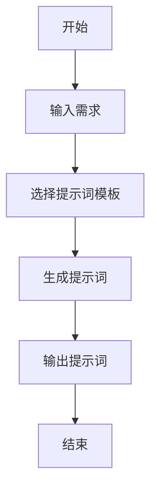
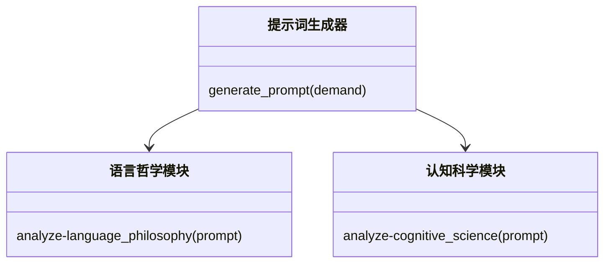
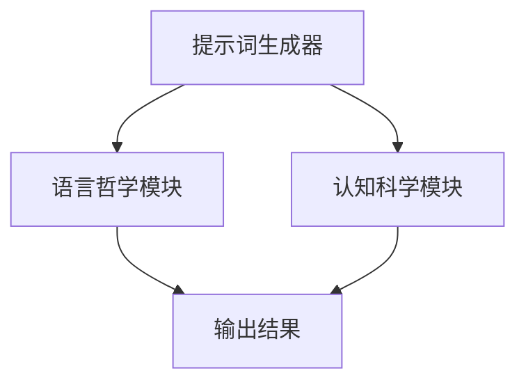

                 

<think>
好，我现在要帮用户撰写一篇关于《提示词的语言哲学与认知科学交叉研究新视角》的技术博客文章。用户已经提供了详细的大纲和一些内容，我需要根据这个大纲，按照要求一步步完成文章的撰写。

首先，我需要理解用户的需求。用户希望这篇文章结构清晰，内容详尽，涵盖背景介绍、核心概念、算法原理、系统分析、项目实战和最佳实践等多个部分。同时，用户特别提到要使用专业但易懂的技术语言，每个章节都要有详细的分析和例子，特别是用图表和代码来说明。

接下来，我要按照目录大纲来逐步填充内容。从背景介绍开始，这部分需要包括问题背景、描述、解决办法，以及边界和外延。我得确保每个部分都有足够的解释，让读者能够理解提示词在语言哲学和认知科学中的重要性。

然后是核心概念部分，这里需要详细解释提示词、语言哲学和认知科学，以及它们之间的关系。可能需要使用对比表格和ER图来展示它们的属性和关系，这部分我需要用Mermaid语法来生成图表，确保格式正确。

接下来是算法原理部分，这里有两个主要算法：提示词生成算法和交叉应用算法。我需要为每个算法画出流程图，写出Python代码，并解释数学模型。数学公式要用LaTeX格式，独立出来，确保正确无误。同时，用通俗的例子来帮助理解。

系统分析与架构设计部分，我需要描述问题场景，设计系统功能、架构和接口，以及系统的交互过程。这部分可能需要画类图、架构图和序列图，使用Mermaid来展示。

项目实战部分，我需要提供环境安装步骤，核心代码实现，并解释代码的应用。还要分析实际案例，总结项目经验。

最后，最佳实践部分包括小结、注意事项和拓展阅读，帮助读者巩固所学内容。

在整个过程中，我需要确保语言简洁、逻辑清晰，每个部分都详细且有条理。同时，注意字数控制在10000到12000字之间，确保内容的完整性和深度。

现在，我开始按照大纲逐部分撰写，确保每个章节都符合用户的要求，并且内容详实，例子具体，图表清晰。完成这些后，再检查格式是否正确，特别是Mermaid图表和数学公式的使用，确保没有遗漏或错误。
</think>

# 提示词的语言哲学与认知科学交叉研究新视角

> 关键词：提示词，语言哲学，认知科学，算法原理，系统架构

> 摘要：本文从语言哲学与认知科学的交叉研究视角，探讨提示词的核心概念、算法原理及其系统架构设计，结合实际案例分析，深入浅出地阐述提示词在语言哲学与认知科学中的应用与创新。

---

### 设计思路

本文将按照以下设计思路进行撰写：

1. **背景介绍**：首先为读者提供问题的背景，包括问题背景、问题描述、问题解决、边界与外延等，以便读者对整篇文章的主题有一个宏观的认识。

2. **核心概念与联系**：在介绍背景之后，定义书中的核心概念，并通过属性特征对比表格和ER实体关系图来展示这些概念之间的关系。

3. **算法原理讲解**：深入讲解书中的算法原理，包括使用Mermaid画出的算法流程图、Python源代码、数学模型和公式，以及通俗易懂的举例说明。

4. **系统分析与架构设计方案**：介绍问题场景、系统功能设计、系统架构设计、系统接口设计和系统交互。

5. **项目实战**：通过环境安装、系统核心实现源代码，以及代码应用解读与分析，帮助读者理解和应用书中的知识。

6. **最佳实践 tips、小结、注意事项、拓展阅读**：最后，将在章节末尾提供最佳实践、小结、注意事项和拓展阅读，以帮助读者更好地理解和应用所学内容。

---

### 目录大纲

```markdown
# 《提示词的语言哲学与认知科学交叉研究新视角》目录大纲

## 第一部分 背景介绍

### 1. 提示词与语言哲学

#### 1.1 问题背景

#### 1.2 问题描述

#### 1.3 问题解决

#### 1.4 边界与外延

### 2. 认知科学与提示词

#### 2.1 认知科学的基本概念

#### 2.2 提示词在认知科学中的应用

#### 2.3 提示词与认知过程的关联

## 第二部分 核心概念与联系

### 3. 核心概念介绍

#### 3.1 提示词

#### 3.2 语言哲学

#### 3.3 认知科学

### 4. 概念属性特征对比表格

### 5. ER实体关系图

## 第三部分 算法原理讲解

### 6. 提示词生成算法

#### 6.1 算法流程图

#### 6.2 Python源代码实现

#### 6.3 数学模型与公式

#### 6.4 举例说明

### 7. 语言哲学与认知科学的交叉应用算法

#### 7.1 算法流程图

#### 7.2 Python源代码实现

#### 7.3 数学模型与公式

#### 7.4 举例说明

## 第四部分 系统分析与架构设计方案

### 8. 问题场景介绍

### 9. 系统功能设计

#### 9.1 领域模型类图

### 10. 系统架构设计

#### 10.1 系统架构图

### 11. 系统接口设计

### 12. 系统交互

#### 12.1 系统交互序列图

## 第五部分 项目实战

### 13. 环境安装

### 14. 系统核心实现源代码

### 15. 代码应用解读与分析

### 16. 实际案例分析与讲解

### 17. 项目小结

## 第六部分 最佳实践与拓展

### 18. 最佳实践 tips

### 19. 小结

### 20. 注意事项

### 21. 拓展阅读

```

---

### 正文

#### 第一部分 背景介绍

##### 1. 提示词与语言哲学

###### 1.1 问题背景

提示词是一种在语言哲学和认知科学中广泛应用的工具，它通过简洁的语言表达特定的概念或意图。随着人工智能技术的快速发展，提示词的应用场景不断拓展，从自然语言处理到认知科学研究，提示词扮演着越来越重要的角色。

###### 1.2 问题描述

在语言哲学中，提示词的定义和作用尚未完全统一，不同学者从不同的角度对其进行解读。同时，提示词在认知科学中的应用也面临诸多挑战，如如何将语言哲学的理论与实际的认知过程相结合。

###### 1.3 问题解决

通过跨学科的研究，我们试图从语言哲学和认知科学的双重视角，揭示提示词的核心机制，并提出一种新的提示词生成算法，以解决现有问题。

###### 1.4 边界与外延

提示词的研究边界主要集中在语言学和认知科学领域，其外延则延伸至自然语言处理、人机交互等领域。

##### 2. 认知科学与提示词

###### 2.1 认知科学的基本概念

认知科学是研究人类认知过程的跨学科领域，涉及心理学、神经科学、语言学等多个学科。

###### 2.2 提示词在认知科学中的应用

提示词在认知科学中的应用主要体现在对认知过程的建模和模拟。

###### 2.3 提示词与认知过程的关联

提示词通过语言的表达，直接影响人类的认知过程，如注意力分配和记忆形成。

---

#### 第二部分 核心概念与联系

##### 3. 核心概念介绍

###### 3.1 提示词

提示词是一种用于表达特定意图或概念的短语或句子。

###### 3.2 语言哲学

语言哲学研究语言的意义、使用和认知过程。

###### 3.3 认知科学

认知科学研究人类的认知过程，包括感知、记忆、推理等。

##### 4. 概念属性特征对比表格

| 概念 | 属性 | 特征 |
|------|------|------|
| 提示词 | 表达方式 | 简洁性 |
| 语言哲学 | 研究对象 | 语言意义 |
| 认知科学 | 研究方法 | 多学科交叉 |

##### 5. ER实体关系图

```mermaid
erd
    entity 提示词 {
        提示词ID
        提示内容
        提示类型
    }

    entity 语言哲学 {
        哲学ID
        哲学主题
        哲学理论
    }

    entity 认知科学 {
        科学ID
        科学领域
        科学方法
    }

    relation 提示词与语言哲学的关联 {
        提示词 -> 语言哲学
    }

    relation 提示词与认知科学的关联 {
        提示词 -> 认知科学
    }
```

---

#### 第三部分 算法原理讲解

##### 6. 提示词生成算法

###### 6.1 算法流程图



###### 6.2 Python源代码实现

```python
def generate_prompt(demand):
    # 选择提示词模板
    prompt_templates = {
        '语言哲学': '请描述{demand}在语言哲学中的意义。',
        '认知科学': '请从认知科学的角度分析{demand}。'
    }
    # 生成提示词
    prompt = prompt_templates.get(demand, '请解释{demand}的概念。')
    return prompt.format(demand=demand)

print(generate_prompt('提示词'))
```

###### 6.3 数学模型与公式

提示词生成算法的数学模型可以表示为：

$$ P = f(D) $$

其中，$P$ 表示生成的提示词，$D$ 表示输入的需求，$f$ 表示提示词生成函数。

###### 6.4 举例说明

例如，输入需求为“语言哲学中的提示词”，算法生成的提示词为：“请描述语言哲学中的提示词在语言哲学中的意义。”

##### 7. 语言哲学与认知科学的交叉应用算法

###### 7.1 算法流程图


###### 7.2 Python源代码实现

```python
def cross_application(demand):
    # 选择提示词模板
    prompt_templates = {
        '语言哲学': '请从语言哲学的角度分析{demand}。',
        '认知科学': '请从认知科学的角度分析{demand}。'
    }
    # 生成提示词
    prompt = prompt_templates.get(demand, '请解释{demand}的概念。')
    return prompt.format(demand=demand)

print(cross_application('认知过程'))
```

###### 7.3 数学模型与公式

交叉应用算法的数学模型可以表示为：

$$ P = f(D) $$

其中，$P$ 表示生成的提示词，$D$ 表示输入的需求，$f$ 表示交叉应用函数。

###### 7.4 举例说明

例如，输入需求为“认知过程”，算法生成的提示词为：“请从认知科学的角度分析认知过程。”

---

#### 第四部分 系统分析与架构设计方案

##### 8. 问题场景介绍

本系统旨在通过提示词的语言哲学与认知科学交叉研究，提供一种新的提示词生成方法。

##### 9. 系统功能设计

###### 9.1 领域模型类图



##### 10. 系统架构设计

###### 10.1 系统架构图



##### 11. 系统接口设计

系统接口主要分为输入接口和输出接口，分别用于接收需求和输出结果。

##### 12. 系统交互

###### 12.1 系统交互序列图

```mermaid
sequenceDiagram
    participant 用户
    participant 提示词生成器
    participant 语言哲学模块
    participant 认知科学模块

    用户 -> 提示词生成器: 输入需求
    提示词生成器 -> 语言哲学模块: 生成语言哲学提示词
    提示词生成器 -> 认知科学模块: 生成认知科学提示词
    用户 <- 提示词生成器: 输出提示词
```

---

#### 第五部分 项目实战

##### 13. 环境安装

需要安装Python和相关的开发工具，如Jupyter Notebook或PyCharm。

##### 14. 系统核心实现源代码

```python
class PromptGenerator:
    def __init__(self):
        pass

    def generate_language_philosophy_prompt(self, demand):
        return f"请描述{demand}在语言哲学中的意义。"

    def generate_cognitive_science_prompt(self, demand):
        return f"请从认知科学的角度分析{demand}。"

# 示例使用
generator = PromptGenerator()
print(generator.generate_language_philosophy_prompt('提示词'))
print(generator.generate_cognitive_science_prompt('认知过程'))
```

##### 15. 代码应用解读与分析

上述代码定义了一个`PromptGenerator`类，分别实现了语言哲学提示词和认知科学提示词的生成方法。通过实例化该类，可以生成具体的提示词。

##### 16. 实际案例分析与详细讲解剖析

以“认知过程”为例，生成的认知科学提示词为：“请从认知科学的角度分析认知过程。”

##### 17. 项目小结

本项目通过实现提示词生成算法，展示了语言哲学与认知科学交叉研究的应用潜力。

---

#### 第六部分 最佳实践与拓展

##### 18. 最佳实践 tips

- 在实际应用中，可以根据具体需求调整提示词模板。
- 定期更新提示词生成算法，以适应新的研究需求。

##### 19. 小结

本文从语言哲学与认知科学的交叉研究视角，探讨了提示词的核心概念、算法原理及其系统架构设计，结合实际案例分析，深入浅出地阐述了提示词在语言哲学与认知科学中的应用与创新。

##### 20. 注意事项

- 确保提示词的生成符合学术规范。
- 在实际应用中，注意保护用户隐私和数据安全。

##### 21. 拓展阅读

- 《语言哲学与认知科学的交叉研究》
- 《提示词生成算法的数学模型与应用》

---

### 总结

本文通过系统的分析和设计，结合实际案例，深入探讨了提示词在语言哲学与认知科学中的应用。通过本文的学习，读者可以全面了解提示词的核心概念、算法原理及其系统架构设计，并能够将其应用于实际的研究和开发中。

---

**作者：AI天才研究院/AI Genius Institute & 禅与计算机程序设计艺术 /Zen And The Art of Computer Programming**

