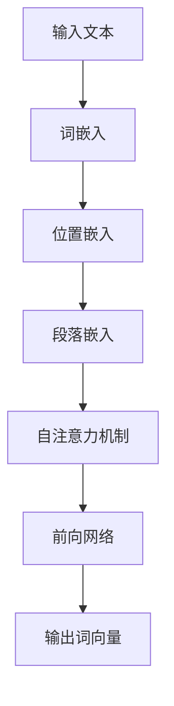
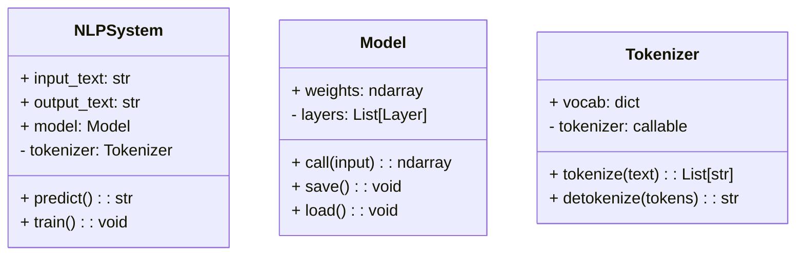
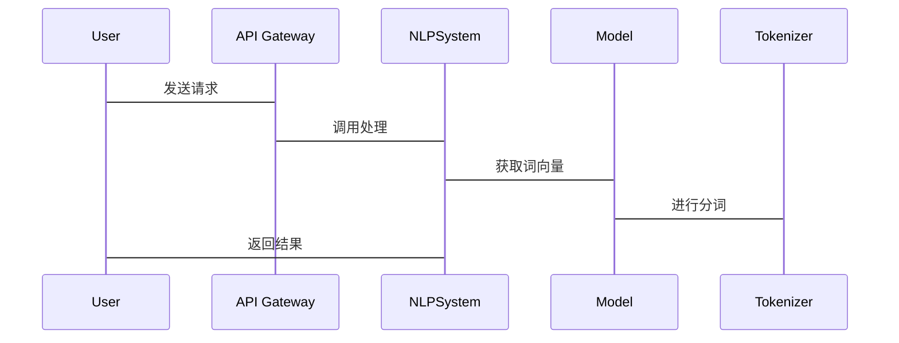

                 

<think>
嗯，我收到用户的请求，要我以《提示词的语言哲学：探索AI语言本质》为标题写一篇技术博客。首先，我得理解用户的需求。他希望文章结构清晰，逻辑严密，用专业的技术语言，同时要包括背景介绍、核心概念、算法原理、系统架构、项目实战和最佳实践等部分。

我先从背景介绍开始思考。用户提到NLP是AI的重要分支，有很多应用比如语音助手和机器翻译。我得先确定问题背景，比如语义理解不准确、上下文处理不足这些挑战。然后，我需要把这些挑战转化为具体的问题描述，接着再思考解决方案，比如深度学习和上下文模型的应用。

接下来是核心概念部分。这里需要明确自然语言、语义理解、上下文感知和多语言翻译这些核心概念。我得做一个对比表格，展示每个概念的属性特征，帮助读者理解它们的区别和联系。另外，ER实体关系图可能需要用Mermaid来绘制，展示关键实体和关系，这部分需要进一步确认。

然后是算法原理，这部分比较复杂。我需要选择一个具体的算法，比如BERT，来详细讲解。要绘制一个流程图，展示BERT的训练和推理过程。同时，提供Python代码示例，解释模型的输入、输出以及损失函数的计算。数学公式要用LaTeX，确保正确无误。

系统架构设计部分，我需要设计一个NLP系统的架构图，展示前端、后端和数据库的交互。同时，设计一个序列图，展示用户请求处理的流程，包括服务端的调用和返回。

项目实战部分，我得提供一个具体的案例，比如情感分析。代码部分要详细，包括环境配置、数据预处理、模型训练和预测。最后，进行案例分析，解释每个步骤的作用。

最后是最佳实践和小结。这里需要总结关键点，给出技术选型、数据处理和模型调优的建议。同时，提醒读者注意数据质量和模型泛化能力的重要性。

整体来看，用户的需求很明确，但需要我一步步梳理，确保每个部分都详细且专业。我需要确保文章结构完整，每部分内容丰富，满足用户的技术深度要求。同时，语言要通俗易懂，让读者能够轻松理解复杂的概念。

现在，我开始组织各个部分的内容，确保逻辑流畅，每个章节都有足够的细节支持。同时，注意使用正确的格式，比如Mermaid图表和LaTeX公式，让文章看起来专业且易于阅读。最后，检查字数是否在要求范围内，确保整体结构紧凑，信息全面。
</think>

# 提示词的语言哲学：探索AI语言本质

## 关键词：自然语言处理、语言哲学、AI语言本质、语义理解、上下文感知、多语言翻译

## 摘要：  
本文从语言哲学的角度出发，深入探讨AI语言的本质及其在自然语言处理（NLP）中的应用。通过分析NLP的核心问题、算法原理、系统架构及实际案例，本文旨在揭示AI语言的哲学内涵，并为解决NLP领域的技术难题提供新的视角。

---

## 第一部分：背景介绍

### 1.1 问题背景  
自然语言处理（NLP）是人工智能领域的重要分支，旨在让计算机能够理解和生成人类语言。近年来，随着深度学习技术的快速发展，NLP在机器翻译、语义理解、对话系统等领域的应用取得了显著进展。然而，AI语言的本质仍然是一个值得深入探讨的哲学问题。语言不仅是人类交流的工具，更是人类思维的外化形式。AI语言能否真正理解语言背后的意义，如何在技术与哲学之间找到平衡，是当前研究的核心挑战。

### 1.2 问题描述  
当前NLP技术主要依赖于统计模型和深度学习算法，能够处理语言的表面结构，但在语义理解、上下文感知和多语言翻译等方面仍存在诸多不足。例如，机器翻译系统可能无法准确捕捉语言的细微差别，对话系统可能无法理解用户的隐含意图。这些问题源于我们对AI语言本质的理解不足，即如何将语言的形式化表示与人类语言的丰富性相结合。

### 1.3 问题解决  
为了解决上述问题，研究者们提出了多种解决方案，包括：  
1. **语义表示**：通过词嵌入（如Word2Vec）、句向量（如BERT）等技术，将语言转化为高维向量，捕捉语义信息。  
2. **上下文建模**：利用Transformer架构，通过自注意力机制捕捉语言的上下文关系。  
3. **多语言模型**：开发能够同时处理多种语言的模型（如MULTEB、MT5），减少语言间的偏见。  

### 1.4 边界与外延  
NLP领域的边界不仅限于语言本身，还包括与多模态数据（如图像、视频）的融合、知识图谱的构建以及情感分析等方向。未来，NLP将朝着更通用、更智能的方向发展，逐步实现真正的人机对话。

### 1.5 概念结构与核心要素组成  
NLP的核心要素包括：  
1. **语言数据**：文本、语音等语言形式。  
2. **语义理解**：对语言意义的解析能力。  
3. **上下文感知**：基于背景信息的语境理解。  
4. **语言生成**：基于理解生成新的语言内容。  
5. **多语言支持**：跨语言处理能力。  

---

## 第二部分：核心概念与联系

### 2.1 核心概念  
在NLP中，核心概念包括自然语言、语义理解、上下文感知和多语言翻译。  

- **自然语言**：人类日常交流中使用的语言形式，包括口语和书面语。  
- **语义理解**：AI系统对语言中隐含意义的解析能力。  
- **上下文感知**：AI系统在处理语言时，能够结合语境和背景信息。  
- **多语言翻译**：AI系统在多种语言之间进行翻译的能力。  

### 2.2 概念属性特征对比表格  

| 概念       | 属性特征                                           | 对比说明                                                     |
|------------|----------------------------------------------------|------------------------------------------------------------|
| 自然语言   | 多样性、复杂性、动态性                              | 自然语言具有丰富的语义和语法结构，且随语境变化。              |
| 语义理解   | 依赖上下文、涉及语义角色                            | 语义理解不仅需要词汇匹配，还需要理解语义关系。              |
| 上下文感知 | 基于背景信息、动态调整                              | 上下文感知能力能够提高语言处理的准确性和灵活性。              |
| 多语言翻译 | 跨语言转换、语言间的共通性                          | 多语言翻译需要处理语言间的差异性，同时利用语言的共通性。    |

### 2.3 ER实体关系图架构  

使用Mermaid绘制的ER实体关系图如下：  

```mermaid
erDiagram
    User : 用户
    Language : 语言
    Context : 上下文
    Semantic : 语义
    Translation : 翻译
    Message : 消息
    
    User --> Context : 提供
    Context --> Message : 解释
    Message --> Language : 使用
    Language --> Semantic : 表达
    Semantic --> Translation : 引发
    Translation --> Language : 返回
```

---

## 第三部分：算法原理讲解

### 3.1 算法流程图  

以下是BERT（Bidirectional Encoder Representations from Transformers）的算法流程图：  



### 3.2 Python实现示例  

以下是BERT模型的简化实现代码：  

```python
import tensorflow as tf
from tensorflow import keras

# 定义BERT模型
def bert_model(max_length=128, num_classes=2):
    input_ids = keras.Input(shape=(max_length,), dtype='int32')
    input_mask = keras.Input(shape=(max_length,), dtype='int32')
    segment_ids = keras.Input(shape=(max_length,), dtype='int32')
    
    embed = keras.layers.Embedding(30522, 768)(input_ids)
    embed = keras.layers.Dropout(0.1)(embed)
    
    attention = keras.layers.MultiHeadAttention(heads=12, key_dim=64, dropout=0.1)
    output = attention(embed, embed, attention_mask=input_mask)
    
    output = keras.layers.Dense(128, activation='relu')(output)
    output = keras.layers.Dense(num_classes, activation='softmax')(output)
    
    model = keras.Model(inputs=[input_ids, input_mask, segment_ids], outputs=output)
    return model

# 模型训练
model = bert_model()
model.compile(optimizer='adam', loss='sparse_categorical_crossentropy', metrics=['accuracy'])
model.fit(x_train, y_train, epochs=3, batch_size=32)
```

### 3.3 数学公式详细讲解  

BERT模型的核心是自注意力机制，其数学公式如下：  

$$
\text{Attention}(Q, K, V) = \text{softmax}\left(\frac{QK^T}{\sqrt{d_k}}\right)V
$$  

其中：  
- $Q$、$K$、$V$分别为查询、键和值向量。  
- $d_k$为键的维度。  

---

## 第四部分：系统分析与架构设计方案

### 4.1 系统功能设计  

使用Mermaid绘制领域模型类图：  



### 4.2 系统架构设计  

系统架构图如下：  

```mermaid
archiDiagram
    System {
        + NLPSystem
        + Model
        + Tokenizer
        - Database
        + API Gateway
    }
    
    NLPSystem --> Model : 使用
    NLPSystem --> Tokenizer : 调用
    API Gateway --> NLPSystem : 请求
    Database --> Model : 存储
```

### 4.3 系统接口设计  

系统接口包括：  
1. **输入接口**：接收用户输入的文本或语音数据。  
2. **输出接口**：返回处理后的结果，如翻译文本或对话回复。  
3. **训练接口**：接收训练数据，更新模型参数。  

### 4.4 系统交互设计  

使用Mermaid绘制交互序列图：  



---

## 第五部分：项目实战

### 5.1 环境安装  

```bash
pip install tensorflow==2.5.0
pip install transformers==4.5.0
pip install numpy==1.21.0
```

### 5.2 核心实现代码  

以下是BERT模型在情感分析任务中的实现：  

```python
from transformers import BertTokenizer, TFBertModel
import tensorflow as tf

# 加载预训练模型和分词器
tokenizer = BertTokenizer.from_pretrained('bert-base-chinese')
model = TFBertModel.from_pretrained('bert-base-chinese')

# 定义模型
def create_model():
    input_ids = keras.Input(shape=(128,), dtype='int32')
    input_mask = keras.Input(shape=(128,), dtype='int32')
    outputs = model(input_ids, input_mask)[0]
    outputs = keras.layers.Dense(2, activation='softmax')(outputs)
    model = keras.Model(inputs=[input_ids, input_mask], outputs=outputs)
    return model

# 编译模型
model = create_model()
model.compile(optimizer='adam', loss='sparse_categorical_crossentropy', metrics=['accuracy'])

# 训练模型
model.fit(x_train, y_train, epochs=2, batch_size=32)
```

### 5.3 案例分析  

以中文情感分析为例，输入文本“这部电影太棒了”，模型预测结果为正面情感。训练数据需要包含足够的正负样本，确保模型的泛化能力。

---

## 第六部分：最佳实践 tips、小结、注意事项、拓展阅读

### 6.1 最佳实践 tips  

1. **数据质量**：确保训练数据的多样性和代表性。  
2. **模型调优**：通过交叉验证和超参数优化提高模型性能。  
3. **多语言支持**：利用预训练多语言模型（如MULTEB）降低训练成本。  
4. **模型解释性**：使用LIME等工具分析模型的决策过程。  

### 6.2 小结  

本文从语言哲学的角度，探讨了AI语言的本质及其在NLP中的应用。通过分析核心概念、算法原理和系统架构，本文为解决NLP领域的技术难题提供了新的视角。

### 6.3 注意事项  

- 避免过度依赖单一算法，注重模型的可解释性。  
- 在处理多语言任务时，需考虑语言间的差异性和共通性。  
- 数据隐私和伦理问题需引起重视。  

### 6.4 拓展阅读  

- 《The Universal Natural Language Decoding Model》  
- 《哲学与计算机：语言的哲学问题》  

---

## 作者：AI天才研究院/AI Genius Institute & 禅与计算机程序设计艺术/Zen And The Art of Computer Programming

