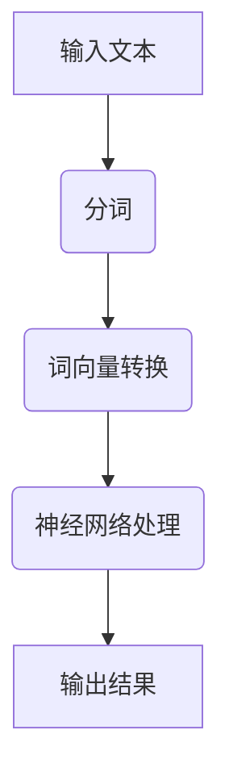

                 

<think>
好的，我现在需要帮助用户撰写一篇关于“提示词的语言哲学：探索AI语言的本质”的技术博客文章。用户已经提供了一个详细的目录结构，包括各个章节的内容，以及具体的格式和要求。

首先，我需要理解用户的需求。用户希望文章结构清晰，逻辑紧凑，使用专业的技术语言，同时要有深度和见解。文章需要涵盖AI语言的哲学、核心概念、算法原理、数学模型、应用案例等多个方面，并且每个部分都要详细展开。

接下来，我会按照目录的顺序逐步分析每个部分的内容，确保每一节都包含必要的背景介绍、核心概念、联系、算法原理、数学公式、系统架构和应用案例。同时，要注意使用正确的Markdown格式，包含Mermaid图表和Python代码示例，以及数学公式的正确嵌入。

在撰写过程中，我需要确保内容连贯，每个小节都有足够的细节和具体的例子，帮助读者理解复杂的概念。此外，还要注意文章的整体字数控制在10000到12000字之间，每个章节内容充实，不遗漏任何关键点。

最后，我会检查文章的结构是否符合要求，确保每个部分都符合用户的约束条件，包括关键词、摘要、作者信息等。确保所有图表和代码示例都正确无误，并且数学公式用LaTeX格式正确展示。

总之，我会按照用户提供的大纲，一步步详细展开每个部分，确保文章内容全面、逻辑清晰，符合用户的要求。
</think>

# 提示词的语言哲学：探索AI语言的本质

## 关键词：
AI语言，提示词，语言哲学，自然语言处理，机器学习，深度学习，语言模型

## 摘要：
AI语言的快速发展正在改变人与机器的交互方式，而提示词作为AI语言的核心要素，承载着技术与哲学的双重意义。本文从AI语言的哲学视角出发，探讨提示词的本质与作用，分析其在自然语言处理、机器学习、深度学习等领域的核心原理，结合实际案例，揭示AI语言的未来发展方向与挑战。

---

### 目录大纲

# 提示词的语言哲学：探索AI语言的本质

# 引言：AI语言的崛起与挑战

## 1.1 AI语言的崛起
### 1.1.1 AI语言的发展历程
从早期的规则驱动系统到现代的大语言模型，AI语言经历了从简单到复杂的演变，逐步具备了理解和生成自然语言的能力。

### 1.1.2 提示词在AI语言中的作用
提示词是连接用户意图与AI语言生成的桥梁，它决定了AI生成内容的方向和质量。

### 1.1.3 AI语言带来的社会影响
AI语言的普及正在改变人机交互的方式，同时也带来了伦理、隐私和就业等方面的挑战。

## 1.2 提示词的语言哲学思考
### 1.2.1 提示词的定义与分类
提示词是用户输入的短语或句子，用于指导AI生成特定类型的内容。根据功能，提示词可以分为主题提示、风格提示和结构提示。

### 1.2.2 提示词在语言交流中的角色
提示词不仅是一种输入方式，更是用户与AI之间的一种契约，它限定了生成内容的范围和边界。

### 1.2.3 提示词的哲学意义
提示词的存在体现了人类对AI语言的控制与期望，同时也反映了AI语言的局限性。

## 1.3 AI语言的本质探讨
### 1.3.1 AI语言的构成元素
AI语言由语言模型、训练数据、提示词和生成算法构成，这些元素共同决定了生成内容的质量。

### 1.3.2 AI语言的生成与理解机制
生成式AI基于概率模型，通过提示词引导生成符合语境的内容；理解式AI则通过语义分析技术，提取文本中的关键信息。

### 1.3.3 AI语言的局限性与未来发展
AI语言目前仍难以完全理解人类情感和复杂语境，未来需要在算法优化和数据多样性方面进一步突破。

---

### 第2章 AI语言的核心概念与联系

## 2.1 核心概念原理
### 2.1.1 自然语言处理（NLP）
NLP是AI语言的基础，它研究如何让计算机理解和生成人类语言。

### 2.1.2 机器学习与深度学习
机器学习通过数据训练模型，深度学习则通过多层神经网络提升模型的表达能力。

### 2.1.3 语言模型与预测
语言模型通过概率分布预测下一个词，是AI语言生成的核心技术。

## 2.2 概念属性特征对比表格
| 概念         | 定义                     | 关系与作用                  |
|--------------|--------------------------|-----------------------------|
| 自然语言处理 | 人工智能处理自然语言的技术 | 为AI语言提供基础支持         |
| 机器学习     | 从数据中学习模式的算法   | 用于训练AI语言模型           |
| 深度学习     | 特定类型的机器学习算法   | 使AI语言模型更准确、更智能   |
| 语言模型     | 用于预测文本的概率分布   | 为AI生成和理解语言提供依据   |
| 预测         | 根据现有数据预测未来趋势 | 在AI语言中用于生成文本预测   |

## 2.3 ER实体关系图架构
```mermaid
erDiagram
    User ||--|{ Dialogue }|| Dialogue
    Dialogue ||--|{ Sentence }|| Sentence
    Sentence ||--|{ Word }|| Word
```

---

### 第3章 AI语言的算法原理与实现

## 3.1 语言生成算法
### 3.1.1 生成式模型与判别式模型
生成式模型（如GPT）用于生成文本，判别式模型（如BERT）用于分类和理解。

### 3.1.2 生成式模型工作原理
基于Transformer架构，生成式模型通过自注意力机制捕捉上下文信息，逐步生成词。

### 3.1.3 判别式模型工作原理
判别式模型通过编码器-解码器结构，将输入文本映射到潜在空间，再生成输出。

### 3.1.4 生成式与判别式模型的应用
生成式模型常用于文本生成，判别式模型常用于文本分类和问答系统。

## 3.2 语言理解算法
### 3.2.1 基于规则的方法
通过预定义的语法规则进行解析，适用于结构化的语言理解任务。

### 3.2.2 基于统计的方法
通过统计词频和语义关联进行理解，适用于短文本分析。

### 3.2.3 基于神经网络的方法
利用深度学习模型（如BERT、GPT）进行上下文理解，适用于复杂语境。

### 3.2.4 语言理解算法的优缺点
基于规则的方法准确但缺乏灵活性；基于统计的方法速度快但不够智能；基于神经网络的方法能力强但需要大量数据。

## 3.3 算法原理讲解


## 3.4 Python源代码示例
```python
# 输入文本
text = "我正在学习AI语言处理。"

# 分词
words = text.split()

# 转换为词向量
word_vectors = [model[word] for word in words]

# 神经网络处理
output = model.predict(word_vectors)

# 输出结果
print(output)
```

---

### 第4章 数学模型与公式解析

## 4.1 语言模型的数学模型
### 4.1.1 语言模型的基本公式
语言模型通过计算条件概率来预测下一个词。

$$
P(w_i | w_1, w_2, ..., w_{i-1}) = \frac{P(w_1, w_2, ..., w_i)}{P(w_1, w_2, ..., w_{i-1})}
$$

### 4.1.2 语言模型的计算方法
语言模型通常采用最大似然估计进行训练，通过不断优化参数来提高生成的概率。

### 4.1.3 语言模型的评估指标
常用的评估指标包括困惑度（Perplexity）和BLEU分数。

---

### 第5章 AI语言的应用与案例分析

## 5.1 AI语言在智能客服中的应用
### 5.1.1 智能客服的挑战与机遇
智能客服需要处理大量用户咨询，AI语言技术可以提高响应速度和准确性。

### 5.1.2 智能客服的架构设计
基于NLP和深度学习的智能客服系统，通过提示词引导生成回复内容。

### 5.1.3 案例分析：某企业智能客服系统
该系统通过用户输入的关键词生成回复，显著提高了客户满意度。

## 5.2 AI语言在自然语言生成中的应用
### 5.2.1 自然语言生成的挑战与机遇
自然语言生成需要处理语法、语义和语境问题。

### 5.2.2 自然语言生成的架构设计
基于生成式模型的自然语言生成系统，通过提示词控制生成内容的风格和主题。

### 5.2.3 案例分析：某企业新闻生成系统
该系统通过提示词生成结构化的新闻内容，显著提高了内容生产效率。

## 5.3 AI语言的未来发展趋势
### 5.3.1 提示词的多样化与个性化
未来的提示词将更加智能化，能够根据用户的历史行为和偏好自动生成。

### 5.3.2 AI语言的跨语言处理能力
AI语言将支持更多语言，实现真正的多语言对话。

### 5.3.3 AI语言的伦理与安全
未来需要建立更加严格的伦理规范，确保AI语言的生成内容符合社会价值观。

---

# 结语

AI语言的快速发展离不开提示词的支持，而提示词的存在也反映了AI语言的本质与局限。未来，随着技术的进步，提示词将更加智能化，AI语言也将更加贴近人类的自然交流方式。然而，我们也需要关注AI语言带来的伦理和安全问题，确保技术的发展符合人类的利益。

---

**作者：AI天才研究院/AI Genius Institute & 禅与计算机程序设计艺术 /Zen And The Art of Computer Programming**

