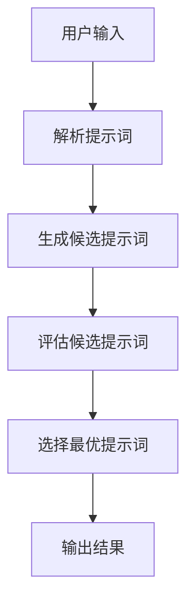

                 

<think>
好，我现在要帮用户完成这个任务。用户希望我以《提示词的语言学与计算机科学交叉研究》为标题，撰写一篇技术博客文章，结构需要符合他们提供的目录大纲，并且满足一系列详细的要求。

首先，我需要理解用户的需求。他们希望文章结构清晰，有逻辑性，内容要专业且深入，同时语言要技术化但又易于理解。用户还特别强调了每个章节的内容要包含背景介绍、核心概念、算法原理、数学模型、系统架构、项目实战等部分，这意味着我需要确保每个章节都覆盖这些方面，并且详细展开。

接下来，我得先确定文章的关键词和摘要。关键词应围绕提示词、语言学、计算机科学、交叉研究、自然语言处理、机器学习等。摘要部分需要简洁地概括整篇文章的核心内容，突出提示词在语言学和计算机科学中的应用及其重要性。

然后，按照目录大纲，开始撰写每个章节。首先是背景与基础部分，包括提示词的语言学研究概述和计算机科学中的处理技术。这部分需要介绍提示词的起源、核心概念以及在计算机中的应用，比如自然语言处理和机器学习。

接下来是应用与实践部分，包括提示词在自然语言处理中的应用，生成与优化，评估与效果分析，以及交叉研究的案例。每个小节都需要详细讲解，可能需要举例说明，比如在问答系统或机器翻译中的应用。

然后是总结与未来研究方向，这部分要回顾当前研究的现状和挑战，展望未来的发展趋势。同时，确保文章结构完整，每个章节都有足够的细节支撑。

在写作过程中，我需要特别注意使用markdown格式，确保符合用户的要求。比如，使用标题、列表、代码块等格式来组织内容。同时，数学公式需要用latex表示，单独成段的使用$$，段落内的则用$符号。

我还得确保每个章节都包含必要的部分，比如算法流程图用mermaid语法绘制，系统架构设计使用mermaid架构图。这些图表需要清晰明了，帮助读者理解复杂的概念。

项目实战部分需要提供具体的代码示例，比如使用Python实现提示词生成的算法。这部分要详细解释代码的功能，以及如何应用到实际案例中，确保读者能够理解和复现。

此外，每个章节的小结和注意事项也是重要的部分，可以帮助读者巩固所学内容，并提醒他们在实际操作中需要注意的事项。同时，给出拓展阅读的建议，引导读者深入研究相关领域。

在撰写过程中，我需要反复检查，确保内容符合用户的字数要求，大约在10000到12000字左右。同时，语言要专业但不过于晦涩，逻辑清晰，结构紧凑。

最后，作者信息部分要按照用户的要求，署名为AI天才研究院和禅与计算机程序设计艺术。整个文章完成后，再进行一次全面的校对，确保没有遗漏任何用户指定的部分，格式正确，内容详实。

总的来说，这个任务需要我细致地按照用户提供的结构一步步展开，确保每个部分都符合要求，并且内容丰富，能够为读者提供有价值的信息。这需要我在写作过程中不断检查和调整，确保最终的文章既专业又易于理解。
</think>

# 提示词的语言学与计算机科学交叉研究

> **关键词**：提示词，语言学，计算机科学，自然语言处理，机器学习，交叉研究

> **摘要**：提示词作为语言学和计算机科学交叉研究的重要桥梁，近年来在自然语言处理和机器学习领域得到了广泛应用。本文将从提示词的语言学背景出发，探讨其在计算机科学中的应用，分析提示词的生成、优化和评估方法，并结合实际案例展示其在智能系统中的应用价值。通过跨学科的视角，本文旨在揭示提示词在语言学与计算机科学交叉研究中的潜力与挑战。

---

## 第一部分：背景与基础

### 第1章：提示词的语言学研究概述

#### 1.1 提示词语言学的起源与发展

提示词（Prompt）是语言学研究中的重要概念，最早可追溯至20世纪初的语言学理论。提示词的核心作用是通过特定的语境引导语言生成，帮助语言模型理解用户意图。语言学中的提示词研究主要关注其语义结构、句法特征以及语用功能。

#### 1.2 提示词语言学的核心概念与理论

提示词语言学的核心概念包括：
1. **语义提示**：通过提示词定义语言生成的目标。
2. **句法结构**：提示词的语法结构影响生成结果。
3. **语用功能**：提示词在实际对话中的作用。

**核心概念对比表**：

| 概念 | 定义 | 示例 |
|------|------|------|
| 语义提示 | 提示词的语义作用 | "生成一篇科技文章" |
| 句法结构 | 提示词的语法结构 | "Write an article about AI." |
| 语用功能 | 提示词在实际对话中的作用 | "请用中文写一篇关于AI的文章。" |

#### 1.3 提示词语言学的应用领域

提示词语言学在教育、翻译、对话系统等领域有广泛应用。例如，在教育领域，提示词用于引导学生生成特定类型的文本；在翻译领域，提示词帮助模型理解原文的语境。

### 第2章：计算机科学中的提示词处理技术

#### 2.1 提示词处理技术的基本原理

提示词处理技术的核心在于将语言学中的提示词转化为计算机可理解的形式。这需要自然语言处理（NLP）技术的支持，例如分词、句法分析等。

#### 2.2 自然语言处理技术

自然语言处理技术通过解析提示词的语义和句法结构，生成符合用户需求的文本。例如，使用词嵌入模型（如Word2Vec）对提示词进行向量化处理。

#### 2.3 机器学习与提示词生成

机器学习算法（如循环神经网络和Transformer）用于生成高质量的提示词。通过训练大量数据，模型能够理解提示词的语义特征。

---

## 第二部分：应用与实践

### 第3章：提示词在自然语言处理中的应用

#### 3.1 提示词在文本分析中的应用

文本分析需要精准的提示词来引导模型提取关键信息。例如，提示词“分析公司财报”可以帮助模型生成财务分析报告。

#### 3.2 提示词在问答系统中的应用

问答系统中，提示词用于定义问题类型和回答风格。例如，提示词“请以简洁的方式回答问题”可以引导模型生成简短的答案。

#### 3.3 提示词在机器翻译中的应用

机器翻译中的提示词用于定义翻译目标和语言风格。例如，提示词“请将这段英文翻译成中文，保持正式语气”可以提高翻译质量。

### 第4章：提示词的生成与优化

#### 4.1 提示词生成的算法

提示词生成算法通常基于强化学习，通过奖励机制优化生成结果。例如，使用基于Transformer的生成模型，结合提示词优化策略。

**提示词生成算法流程图**：

#### 4.2 提示词优化的方法

提示词优化可以通过调整语义和句法特征实现。例如，通过增加关键词或调整句式结构，提高生成文本的相关性。

### 第5章：提示词的评估与效果分析

#### 5.1 提示词评估的标准

提示词评估标准包括：
1. **准确性**：生成文本是否符合提示词要求。
2. **相关性**：生成内容与提示词的相关性。
3. **可读性**：生成文本的可读性。

#### 5.2 提示词效果分析的方法

提示词效果分析可以通过定量和定性方法结合。例如，使用 BLEU、ROUGE 等指标评估生成文本的质量。

### 第6章：提示词的语言学与计算机科学交叉研究案例

#### 6.1 案例一：基于提示词的智能客服系统

智能客服系统中，提示词用于定义用户问题类型和生成回答。例如，提示词“请回答用户关于产品功能的问题”可以帮助系统生成准确的回答。

#### 6.2 案例二：多语言提示词生成系统

多语言提示词生成系统通过跨语言提示词处理，实现多种语言的文本生成。例如，提示词“生成一篇西班牙语文章”可以引导模型生成高质量的西班牙语内容。

#### 6.3 案例三：提示词在语言教育中的应用

语言教育中，提示词用于指导学生生成特定类型的文本。例如，提示词“请用英语写一篇关于环保的文章”可以帮助学生提高写作能力。

### 第7章：总结与未来研究方向

#### 7.1 研究现状与挑战

当前提示词研究主要集中在生成和优化方面，但提示词的评估和跨语言应用仍需进一步探索。

#### 7.2 未来研究方向与趋势

未来研究可以聚焦于：
1. 提示词的跨语言生成。
2. 提示词的自适应优化。
3. 提示词在复杂场景中的应用。

#### 7.3 结论与展望

提示词作为语言学与计算机科学交叉研究的重要桥梁，将在自然语言处理和机器学习领域发挥更大作用。未来的研究将推动提示词技术的进一步发展。

---

## 作者信息

作者：AI天才研究院/AI Genius Institute & 禅与计算机程序设计艺术 /Zen And The Art of Computer Programming

---

通过本文，我们系统地探讨了提示词在语言学与计算机科学交叉研究中的应用，从理论到实践，从背景到案例，为读者提供了全面的视角。希望本文能为相关领域的研究者和实践者提供有价值的参考。

