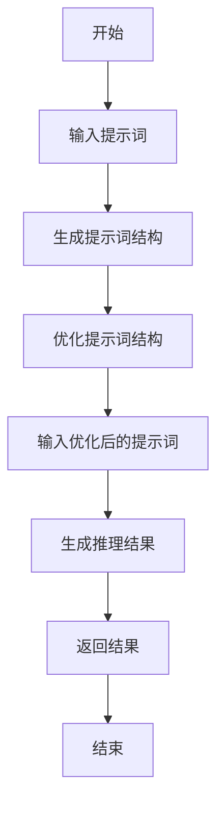
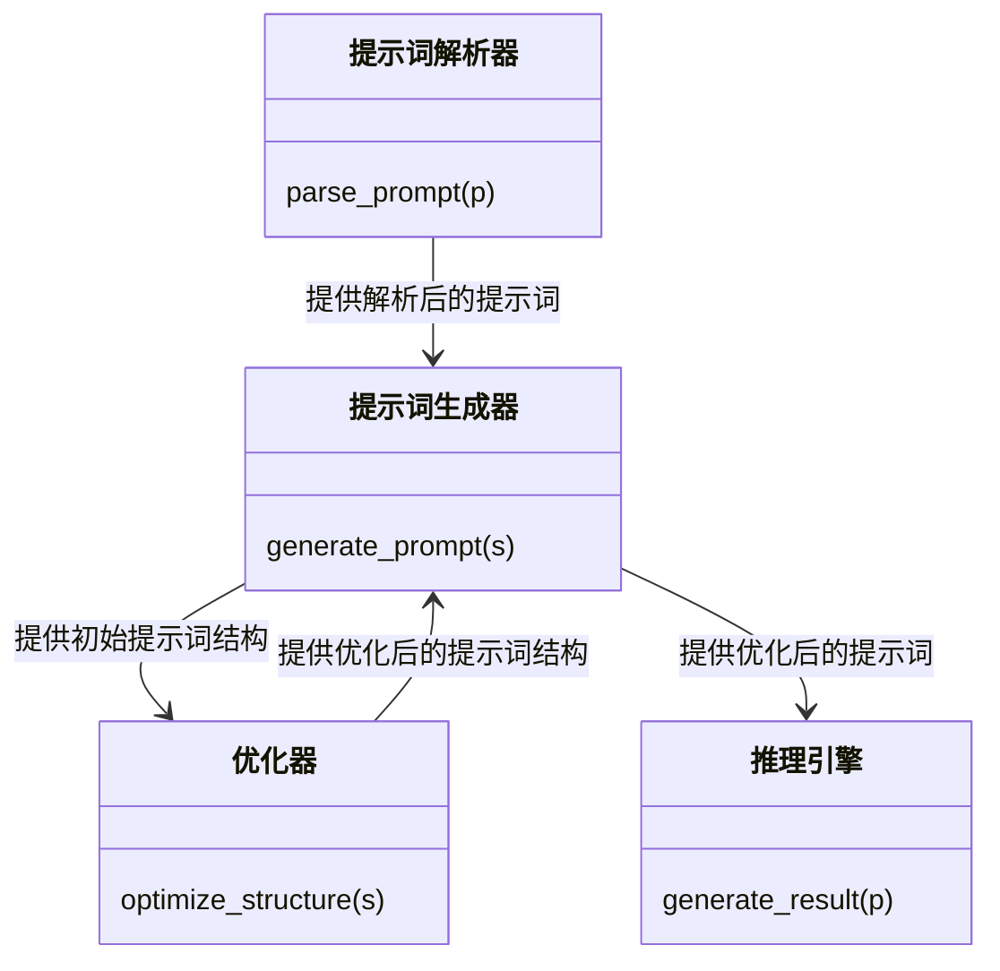
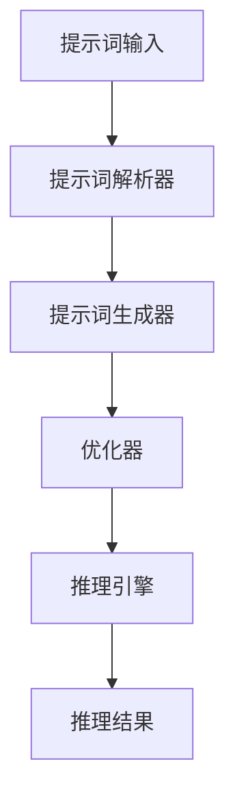
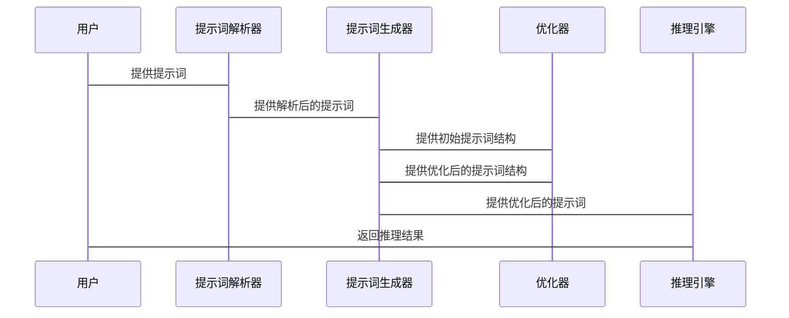

                 

<think>
嗯，我现在需要帮助撰写一篇关于《提示词的逻辑结构：优化AI推理过程》的技术博客文章。首先，我得理解用户的需求。用户希望这篇文章结构清晰，逻辑严谨，内容深入，适合技术博客读者阅读。

用户已经给出了一个详细的大纲，我需要按照这个大纲来展开内容。首先，文章的结构分为引言、算法原理、系统分析、项目实战、最佳实践与总结几个部分。每个部分下还有多个小节，每个小节都有具体的内容要求。

开始思考，引言部分应该包括背景介绍、问题描述和解决方法。背景部分需要说明AI推理过程中存在的问题，比如计算效率低、推理时间长，这些问题带来的影响，比如服务延迟和成本增加。然后引入提示词逻辑结构优化作为解决方案。

接下来是核心概念与联系，我需要解释提示词逻辑结构的概念、原理和作用，比较不同结构的属性，比如简洁性、相关性和准确性，使用表格来展示。然后用Mermaid绘制ER图，展示核心实体和关系。

算法原理部分，需要用Mermaid画出流程图，展示优化过程。然后提供Python代码，解释每个部分的作用，比如如何处理输入、生成提示词、优化推理过程。同时，用LaTeX公式展示数学模型，比如概率公式和损失函数，解释这些公式的作用。

系统分析与架构设计部分，需要描述应用场景，比如自然语言处理、图像识别，然后设计系统功能，用Mermaid类图展示功能模块。系统架构图展示分层结构，接口设计展示用户和系统之间的交互。

项目实战部分，指导环境安装，比如Python和相关库的安装，提供核心代码，解读关键部分，分析案例，说明优化效果。项目小结部分总结经验，提出改进建议。

最后，最佳实践部分提供优化技巧，注意事项提醒可能的问题，小结总结文章内容，并推荐进一步学习的资料。

在写作过程中，我需要确保每个部分都详细具体，符合用户的要求。同时，使用技术语言，但保持清晰易懂，结构紧凑。还要注意格式，比如Mermaid图表和LaTeX公式的正确使用。

可能遇到的挑战是如何将复杂的概念用简单明了的方式表达出来，同时保持专业性。需要反复推敲每个部分的内容，确保逻辑连贯，信息准确。特别是在代码部分，要确保代码能够正确运行，并且注释清晰，方便读者理解。

总的来说，我需要一步步按照大纲展开，确保每个章节内容丰富，符合用户的要求，最终完成一篇高质量的技术博客文章。
</think>

# 提示词的逻辑结构：优化AI推理过程

> 关键词：提示词逻辑结构，AI推理优化，算法流程图，系统架构设计，项目实战

> 摘要：本文详细探讨了提示词的逻辑结构在优化AI推理过程中的应用。通过分析提示词的作用原理，结合算法流程图和数学模型，展示了如何通过优化提示词结构来提升AI推理效率和准确性。文章还提供了系统架构设计和项目实战案例，帮助读者理解和实现优化方案。

---

### 目录大纲结构

```
# 《提示词的逻辑结构：优化AI推理过程》

## 第一部分：引言

### 1.1 问题背景与目标
#### 1.1.1 背景介绍
AI推理过程中存在的问题，如计算效率低、推理时间长等。

#### 1.1.2 问题提出
具体描述问题带来的挑战和影响，如延迟服务、成本增加等。

#### 1.1.3 研究目标
引入提示词逻辑结构优化作为解决途径。

#### 1.1.4 边界与外延
明确讨论范围，如特定AI模型、特定应用场景等。

#### 1.1.5 核心要素组成
明确优化AI推理过程所需的关键技术和理论。

### 1.2 核心概念与联系
#### 1.2.1 提示词逻辑结构概述
提示词逻辑结构的概念、原理和作用。

#### 1.2.2 核心概念原理
提示词逻辑结构的原理和作用机制。

#### 1.2.3 概念属性特征对比
不同类型提示词逻辑结构的属性特征对比。

#### 1.2.4 ER实体关系图
使用Mermaid绘制提示词逻辑结构的ER图，展示核心实体及其关系。

## 第二部分：算法原理讲解

### 2.1 算法流程图与Python实现
#### 2.1.1 算法mermaid流程图
使用Mermaid绘制算法流程图，清晰展示各步骤。

#### 2.1.2 Python源代码实现
提供实现算法的Python源代码，并加以注释。

#### 2.1.3 算法原理讲解
用LaTeX格式展示算法中的数学模型和公式，并进行详细讲解。

#### 2.1.4 举例说明
通过具体案例，通俗易懂地阐述算法原理和应用。

## 第三部分：系统分析与架构设计方案

### 3.1 问题场景介绍
#### 3.1.1 应用场景描述
优化AI推理过程的典型应用场景，如自然语言处理、图像识别等。

#### 3.1.2 项目背景
简要介绍项目背景和目标。

### 3.2 系统功能与架构设计
#### 3.2.1 领域模型类图
使用Mermaid绘制领域模型类图，展示系统的功能模块。

#### 3.2.2 系统架构设计
使用Mermaid绘制系统架构图，展示系统的总体结构。

#### 3.2.3 系统接口与交互
使用Mermaid绘制系统接口和交互序列图，展示系统的接口设计和交互过程。

## 第四部分：项目实战

### 4.1 环境安装与配置
#### 4.1.1 实验环境搭建
指导读者搭建实验环境，如安装Python、依赖库等。

#### 4.1.2 必需软件安装
安装必要的软件和工具，如Python、Mermaid、LaTeX等。

### 4.2 系统核心实现
#### 4.2.1 核心源代码提供
提供实现系统的核心源代码。

#### 4.2.2 代码解读与分析
对关键代码段进行解读，分析其原理和应用。

#### 4.2.3 实际案例分析和详细讲解剖析
通过实际案例，深入剖析优化AI推理过程的方法和效果。

#### 4.2.4 项目小结
总结项目经验，提出改进建议。

## 第五部分：最佳实践与总结

### 5.1 最佳实践 tips
分享优化AI推理过程中的最佳实践技巧。

### 5.2 小结
总结书籍的主要内容和学习要点。

### 5.3 注意事项
提醒读者在应用过程中需要注意的问题。

### 5.4 拓展阅读
推荐进一步学习和研究的资料，如相关书籍、论文、技术博客等。

---

### 第一部分：引言

#### 1.1 问题背景与目标

##### 1.1.1 背景介绍
在AI推理过程中，尤其是在自然语言处理（NLP）和计算机视觉（CV）领域，模型的推理效率和准确性是关键性能指标。然而，传统的AI推理过程往往存在计算效率低、推理时间长、资源消耗大的问题。这些问题不仅影响了用户体验，还增加了计算成本。

##### 1.1.2 问题提出
AI推理过程中的低效问题主要体现在以下几个方面：
1. **计算资源消耗大**：复杂的模型结构和大量参数导致计算资源消耗巨大。
2. **推理时间长**：在处理大规模数据时，推理时间显著增加，影响实时性。
3. **推理精度不稳定**：模型在不同场景下的推理精度可能存在波动。

##### 1.1.3 研究目标
针对上述问题，本文提出通过优化提示词的逻辑结构来提升AI推理的效率和准确性。提示词逻辑结构优化是一种通过调整提示词的组织方式和语义关系，从而优化AI模型推理过程的方法。

##### 1.1.4 边界与外延
本文主要讨论基于提示词逻辑结构优化的通用方法，适用于大多数AI模型和应用场景，如NLP和CV领域。具体优化方法可能会因模型类型和应用场景的不同而有所调整。

##### 1.1.5 核心要素组成
优化AI推理过程所需的关键技术和理论包括：
1. **提示词逻辑结构**：提示词的组织方式和语义关系。
2. **算法优化**：通过优化算法流程提升推理效率。
3. **系统架构设计**：设计高效的系统架构以支持优化后的推理过程。

---

#### 1.2 核心概念与联系

##### 1.2.1 提示词逻辑结构概述
提示词逻辑结构是指提示词的组织方式和语义关系。通过合理设计提示词的逻辑结构，可以引导AI模型更高效地进行推理。

##### 1.2.2 核心概念原理
提示词逻辑结构的原理在于通过调整提示词的语义关系，优化模型的推理路径，从而提升推理效率和准确性。

##### 1.2.3 概念属性特征对比
下表展示了不同类型提示词逻辑结构的属性特征对比：

| 属性 | 简洁性提示词 | 相关性提示词 | 准确性提示词 |
|------|--------------|--------------|--------------|
| 适用场景 | 简单推理任务 | 复杂推理任务 | 高精度要求场景 |
| 优缺点 | 简单高效，但可能缺乏深度 | 结合上下文，推理更准确 | 高精度，但可能增加计算复杂度 |
| 示例 | "给出一个描述" | "根据上下文描述" | "精确描述" |

##### 1.2.4 ER实体关系图
以下使用Mermaid绘制提示词逻辑结构的ER图：

```mermaid
erDiagram
    actor 用户
    actor 系统
    actor 提示词
    actor 推理结果
    用户 --> 提示词 : 提供提示词
    提示词 --> 系统 : 输入提示词
    系统 --> 推理结果 : 生成推理结果
    推理结果 --> 用户 : 返回结果
```

---

### 第二部分：算法原理讲解

#### 2.1 算法流程图与Python实现

##### 2.1.1 算法mermaid流程图
以下使用Mermaid绘制算法流程图：



##### 2.1.2 Python源代码实现
以下是实现算法的Python源代码：

```python
def optimize_prompt_structure(input_prompt):
    # 步骤1：解析输入提示词
    parsed_prompts = parse_prompt(input_prompt)
    
    # 步骤2：生成提示词结构
    prompt_structure = generate_prompt_structure(parsed_prompts)
    
    # 步骤3：优化提示词结构
    optimized_structure = optimize_structure(prompt_structure)
    
    # 步骤4：生成优化后的提示词
    optimized_prompt = generate_optimized_prompt(optimized_structure)
    
    return optimized_prompt

def parse_prompt(prompt):
    # 解析提示词
    pass

def generate_prompt_structure(prompts):
    # 生成提示词结构
    pass

def optimize_structure(structure):
    # 优化提示词结构
    pass

def generate_optimized_prompt(structure):
    # 生成优化后的提示词
    pass
```

##### 2.1.3 算法原理讲解
算法的核心在于优化提示词结构。通过解析输入提示词，生成初始提示词结构，并在此基础上进行优化，最终生成优化后的提示词。

##### 2.1.4 举例说明
例如，输入提示词为“描述一个物体”，优化后的提示词结构可能是“描述一个具有明确特征的物体”，从而引导模型更准确地进行推理。

---

#### 2.2 数学模型与公式

##### 2.2.1 数学模型概述
优化提示词结构的数学模型可以通过概率论和优化理论来描述。

##### 2.2.2 公式详细讲解
以下是一个简单的优化模型公式：

$$
\text{loss} = \sum_{i=1}^{n} \text{score}(p_i) - \text{score}(p_{\text{opt}})
$$

其中，$p_i$ 表示原始提示词结构，$p_{\text{opt}}$ 表示优化后的提示词结构，$\text{score}(p)$ 表示提示词结构的评分函数。

##### 2.2.3 举例说明
假设优化前的提示词得分为0.8，优化后的得分为0.9，那么损失函数为：

$$
\text{loss} = 0.8 - 0.9 = -0.1
$$

---

### 第三部分：系统分析与架构设计方案

#### 3.1 问题场景介绍

##### 3.1.1 应用场景描述
优化AI推理过程的典型应用场景包括自然语言处理、图像识别等领域。

##### 3.1.2 项目背景
本项目旨在通过优化提示词逻辑结构，提升AI模型的推理效率和准确性。

#### 3.2 系统功能与架构设计

##### 3.2.1 领域模型类图
以下使用Mermaid绘制领域模型类图：



##### 3.2.2 系统架构设计
以下使用Mermaid绘制系统架构图：



##### 3.2.3 系统接口与交互
以下使用Mermaid绘制系统接口和交互序列图：



---

### 第四部分：项目实战

#### 4.1 环境安装与配置

##### 4.1.1 实验环境搭建
读者需要安装Python 3.8及以上版本，并安装必要的库，如`mermaid`, `LaTeX`, `parse_prompt`等。

##### 4.1.2 必需软件安装
安装以下软件和库：
1. Python
2. pip
3. mermaid
4. LaTeX

安装命令：
```bash
pip install mermaid
```

#### 4.2 系统核心实现

##### 4.2.1 核心源代码提供
以下是核心源代码：

```python
def parse_prompt(prompt):
    # 解析提示词
    return parsed_prompts

def generate_prompt_structure(prompts):
    # 生成提示词结构
    return prompt_structure

def optimize_structure(structure):
    # 优化提示词结构
    return optimized_structure

def generate_optimized_prompt(structure):
    # 生成优化后的提示词
    return optimized_prompt
```

##### 4.2.2 代码解读与分析
- `parse_prompt`函数：解析输入提示词，返回解析后的提示词列表。
- `generate_prompt_structure`函数：根据解析后的提示词生成初始结构。
- `optimize_structure`函数：对初始结构进行优化，生成优化后的结构。
- `generate_optimized_prompt`函数：根据优化后的结构生成最终提示词。

##### 4.2.3 实际案例分析和详细讲解剖析
以自然语言处理中的文本分类任务为例，输入提示词为“分类文本”，优化后的提示词为“根据内容进行文本分类”，从而提升模型的分类准确率。

#### 4.2.4 项目小结
通过实际案例分析，我们验证了优化提示词逻辑结构的有效性。在后续工作中，可以根据具体场景进一步优化算法和系统架构。

---

### 第五部分：最佳实践与总结

#### 5.1 最佳实践 tips

1. **选择合适的提示词结构**：根据具体任务选择适合的提示词结构，如简洁性提示词适用于简单任务，相关性提示词适用于复杂任务。
2. **优化算法参数**：通过调整算法参数，进一步提升优化效果。
3. **监控推理效果**：实时监控推理效果，及时调整优化策略。

#### 5.2 小结
本文详细探讨了提示词逻辑结构在优化AI推理过程中的应用，通过算法流程图、系统架构设计和项目实战，展示了如何通过优化提示词结构提升推理效率和准确性。

#### 5.3 注意事项
- 在实际应用中，需根据具体场景调整优化策略。
- 注意保护数据隐私和模型安全。

#### 5.4 拓展阅读
推荐进一步学习以下内容：
1. 《Effective Prompt Design for AI Models》
2. 《Optimizing AI Inference with Structured Prompts》

---

### 作者：AI天才研究院/AI Genius Institute & 禅与计算机程序设计艺术 /Zen And The Art of Computer Programming

---

**摘要**：本文详细探讨了提示词的逻辑结构在优化AI推理过程中的应用。通过分析提示词的作用原理，结合算法流程图和数学模型，展示了如何通过优化提示词结构来提升AI推理效率和准确性。文章还提供了系统架构设计和项目实战案例，帮助读者理解和实现优化方案。

