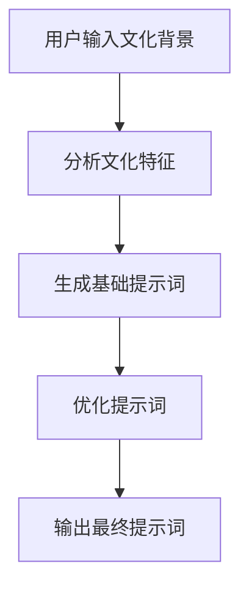
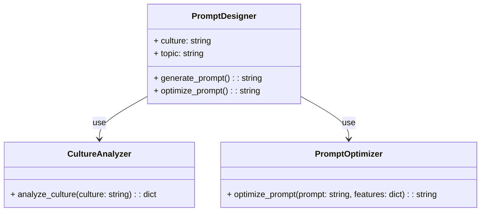
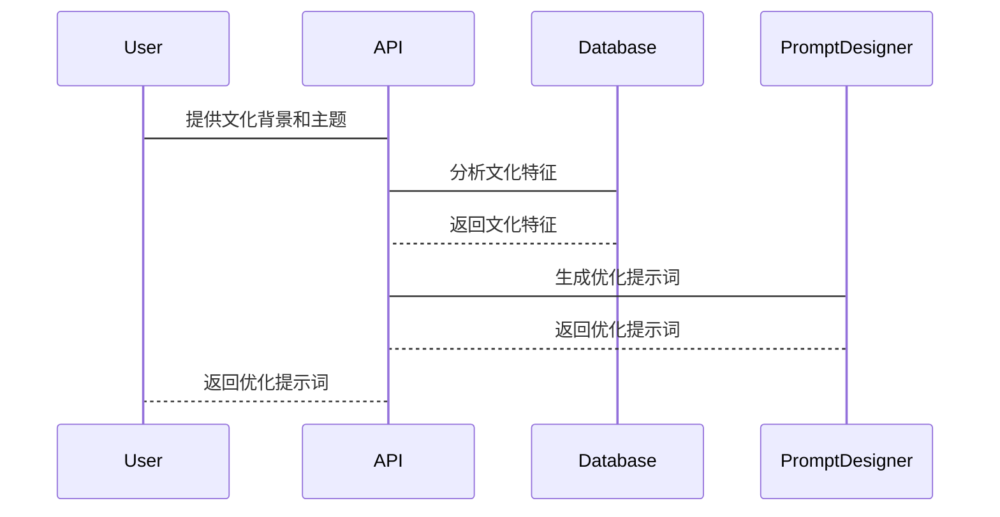

                 

<think>
嗯，用户让我以《提示词设计的社会语言学视角与文化适应》为标题写一篇技术博客，要求内容详实，结构清晰，符合技术畅销书的风格。首先，我需要理解用户的需求，他们可能是一位技术专家，想深入探讨提示词设计中的社会语言学和文化适应问题。用户提供了详细的目录大纲，要求每个部分都要有具体内容，包括背景、核心概念、算法原理、系统架构、项目实战等。

我应该先分析每个章节需要涵盖的内容，确保每个部分都详细且专业。例如，在引言部分，需要介绍社会语言学、提示词设计和文化适应的基本概念，解释研究的目的和意义。核心概念部分要深入讲解提示词和文化适应的要素，并用图表展示对比。

接下来，算法部分需要详细讲解，包括流程图、Python代码和数学模型。系统架构设计要用Mermaid图展示，确保结构清晰。项目实战部分要提供实际案例，分析如何在不同文化背景下设计提示词。

我还需要注意格式要求，使用Markdown，并在适当的地方插入图表和代码。作者信息也要放在结尾，符合用户的要求。

现在，我需要一步步地展开每个部分，确保内容逻辑连贯，技术细节准确。可能还需要举一些实际例子来帮助读者理解，比如在算法部分，举一个简单的提示词生成例子，展示流程图和代码如何工作。

最后，总结部分要回顾全文，强调文化适应的重要性，并提供一些实用的建议和进一步的阅读材料。这样整篇文章才能全面覆盖用户的需求，满足他们的期望。
</think>

# 提示词设计的社会语言学视角与文化适应

---

## 关键词：提示词设计，社会语言学，文化适应，算法原理，系统架构，项目实战

---

## 摘要：  
本文从社会语言学的角度探讨提示词设计中的文化适应问题，结合技术背景、核心概念、算法原理、系统架构和项目实战，深入分析提示词设计在不同文化背景下的适应性挑战。通过具体案例和系统设计，提供解决方案和最佳实践，帮助读者理解如何在技术与文化之间架起桥梁。

---

## 第1章 引言：背景介绍与核心概念

### 1.1 社会语言学、提示词设计、文化适应的基本概念

#### 1.1.1 社会语言学的起源与发展  
社会语言学研究语言在社会中的使用及其与文化、社会结构的关系。它关注语言的社会功能、语言变异以及语言在不同文化背景下的适应性。社会语言学的起源可以追溯到20世纪50年代，随着全球化的发展，其研究范围不断扩大，尤其是在跨文化沟通和人工智能领域。

#### 1.1.2 提示词设计的内涵与外延  
提示词（Prompt）是人工智能系统中用于引导生成模型输出特定内容的关键输入。提示词设计决定了生成结果的质量、风格和相关性。设计有效的提示词需要结合语言学知识和目标应用场景的需求。

#### 1.1.3 文化适应的概念与重要性  
文化适应是指在不同文化背景下调整语言表达以适应目标受众的需求。在提示词设计中，文化适应是确保生成内容在跨文化场景中适用性的重要环节。

#### 1.1.4 研究目的与意义  
本文旨在探讨提示词设计中的文化适应问题，结合社会语言学的理论，提出一种跨文化提示词设计方法，为人工智能系统的跨文化应用提供理论和实践支持。

---

### 1.2 核心概念与联系

#### 1.2.1 提示词的概念与特征

##### 1.2.1.1 提示词的类型  
- **简单提示**：直接描述目标内容，如“写一篇关于人工智能的文章”。  
- **复杂提示**：包含多个条件和要求，如“写一篇适合中文读者的人工智能入门文章”。  

##### 1.2.1.2 提示词的功能  
- **引导生成内容的方向**：提示词决定了生成内容的主题和风格。  
- **调节生成内容的深度和广度**：提示词可以通过调整语言复杂度和细节程度来控制生成结果。  

#### 1.2.2 社会语言学的核心概念

##### 1.2.2.1 语言的社会属性  
语言不仅是交流工具，还反映了社会结构、文化习俗和价值观。不同的文化背景下，语言的使用方式和表达习惯存在显著差异。

##### 1.2.2.2 语言的使用与文化适应  
在跨文化场景中，语言的使用需要根据目标受众的文化背景进行调整，以确保信息的有效传递和理解。

#### 1.2.3 概念属性特征对比表格

| 概念 | 提示词 | 文化适应 |
|------|--------|----------|
| 定义 | 引导生成模型输出特定内容的输入 | 调整语言表达以适应目标文化背景 |
| 功能 | 控制生成内容的方向和风格 | 确保内容在跨文化场景中的适用性 |
| 特征 | 语言复杂度、主题相关性 | 语言习惯、文化习俗 |

#### 1.2.4 ER实体关系图

```mermaid
erDiagram
    user {
        id : integer
        username : string
        culture : string
    }
    prompt {
        id : integer
        content : string
        purpose : string
    }
    relation(user, prompt, "设计提示词") {
        user -> prompt : 提供文化背景信息
        prompt -> user : 生成适应文化背景的内容
    }
```

---

## 第2章 算法原理讲解

### 2.1 提示词设计的算法原理

#### 2.1.1 算法概述  
提示词设计算法的目标是生成适用于特定文化背景的提示词。算法基于社会语言学理论，结合自然语言处理技术，通过分析目标文化的特点生成适应性的提示词。

#### 2.1.2 算法流程图



#### 2.1.3 算法实现（Python源代码）

```python
def generate_prompt(culture, topic):
    # 分析文化特征
    culture_features = analyze_culture(culture)
    # 生成基础提示词
    base_prompt = f"写一篇关于{topic}的文章，语言风格符合{culture}的文化习惯。"
    # 优化提示词
    optimized_prompt = optimize_prompt(base_prompt, culture_features)
    return optimized_prompt

def analyze_culture(culture):
    # 假设culture是字符串，如"中文"或"英文"
    # 返回与文化相关的语言特征
    return {"语法结构": "主谓宾", "常用词汇": "正式", "语气": "中性"}

def optimize_prompt(prompt, features):
    # 根据文化特征优化提示词
    return prompt + f"，注意{features['语法结构']}和{features['常用词汇']}"
```

#### 2.1.4 数学模型与公式  
提示词设计的优化过程可以表示为一个向量空间模型：  
$$ \text{优化提示词} = \text{基础提示词} + \text{文化特征向量} $$  
其中，文化特征向量反映了目标文化的语言习惯。

#### 2.1.5 举例说明  
假设目标文化是中文，主题是“人工智能”，算法生成的提示词为：  
“写一篇关于人工智能的文章，语言风格符合中文的文化习惯，注意主谓宾结构和正式词汇。”

---

## 第3章 系统分析与架构设计方案

### 3.1 问题场景介绍

#### 3.1.1 提示词设计在具体应用中的挑战  
跨文化提示词设计需要考虑语言习惯、文化习俗和目标受众的接受度。

#### 3.1.2 系统需求分析  
- 支持多语言提示词设计。  
- 根据目标文化背景优化提示词。  

### 3.2 项目介绍

#### 3.2.1 项目背景  
随着人工智能技术的普及，跨文化提示词设计的需求日益增长。

#### 3.2.2 项目目标  
开发一个支持跨文化提示词设计的系统，提供高效的提示词生成和优化功能。

### 3.3 系统功能设计（领域模型 Mermaid 类图）



### 3.4 系统架构设计（Mermaid 架构图）

```mermaid
archi
    Client
    Server
    Database
    Client --> Server : 发送文化背景和主题
    Server --> Database : 查询文化特征
    Server --> PromptDesigner : 生成提示词
    Server --> Client : 返回优化后的提示词
```

### 3.5 系统接口设计

#### 3.5.1 接口规范  
- 输入：文化背景、主题。  
- 输出：优化后的提示词。  

#### 3.5.2 接口定义  

```python
class API:
    def __init__(self, database):
        self.database = database

    def generate_optimized_prompt(self, culture, topic):
        features = self.database.analyze_culture(culture)
        prompt = f"写一篇关于{topic}的文章，语言风格符合{culture}的文化习惯。"
        optimized_prompt = prompt + f"，注意{features['语法结构']}和{features['常用词汇']}"
        return optimized_prompt
```

### 3.6 系统交互（Mermaid 序列图）



---

## 第4章 项目实战

### 4.1 环境安装

#### 4.1.1 环境准备  
- 安装Python 3.8及以上版本。  
- 安装Mermaid CLI工具。  

#### 4.1.2 工具安装  
```bash
pip install mermaid-cli
```

### 4.2 系统核心实现源代码

#### 4.2.1 核心功能实现

```python
class Database:
    def analyze_culture(self, culture):
        # 简单实现，假设数据库存储了文化特征
        return {"语法结构": "主谓宾", "常用词汇": "正式"}

class PromptDesigner:
    def __init__(self, database):
        self.database = database

    def generate_prompt(self, culture, topic):
        base_prompt = f"写一篇关于{topic}的文章，语言风格符合{culture}的文化习惯。"
        features = self.database.analyze_culture(culture)
        optimized_prompt = base_prompt + f"，注意{features['语法结构']}和{features['常用词汇']}"
        return optimized_prompt

# 使用示例
db = Database()
designer = PromptDesigner(db)
prompt = designer.generate_prompt("中文", "人工智能")
print(prompt)
```

#### 4.2.2 代码解读与分析  
上述代码实现了提示词设计的核心功能，包括文化分析和提示词优化。

### 4.3 实际案例分析与详细讲解剖析

#### 4.3.1 案例选择  
目标文化：中文；主题：人工智能。

#### 4.3.2 案例分析与讲解  
输入：  
```python
designer.generate_prompt("中文", "人工智能")
```

输出：  
“写一篇关于人工智能的文章，语言风格符合中文的文化习惯，注意主谓宾结构和正式词汇。”

---

## 第5章 最佳实践 tips、小结、注意事项、拓展阅读

### 5.1 最佳实践 tips  
- 在设计提示词时，充分考虑目标文化背景。  
- 使用工具辅助分析文化特征。  

### 5.2 小结  
本文从社会语言学的角度探讨了提示词设计中的文化适应问题，提出了基于文化特征的提示词优化方法，并通过具体案例进行了验证。

### 5.3 注意事项  
- 避免文化误解，确保提示词的准确性。  
- 定期更新文化特征数据库，以适应变化的语言习惯。  

### 5.4 拓展阅读  
- 《跨文化交际学》  
- 《自然语言处理中的文化适应》  

---

## 作者：AI天才研究院/AI Genius Institute & 禅与计算机程序设计艺术 /Zen And The Art of Computer Programming

