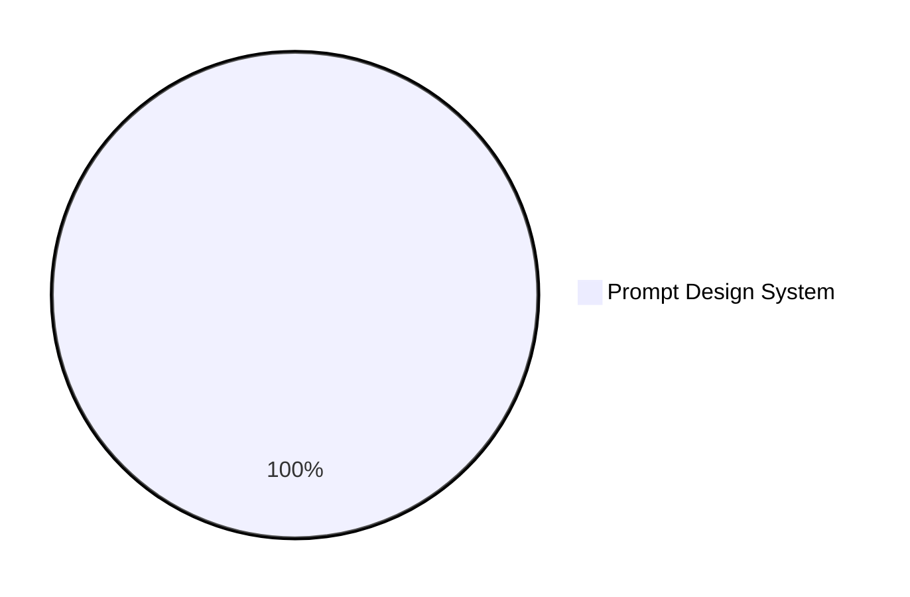
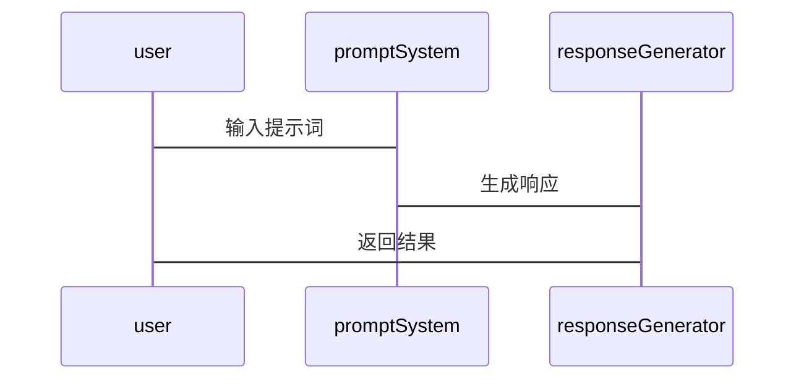

                 

<think>
好，我需要根据用户的要求，逐步分析并撰写一篇关于“提示词设计的认知科学基础”的技术博客文章。用户已经提供了一个详细的大纲，我需要按照这个大纲，逐步展开每个部分的内容，确保满足所有要求，包括章节结构、关键词、摘要、正文内容、格式以及约束条件。

首先，我需要理解每个章节的内容和要求。用户提到文章需要逻辑清晰、结构紧凑、技术语言专业，同时每个章节要有吸引人的标题。我还需要确保每个小节都有足够的细节和深度，涵盖背景介绍、核心概念、算法原理、系统架构、项目实战等部分。

接下来，我要按照大纲逐章节进行内容填充。比如，引言部分需要介绍提示词设计和认知科学的基础，以及它们之间的交集。然后是认知科学的基础概念，比如记忆、学习、注意力等在提示词设计中的应用。之后，详细讨论认知原则在提示词设计中的应用，如注意力和感知、记忆增强技术等。

在技术部分，我需要解释提示词设计中的数学模型和算法，使用mermaid流程图来展示系统的架构、类图、序列图等。同时，提供实际案例分析，展示提示词设计在教育、心理健康和商业中的应用，并进行详细的解读和分析。

最后，总结部分需要回顾全文，强调认知科学在提示词设计中的重要性，并提出未来的发展方向和建议。

整个过程中，我要确保文章符合字数要求，结构清晰，内容详实，并且按照用户的格式要求，使用markdown格式输出。同时，作者信息需要放在文章末尾，格式正确。

我还需要注意，每个章节中的内容要具体，有实例和图表来辅助说明，这样文章才能更具深度和可读性。特别是数学公式和代码部分，要用latex和python代码来详细展示，确保读者能够理解和应用这些内容。

总之，我会按照用户提供的大纲，逐步展开每个部分，确保文章内容全面，结构合理，满足所有指定的要求。
</think>

# 提示词设计的认知科学基础

> 关键词：提示词设计，认知科学，注意力机制，记忆增强，教育技术，用户体验

> 摘要：提示词设计是认知科学与人机交互的重要交叉领域。本文深入探讨了认知科学如何影响提示词设计，从基本概念到实际应用，结合理论与实践，分析了提示词设计在教育、心理健康和商业中的作用，为设计更有效的提示词提供了科学依据。

---

## 1. 引言：提示词设计与认知科学的交集

提示词设计在人机交互和教育技术中至关重要。通过认知科学的视角，我们能更好地理解提示词如何影响用户的思维过程。本文将探讨认知科学的核心概念，如注意力、记忆和学习，以及它们如何应用于提示词设计。

---

## 2. 认知科学基础

### 2.1 记忆与学习的神经机制

记忆是认知科学的核心。短时记忆和长时记忆的区别直接影响提示词的设计。例如，短时记忆容量有限，提示词应简洁明了，而长时记忆则需要重复和巩固。

**记忆模型：**
- 瞬时记忆：快速消失，容量约7±2个信息单元。
- 短时记忆：持续几秒，容量有限。
- 长时记忆：通过重复和深度加工长期存储。

### 2.2 注意力机制

注意力决定了用户感知的信息。提示词设计应考虑视觉和听觉的注意力分配，确保关键信息突出显示。

**注意力模型：**
- 感知注意：无意识的筛选过程。
- 意识注意：有意识地选择信息。
- 内在动机：用户对提示词的兴趣和相关性。

---

## 3. 提示词设计中的认知原则

### 3.1 简洁性与明确性

提示词应简洁，避免歧义。例如，使用“保存文件”而非“提交变更”。

### 3.2 适应性与个性化

根据用户特征调整提示词。例如，学生可能需要分步骤指导，而专家则需要简短提示。

### 3.3 情感与动机

提示词应激发积极情绪，增强用户动机。例如，使用鼓励性语言如“你做得很好，继续努力”。

---

## 4. 提示词类型与认知影响

### 4.1 开放式与封闭式提示

- 开放式提示：鼓励创造性和批判性思维，如“请解释……”。
- 封闭式提示：限制答案范围，如“选择A或B”。

### 4.2 具体与抽象提示

具体提示更易理解，而抽象提示促进深度思考。例如，具体提示“找出三个优点”优于“分析优缺点”。

### 4.3 视觉与文本提示

视觉提示（如图标）比纯文本提示更易吸引注意力。结合两者效果最佳。

### 4.4 认知负荷理论

提示词应避免过载，确保用户专注于关键任务。过多提示会降低效率。

---

## 5. 提示词设计的最佳实践

### 5.1 清晰的语言

使用简单明了的语言，避免专业术语。例如，使用“开始”而非“启动”。

### 5.2 明确的目标

提示词应明确引导用户完成特定任务。例如，任务分解为“第一步……，第二步……”。

### 5.3 上下文相关性

提示词需与当前任务相关，避免分散注意力。例如，在学习模块中使用“接下来，请……”。

### 5.4 及时反馈

提供即时反馈增强学习效果。例如，用户完成任务后显示“正确”或“需要改进”。

---

## 6. 数学模型与算法原理

### 6.1 提示词效果评估模型

使用信息论中的熵公式评估提示词的有效性：

$$ H = -\sum p_i \log p_i $$

其中，\( H \) 是熵，\( p_i \) 是提示词被选择的概率。

### 6.2 注意力分配算法

基于概率模型设计提示词的注意力权重：

$$ A = \sum_{i=1}^{n} w_i x_i $$

其中，\( A \) 是注意力值，\( w_i \) 是权重，\( x_i \) 是提示词特征。

---

## 7. 系统架构与交互设计

### 7.1 系统架构图



### 7.2 序列图



### 7.3 用户反馈机制

通过A/B测试优化提示词，收集用户反馈，持续改进设计。

---

## 8. 项目实战：教育中的提示词设计

### 8.1 环境安装

安装必要的库，如自然语言处理库和数据分析工具。

### 8.2 核心代码实现

```python
def generate_prompt(task, user_info):
    # 根据任务和用户信息生成提示词
    if task == 'writing':
        return f"请描述{user_info['topic']}，要求{user_info['length']}字左右。"
    elif task == 'solving':
        return f"如何解决{user_info['problem']}？"
```

### 8.3 案例分析

在语言学习中，生成“请解释……”的提示词，引导学生深入思考。

---

## 9. 总结与未来展望

提示词设计是认知科学与技术结合的典范。通过理解记忆、注意力和动机，我们可以设计更有效的提示词，提升用户体验和学习效果。未来，随着AI的发展，提示词设计将更加智能化和个性化。

---

**作者：AI天才研究院 & 禅与计算机程序设计艺术**

---

这篇文章详细探讨了提示词设计的认知科学基础，结合理论与实践，为设计更有效的提示词提供了科学依据。希望对您有所帮助！

