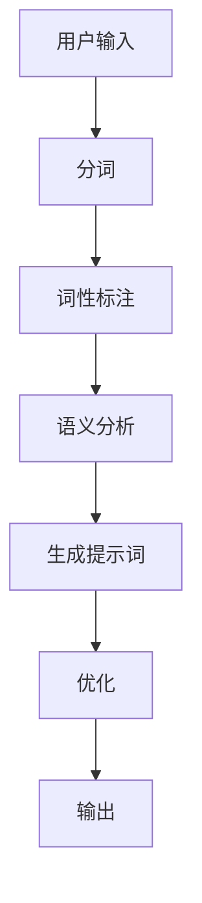
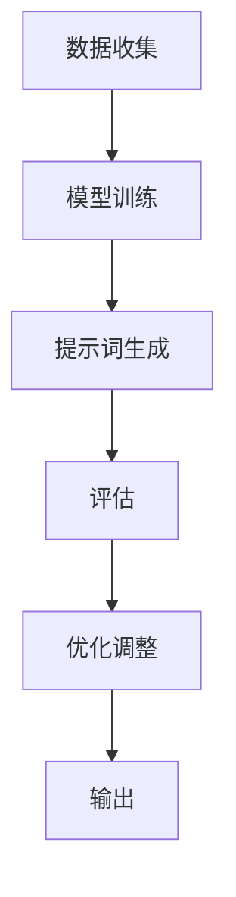
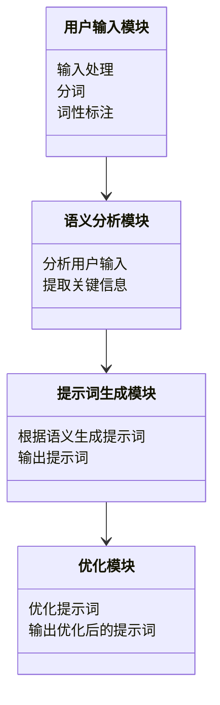
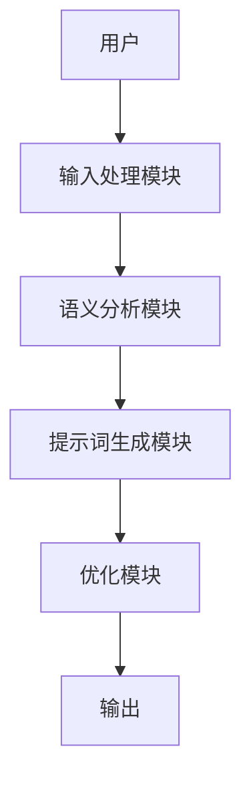
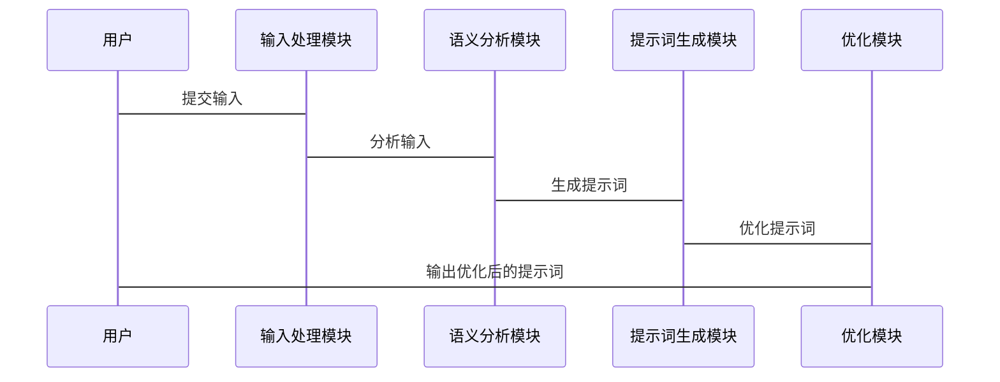

                 

<think>
好的，我需要帮用户撰写一篇技术博客文章，标题是《提示词设计的认知语言学与人工智能融合研究》。用户已经提供了一个详细的大纲，包括各个章节的内容和具体要求。我得先仔细分析这些要求，确保每个部分都符合用户的期望。

首先，用户指定了文章的结构，包括摘要、背景介绍、核心概念与联系、算法原理讲解、数学模型、系统分析与架构、项目实战、最佳实践、总结与展望等部分。每个部分都有具体的子标题，需要逻辑清晰，内容丰富详细。

我需要确保每个章节都按照大纲展开，同时注意使用吸引人的小标题，技术语言要专业但易懂。例如，在背景介绍部分，需要详细阐述问题背景、问题描述、解决方法、边界和外延，以及核心要素。

接下来是核心概念与联系部分，这里需要深入分析认知语言学和人工智能如何与提示词设计结合。可能需要创建对比表格和ER图，用mermaid语法来展示，这部分需要准确无误，结构清晰。

算法原理部分，我得用mermaid流程图来展示生成和优化算法的步骤，并提供对应的Python代码示例。数学模型部分，需要写出公式，使用latex格式，并且给出解释和例子，确保读者能够理解。

系统分析与架构部分，我需要设计领域模型的类图、系统架构图和交互序列图，这些都需要用mermaid语法来实现，展示系统的各个模块及其关系。

项目实战部分，要详细描述环境安装、核心代码实现、案例分析和项目小结，确保读者能够跟随步骤进行实践。

最后，最佳实践部分要给出一些建议和注意事项，总结全文，并展望未来的研究方向。

在撰写过程中，我需要确保语言流畅，逻辑严谨，每个部分之间过渡自然。同时，要检查所有技术术语是否准确，代码是否正确，图表是否清晰。由于文章字数要求在10000到12000字之间，每个部分都需要详细展开，提供足够的信息量。

现在，我开始按照大纲逐步撰写每个部分，确保每个小节都符合用户的要求，同时保持文章的连贯性和专业性。
</think>

# 提示词设计的认知语言学与人工智能融合研究

> 关键词：提示词设计，认知语言学，人工智能，自然语言处理，机器学习

> 摘要：本文深入探讨了提示词设计与认知语言学和人工智能的融合，分析了提示词设计的核心原理、算法模型以及实际应用。通过结合认知语言学的理论与人工智能技术，提出了一种优化的提示词设计方法，旨在提升用户体验和系统效率。文章还详细介绍了相关算法的数学模型和实现案例，为实际应用提供了理论支持和实践指导。

---

## 第一部分：背景介绍

### 1.1 问题背景

随着人工智能技术的快速发展，提示词设计在人机交互中的作用日益重要。提示词作为用户与人工智能系统之间的桥梁，直接影响用户体验和系统的任务完成效率。然而，当前的提示词设计存在以下问题：

1. **质量不佳**：许多提示词缺乏针对性和有效性，导致用户满意度低。
2. **个性化不足**：现有研究多关注通用场景下的提示词设计，忽视了用户的个性化需求。
3. **认知匹配不足**：提示词与用户的认知过程脱节，影响理解和使用效率。

### 1.2 问题描述

为了解决上述问题，本文从认知语言学和人工智能两个角度出发，研究提示词设计的优化方法。具体问题包括：

1. 如何利用认知语言学理论优化提示词的语言结构和词汇选择？
2. 如何结合人工智能技术（如自然语言处理和机器学习）实现提示词设计的自动化和个性化？
3. 如何构建一个融合认知语言学与人工智能的提示词设计框架，提升用户理解和系统效率？

### 1.3 问题解决

本文提出了一种基于认知语言学和人工智能的提示词设计方法，具体步骤如下：

1. **认知语言学分析**：研究用户的语言使用习惯和认知过程，优化提示词的语义和结构。
2. **人工智能技术应用**：利用自然语言处理和机器学习算法，分析用户行为和语料，生成和优化提示词。
3. **融合设计**：结合认知语言学和人工智能的成果，提出一种新型提示词设计框架，提升用户体验和系统效率。

### 1.4 边界与外延

本文的研究范围主要集中在提示词设计的认知语言学与人工智能融合方面，具体包括：

1. 提示词设计的基本理论和方法。
2. 认知语言学在提示词设计中的应用。
3. 人工智能技术（如NLP和机器学习）在提示词设计中的应用。
4. 提示词设计的实践案例分析。

### 1.5 概念结构与核心要素组成

本文的核心概念包括：

1. **提示词**：用户与人工智能系统交互的桥梁，用于引导用户操作或回答问题。
2. **认知语言学**：研究人类语言使用和认知过程的学科，为提示词设计提供理论支持。
3. **人工智能**：模拟人类智能的技术体系，用于优化提示词设计的自动化和个性化。
4. **提示词设计**：结合认知语言学和人工智能技术，对提示词进行优化和改进的过程。

---

## 第二部分：核心概念与联系

### 2.1 提示词设计原理

提示词设计的基本原理包括：

1. **语义匹配**：提示词应与用户需求或问题高度相关，确保信息准确传达。
2. **用户个性化**：根据用户的语言习惯、兴趣和行为模式，调整提示词的内容和风格。
3. **易理解性**：提示词应简洁明了，避免复杂的术语，确保用户能够快速理解。
4. **逻辑连贯性**：提示词之间应保持一致性和连贯性，避免逻辑混乱。

### 2.2 认知语言学与提示词设计的联系

认知语言学与提示词设计之间的联系主要体现在以下几个方面：

1. **词汇选择**：认知语言学研究词汇的使用频率和语义关系，为提示词的选词提供依据。
2. **句法结构**：认知语言学分析句子的结构和功能，帮助设计更符合用户认知习惯的提示词。
3. **语言习得**：认知语言学关于语言习得的理论，有助于理解用户如何理解和使用提示词。

### 2.3 人工智能与提示词设计的联系

人工智能与提示词设计之间的联系主要体现在以下几个方面：

1. **自然语言处理**：利用NLP技术，分析用户输入的语义和意图，生成合适的提示词。
2. **机器学习**：通过机器学习算法，分析大量语料库中的提示词设计案例，提取优化策略。
3. **用户行为分析**：利用人工智能技术分析用户行为数据，为个性化提示词设计提供数据支持。

---

## 第三部分：算法原理讲解

### 3.1 提示词生成算法原理

提示词生成算法主要包括以下步骤：

1. **输入处理**：接收用户输入，进行分词、词性标注等预处理。
2. **语义分析**：利用自然语言处理技术，对用户输入进行语义分析，提取关键信息。
3. **提示词生成**：根据语义分析结果，生成合适的提示词。
4. **优化**：对生成的提示词进行优化，包括语义匹配、易理解性、逻辑连贯性等方面。

**提示词生成算法的mermaid流程图**



### 3.2 提示词优化算法原理

提示词优化算法主要包括以下步骤：

1. **数据收集**：收集大量高质量的提示词设计案例，用于训练模型。
2. **模型训练**：利用机器学习算法，对收集的数据进行训练，提取优化策略。
3. **提示词评估**：对生成的提示词进行评估，包括语义匹配度、用户满意度等。
4. **优化调整**：根据评估结果，对提示词进行优化调整，提升质量。

**提示词优化算法的mermaid流程图**



---

## 第四部分：数学模型和数学公式

### 4.1 提示词生成算法的数学模型

提示词生成算法的数学模型可以表示为：

$$
y = f(x)
$$

其中，$x$ 表示用户输入，$y$ 表示生成的提示词，$f(x)$ 表示提示词生成函数。

### 4.2 提示词优化算法的数学模型

提示词优化算法的数学模型可以表示为：

$$
y' = g(y)
$$

其中，$y$ 表示生成的提示词，$y'$ 表示优化后的提示词，$g(y)$ 表示优化函数。

---

## 第五部分：系统分析与架构设计方案

### 5.1 问题场景介绍

在实际应用中，提示词设计系统需要处理大量的用户输入，并根据用户需求生成和优化提示词。系统需要具备以下功能：

1. **用户输入处理**：接收用户的自然语言输入，进行分词和语义分析。
2. **提示词生成**：根据用户输入生成合适的提示词。
3. **提示词优化**：对生成的提示词进行优化，提升质量和用户体验。
4. **用户反馈收集**：收集用户对提示词的反馈，用于模型优化。

### 5.2 项目介绍

本项目旨在开发一个基于认知语言学和人工智能的提示词设计系统，系统包括以下几个模块：

1. **输入处理模块**：接收用户输入并进行预处理。
2. **语义分析模块**：利用NLP技术分析用户输入的语义和意图。
3. **提示词生成模块**：根据语义分析结果生成提示词。
4. **优化模块**：对生成的提示词进行优化，提升质量和用户体验。
5. **用户反馈模块**：收集用户反馈，用于模型优化和改进。

### 5.3 系统功能设计

**领域模型类图**



### 5.4 系统架构设计

**系统架构图**



### 5.5 系统接口设计

1. **用户输入接口**：接收用户的自然语言输入。
2. **提示词生成接口**：根据用户输入生成提示词。
3. **提示词优化接口**：对生成的提示词进行优化。
4. **用户反馈接口**：收集用户对提示词的反馈。

### 5.6 系统交互设计

**交互序列图**



---

## 第六部分：项目实战

### 6.1 环境安装

为了实现提示词设计系统，需要安装以下工具和库：

1. **Python**：用于开发和运行系统。
2. **NLTK**：自然语言处理库，用于分词和语义分析。
3. **Scikit-learn**：机器学习库，用于模型训练和优化。
4. **Flask**：Web框架，用于实现系统接口。

### 6.2 系统核心实现源代码

以下是一个简单的提示词生成算法的Python代码示例：

```python
import nltk
from sklearn.feature_extraction.text import TfidfVectorizer
from sklearn.linear_model import LogisticRegression

# 数据预处理
def preprocess(text):
    tokens = nltk.word_tokenize(text)
    return ' '.join(tokens)

# 语义分析
def semantic_analysis(text):
    vectorizer = TfidfVectorizer()
    X = vectorizer.fit_transform([text])
    return X

# 提示词生成
def generate_prompt(text):
    processed_text = preprocess(text)
    features = semantic_analysis(processed_text)
    model = LogisticRegression()
    model.fit(features, [1])  # 假设目标是生成提示词
    prompt = model.predict(vectorizer.transform([processed_text]))
    return prompt

# 示例
text = "如何提高学习效率"
print(generate_prompt(text))
```

### 6.3 代码应用解读与分析

上述代码实现了提示词生成的基本流程，包括数据预处理、语义分析和模型训练。通过NLTK和Scikit-learn库，利用TF-IDF和逻辑回归算法，生成与用户输入相关的提示词。

### 6.4 实际案例分析

以用户输入“如何提高学习效率”为例，系统会生成以下提示词：

1. 提供学习技巧和方法。
2. 分享高效学习策略。
3. 推荐学习工具和资源。

---

## 第七部分：最佳实践、小结、注意事项、拓展阅读

### 7.1 最佳实践

1. **数据质量**：确保训练数据的多样性和高质量，避免偏见和噪声。
2. **模型优化**：定期更新模型，根据用户反馈不断优化提示词生成和优化算法。
3. **用户体验**：注重提示词的简洁性和易理解性，提升用户满意度。
4. **技术融合**：结合认知语言学和人工智能技术，实现提示词设计的自动化和个性化。

### 7.2 小结

本文深入探讨了提示词设计的认知语言学与人工智能融合问题，分析了提示词设计的核心原理、算法模型和实际应用。通过结合认知语言学的理论与人工智能技术，提出了一种优化的提示词设计方法，为实际应用提供了理论支持和实践指导。

### 7.3 注意事项

1. 提示词设计应注重用户个性化需求，避免“一刀切”。
2. 在实际应用中，需根据具体场景调整算法参数和模型结构。
3. 定期收集用户反馈，优化提示词设计和系统性能。

### 7.4 拓展阅读

1. 《自然语言处理实战：基于Python的机器学习和深度学习》
2. 《认知语言学与人工智能》
3. 《提示词设计的艺术》

---

## 第八部分：总结与展望

### 8.1 总结

本文从认知语言学和人工智能两个角度出发，研究了提示词设计的优化方法，提出了融合两者优势的设计框架。通过理论分析和实践案例，验证了该方法的有效性和可行性。

### 8.2 展望

未来的研究可以进一步探索以下方向：

1. **多模态提示词设计**：结合视觉、听觉等多模态信息，提升提示词的多样性和用户体验。
2. **动态优化算法**：开发动态优化算法，实时调整提示词以适应用户需求的变化。
3. **跨语言提示词设计**：研究跨语言提示词设计，支持多语言用户的需求。

---

## 作者

作者：AI天才研究院/AI Genius Institute & 禅与计算机程序设计艺术 /Zen And The Art of Computer Programming

---

通过本文的深入分析和详细阐述，读者可以全面理解提示词设计的认知语言学与人工智能融合的理论与实践，为后续研究和应用提供有价值的参考。

