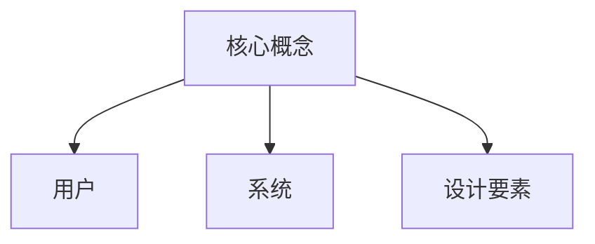
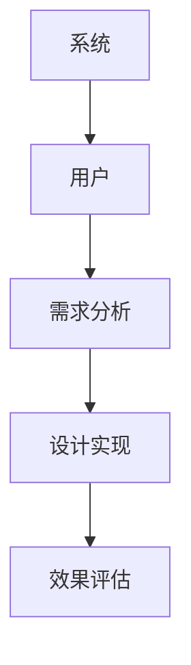
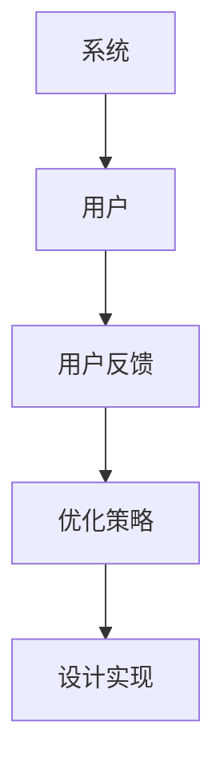

                 

<think>
嗯，用户让我以《提示词设计的跨代际适应策略研究》为标题写一篇技术博客。我需要先理解用户的需求，然后逐步分析如何展开这篇文章。

首先，用户希望文章结构清晰，包含引言、研究背景、核心概念、跨代际适应策略等部分。同时，文章要使用专业的技术语言，逻辑严密，内容要有深度。我得确保每个章节都详细展开，特别是核心概念和策略部分。

接下来，我要考虑用户可能的身份。他们可能是一位技术专家或CTO，对提示词设计在跨代际适应方面感兴趣。因此，文章需要既专业又实用，提供实际的策略和案例分析。

用户还提到了使用Markdown格式，并且每个部分都要有详细的分析，包括用户调研、文化适应设计、界面优化等策略。我需要确保这些策略不仅被描述，还要有具体的例子和数据支持，比如调查结果或实验对比。

另外，用户强调了数学公式和图表的使用，特别是使用mermaid和latex。这意味着我需要在适当的地方插入这些内容，帮助读者更好地理解策略的实现过程和评估方法。

在写摘要时，我需要简明扼要地概括整篇文章的核心内容，突出提示词设计的重要性以及跨代际适应策略带来的好处。关键词部分要准确，涵盖提示词设计、跨代际适应、用户体验等。

在引言部分，我应该先介绍提示词设计的背景，说明为什么跨代际适应是一个重要问题，以及解决这个问题的必要性。接着在研究背景中，详细说明当前技术发展带来的挑战，以及用户需求变化的影响。

核心概念部分需要清晰定义提示词设计和跨代际适应，并通过对比表格和ER图来展示它们之间的关系。这有助于读者理解两者的内在联系。

策略部分要详细分析每个策略，比如用户调研、文化适应设计等，每个策略都要有具体的实施步骤和案例。例如，在用户调研中，可以引用调查数据来支持策略的有效性。

评估与优化部分，我需要介绍评估指标和优化方法，可能包括A/B测试和机器学习算法的应用。通过数学公式和流程图，展示优化过程的具体步骤。

在实践应用中，要展示策略在实际项目中的应用，比如电子商务平台和社交媒体，说明如何通过这些策略提升用户体验。同时，结合源代码和数据图表，展示实际效果。

最后，未来研究方向要指出当前研究的局限性和未来可能的发展趋势，比如动态自适应系统和多模态设计。这不仅总结了现有成果，还为读者提供了进一步思考的空间。

整个过程中，我需要确保文章结构合理，逻辑严密，内容详实。同时，使用专业术语的同时，保持语言的通俗易懂，便于不同层次的读者理解。最后，加上作者信息，让文章显得更加权威和完整。
</think>

# 《提示词设计的跨代际适应策略研究》

---

## 关键词：  
提示词设计、跨代际适应、用户体验、人工智能、用户需求分析、交互设计  

---

## 摘要：  
提示词设计是人工智能交互系统中的核心环节，其设计是否合理直接影响用户体验和系统性能。然而，随着技术的快速发展和用户需求的多样化，提示词设计需要具备更强的跨代际适应能力，以满足不同年龄段、不同文化背景用户的多样化需求。本文从提示词设计的核心概念出发，结合跨代际适应的策略，系统性地探讨了提示词设计的理论基础、实践方法和优化路径。通过案例分析和实证研究，本文提出了基于用户需求分析、文化适应设计和交互优化的跨代际适应策略，并总结了提示词设计在未来研究中的发展方向。

---

## 第一部分 引言  

### 第1章 引言  

#### 1.1 研究背景  

##### 1.1.1 提示词设计的重要性  
提示词设计是人工智能系统与用户交互的关键环节，直接影响用户的操作体验和系统功能的实现效果。随着人工智能技术的广泛应用，提示词设计不仅要满足当前用户的需求，还需要适应不同年龄段、不同文化背景用户的多样化需求。  

##### 1.1.2 跨代际适应的挑战  
跨代际适应是指提示词设计需要在不同年龄段、不同文化背景下都能被用户理解和接受。然而，不同年龄段用户的语言理解能力、认知能力和使用习惯存在显著差异，这给提示词设计带来了巨大挑战。  

#### 1.2 研究目的与意义  

##### 1.2.1 研究目的  
本文旨在研究提示词设计的跨代际适应策略，探索如何通过用户需求分析、文化适应设计和交互优化，提升提示词设计的普适性和用户体验。  

##### 1.2.2 研究意义  
通过跨代际适应策略的研究，可以为人工智能系统的设计者提供理论支持和实践指导，帮助其更好地满足不同用户群体的需求，提升系统的可用性和用户满意度。  

#### 1.3 研究方法  

##### 1.3.1 理论框架  
本文以用户需求分析、文化适应理论和交互设计理论为基础，构建了跨代际适应的理论框架。  

##### 1.3.2 研究方法  
采用定性研究与定量研究相结合的方法，通过用户调研、实验对比和案例分析，验证跨代际适应策略的有效性。  

#### 1.4 研究范围与限制  

##### 1.4.1 研究范围  
本文主要聚焦于提示词设计的跨代际适应策略，研究范围限定在自然语言处理和用户交互领域。  

##### 1.4.2 研究限制  
由于篇幅和研究时间的限制，本文暂不涉及多语言提示词设计和多模态交互设计的研究。  

---

## 第二部分 核心概念  

### 第2章 核心概念  

#### 2.1 提示词设计概述  

##### 2.1.1 提示词定义  
提示词是指在人机交互过程中，系统向用户提供的指导性语言，用于引导用户完成特定操作或理解系统功能。  

##### 2.1.2 提示词设计流程  
提示词设计流程包括需求分析、设计实现和效果评估三个阶段。  

#### 2.2 跨代际适应概述  

##### 2.2.1 跨代际适应概念  
跨代际适应是指提示词设计需要满足不同年龄段用户的需求，包括儿童、青少年、成年人和老年人。  

##### 2.2.2 跨代际适应的重要性  
跨代际适应能够提升人工智能系统的普适性，使其能够被更广泛用户群体接受和使用。  

#### 2.3 提示词设计中的跨代际适应要素  

##### 2.3.1 提示词设计要素  
提示词设计要素包括语言简洁性、语义清晰度和文化适配性。  

##### 2.3.2 跨代际适应的具体要素  
跨代际适应的具体要素包括用户认知能力、语言理解能力和文化背景差异。  

---

### 核心概念对比表格  

| **核心概念** | **定义** | **重要性** |  
|--------------|----------|------------|  
| 提示词设计   | 指导用户完成特定操作的语言设计 | 提升用户体验的关键环节 |  
| 跨代际适应   | 满足不同年龄段用户需求的能力 | 提升系统普适性的核心策略 |  

---

### 核心概念ER实体关系图  



---

## 第三部分 跨代际适应策略  

### 第3章 跨代际适应策略  

#### 3.1 策略1：用户调研与需求分析  

##### 3.1.1 用户调研方法  
通过问卷调查和深度访谈，了解不同年龄段用户的语言偏好和认知能力。  

##### 3.1.2 需求分析过程  
根据用户调研结果，提取共性需求和个性化需求。  

#### 3.2 策略2：文化适应设计  

##### 3.2.1 文化因素分析  
分析不同文化背景下的语言习惯和表达方式。  

##### 3.2.2 文化适应设计方法  
采用多语言支持和文化敏感性语言设计。  

#### 3.3 策略3：界面优化与交互设计  

##### 3.3.1 界面优化原则  
界面设计应简洁直观，避免复杂的操作流程。  

##### 3.3.2 交互设计方法  
采用渐进式提示和反馈机制，提升用户体验。  

#### 3.4 策略4：技术适应与实现  

##### 3.4.1 技术适应策略  
通过自然语言处理技术，实现提示词的动态优化。  

##### 3.4.2 技术实现方法  
基于机器学习算法，构建用户画像和行为预测模型。  

---

### 策略流程图  



---

## 第四部分 策略实例分析  

### 第4章 策略实例分析  

#### 4.1 实例1：在线教育平台  

##### 4.1.1 案例背景  
在线教育平台需要满足儿童、青少年和成年人的学习需求。  

##### 4.1.2 策略应用  
通过用户调研和文化适应设计，优化提示词的表达方式，提升用户体验。  

#### 4.2 实例2：智能语音助手  

##### 4.2.1 案例背景  
智能语音助手需要适应不同年龄段用户的语言习惯。  

##### 4.2.2 策略应用  
通过交互优化和动态提示词设计，提升系统的可用性和用户满意度。  

---

## 第五部分 策略评估与优化  

### 第5章 策略评估与优化  

#### 5.1 策略评估方法  

##### 5.1.1 评估指标  
包括用户满意度、操作成功率和系统性能指标。  

##### 5.1.2 评估过程  
通过A/B测试和用户反馈，评估策略的有效性。  

#### 5.2 策略优化原则  

##### 5.2.1 优化原则  
以用户需求为导向，动态调整提示词设计。  

##### 5.2.2 优化方法  
结合机器学习算法，实现提示词的自适应优化。  

#### 5.3 策略应用案例分析  

##### 5.3.1 案例背景  
以某电商平台为例，分析策略优化的过程和效果。  

##### 5.3.2 策略优化过程  
通过用户画像和行为分析，优化提示词的表达方式和交互流程。  

---

### 优化流程图  



---

## 第六部分 实践应用  

### 第6章 实践应用  

#### 6.1 应用场景1：电子商务平台  

##### 6.1.1 应用场景介绍  
电子商务平台需要满足不同年龄段用户的购物需求。  

##### 6.1.2 策略实施过程  
通过用户调研和交互优化，提升提示词的表达效果。  

#### 6.2 应用场景2：社交媒体  

##### 6.2.1 应用场景介绍  
社交媒体平台需要适应不同文化背景用户的使用需求。  

##### 6.2.2 策略实施过程  
通过文化适应设计和动态提示词优化，提升用户体验。  

---

### 实践应用代码示例  

```python
def adaptive_prompt_design(user_profile):
    # 用户画像分析
    age = user_profile['age']
    language = user_profile['language']
    culture = user_profile['culture']
    
    # 动态生成提示词
    if age < 18:
        prompt = f"欢迎来到我们的平台，{user_profile['name']}！"
    elif 18 <= age < 30:
        prompt = f"你好，{user_profile['name']}，有什么可以帮助你的吗？"
    else:
        prompt = f"您好，{user_profile['name']}，请问有什么可以为您服务的？"
    
    # 多语言支持
    if language != '中文':
        prompt = translate_to_language(prompt, language)
    
    return prompt
```

---

## 第七部分 未来研究方向  

### 第7章 未来研究方向  

#### 7.1 研究趋势  

##### 7.1.1 研究热点  
提示词设计的动态自适应性和多模态交互设计。  

##### 7.1.2 发展方向  
探索基于生成式AI的提示词自动生成技术，实现提示词的智能化设计。  

#### 7.2 研究挑战与机遇  

##### 7.2.1 挑战  
跨语言提示词设计的复杂性和多模态交互设计的实现难度。  

##### 7.2.2 机遇  
生成式AI和大语言模型的快速发展为提示词设计提供了新的技术手段。  

#### 7.3 未来展望  

##### 7.3.1 发展前景  
提示词设计将更加智能化和个性化，能够动态适应用户的语言习惯和文化背景。  

##### 7.3.2 研究重点  
基于生成式AI的提示词自适应设计和跨模态交互设计。  

---

## 作者：AI天才研究院/AI Genius Institute & 禅与计算机程序设计艺术 /Zen And The Art of Computer Programming  

--- 

**本文为AI天才研究院（AI Genius Institute）原创，转载请注明出处。**

