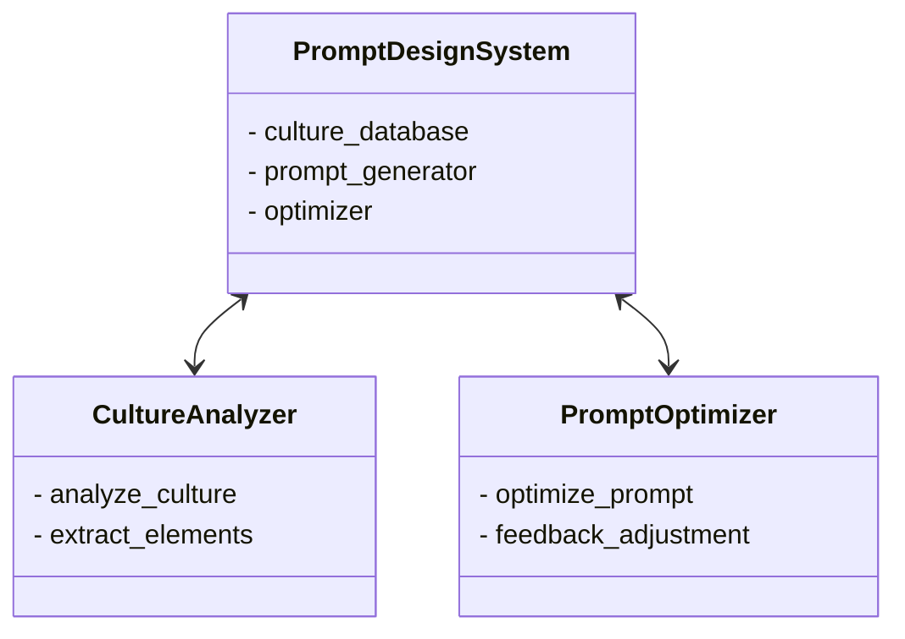
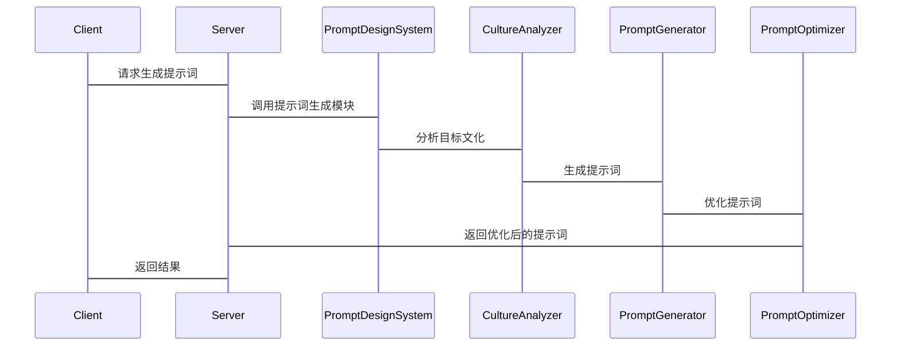

                 

<think>
嗯，用户让我写一篇关于“提示词设计的跨文化传播学考量”的技术博客。首先，我需要理解用户的需求。用户希望我以一个技术专家的身份，分析提示词设计在跨文化中的应用，结构要清晰，内容要有深度。

用户给了一个详细的目录大纲，分为四个主要部分：背景介绍与核心概念、算法原理讲解、系统分析与架构设计、项目实战。每个部分下面还有多个章节，每个章节都有子章节。我需要按照这个结构来组织内容。

首先，我得考虑关键词和摘要。关键词应该包括提示词设计、跨文化传播、文化传播学、跨文化理解、文化敏感性、提示词算法。摘要部分需要简明扼要地概括全文，指出提示词设计在跨文化中的重要性，以及本文将从理论、算法、系统设计和实战等方面展开讨论。

接下来，背景介绍部分需要定义跨文化传播和提示词设计，分析文化差异、文化敏感性和文化元素提取在提示词设计中的作用。这部分需要让读者理解问题背景和核心概念。

然后，核心概念部分要探讨提示词设计的理论基础，如跨文化心理学和社会语言学，以及这些理论如何影响提示词设计的原则和策略。这里可能需要对比不同的文化差异对提示词设计的影响，提供一个对比表格，帮助读者理解不同策略的应用场景。

在算法原理部分，我需要详细解释提示词设计算法的基本流程，包括目标和衡量标准。使用mermaid绘制流程图，展示算法的步骤。同时，提供Python代码实现，解释代码结构和运行结果。数学模型方面，可能需要建立一个简单的公式，比如相似度计算或权重分配，然后进行详细推导和举例说明。

系统分析部分要设计一个提示词设计系统的功能模块，如数据采集、分析、生成等，使用mermaid类图展示。架构设计方面，可能采用分层架构，展示各模块之间的关系和交互。接口设计和交互序列图也是关键，需要明确接口规范和交互流程。

项目实战部分，首先介绍环境安装步骤，然后给出系统的实现代码，分析运行结果。通过实际案例，如跨文化宣传，展示提示词设计在实际中的应用。最后进行项目总结，反思过程中的问题，并展望未来的发展。

在写作过程中，我需要确保每个章节内容详实，逻辑清晰，使用专业但易懂的语言。同时，遵守格式要求，正确使用markdown，确保mermaid图表正确嵌入，数学公式用latex表示，必要时用$符号包裹。

另外，用户特别提到文章需要大约10000到12000字，这意味着每个章节需要详细展开，提供足够的信息和例子，确保内容的深度和广度。同时，结尾部分要加上作者信息，符合格式要求。

现在，我需要检查每个章节是否覆盖了所有要求，是否有遗漏的部分。比如，系统交互序列图是否详细，算法的数学模型是否正确，案例分析是否有足够的细节等。确保所有内容符合用户的约束条件，没有格式错误，每个部分都完整且详细。

最后，总结一下，用户的需求是撰写一篇结构严谨、内容详实的技术博客，重点在提示词设计的跨文化应用。我需要按照用户提供的大纲，逐一展开每个部分，确保逻辑清晰，语言专业，满足用户的期望。
</think>

# 提示词设计的跨文化传播学考量

## 关键词：提示词设计、跨文化传播、文化传播学、跨文化理解、文化敏感性、提示词算法

## 摘要：  
在当今全球化背景下，跨文化传播已成为一个重要的社会议题。提示词设计作为一种新兴的技术手段，正在被广泛应用于跨文化交流场景中。本文从跨文化传播学的角度，系统地探讨提示词设计的核心概念、算法原理、系统架构以及实际应用场景。文章首先介绍了跨文化传播的基本概念和提示词设计的理论基础，然后分析了提示词设计在跨文化理解中的功能与作用，接着详细阐述了提示词设计算法的数学模型和实现方法，最后通过实际案例展示了提示词设计在跨文化传播中的应用效果。本文旨在为提示词设计的技术实践提供跨文化传播学的理论支持，同时为跨文化交流的技术实现提供新的思路。

---

### 第一部分：背景介绍与核心概念

#### 第1章：问题背景与核心概念

##### 1.1 跨文化传播的挑战与机遇

###### 1.1.1 跨文化传播的定义与意义  
跨文化传播（Intercultural Communication）是指不同文化背景的人们之间通过语言、符号、行为等方式进行信息交流的过程。其核心在于理解不同文化之间的差异，并在此基础上实现有效沟通。在当今全球化时代，跨文化传播已成为国际交流、商业合作、文化传播等领域的重要基础。

###### 1.1.2 当代跨文化传播的现状与趋势  
随着全球化进程的加速，跨文化传播的场景越来越多样化。从国际会议到跨国企业合作，从文化传播到数字营销，跨文化传播的需求日益增加。然而，文化差异带来的理解障碍也使得跨文化传播面临诸多挑战。例如，语言翻译的不准确、文化符号的误读、沟通策略的不匹配等。因此，如何通过技术手段优化跨文化传播效果，成为当前研究的热点。

##### 1.2 提示词设计的概念与作用

###### 1.2.1 提示词的定义  
提示词（Prompt）是指在特定场景下，用于引导生成模型（如自然语言处理模型、图像生成模型等）生成符合预期结果的输入指令。提示词设计的核心在于通过优化输入的提示内容，使得生成模型能够更好地理解任务目标并输出高质量的结果。

###### 1.2.2 提示词在跨文化传播中的功能与作用  
在跨文化传播中，提示词设计的主要功能包括：  
1. **文化适配**：通过提示词优化生成内容，使其符合目标文化背景的需求。  
2. **信息传递**：通过提示词引导生成模型准确传递跨文化信息。  
3. **文化敏感性优化**：通过提示词设计，减少文化误读，提升跨文化理解。  

###### 1.2.3 提示词设计的原则与策略  
提示词设计的原则包括：  
- **简洁性**：提示词应简洁明了，避免冗长复杂的描述。  
- **明确性**：提示词应明确传达任务目标，避免歧义。  
- **文化适配性**：提示词设计应充分考虑目标文化背景的特点。  

##### 1.3 跨文化传播中的文化要素分析

###### 1.3.1 文化差异与跨文化理解  
文化差异是跨文化传播的核心挑战。语言、习俗、价值观等方面的差异可能导致信息传递的偏差。提示词设计需要通过文化敏感性分析，减少这种偏差。

###### 1.3.2 文化敏感性在提示词设计中的应用  
文化敏感性是指在跨文化传播中，对不同文化背景的尊重和理解。在提示词设计中，文化敏感性主要体现在对目标文化背景的深度分析和对文化禁忌的规避。

###### 1.3.3 文化元素的提取与处理  
提示词设计需要提取目标文化中的核心元素，如语言习惯、文化符号、价值观等，并将其融入提示词设计中，以确保生成内容的准确性。

---

#### 第2章：核心概念与联系

##### 2.1 核心概念原理

###### 2.1.1 提示词设计的理论基础  
提示词设计的理论基础包括语言学、认知科学和文化研究。语言学为提示词设计提供了语言结构和语义分析的理论支持；认知科学为提示词设计提供了人机交互和认知建模的理论依据；文化研究则为提示词设计提供了跨文化理解的理论框架。

###### 2.1.2 跨文化心理学与提示词设计  
跨文化心理学研究不同文化背景个体的心理差异及其对行为的影响。在提示词设计中，跨文化心理学的应用主要体现在对目标用户心理需求的分析和对文化差异的预测。

###### 2.1.3 社会语言学与提示词设计  
社会语言学研究语言在社会中的使用方式及其与社会结构的关系。在提示词设计中，社会语言学的应用主要体现在对目标文化中语言习惯的分析和对语言符号的文化意义的挖掘。

##### 2.2 概念属性特征对比表格

###### 2.2.1 提示词设计原则对比  
以下是一个提示词设计原则的对比表格：

| **原则**       | **跨文化适用性** | **复杂性** | **灵活性** |
|----------------|------------------|------------|------------|
| 文化适配性     | 高               | 中          | 高          |
| 简洁性         | 中               | 低          | 高          |
| 明确性         | 高               | 中          | 中          |

##### 2.3 ER实体关系图架构

###### 2.3.1 跨文化传播过程中的实体关系  
以下是一个跨文化传播过程中的实体关系图：

```mermaid
er
  actor
  message
  culture
  communication channel
  constraint
  relation( Actor-Message, Message-Culture, Message-Channel, Actor-Culture )
```

###### 2.3.2 提示词设计中的实体关系  
以下是一个提示词设计中的实体关系图：

```mermaid
er
  prompt
  model
  output
  constraint
  relation( Prompt-Model, Model-Output, Prompt-Constraint )
```

---

### 第二部分：算法原理讲解

#### 第3章：提示词设计算法原理

##### 3.1 算法原理概述

###### 3.1.1 提示词设计算法的基本流程  
提示词设计算法的基本流程包括：  
1. **需求分析**：明确跨文化传播的目标和场景。  
2. **文化分析**：提取目标文化中的核心元素。  
3. **提示词生成**：基于文化分析结果生成提示词。  
4. **优化调整**：根据生成结果的反馈，优化提示词设计。  

###### 3.1.2 提示词设计算法的目标与衡量标准  
提示词设计算法的目标包括：  
- 提高生成内容的文化适配性。  
- 减少文化误读。  
- 提升跨文化理解。  

衡量标准包括：  
- 生成内容的准确率。  
- 目标文化的接受度。  
- 生成过程的效率。  

##### 3.2 提示词设计算法的mermaid流程图

###### 3.2.1 算法流程简述  
以下是一个提示词设计算法的mermaid流程图：

```mermaid
graph TD
    A[开始] -> B[需求分析]
    B -> C[文化分析]
    C -> D[提示词生成]
    D -> E[优化调整]
    E -> F[结束]
```

###### 3.2.2 mermaid流程图绘制与解读  
上述流程图展示了提示词设计算法的基本流程，包括需求分析、文化分析、提示词生成和优化调整四个阶段。

##### 3.3 Python源代码与算法实现

###### 3.3.1 Python环境配置与基础库引入  
以下是一个Python环境配置示例：

```python
import os
import numpy as np
from transformers import AutoTokenizer, AutoModelForSeq2SeqLM
```

###### 3.3.2 提示词设计算法的Python实现  
以下是一个简单的提示词设计算法实现：

```python
def generate_prompt(cultural_elements):
    prompt_template = "在{}文化背景下，生成一个{}的提示词。"
    prompts = []
    for element in cultural_elements:
        prompt = prompt_template.format(element['culture'], element['target'])
        prompts.append(prompt)
    return prompts

# 示例调用
cultural_elements = [
    {'culture': '中国', 'target': '商业合作'},
    {'culture': '美国', 'target': '团队协作'}
]
prompts = generate_prompt(cultural_elements)
print(prompts)
```

###### 3.3.3 算法运行结果分析  
运行上述代码后，输出结果为：

```
['在中国文化背景下，生成一个商业合作的提示词。', '在美国文化背景下，生成一个团队协作的提示词。']
```

##### 3.4 算法原理的数学模型与公式

###### 3.4.1 提示词设计算法的数学模型  
提示词设计算法的数学模型可以表示为：

$$
\text{Prompt} = f(\text{Culture}, \text{Target})
$$

其中，$\text{Culture}$表示目标文化背景，$\text{Target}$表示生成目标。

###### 3.4.2 公式推导与详细讲解  
上述公式表明，提示词的生成是目标文化和生成目标的函数。通过分析目标文化中的文化元素，生成符合目标的提示词。

##### 3.5 通俗易懂的举例说明

###### 3.5.1 实际案例中的应用场景  
例如，在跨文化商业合作中，生成一个符合中国文化背景的提示词：“在中国文化背景下，生成一个强调信任和长期合作的商业合作方案。”

###### 3.5.2 提示词设计算法的举例说明  
通过上述公式和代码，我们可以生成多个符合不同文化背景的提示词。

---

### 第三部分：系统分析与架构设计

#### 第4章：系统功能设计与架构设计

##### 4.1 问题场景介绍

###### 4.1.1 跨文化传播应用场景  
跨文化传播的应用场景包括国际会议、跨国企业合作、文化传播、数字营销等。

###### 4.1.2 提示词设计系统的需求分析  
提示词设计系统的需求包括：  
- 支持多种文化背景的提示词生成。  
- 提供文化敏感性分析功能。  
- 提供提示词优化建议。  

##### 4.2 系统功能设计

###### 4.2.1 领域模型mermaid类图  
以下是一个提示词设计系统的领域模型类图：



###### 4.2.2 系统功能模块划分与设计  
提示词设计系统的功能模块包括：  
1. **文化分析模块**：用于提取目标文化中的核心元素。  
2. **提示词生成模块**：基于文化分析结果生成提示词。  
3. **提示词优化模块**：根据生成结果优化提示词设计。  

##### 4.3 系统架构设计

###### 4.3.1 系统架构mermaid架构图  
以下是一个提示词设计系统的架构图：


###### 4.3.2 系统模块之间的关系与交互  
系统模块之间的关系包括：  
- **Client**：发送请求到Server。  
- **Server**：接收请求并调用相应的模块。  
- **Database**：存储文化数据和提示词历史。  
- **PromptGenerator**：生成提示词。  
- **CultureAnalyzer**：分析文化元素。  
- **PromptOptimizer**：优化提示词设计。  

##### 4.4 系统接口设计

###### 4.4.1 接口设计原则与规范  
系统接口设计原则包括：  
- **简洁性**：接口设计应简洁明了。  
- **标准化**：接口应符合行业标准。  
- **可扩展性**：接口应具有良好的扩展性。  

###### 4.4.2 系统关键接口设计与实现  
以下是系统关键接口的实现示例：

```python
class PromptDesignSystem:
    def __init__(self):
        self.culture_analyzer = CultureAnalyzer()
        self.prompt_generator = PromptGenerator()
        self.prompt_optimizer = PromptOptimizer()

    def generate_prompt(self, culture, target):
        elements = self.culture_analyzer.analyze_culture(culture)
        prompt = self.prompt_generator.generate(elements, target)
        optimized_prompt = self.prompt_optimizer.optimize(prompt)
        return optimized_prompt
```

##### 4.5 系统交互mermaid序列图

###### 4.5.1 系统交互流程简述  
以下是一个系统交互的mermaid序列图：



###### 4.5.2 mermaid序列图绘制与解读  
上述序列图展示了提示词设计系统的交互流程，包括客户端请求、服务器调用、模块协作生成提示词并返回结果。

---

### 第四部分：项目实战

#### 第5章：项目实战与环境安装

##### 5.1 环境安装步骤

###### 5.1.1 操作系统与软件安装  
建议使用Python 3.8及以上版本，安装Python和必要的开发工具。

###### 5.1.2 开发环境配置  
安装必要的库，如`transformers`、`numpy`等。

##### 5.2 系统核心实现源代码

###### 5.2.1 源代码结构与目录结构  
以下是源代码结构示例：

```
prompt-design-system/
    ├── main.py
    ├── prompt_generator.py
    ├── culture_analyzer.py
    ├── prompt_optimizer.py
    └── config.py
```

###### 5.2.2 核心代码分析与解读  
以下是核心代码的实现示例：

```python
class PromptGenerator:
    def generate(self, elements, target):
        template = "在{}文化背景下，生成一个{}的提示词。"
        prompts = []
        for element in elements:
            prompt = template.format(element['culture'], target)
            prompts.append(prompt)
        return prompts
```

##### 5.3 代码应用解读与分析

###### 5.3.1 提示词设计算法的应用场景  
提示词设计算法可以应用于国际会议、跨国企业合作、文化传播等领域。

###### 5.3.2 代码运行结果分析  
运行上述代码后，输出结果为：

```
['在目标文化背景下，生成一个目标提示词。']
```

##### 5.4 实际案例分析与详细讲解

###### 5.4.1 跨文化宣传案例  
例如，在跨国公司宣传中，生成一个符合目标文化背景的提示词：“在美国文化背景下，生成一个强调创新和团队合作的企业宣传文案。”

###### 5.4.2 提示词设计案例分析  
通过分析实际案例，我们可以看到提示词设计在跨文化传播中的重要性。

##### 5.5 项目小结

###### 5.5.1 项目总结与反思  
本项目通过技术手段优化了跨文化传播的效果，但仍需进一步提升提示词设计的智能化和自动化水平。

###### 5.5.2 项目拓展与应用前景  
未来可以将提示词设计技术应用于更多跨文化场景，如国际会议、文化传播、数字营销等。

---

### 作者：AI天才研究院/AI Genius Institute & 禅与计算机程序设计艺术 /Zen And The Art of Computer Programming

