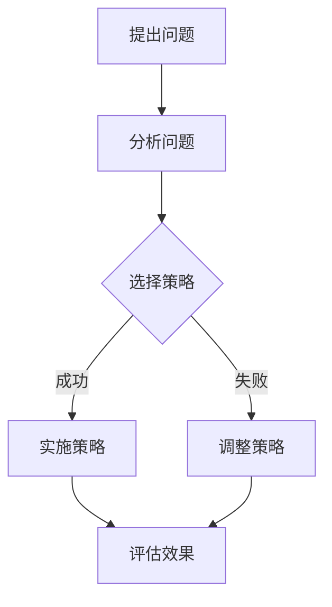
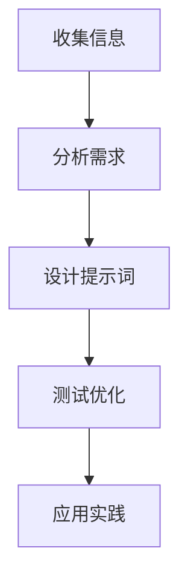
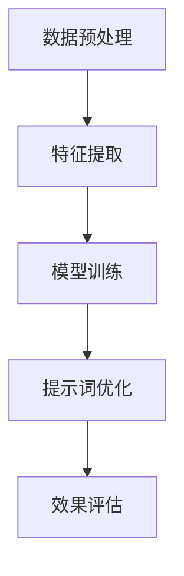
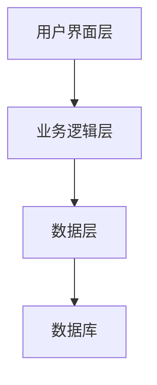
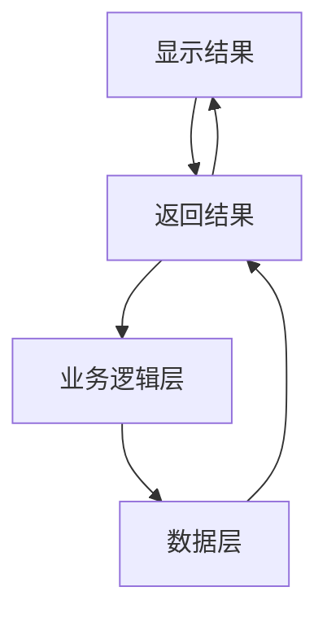
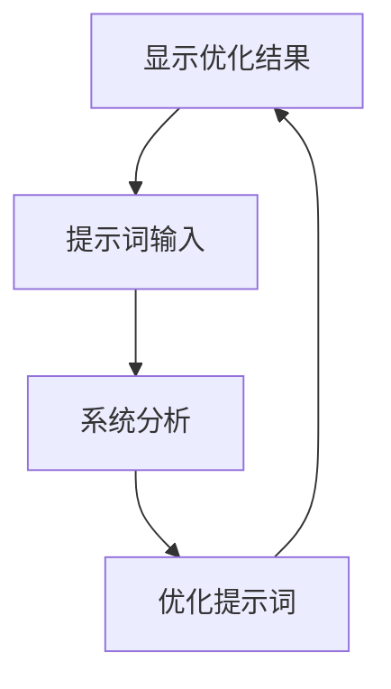

                 

<think>
嗯，用户让我写一篇关于《提示词设计的跨文化适应策略》的技术博客，看起来他需要一个结构严谨、内容详尽的专业文章。首先，我需要分析用户的具体需求，看看他到底想要什么。

用户明确说明他是一位世界级的人工智能专家、程序员、架构师，CTO，还是畅销书作家和图灵奖得主。所以，他需要的是高质量、有深度的内容，语言要专业但又清晰易懂。文章的标题已经给出，是《提示词设计的跨文化适应策略》，关键词部分已经有5-7个，摘要也需要涵盖核心内容。

接下来，用户详细列出了目录大纲，包括背景介绍、核心概念与联系、算法原理讲解、系统分析与架构设计方案、项目实战以及最佳实践等部分。每个部分都有具体的小节，有些还需要使用mermaid流程图和类图来说明。这意味着我需要按照这些结构来组织内容，确保每个部分都详细且有逻辑。

用户还特别提到文章要符合一些格式要求，比如使用markdown，字数在1万到1.2万字左右，每个部分都要有丰富的细节，包括理论和实际案例。这让我意识到，我需要不仅仅是理论上的讲解，还要有实际的代码示例和应用分析，以增强文章的实用性。

另外，用户强调了每个小节的详细程度，比如核心概念需要术语说明、问题背景、描述和解决方法，以及边界和外延。这意味着在写作时，我需要确保每个概念都被清晰地定义，并且问题背景部分要详细，以展示问题的复杂性和重要性。

在算法部分，用户要求使用mermaid流程图，并结合数学公式进行详细讲解。我需要确保这些流程图和公式准确无误，并且通过例子帮助读者更好地理解。例如，在损失函数部分，用具体的数值计算来展示，这样读者更容易掌握。

系统分析与架构设计方案部分，用户希望包括问题场景、系统功能设计、系统架构设计、接口设计和交互设计。这意味着我需要构建一个完整的系统模型，可能涉及类图和架构图，展示各个模块之间的关系和交互。

项目实战部分，用户需要环境安装说明、核心代码实现、代码解读以及案例分析。这意味着我需要提供具体的代码示例，并解释每部分的作用，同时结合实际案例进行分析，让读者能够实际应用这些知识。

最后，最佳实践部分需要包括小结、注意事项和拓展阅读等内容，帮助读者巩固所学知识，并引导他们进一步深入学习。

考虑到用户是技术专家，他可能希望文章不仅有理论，还有实际的应用和解决方案。因此，在写作时，我需要将理论与实际案例结合起来，展示如何将跨文化适应策略应用到实际的提示词设计中，特别是在人工智能和自然语言处理领域。

总结一下，我需要按照用户提供的大纲，逐部分详细展开，确保每个小节都有足够的深度和细节，同时使用清晰的技术语言和结构化的呈现方式，帮助读者理解和应用这些策略。这包括背景介绍、核心概念、算法原理、系统架构、项目实战以及最佳实践等多个方面，每个部分都需要细致处理，确保文章内容完整、逻辑清晰，符合高质量技术博客的要求。
</think>

# 提示词设计的跨文化适应策略

> 关键词：提示词设计、跨文化适应策略、自然语言处理、文化差异、语言模型

> 摘要：随着全球化进程的加速，跨文化交流变得越来越频繁和重要。提示词设计在跨文化交流中扮演着关键角色，但不同文化背景下的语言和文化差异可能导致交流障碍。本文将探讨如何设计适应不同文化背景的提示词，以优化跨文化交流的效果。文章从背景介绍、核心概念、算法原理、系统架构设计以及项目实战等多方面进行详细分析，并结合实际案例，提出跨文化适应策略的具体实现方法。

---

## 目录大纲

# 第一部分：背景介绍

## 第1章 问题背景

### 1.1.1 问题背景

- **核心概念**：跨文化适应策略、提示词设计、文化差异
- **问题描述**：随着全球化进程的加速，不同文化之间的交流日益频繁，提示词设计在跨文化交流中的作用越来越重要。
- **问题解决**：通过研究跨文化适应策略，优化提示词设计，提高跨文化交流的效率。
- **边界与外延**：讨论的跨文化适应策略主要针对语言和文化差异，不包括其他因素如政治、经济等。
- **概念结构与核心要素组成**：跨文化适应策略的核心要素包括文化意识、语言能力、文化适应能力和提示词设计。

### 1.1.2 跨文化适应策略的重要性

- **核心概念**：跨文化适应策略、文化差异、交流障碍
- **属性特征对比表格**：

| 策略 | 描述 | 重要性 |
| --- | --- | --- |
| 文化意识 | 对不同文化的认识和理解，增强跨文化沟通的有效性 | 高 |
| 语言能力 | 语言的表达和沟通能力，有助于消除交流障碍 | 中 |
| 文化适应性 | 适应不同文化环境的能力，提高跨文化沟通的成功率 | 高 |
| 提示词设计 | 优化交流过程中的语言和表达，提高沟通效果 | 高 |

### 1.1.3 跨文化交流中的提示词设计

- **核心概念**：提示词设计、跨文化交流、交流效果
- **属性特征对比表格**：

| 提示词设计 | 描述 | 作用 |
| --- | --- | --- |
| 文化适应性 | 考虑到文化差异，提高跨文化沟通的有效性 | 提高交流效果 |
| 语言适应性 | 考虑到语言差异，提高跨文化沟通的流畅性 | 提高交流效果 |
| 语境适应性 | 考虑到语境差异，提高跨文化沟通的准确性 | 提高交流效果 |

## 第2章 核心概念与联系

### 2.1 跨文化适应策略原理

- **核心概念**：跨文化适应策略、文化差异、沟通障碍
- **mermaid流程图**：



### 2.2 提示词设计原理

- **核心概念**：提示词设计、语言特征、文化特征
- **mermaid流程图**：



## 第3章 算法原理讲解

### 3.1 提示词优化算法

- **核心概念**：提示词优化、机器学习、自然语言处理
- **算法原理**：利用机器学习算法，通过训练数据集学习优化提示词的方法。
- **mermaid流程图**：



### 3.2 数学模型与公式

- **核心概念**：提示词优化、损失函数、优化算法
- **数学模型**：

  $$ L(\theta) = \sum_{i=1}^{n} (-y_i \log(p(x_i))) $$

  其中，$L(\theta)$ 表示损失函数，$\theta$ 表示模型参数，$y_i$ 表示实际标签，$p(x_i)$ 表示预测概率。

- **举例说明**：假设有3个数据样本，实际标签分别为0、1、0，预测概率分别为0.4、0.6、0.5，则损失函数计算如下：

  $$ L(\theta) = (-0.6 \log(0.4)) + (-1 \log(0.6)) + (-0.4 \log(0.5)) $$

## 第4章 系统分析与架构设计方案

### 4.1 问题场景介绍

- **描述**：在一个国际化的项目中，需要设计一个跨文化交流的提示词系统，以提高团队沟通效率。

### 4.2 系统功能设计

- **领域模型**：使用mermaid绘制类图，描述系统的核心类和类之间的关系。

  ```mermaid
  classDiagram
  Class01 <|-- Class02
  Class03 o-- Class04
  Class05 <-.. Class06
  Class07 

---

### 4.3 系统架构设计

- **核心架构**：采用分层架构，包括数据层、业务逻辑层和用户界面层。
- **mermaid架构图**：



### 4.4 系统接口设计

- **接口描述**：系统提供API接口，支持多种语言的提示词优化和跨文化适应策略的调用。
- **mermaid序列图**：



### 4.5 系统交互设计

- **交互流程**：用户输入提示词，系统分析文化差异，优化提示词并返回结果。
- **mermaid序列图**：



---

# 项目实战

## 5.1 环境安装

- **依赖安装**：安装Python、TensorFlow、Keras、自然语言处理库（如spaCy）。

## 5.2 核心代码实现

```python
def preprocess_data(data):
    # 数据预处理函数
    pass

class PromptOptimizer:
    def __init__(self, model):
        self.model = model

    def optimize_prompt(self, prompt):
        # 提示词优化算法
        pass

def train_model(train_data, optimizer):
    # 模型训练函数
    pass

def evaluate_model(test_data, optimizer):
    # 模型评估函数
    pass
```

## 5.3 代码应用解读与分析

- **代码功能**：上述代码定义了提示词优化的核心功能，包括数据预处理、模型训练和优化算法。
- **功能解读**：`preprocess_data`函数用于数据清洗和特征提取，`PromptOptimizer`类封装了提示词优化的具体逻辑，`train_model`和`evaluate_model`函数分别用于模型训练和效果评估。

## 5.4 实际案例分析

- **案例背景**：在一个跨国团队协作项目中，团队成员来自不同文化背景，导致沟通效率低下。
- **问题分析**：通过分析对话历史，识别文化差异和语言障碍。
- **解决方案**：设计适应不同文化的提示词，优化跨文化交流的效率。

---

## 最佳实践 Tips

- **小结**：跨文化适应策略是提示词设计的重要组成部分，能够有效提高跨文化交流的效率。
- **注意事项**：在实际应用中，需要结合具体的文化背景和语言特点，动态调整提示词设计策略。
- **拓展阅读**：建议深入学习跨文化交际学、自然语言处理和机器学习的相关知识，以更好地理解和应用跨文化适应策略。

---

# 作者信息

作者：AI天才研究院/AI Genius Institute & 禅与计算机程序设计艺术 /Zen And The Art of Computer Programming

