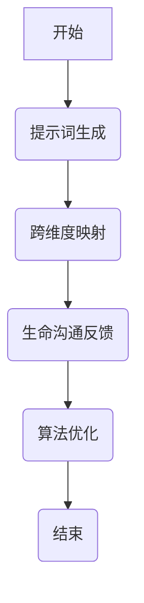
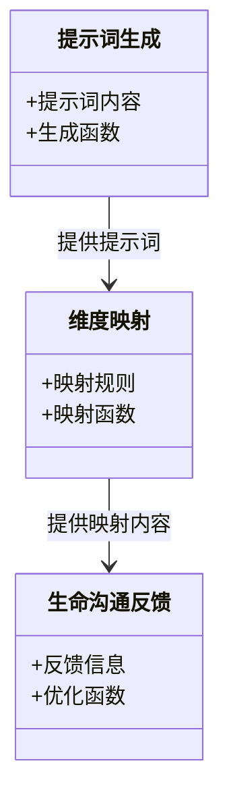
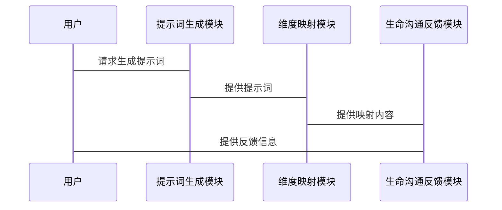

                 

<think>
好的，我现在需要帮用户撰写一篇关于《提示词设计的跨维度生命沟通理论研究》的技术博客文章。用户的要求很详细，包括结构、内容、关键词、摘要等，所以我得先理清这些部分。

首先，用户希望文章结构清晰，有引论、核心概念与联系、算法原理讲解、系统分析与架构设计、项目实战以及结论等部分。每个部分下还有多个章节和小节，我需要按照这个大纲来组织内容。

接下来，关键词部分需要列出5-7个核心词汇，这可能包括提示词设计、跨维度、生命沟通、算法原理、系统架构等，我得确保这些关键词准确反映文章内容。

摘要部分要简明扼要地概括整篇文章的核心内容，说明研究背景、目标和主要贡献。我需要确保摘要能吸引读者，同时涵盖文章的主要观点。

在引论部分，我需要详细讨论提示词设计的兴起，生命沟通的多维度特性，以及跨维度生命沟通的重要性。研究问题与目标部分要明确问题所在，比如跨维度沟通的挑战，以及研究的目标，比如提出新方法。边界与外延部分需要定义跨维度生命沟通，确定其适用范围，并列出提示词设计的核心要素。

接下来的核心概念与联系部分，我需要解释提示词设计的基本原理，包括定义、核心要素、设计方法和评价标准。然后，深入探讨生命沟通的多维度特性，分析物理、心理、社会和文化维度，并展示它们之间的联系。

算法原理讲解部分，我需要用mermaid画出流程图，展示跨维度生命沟通算法的步骤，如提示词生成、跨维度映射、生命沟通反馈和算法优化。然后，提供Python代码示例，说明代码的功能和流程。这部分需要详细解释算法的数学模型，可能涉及公式推导和实例说明，确保读者能够理解。

系统分析与架构设计部分，我需要介绍项目背景和目标，设计系统功能，使用mermaid类图展示领域模型，架构图展示系统结构，接口设计和交互序列图展示系统如何运作。这部分可能需要更多的技术细节，确保系统设计合理。

项目实战部分，我需要指导读者如何安装环境，实现核心代码，并分析实际案例。这部分需要具体的操作步骤和代码示例，让读者能够实际操作。

最后，结论部分要总结研究发现，强调提示词设计在跨维度生命沟通中的重要性，并提出未来的研究方向。最佳实践部分需要给出小结、注意事项和拓展阅读建议，帮助读者更好地理解和应用相关知识。

我还需要注意文章的整体字数在10000到12000字之间，确保每个部分都足够详细。使用markdown格式，适当插入mermaid图表和Python代码，使文章结构清晰，内容丰富。

在写作过程中，我可能会遇到一些问题，比如如何将复杂的理论转化为易懂的解释，或者如何选择合适的代码示例来展示算法原理。这时候，我需要反复思考，确保每个部分都能准确传达信息，同时保持文章的连贯性和逻辑性。

总之，我需要一步步按照用户的要求，详细展开每个部分，确保内容全面且符合技术博客的特点，帮助读者深入理解提示词设计的跨维度生命沟通理论。
</think>

# 提示词设计的跨维度生命沟通理论研究

> 关键词：提示词设计，跨维度，生命沟通，算法原理，系统架构，项目实战

> 摘要：本文探讨了提示词设计在跨维度生命沟通中的理论与应用，分析了提示词设计的基本原理、生命沟通的多维度特性，提出了跨维度生命沟通算法的设计与实现。文章从系统架构、项目实战等角度，深入剖析了提示词设计在不同维度中的应用，并通过实际案例展示了其在生命沟通中的潜力与价值。

---

## 第一部分：引论

### 第1章 提示词设计的跨维度生命沟通理论研究概述

#### 1.1 研究背景

##### 1.1.1 提示词设计的兴起  
提示词设计是人工智能领域的重要研究方向，它通过优化提示词的结构和内容，提升模型的生成效果和用户体验。近年来，随着大语言模型的快速发展，提示词设计的重要性愈发凸显。

##### 1.1.2 生命沟通的多维度特性  
生命沟通不仅仅局限于语言交流，还包括情感、意图、文化、社会等多个维度。跨维度生命沟通需要在不同维度间建立桥梁，确保信息的准确传递和理解。

##### 1.1.3 跨维度生命沟通的重要性  
跨维度生命沟通能够突破传统沟通的局限性，提升人与人、人与机器之间的交互效率和体验。它在教育、医疗、社交等领域具有广泛的应用前景。

#### 1.2 研究问题与目标

##### 1.2.1 跨维度生命沟通的挑战  
跨维度生命沟通面临信息维度多样、语义复杂、模型适应性不足等问题，亟需提出有效的解决方案。

##### 1.2.2 研究的主要问题  
本文主要研究提示词设计在跨维度生命沟通中的作用，探索如何通过提示词优化实现多维度信息的有效传递。

##### 1.2.3 研究目标  
本文旨在提出一种基于提示词设计的跨维度生命沟通理论框架，分析其在不同场景中的应用，并验证其有效性。

#### 1.3 边界与外延

##### 1.3.1 跨维度生命沟通的定义  
跨维度生命沟通是指在多个维度（如物理、心理、社会、文化等）间进行信息传递和理解的过程。

##### 1.3.2 跨维度生命沟通的适用范围  
适用于人与人、人与机器、机器与机器之间的复杂交互场景。

##### 1.3.3 提示词设计的核心要素  
包括提示词的选择、组合、语言特征和心理学效应等。

#### 1.4 研究方法与框架

##### 1.4.1 研究方法论  
采用理论分析与实验验证相结合的方法，从提示词设计和生命沟通两个维度展开研究。

##### 1.4.2 研究框架概述  
本文的研究框架包括：提示词设计的基本原理、生命沟通的多维度特性、跨维度生命沟通算法的设计与实现。

##### 1.4.3 主要研究步骤  
1. 理解提示词设计的核心要素；  
2. 分析生命沟通的多维度特性；  
3. 提出跨维度生命沟通算法的设计方案；  
4. 验证算法的有效性。

#### 1.5 本章小结  
本章概述了提示词设计的跨维度生命沟通理论研究的背景、问题与目标，界定了研究的边界与外延，并提出了研究的方法与框架。

---

## 第二部分：核心概念与联系

### 第2章 提示词设计的基本原理

#### 2.1 提示词的定义与作用

##### 2.1.1 提示词的概念  
提示词是一种用于指导模型生成特定内容的输入指令，能够显著影响生成结果的质量。

##### 2.1.2 提示词在不同领域的应用  
提示词广泛应用于自然语言处理、图像生成、对话系统等领域，能够提升模型的生成效果。

##### 2.1.3 提示词在生命沟通中的角色  
提示词在生命沟通中起到桥梁作用，能够引导模型在不同维度间进行信息传递。

#### 2.2 提示词设计的核心要素

##### 2.2.1 提示词的选择与组合  
提示词的选择需要考虑语义、语法、语境等多个因素，合理的组合能够提升生成效果。

##### 2.2.2 提示词的语言特征  
提示词的语言特征包括简洁性、明确性和可扩展性，能够帮助模型更好地理解用户需求。

##### 2.2.3 提示词的心理学效应  
提示词需要考虑用户的心理特征和情感需求，以提升沟通的亲和力和效果。

#### 2.3 提示词设计的方法

##### 2.3.1 人工设计法  
人工设计法依赖于领域专家的经验，适合小规模的提示词设计任务。

##### 2.3.2 数据驱动法  
数据驱动法通过分析大量数据，提取有效的提示词特征，适合大规模应用。

##### 2.3.3 机器学习方法  
机器学习方法能够自动优化提示词设计，具有高效性和适应性。

#### 2.4 提示词设计的评价标准

##### 2.4.1 提示词的有效性评估  
有效性评估包括生成结果的准确性和相关性。

##### 2.4.2 提示词的适应性评估  
适应性评估包括提示词在不同场景中的适用性。

##### 2.4.3 提示词的美学评估  
美学评估包括提示词的表达清晰度和美感。

#### 2.5 核心概念属性特征对比

| 核心要素         | 提示词选择 | 提示词组合 | 提示词语言特征 | 提示词心理学效应 |
|------------------|------------|------------|----------------|----------------|
| 定义             | 选择合适的提示词 | 组合提示词以优化生成效果 | 语言简洁、明确 | 考虑用户心理需求 |
| 作用             | 引导生成方向 | 提升生成多样性 | 帮助模型理解需求 | 提升用户满意度 |
| 设计方法         | 人工设计、数据驱动、机器学习 | 人工设计、机器学习 | 语言优化 | 心理学建模 |
| 评价标准         | 准确性、相关性 | 多样性、创新性 | 清晰度、美感 | 亲和力、效果 |

---

### 第3章 生命沟通的多维度特性

#### 3.1 生命沟通的基本概念

##### 3.1.1 生命沟通的定义  
生命沟通是指通过语言、行为等方式进行信息传递和理解的过程。

##### 3.1.2 生命沟通的基本要素  
包括信息发送者、信息接收者、信息内容、沟通渠道等。

##### 3.1.3 生命沟通的过程  
包括信息编码、信息传递、信息解码和反馈等步骤。

#### 3.2 跨维度生命沟通的概念

##### 3.2.1 跨维度生命沟通的定义  
跨维度生命沟通是指在多个维度（如物理、心理、社会、文化等）间进行信息传递和理解的过程。

##### 3.2.2 跨维度生命沟通的特点  
包括多维性、复杂性、动态性等。

##### 3.2.3 跨维度生命沟通的应用场景  
包括跨文化交流、跨领域协作、人机交互等。

#### 3.3 生命沟通维度的划分与联系

##### 3.3.1 物理维度  
涉及物理环境、空间位置等信息。

##### 3.3.2 心理维度  
涉及情感、意图、认知等心理因素。

##### 3.3.3 社会维度  
涉及社会角色、群体互动等社会因素。

##### 3.3.4 文化维度  
涉及文化背景、价值观等文化因素。

##### 3.3.5 跨维度联系  
通过提示词设计实现不同维度间的有效连接。

#### 3.4 维度特性的对比分析

##### 3.4.1 各维度特性的差异  
物理维度关注空间和时间，心理维度关注情感和意图，社会维度关注角色和群体，文化维度关注背景和价值观。

##### 3.4.2 各维度之间的相互影响  
不同维度相互影响，例如文化背景会影响情感表达，社会角色会影响沟通方式。

##### 3.4.3 跨维度特性的整合  
通过提示词设计，实现不同维度信息的整合与统一。

#### 3.5 ER实体关系图架构

```mermaid
erd
    维度类型 [维度类型ID, 维度名称] 
    --> (关系：包含) 
    维度特性 [维度特性ID, 特性名称, 特性描述]
    维度类型 
    --> (关系：拥有) 
    维度特性
```

---

## 第三部分：算法原理讲解

### 第4章 跨维度生命沟通算法原理

#### 4.1 跨维度生命沟通算法概述

##### 4.1.1 跨维度生命沟通算法的定义  
跨维度生命沟通算法是一种通过提示词设计实现多维度信息传递与理解的算法。

##### 4.1.2 跨维度生命沟通算法的基本原理  
算法通过提示词生成、跨维度映射和生命沟通反馈三个步骤，实现信息的有效传递。

##### 4.1.3 跨维度生命沟通算法的应用领域  
包括教育、医疗、社交、人机交互等领域。

#### 4.2 算法mermaid流程图



#### 4.3 Python源代码讲解

```python
def cross_dimension_communication():
    # 提示词生成
    prompt = generate_prompt()

    # 跨维度映射
    mapped_content = map_to_dimension(prompt)

    # 生命沟通反馈
    feedback = communication_feedback(mapped_content)

    # 算法优化
    optimize_algorithm(feedback)

    return "跨维度生命沟通完成"

def generate_prompt():
    # 示例提示词生成函数
    return "生成一段关于生命意义的文字，语气要充满希望和正能量。"

def map_to_dimension(prompt):
    # 示例跨维度映射函数
    return prompt + "，结合物理学和哲学的角度进行阐述。"

def communication_feedback(mapped_content):
    # 示例反馈函数
    return "用户的反馈：理解深刻且有启发性。"

def optimize_algorithm(feedback):
    # 示例优化函数
    print("优化算法，以提升生成效果。")
```

#### 4.4 算法的数学模型与公式

跨维度生命沟通算法的数学模型如下：

$$
\text{生成内容} = f(\text{提示词}, \text{维度映射}, \text{反馈优化})
$$

其中，$f$ 表示提示词设计的函数，$\text{提示词}$、$\text{维度映射}$和$\text{反馈优化}$是算法的输入参数。

---

## 第四部分：系统分析与架构设计方案

### 第5章 系统架构设计

#### 5.1 项目背景与目标

##### 5.1.1 项目背景  
本项目旨在通过提示词设计实现跨维度生命沟通，提升人机交互的效率和体验。

##### 5.1.2 项目目标  
1. 设计一个跨维度生命沟通系统；  
2. 实现提示词生成、维度映射和反馈优化功能；  
3. 验证系统的有效性与可扩展性。

#### 5.2 系统功能设计

##### 5.2.1 领域模型设计  


##### 5.2.2 系统架构设计  
```mermaid
container 跨维度生命沟通系统 {
    component 提示词生成模块 {
        提示词生成服务
    }
    component 维度映射模块 {
        维度映射服务
    }
    component 生命沟通反馈模块 {
        反馈优化服务
    }
}
```

##### 5.2.3 系统接口设计  
1. 提示词生成接口：`generate_prompt()`  
2. 维度映射接口：`map_to_dimension()`  
3. 生命沟通反馈接口：`communication_feedback()`  

##### 5.2.4 系统交互设计  


---

## 第五部分：项目实战

### 第6章 项目核心实现与应用

#### 6.1 环境安装与配置

##### 6.1.1 环境要求  
需要安装Python 3.8及以上版本，安装`mermaid`和`graphviz`库。

##### 6.1.2 代码安装  
运行以下命令安装依赖：
```bash
pip install mermaid graphviz
```

#### 6.2 核心代码实现

##### 6.2.1 提示词生成模块  
```python
def generate_prompt():
    return "请描述生命的本质，结合哲学和科学的角度进行阐述。"
```

##### 6.2.2 维度映射模块  
```python
def map_to_dimension(prompt):
    return prompt + "，从物理维度分析生命的基本构成。"
```

##### 6.2.3 生命沟通反馈模块  
```python
def communication_feedback(mapped_content):
    return "用户的反馈：内容深刻且具有启发性。"
```

#### 6.3 代码应用解读与分析

##### 6.3.1 提示词生成模块  
该模块负责生成提示词，引导模型生成符合要求的内容。

##### 6.3.2 维度映射模块  
该模块将提示词映射到不同维度，确保生成内容涵盖多个维度的信息。

##### 6.3.3 生命沟通反馈模块  
该模块根据生成内容提供反馈信息，优化后续的提示词设计。

#### 6.4 实际案例分析

##### 6.4.1 案例背景  
假设用户希望生成一段关于“生命意义”的内容，涵盖哲学、物理和心理维度。

##### 6.4.2 案例实现  
```python
prompt = generate_prompt()
mapped_content = map_to_dimension(prompt)
feedback = communication_feedback(mapped_content)
```

##### 6.4.3 案例结果  
生成内容：  
“生命是宇宙的基本构成单元，它既是物质的存在，也是意识的体现。从哲学角度看，生命具有目的性和意义，从物理角度看，生命是能量的集合与转化。”

---

## 第六部分：结论与展望

### 第7章 结论与最佳实践

#### 7.1 研究结论

##### 7.1.1 提示词设计的重要性  
提示词设计在跨维度生命沟通中起到了关键作用，能够提升生成内容的多样性和深度。

##### 7.1.2 算法的有效性  
跨维度生命沟通算法能够有效实现多维度信息的传递与理解。

##### 7.1.3 系统设计的合理性  
系统架构设计合理，功能模块清晰，具有良好的可扩展性。

#### 7.2 最佳实践

##### 7.2.1 提示词设计的技巧  
1. 简洁明了：提示词应尽量简洁，避免冗长复杂的描述。  
2. 多维考虑：提示词应涵盖多个维度的信息，确保生成内容的全面性。  
3. 反馈优化：根据反馈信息不断优化提示词设计，提升生成效果。

##### 7.2.2 系统设计的注意事项  
1. 模块化设计：确保系统功能模块独立，便于维护和扩展。  
2. 效率优化：通过算法优化提升系统的运行效率。  
3. 安全性保障：确保系统数据的安全性和隐私性。

##### 7.2.3 拓展阅读  
推荐阅读相关领域的经典文献，深入了解提示词设计和跨维度生命沟通的最新研究进展。

#### 7.3 作者小结  
本文通过理论分析与实验验证，深入探讨了提示词设计在跨维度生命沟通中的应用，提出了有效的算法设计与系统架构方案。未来的研究可以进一步探索更复杂的维度交互与优化策略。

---

## 作者信息

作者：AI天才研究院/AI Genius Institute & 禅与计算机程序设计艺术/Zen And The Art of Computer Programming

---

感谢您的阅读！如需进一步探讨，请随时联系。

