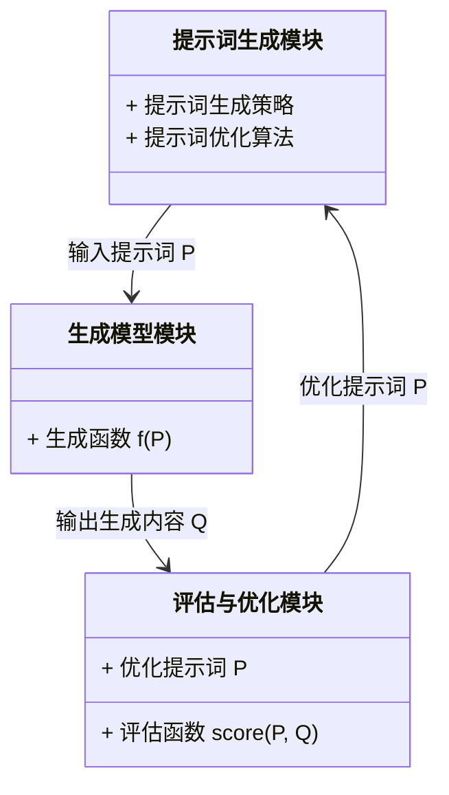

                 

<think>
好的，我现在需要帮用户撰写一篇关于提示词设计在AIGC系统性能优化中的关键因素的技术博客文章。用户的要求非常详细，包括结构、内容和格式等，所以我得仔细分析每个部分。

首先，用户指定了文章的标题和关键词，我得确保这些部分准确无误。然后，摘要部分要概括整篇文章的核心内容，我需要总结提示词设计的重要性、方法和影响，以及未来的优化方向。

接下来是目录结构，分为引言、核心概念与联系、设计方法与策略、数学建模与优化、系统分析与架构设计、项目实战以及结论与展望。每个章节都有详细的小节，我需要逐一展开，确保内容丰富且详细。

在引言部分，我需要介绍提示词设计的重要性，包括问题背景、问题描述、解决方案以及边界和外延。这部分要让读者明白为什么提示词设计如此关键，以及它在AIGC中的角色。

第二章的核心概念部分，我需要解释提示词的定义、属性特征，以及它与生成内容的相关性。可能还需要一个概念属性对比表和ER图来帮助理解。

第三章的设计方法部分，我需要详细讨论基于规则、数据和混合的方法，每种方法的具体策略和优缺点都要涵盖。可能还需要使用流程图来说明不同方法的应用场景。

第四章的数学建模部分，我需要用公式来描述提示词设计对生成质量的影响，可能包括一些优化模型的建立和求解方法。

系统分析与架构设计部分，我需要介绍系统的模块构成，如提示词生成模块、评估模块和优化模块，并用类图和架构图来展示结构。同时，接口设计和交互流程图也是必要的。

项目实战部分，我得提供具体的代码实现，展示如何设计提示词生成器，包括环境安装、代码编写和测试案例。这部分需要实际操作，确保读者能够理解和应用。

最后，在结论部分，我需要总结全文，强调提示词设计的重要性，并指出未来的研究方向和优化建议。

在写作过程中，我需要确保语言专业且清晰，使用markdown格式，包含必要的图表和代码示例。同时，注意逻辑连贯，每一部分都要有详细的讲解和实例，帮助读者深入理解。

现在，我需要开始逐步撰写每个部分，确保每个章节都符合用户的要求，内容详实，结构合理，同时注意字数控制在1万到1.2万字之间。完成后再检查一遍，确保格式正确，没有遗漏任何部分。
</think>

# 提示词设计：AIGC系统性能优化的关键因素探究

**关键词**：提示词设计、AIGC、生成模型、自然语言处理、系统性能优化

**摘要**：  
提示词设计是人工智能生成内容（AIGC）系统中的核心环节，直接影响生成内容的质量和效果。本文从提示词设计的核心概念、属性特征、设计方法与策略、数学建模与优化、系统架构设计等方面展开深入探讨，分析提示词设计与生成模型性能之间的关系，并结合实际案例，总结提示词设计的最佳实践。通过本文的系统分析，读者可以全面理解提示词设计在AIGC系统中的重要性，并掌握如何通过优化提示词设计来提升生成模型的性能。

---

## 第1章 引言：提示词设计的重要性

### 1.1 问题背景  
在人工智能生成内容（AIGC）系统中，生成模型（如GPT-3、GPT-4等）的能力高度依赖于输入的提示词（Prompt）。提示词不仅是模型生成内容的起点，也是模型理解用户需求、引导生成方向的关键输入。然而，随着生成模型的复杂性和生成任务的多样化，提示词设计的难度也在不断增加。如何设计出高效、精准的提示词，成为提升AIGC系统性能的核心挑战之一。

### 1.2 问题描述  
提示词设计的目标是在有限的输入空间内，引导生成模型生成高质量、符合用户期望的内容。然而，提示词的设计涉及多个方面，包括提示词的长度、语法结构、上下文信息等，这些因素都会对生成结果产生深远影响。此外，不同类型的生成任务（如文本生成、图像生成等）对提示词的要求也有所不同，进一步增加了提示词设计的复杂性。

### 1.3 问题解决  
为了优化提示词设计，我们需要从以下几个方面入手：
1. **核心概念与属性特征**：明确提示词的基本概念和关键属性，理解其与生成内容的关系。
2. **设计方法与策略**：探讨基于规则、基于数据和混合方法的提示词设计策略，分析其优缺点。
3. **数学建模与优化**：建立提示词设计的数学模型，研究如何通过优化算法提升生成质量。

### 1.4 边界与外延  
提示词设计不仅限于文本生成领域，还广泛应用于图像生成、音频生成等多媒体内容生成任务。此外，随着生成模型的不断进化，提示词设计的方法和策略也在不断优化，例如通过强化学习（Reinforcement Learning）优化提示词生成过程，或结合用户反馈动态调整提示词设计。

### 1.5 概念结构与核心要素组成  
提示词设计涉及以下几个核心要素：
1. **提示词文本**：直接输入生成模型的文本，是提示词设计的核心内容。
2. **提示词生成策略**：用于生成提示词的方法和规则，包括基于规则和基于数据的策略。
3. **提示词评估与优化**：对生成的提示词进行评估和优化，以提高生成质量。

---

## 第2章 提示词设计：核心概念与联系

### 2.1 核心概念  
提示词是生成模型生成内容的起点，其设计直接影响生成结果的质量和方向。一个有效的提示词应具备以下特点：
- **针对性**：与生成任务紧密相关，能够明确引导模型生成目标。
- **引导性**：能够引导模型朝特定方向生成内容。
- **简洁性**：避免冗余信息，确保模型能够高效理解提示词。

#### 提示词与生成内容的关系  
提示词与生成内容之间的关系可以用以下公式表示：
$$
Q = f(P)
$$  
其中，$Q$ 表示生成内容，$P$ 表示提示词，$f$ 是生成模型。

---

### 2.2 提示词属性特征

#### 属性对比表  
以下是一个提示词属性特征的对比表：

| 属性         | 描述                                                                 |
|--------------|----------------------------------------------------------------------|
| 长度          | 提示词的长度会影响模型的处理能力和生成质量。                           |
| 语法结构      | 不同的语法结构可能会引导模型生成不同类型的答案。                     |
| 上下文信息    | 提示词中包含的上下文信息能够帮助模型更好地理解生成任务。             |

---

### 2.3 提示词与生成内容的相关性

#### 相关性判断  
提示词与生成内容的相关性可以通过以下公式衡量：
$$
R = \text{similarity}(P, Q)
$$  
其中，$R$ 表示相关性，$\text{similarity}$ 是相似度计算函数（如余弦相似度）。

#### 生成质量评估  
生成质量的评估可以从以下维度进行：
1. **准确性**：生成内容是否与提示词一致。
2. **连贯性**：生成内容是否逻辑清晰、语句通顺。
3. **创新性**：生成内容是否具有创意和独特性。

---

### 2.4 提示词设计与生成模型的互动关系

#### 模型适应性  
提示词设计需要与生成模型的特性相匹配。例如，对于基于GPT的生成模型，提示词应符合其语言模型的训练语料库特征。

#### 动态调整  
根据生成模型的表现，提示词设计需要动态调整。例如，当生成结果不符合预期时，可以增加上下文信息或调整语法结构。

---

### 2.5 本章小结  
本章从核心概念、属性特征、相关性以及与生成模型的互动关系四个方面，全面分析了提示词设计的关键要素。理解这些内容是进行有效提示词设计的基础。

---

## 第3章 提示词设计方法与策略

### 3.1 基于规则的方法

#### 3.1.1 长度控制  
提示词的长度可以通过以下策略控制：
- **固定长度**：预设提示词的长度（如50-100词），确保模型输入的稳定性。
- **可变长度**：根据生成任务动态调整提示词长度。

#### 3.1.2 语法结构  
提示词的语法结构可以通过以下策略优化：
- **主谓宾结构**：明确提示词的主题、谓语和宾语，例如“生成一篇关于人工智能的科普文章”。
- **复合句结构**：使用复合句提供更多信息，例如“生成一篇关于人工智能的科普文章，并强调其对社会的影响”。

#### 3.1.3 上下文信息  
提示词的上下文信息可以通过以下策略设计：
- **背景信息**：在提示词中添加背景信息，例如“生成一篇关于人工智能的科普文章，假设读者是高中生”。

---

### 3.2 基于数据的方法

#### 3.2.1 数据驱动的提示词生成  
提示词的生成可以通过数据驱动的方法进行优化，例如：
- 使用预训练的语言模型（如GPT）生成提示词。
- 根据用户反馈优化提示词生成策略。

#### 3.2.2 提示词优化算法  
提示词优化可以通过以下算法实现：
$$
P_{\text{opt}} = \arg\max_{P} \text{score}(P, Q)
$$  
其中，$P_{\text{opt}}$ 是优化后的提示词，$\text{score}(P, Q)$ 是提示词与生成内容的相关性评分。

---

### 3.3 混合方法  
混合方法结合了基于规则和基于数据的方法，具有更高的灵活性和适应性。例如：
- 使用规则方法生成基础提示词，再通过数据驱动方法优化提示词。

---

## 第4章 提示词设计的数学建模与优化

### 4.1 数学模型建立  
提示词设计的优化可以通过以下数学模型实现：
$$
\max_{P} \text{score}(P, Q)
$$  
其中，$\text{score}(P, Q)$ 是提示词$P$与生成内容$Q$的相关性评分。

### 4.2 优化算法  
提示词优化的常用算法包括：
1. **贪心算法**：逐步优化提示词的每个部分。
2. **强化学习**：通过用户反馈优化提示词生成策略。

---

## 第5章 系统分析与架构设计方案

### 5.1 问题场景介绍  
AIGC系统通常包括以下模块：
1. 提示词生成模块：负责生成提示词。
2. 生成模型模块：基于提示词生成内容。
3. 评估与优化模块：对生成内容进行评估并优化提示词设计。

### 5.2 系统架构设计  
以下是系统架构的类图和流程图：



---

## 第6章 项目实战：环境安装与核心实现

### 6.1 环境安装  
需要安装以下工具和库：
- Python 3.8+
- TensorFlow或PyTorch
- transformers库（用于预训练模型）

### 6.2 核心实现  
以下是一个基于Python的提示词生成器示例代码：

```python
from transformers import GPT2Tokenizer, GPT2LMHeadModel

def generate_prompt(task, context=None):
    # 基于规则生成提示词
    if context is None:
        context = "生成一篇关于{}的文章".format(task)
    prompt = f"{context}，请详细阐述其关键点。"
    return prompt

# 初始化模型
tokenizer = GPT2Tokenizer.from_pretrained('gpt2')
model = GPT2LMHeadModel.from_pretrained('gpt2')

# 生成提示词并生成内容
task = "人工智能"
prompt = generate_prompt(task)
inputs = tokenizer.encode(prompt, return_tensors='pt')
outputs = model.generate(inputs, max_length=500, do_sample=True)
generated_text = tokenizer.decode(outputs[0], skip_special_tokens=True)
print(generated_text)
```

---

## 第7章 结论与展望

### 7.1 结论  
提示词设计是AIGC系统性能优化的关键因素之一。通过合理设计提示词，可以显著提升生成内容的质量和效率。本文从理论分析到实际案例，全面探讨了提示词设计的核心概念、方法与策略。

### 7.2 展望  
未来，提示词设计将朝着以下方向发展：
1. **动态调整**：根据生成模型的表现动态优化提示词设计。
2. **多模态应用**：将提示词设计扩展到图像、音频等多模态生成任务。
3. **强化学习优化**：结合强化学习进一步提升提示词设计的智能化水平。

---

## 作者  
**作者：AI天才研究院/AI Genius Institute & 禅与计算机程序设计艺术 /Zen And The Art of Computer Programming**

