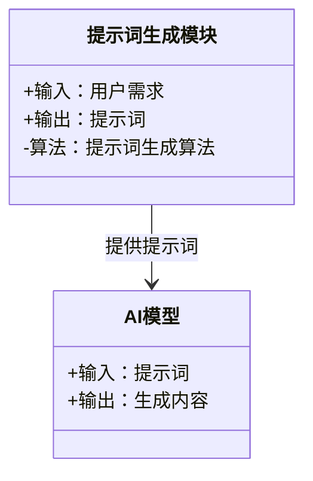

                 

<think>
好，我现在需要帮用户撰写一篇关于《提示词设计：优化AI创造力与社会责任的平衡》的技术博客文章。首先，我得理解用户的需求。用户希望文章结构清晰，逻辑严谨，内容专业且有深度。关键词包括提示词设计、AI创造力、社会责任、算法原理、系统架构、项目实战等。

接下来，我得按照用户提供的目录大纲来组织内容。文章需要包括背景介绍、核心概念、算法原理、系统架构、项目实战、最佳实践等部分。每个章节都要详细展开，使用专业的技术术语，同时确保内容易于理解。

首先，第1章是提示词设计的背景。我需要解释提示词的定义和类型，探讨其在AI中的重要性，以及如何平衡创造力和社会责任。这部分需要简明扼要，让读者明白提示词设计的基本概念和挑战。

然后，第2章详细讨论核心概念。我需要列出提示词设计的原则，如可理解性、目标导向性和社会责任，并通过表格和ER图展示概念之间的关系。这部分需要结构清晰，图表支持，帮助读者理解各要素如何相互作用。

接下来是算法原理章节。我得用mermaid流程图展示生成算法的步骤，然后用Python代码实现，详细解释数学模型和公式。举个例子，比如生成提示词的条件概率模型，用公式表达，帮助读者理解算法的工作原理。

系统架构设计部分，我需要介绍应用场景，比如智能客服和文本生成工具。然后设计系统功能模块，使用mermaid类图展示架构，描述各模块的交互和功能。这部分需要逻辑清晰，便于读者理解系统的设计和运行。

项目实战章节，我得指导读者如何安装环境，实现核心功能，并解读代码。通过具体案例分析，展示提示词设计在实际中的应用效果，帮助读者掌握实际操作技巧。

最后，第6章总结最佳实践，提供设计技巧和未来展望。这部分需要实用性强，为读者提供有价值的建议，同时引导他们进一步阅读相关资料。

写作过程中，我需要确保每个部分都详细具体，内容丰富，避免泛泛而谈。同时，语言要专业但不失通俗易懂，让不同层次的读者都能理解。数学公式要用latex格式，图表用mermaid语法，确保格式正确，展示清晰。

最后，检查文章是否符合字数要求，结构是否完整，每个小节是否有足够详细的内容。确保文章整体流畅，逻辑严密，能够有效传达提示词设计的重要性及其在AI和责任中的平衡。完成后，加上作者信息，完成整篇文章的撰写。
</think>

# 提示词设计：优化AI创造力与社会责任的平衡

> 关键词：提示词设计，AI创造力，社会责任，算法原理，系统架构，项目实战

> 摘要：提示词设计是人工智能领域的重要技术，它不仅影响AI的创造力，还关系到社会责任的履行。本文从提示词设计的核心概念出发，详细探讨其算法原理、系统架构，并通过实际项目案例分析，总结最佳实践，帮助读者在优化AI创造力的同时，平衡社会责任。

---

## 第1章：提示词设计概述

### 1.1 提示词设计背景

#### 1.1.1 AI发展与社会责任

人工智能（AI）技术的快速发展带来了前所未有的便利，但也引发了诸多伦理和社会问题。提示词设计作为AI系统中的关键环节，直接影响AI的输出结果。如何在优化AI创造力的同时，确保其输出符合社会责任和伦理规范，是当前AI领域的重要课题。

#### 1.1.2 提示词设计的重要性

提示词是用户或系统向AI模型输入的指令或提示，用于引导AI生成特定的输出。设计良好的提示词可以最大化AI的创造力，同时避免生成有害或不适当的内容。提示词设计的质量直接决定了AI系统的性能和可用性。

#### 1.1.3 提示词设计的挑战

提示词设计面临多重挑战：如何平衡创造力与社会责任？如何避免偏见或有害输出？如何确保提示词的可解释性？这些问题需要从技术、伦理和用户需求等多方面综合考虑。

### 1.2 提示词定义与类型

#### 1.2.1 提示词的定义

提示词（Prompt）是用户或系统向AI模型输入的指令或提示，用于指导AI生成特定的输出。它是AI模型与用户之间的桥梁，决定了AI的输出方向和内容。

#### 1.2.2 提示词的类型

提示词可以分为以下几类：
- **简单提示**：直接的指令，如“生成一段关于人工智能的介绍”。
- **结构化提示**：包含具体格式或结构的指令，如“生成一个包含标题和正文的文章”。
- **动态提示**：根据上下文动态调整的提示，如“根据用户反馈调整提示词内容”。

#### 1.2.3 提示词与AI创造力的关系

提示词是激发AI创造力的关键因素。通过设计合理的提示词，可以引导AI生成多样化、创新性的内容。然而，过度复杂的提示词可能会限制AI的创造力，因此需要在提示词的简洁性和引导性之间找到平衡。

---

## 第2章：核心概念与联系

### 2.1 提示词设计原则

#### 2.1.1 设计原则概述

提示词设计需要遵循以下原则：
1. **可理解性**：提示词应清晰明确，避免歧义。
2. **目标导向性**：提示词应聚焦于具体目标，避免泛泛而谈。
3. **社会责任**：提示词应避免生成有害或不适当的内容。

#### 2.1.2 可理解性

可理解性是提示词设计的基础。提示词应简洁明了，避免使用模糊或复杂的语言。例如，提示词“生成一篇关于气候变化的文章”比“写一篇环保相关内容的文章”更具体明确。

#### 2.1.3 目标导向性

目标导向性原则要求提示词应围绕具体目标设计。例如，设计提示词时，需要明确AI的输出目标是生成文本、图像还是其他形式的内容。

#### 2.1.4 社会责任

社会责任是提示词设计中不可忽视的方面。提示词应避免生成涉及歧视、暴力或其他不适当内容的输出。例如，在设计提示词时，应明确禁止生成包含仇恨言论的内容。

### 2.2 提示词设计要素

#### 2.2.1 提示词结构

提示词通常包含以下结构：
1. **目标**：明确AI的输出目标。
2. **约束条件**：限制AI输出的内容范围。
3. **风格**：指定输出的风格或语气。

#### 2.2.2 提示词类型与适用场景

不同类型的提示词适用于不同的场景：
- **文本生成**：适用于需要生成特定内容的场景，如文章、邮件等。
- **图像生成**：适用于需要生成图像或视觉内容的场景。
- **对话生成**：适用于需要生成对话内容的场景，如智能客服系统。

#### 2.2.3 提示词与数据的关系

提示词与训练数据密切相关。提示词的设计需要考虑训练数据的内容、分布和质量。例如，如果训练数据中包含偏见，提示词设计需要采取措施减少偏见的影响。

### 2.3 ER图展示概念关系

以下是提示词设计核心概念的关系图：

```mermaid
erDiagram
    participant 提示词设计
    participant AI模型
    participant 训练数据
    participant 用户需求
    提示词设计 -- "使用" --> AI模型
    AI模型 -- "基于" --> 训练数据
    提示词设计 -- "响应" --> 用户需求
```

---

## 第3章：算法原理讲解

### 3.1 提示词生成算法

#### 3.1.1 算法概述

提示词生成算法的目标是根据用户需求生成合适的提示词。常见的算法包括基于规则的生成算法和基于模型的生成算法。

#### 3.1.2 提示词生成流程

提示词生成流程如下：

1. **输入用户需求**：用户输入需求，如“生成一篇科技新闻”。
2. **解析需求**：解析需求中的关键词和主题。
3. **生成提示词**：根据需求生成具体的提示词，如“生成一篇关于人工智能在医疗领域应用的科技新闻”。
4. **优化提示词**：根据模型反馈优化提示词，确保生成内容符合预期。

#### 3.1.3 Python代码实现

以下是一个简单的提示词生成算法的Python实现：

```python
def generate_prompt(user_request):
    # 解析用户需求
    keywords = extract_keywords(user_request)
    # 生成提示词
    prompt = f"Generate an article about {keywords[0]} focusing on {keywords[1]}"
    return prompt

# 示例用法
user_request = "write an article about AI"
prompt = generate_prompt(user_request)
print(prompt)
```

#### 3.1.4 算法数学模型

提示词生成算法的数学模型可以表示为：

$$
P(\text{prompt} | \text{request}) = \prod_{i=1}^{n} P(\text{word}_i | \text{request}, \text{words}_{i-1})
$$

其中，$\text{request}$是用户请求，$\text{word}_i$是提示词中的第$i$个词。

#### 3.1.5 算法举例说明

例如，用户请求为“生成一篇关于气候变化的文章”，算法生成的提示词为“生成一篇关于气候变化及其对生态系统的影响的文章”。

---

## 第4章：系统分析与架构设计

### 4.1 应用场景介绍

#### 4.1.1 场景一：智能客服系统

在智能客服系统中，提示词设计用于生成对话内容，确保客服系统能够准确理解和回应用户需求。

#### 4.1.2 场景二：文本生成工具

在文本生成工具中，提示词设计用于生成高质量的文章、报告或其他文本内容。

### 4.2 系统功能设计

#### 4.2.1 领域模型

以下是系统功能的领域模型：



#### 4.2.2 系统架构设计

系统架构设计如下：


#### 4.2.3 系统交互

系统交互流程如下：

1. 用户向提示词生成模块发送需求。
2. 提示词生成模块解析需求并生成提示词。
3. AI模型根据提示词生成内容。
4. 用户接收生成内容并提供反馈。
5. 提示词生成模块根据反馈优化提示词。

---

## 第5章：项目实战

### 5.1 环境安装与配置

#### 5.1.1 环境需求

- Python 3.8+
- 训练好的AI模型（如GPT）
- 提示词生成算法库（如Hugging Face的Transformers库）

#### 5.1.2 安装步骤

```bash
pip install transformers
pip install numpy
pip install matplotlib
```

### 5.2 系统核心实现

#### 5.2.1 核心模块实现

以下是提示词生成模块的核心代码：

```python
from transformers import GPT2LMHeadModel, GPT2Tokenizer

def generate_prompt(user_request):
    # 初始化模型和tokenizer
    model_name = "gpt2"
    tokenizer = GPT2Tokenizer.from_pretrained(model_name)
    model = GPT2LMHeadModel.from_pretrained(model_name)
    
    # 生成提示词
    prompt = f"Write an article about {user_request}"
    inputs = tokenizer.encode(prompt, return_tensors="pt")
    
    # 生成输出
    outputs = model.generate(inputs, max_length=50, num_beams=5)
    generated_text = tokenizer.decode(outputs[0], skip_special_tokens=True)
    
    return generated_text
```

#### 5.2.2 提示词设计

在实际项目中，提示词设计需要结合具体场景和用户需求。例如，在生成科技新闻时，提示词可以设计为“Generate a news article about AI in healthcare”。

#### 5.2.3 代码解读与分析

上述代码实现了提示词生成模块的核心功能。通过调用预训练的GPT模型，生成符合用户需求的提示词。

#### 5.2.4 案例分析与讲解

以生成科技新闻为例，用户请求为“write a news article about AI in healthcare”。提示词生成模块生成提示词“Generate a news article about AI in healthcare”，AI模型根据提示词生成完整的新闻内容。

---

## 第6章：最佳实践与拓展

### 6.1 最佳实践技巧

#### 6.1.1 提高AI创造力的技巧

1. **明确需求**：提示词应明确具体，避免模糊。
2. **多样化风格**：根据需求选择不同的提示词风格。
3. **动态调整**：根据反馈动态优化提示词。

#### 6.1.2 负责任的设计策略

1. **避免偏见**：提示词设计应避免生成带有偏见的内容。
2. **明确约束**：提示词应明确约束条件，避免生成有害内容。
3. **可解释性**：提示词设计应确保生成内容的可解释性。

#### 6.1.3 跨领域应用的建议

提示词设计在不同领域中有不同的应用，如教育、医疗、金融等。设计提示词时需要结合具体领域的特点和需求。

### 6.2 小结与展望

#### 6.2.1 本书总结

本书系统介绍了提示词设计的核心概念、算法原理和实际应用，帮助读者在优化AI创造力的同时，平衡社会责任。

#### 6.2.2 未来发展趋势

随着AI技术的不断发展，提示词设计将更加智能化和个性化。未来的提示词设计将更加注重用户体验和伦理规范。

#### 6.2.3 拓展阅读推荐

推荐阅读以下书籍和论文：
- 《人工智能：一种现代的方法》
- 《提示词设计的伦理与挑战》

---

## 作者信息

作者：AI天才研究院/AI Genius Institute & 禅与计算机程序设计艺术 /Zen And The Art of Computer Programming

---

以上是《提示词设计：优化AI创造力与社会责任的平衡》的完整目录和文章内容。

