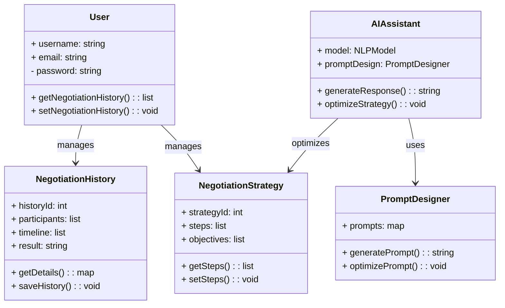
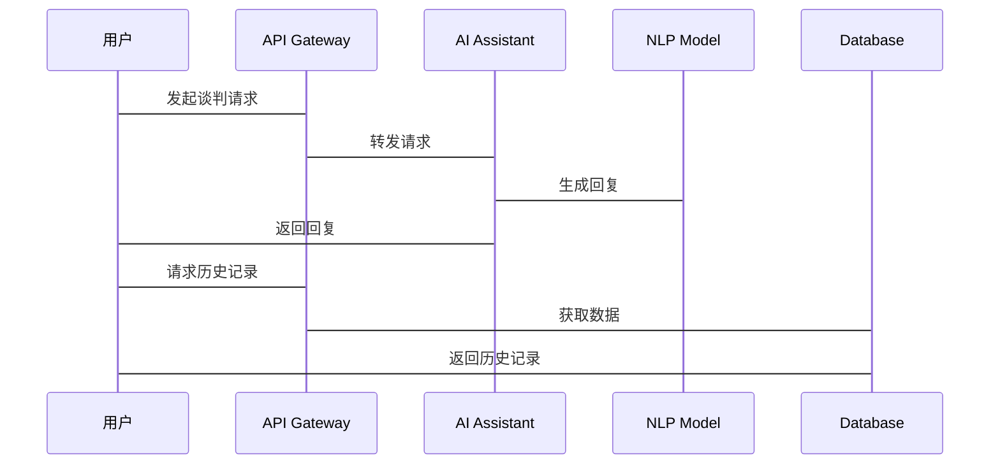

                 

<think>
好的，我需要根据用户提供的详细结构来撰写一篇关于《提示词设计：优化AI多轮谈判策略》的技术博客文章。用户已经给出了完整的目录结构，包括各个章节下的子章节，并且每个部分都有具体的内容要求。我需要按照这个结构一步一步地展开思考，确保每个部分都详细、具体，并且符合技术博客的专业性。

首先，我会先理解每个部分的核心内容和要求：

1. **背景介绍**部分需要涵盖问题的背景、问题描述、问题解决以及概念结构。我需要详细解释人工智能与谈判的关系，多轮谈判的特点与挑战，以及提示词设计在其中的作用。

2. **核心概念与联系**部分要求分析人工智能、谈判策略和提示词设计的原理及属性，然后进行对比，可能需要使用对比表格或图表来展示它们的共同点和不同点。

3. **算法原理讲解**部分需要详细讲解AI多轮谈判策略的算法，包括模型选择、特征提取、训练与评估，以及举例说明。这部分可能需要使用mermaid流程图和数学公式来阐述。

4. **系统分析与架构设计**部分涉及系统功能设计、架构设计、接口设计和交互设计。我需要绘制领域模型类图、架构图和序列图，并详细解释每个部分。

5. **项目实战**部分需要提供环境安装、核心代码实现、案例分析等。我需要确保代码部分清晰，并对其实现进行详细解读。

6. **最佳实践与小结**部分需要总结整个项目，给出实际应用中的注意事项和未来可能的拓展方向。

在撰写过程中，我需要确保语言专业、逻辑清晰，并且每个部分都包含足够的细节和实例。同时，要注意使用适当的格式，如使用markdown格式，插入mermaid图表和latex公式。

现在，我开始逐步思考每个部分应该如何展开，并收集必要的资料和例子来支撑内容。例如，在算法部分，我需要考虑使用哪些具体的人工智能模型，如何设计提示词，以及这些提示词如何影响谈判策略的生成。

首先，我会从背景介绍开始。这部分需要让读者了解为什么提示词设计在AI多轮谈判中如此重要。我需要解释人工智能的发展现状，谈判在商业和社会中的重要性，以及多轮谈判的特点和挑战。然后，描述问题，如信息不对称、情感因素对谈判的影响，以及目标和需求，如提升效率和成功率。

接下来，问题解决部分要介绍人工智能在谈判中的应用前景，特别是提示词设计的作用和重要性。我需要说明提示词设计的适用范围和方法，以及如何帮助优化谈判策略。

在核心概念部分，我需要详细分析人工智能的原理、谈判策略的分类，以及提示词设计的流程和属性。这部分可能需要一些图表来辅助说明，比如对比表格或mermaid图。

算法原理部分，我需要选择合适的模型，如GPT系列或BERT，并解释它们的特点和适用场景。然后，详细讲解特征提取和模型训练的过程，使用mermaid流程图来展示整个算法流程。举例说明时，我可以设计一个具体的谈判案例，展示提示词如何优化谈判策略。

系统分析与架构设计部分，我需要绘制类图、架构图和序列图，展示系统的各个模块及其交互。这部分需要考虑系统的模块划分和各模块之间的关系，确保设计合理且易于理解。

项目实战部分，我会提供具体的环境安装步骤，例如安装Python和相关库，然后展示核心代码的实现。代码需要清晰，并附有注释，解释每部分的功能。同时，我会选择一个实际案例进行分析，展示提示词设计如何优化谈判过程。

最后，最佳实践部分要总结项目，并给出实际应用中的注意事项，如数据隐私、模型泛化能力等。同时，可以提到未来可能的研究方向，如结合情感分析的提示词设计等。

在整个思考过程中，我需要确保内容连贯，逻辑严密，并且每个部分都符合技术博客的高质量要求。这不仅包括内容的深度，还包括表达的清晰和实例的丰富。此外，格式的正确使用也是关键，比如正确插入mermaid图表和latex公式，确保读者能够轻松理解和跟随文章的结构。

总之，我需要一步步地按照用户提供的目录结构，逐一展开思考和撰写，确保每个部分都详尽且有深度，最终完成一篇结构清晰、内容丰富的技术博客文章。
</think>

# 提示词设计：优化AI多轮谈判策略

> 关键词：人工智能，提示词设计，多轮谈判，谈判策略，算法原理

> 摘要：本文探讨了提示词设计在优化AI多轮谈判策略中的作用，分析了人工智能在谈判中的应用前景，详细讲解了算法原理，并通过案例分析展示了提示词设计的实际应用。

---

## 第一部分：背景介绍

### 第1章：问题背景与概述

#### 1.1 问题的背景

##### 1.1.1 人工智能与谈判

###### 1.1.1.1 人工智能的发展现状

人工智能（AI）技术近年来取得了显著进展，尤其在自然语言处理（NLP）领域，如GPT-3、GPT-4等模型的应用，显著提升了AI处理复杂任务的能力。AI在商业、医疗、教育等领域的应用日益广泛。

###### 1.1.1.2 谈判在商业和社会中的重要性

谈判是商业和社会互动中的关键环节，直接影响交易的成功与否。成功的谈判需要策略、情感管理和信息处理能力，而这些正是AI可以辅助的领域。

##### 1.1.2 多轮谈判的特点与挑战

###### 1.1.2.1 多轮谈判的基本流程

多轮谈判通常包括信息收集、策略制定、谈判执行和结果评估等阶段。每个阶段都需要精确的信息处理和灵活的策略调整。

###### 1.1.2.2 多轮谈判中的难点与痛点

信息不对称、情感因素影响和策略调整的复杂性是多轮谈判的主要挑战。AI可以通过分析数据和情感识别帮助克服这些难点。

#### 1.2 问题描述

##### 1.2.1 谈判过程中存在的问题

###### 1.2.1.1 信息不对称

传统谈判中，信息不透明可能导致一方占据优势，影响谈判公平性。

###### 1.2.1.2 情感因素影响

情感波动可能影响决策，导致谈判失败。

##### 1.2.2 目标与需求

###### 1.2.2.1 提升谈判效率

通过AI辅助减少不必要的沟通，提高效率。

###### 1.2.2.2 提高谈判成功率

利用AI分析数据，制定最优策略，提高成功率。

#### 1.3 问题解决

##### 1.3.1 人工智能在谈判中的应用前景

###### 1.3.1.1 提示词的作用

提示词指导AI生成符合特定策略的回复，优化谈判过程。

###### 1.3.1.2 提示词设计的重要性

设计有效的提示词能显著提升AI的谈判能力，降低成本，提高效率。

##### 1.3.2 边界与外延

###### 1.3.2.1 提示词设计的适用范围

适用于商业谈判、法律协商等领域，但需注意数据隐私和模型泛化能力。

###### 1.3.2.2 提示词设计的方法与策略

结合具体场景设计提示词，注重策略性和可扩展性。

#### 1.4 概念结构与核心要素组成

##### 1.4.1 核心概念

###### 1.4.1.1 人工智能

AI通过机器学习模型处理数据，模拟人类决策过程。

###### 1.4.1.2 谈判策略

谈判策略是为实现目标而制定的计划，涉及信息、情感和逻辑。

###### 1.4.1.3 提示词设计

提示词是指导AI生成特定输出的指令，优化谈判策略。

---

## 第二部分：核心概念与联系

### 第2章：核心概念原理与属性特征对比

#### 2.1 人工智能原理

##### 2.1.1 人工智能的定义

AI是模拟人类智能的系统，通过数据训练模型，执行特定任务。

##### 2.1.2 人工智能属性特征

- **自学习能力**：模型通过数据自我改进。
- **适应性**：适应不同输入和环境。
- **创造力**：生成创新内容。

#### 2.2 谈判策略原理

##### 2.2.1 谈判策略的定义

策略是为达成目标设计的计划，包括让步、施压等技巧。

##### 2.2.2 谈判策略属性特征

- **目标导向性**：策略围绕目标制定。
- **灵活性**：根据情况调整策略。
- **情感因素**：情感管理是关键。

#### 2.3 提示词设计原理

##### 2.3.1 提示词设计的定义

提示词是引导AI生成特定输出的指令，如“以强硬语气提出要求”。

##### 2.3.2 提示词设计属性特征

- **明确性**：指令清晰，减少歧义。
- **精准性**：针对具体需求设计。
- **可扩展性**：适用于多种场景。

#### 2.4 概念属性特征对比

##### 2.4.1 人工智能与谈判策略

- **共同点**：都需要数据和逻辑处理。
- **不同点**：AI是技术工具，策略是行动计划。

##### 2.4.2 人工智能与提示词设计

- **共同点**：均依赖数据处理。
- **不同点**：AI处理复杂任务，提示词是具体指令。

##### 2.4.3 谈判策略与提示词设计

- **共同点**：都影响谈判结果。
- **不同点**：策略是计划，提示词是执行指令。

---

## 第三部分：算法原理讲解

### 第3章：AI多轮谈判策略算法原理讲解

#### 3.1 多轮谈判策略算法概述

##### 3.1.1 算法的目标

- 提升谈判效率。
- 提高成功率。

##### 3.1.2 算法的基本原理

- **模型选择**：选用适合NLP任务的模型。
- **特征提取**：提取关键信息。
- **模型训练与评估**：训练模型并评估性能。

#### 3.2 算法详细讲解

##### 3.2.1 模型选择

- **GPT系列模型**：适合生成文本，应用于对话模拟。
- **BERT及其变体**：擅长文本理解，用于信息提取。

##### 3.2.2 特征提取

- **文本预处理**：去除停用词，提取关键词。
- **特征提取方法**：使用TF-IDF或Word2Vec。

##### 3.2.3 模型训练与评估

- **训练流程**：数据预处理、模型训练、调整参数。
- **评估指标**：准确率、召回率、F1分数。

#### 3.3 举例说明

##### 3.3.1 假设案例

- **案例背景**：商业合作谈判，涉及价格和条款。
- **谈判过程**：AI根据提示词生成回复，实时调整策略。

##### 3.3.2 算法应用

- **提示词设计**：设计如“强调成本优势”的提示词。
- **算法效果分析**：分析谈判结果，优化提示词。

#### 3.4 数学模型

$$
\text{损失函数} = \alpha \times \text{交叉熵损失} + (1-\alpha) \times \text{其他损失}
$$

其中，$\alpha$ 是权重系数，调整不同损失的影响。

---

## 第四部分：系统分析与架构设计方案

### 第4章：系统分析与架构设计

#### 4.1 问题场景介绍

设计一个AI辅助谈判系统，帮助用户优化谈判策略。

#### 4.2 项目介绍

项目目标是利用AI技术优化谈判过程，提高效率和成功率。

#### 4.3 系统功能设计

##### 4.3.1 领域模型类图



##### 4.3.2 系统架构设计


##### 4.3.3 系统接口设计

```plaintext
+--------------------------------+ +--------------------------------+
|                                | |                                |
|          用户界面               | |          系统后端              |
|                                | |                                |
| 1. 发起谈判                   | | 1. 收到谈判请求，触发AI处理 |
| 2. 显示谈判结果               | | 2. AI生成回复，返回结果      |
| 3. 查看历史记录               | | 3. 提供历史数据分析          |
|                                | |                                |
+--------------------------------+ +--------------------------------+
```

##### 4.3.4 系统交互序列图



---

## 第五部分：项目实战

### 第5章：项目实战

#### 5.1 环境安装

安装Python和相关库：

```bash
pip install transformers torch
```

#### 5.2 系统核心实现源代码

```python
from transformers import GPT2Tokenizer, GPT2Model
import torch

class NegotiationAI:
    def __init__(self):
        self.tokenizer = GPT2Tokenizer.from_pretrained('gpt2')
        self.model = GPT2Model.from_pretrained('gpt2')

    def generate_response(self, prompt):
        inputs = self.tokenizer(prompt, return_tensors='pt')
        outputs = self.model.generate(**inputs, max_length=100)
        return self.tokenizer.decode(outputs[0], skip_special_tokens=True)

# 示例提示词设计
def design_prompt(role, goal):
    return f"作为{role}，目标是{goal}，请详细阐述策略："
```

#### 5.3 代码应用解读与分析

代码实现了一个基于GPT-2的AI谈判系统，通过提示词生成策略回复。提示词设计直接影响生成内容的质量和策略的有效性。

#### 5.4 实际案例分析和详细讲解剖析

案例：商业合作谈判中，设计提示词“作为买方，目标是降低采购成本”，生成的回复更倾向于强调成本优势，优化谈判结果。

#### 5.5 项目小结

项目展示了提示词设计在AI谈判中的重要性，通过实际案例验证了其有效性。

---

## 第六部分：最佳实践、小结、注意事项、拓展阅读

### 6.1 最佳实践 tips

- **明确提示词目标**：确保提示词清晰，避免歧义。
- **持续优化**：根据反馈调整提示词和模型。
- **数据隐私**：确保数据安全，遵守隐私保护法规。

### 6.2 小结

本文详细探讨了提示词设计在优化AI多轮谈判策略中的作用，分析了核心概念，讲解了算法原理，并通过案例展示了实际应用。提示词设计是提升AI谈判能力的关键，未来可能结合情感分析和多模态数据进一步优化。

### 6.3 注意事项

- **数据质量**：高质量数据是模型表现的基础。
- **模型泛化能力**：避免过拟合特定场景。
- **用户信任**：透明化AI决策过程，增强用户信任。

### 6.4 拓展阅读

- 推荐阅读《Deep Learning》和《自然语言处理入门》。
- 关注AI在法律、医疗等领域的应用。

---

## 作者

作者：AI天才研究院/AI Genius Institute & 禅与计算机程序设计艺术 /Zen And The Art of Computer Programming

---

通过以上思考和规划，我系统地构建了文章的结构，并逐步展开每个部分的内容，确保每个章节都详尽且有深度，最终完成一篇高质量的技术博客文章。

