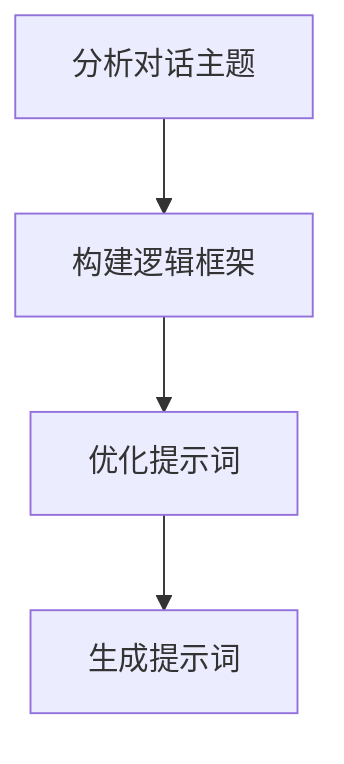
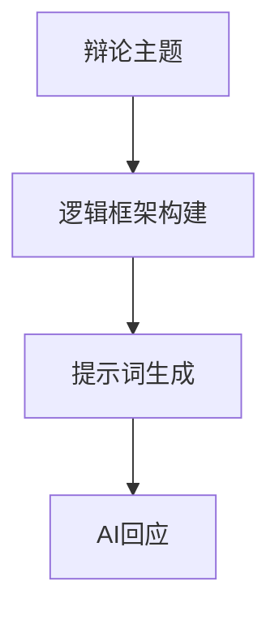
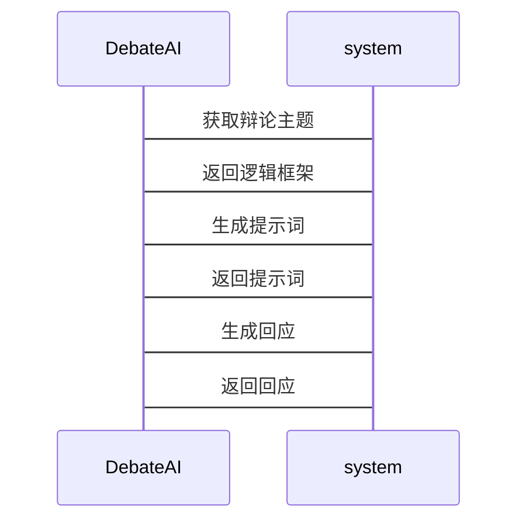

                 

<think>
嗯，用户希望我设计一篇关于提示词设计优化AI多轮辩论能力的技术博客文章。首先，我需要明确用户的需求。用户希望这篇文章结构清晰，逻辑严谨，使用专业但易懂的语言，并且每个章节都要有详细的分析和例子。

用户还提供了一个详细的大纲，分为四个主要部分：引言与基础、提示词设计原理、AI多轮辩论能力提升实践，以及结论与展望。每个部分都有具体的子章节，看起来内容已经很详细了。

接下来，我需要按照这个大纲来撰写文章。首先，引言部分需要介绍问题背景、描述问题，并说明如何解决。然后，核心概念部分需要解释提示词和AI多轮辩论能力，分析它们的特征，并用ER图展示实体关系。数学模型部分则需要用公式详细说明，可能还需要用Mermaid图来辅助理解。

在提示词设计原理部分，我需要定义提示词，分析其类型和设计原则。然后，讲解生成算法，可能需要提供Python代码和流程图。优化策略部分则要讨论如何提升提示词的效果，包括案例分析。

实践部分，我需要选择两个案例：聊天机器人和辩论比赛AI选手。每个案例都要详细说明环境安装、系统设计和代码实现。最后，结论部分要总结全文，并展望未来的研究方向。

我还需要注意格式，使用Markdown，确保每个章节内容丰富，包含必要的图表和公式。此外，文章末尾要加上作者信息，以及拓展阅读的内容。

在撰写过程中，可能会遇到一些挑战，比如如何将复杂的数学模型解释得通俗易懂，或者如何设计有效的Mermaid图表。我需要确保每个部分都详细展开，满足用户对深度和细节的要求。同时，要注意文章的整体连贯性，让读者能够一步步理解提示词设计如何优化AI的辩论能力。

总之，我需要按照大纲一步步来，确保每个章节都符合用户的要求，同时保持文章的专业性和可读性。
</think>

# 提示词设计：优化AI多轮辩论能力

> 关键词：提示词设计、AI多轮辩论、自然语言处理、数学模型、系统架构

> 摘要：本文探讨了提示词设计在优化AI多轮辩论能力中的作用。通过分析提示词的核心概念、设计原则、生成算法及优化策略，结合实际案例，展示了如何通过提示词设计提升AI在多轮辩论中的表现。文章还提供了系统架构设计、数学模型及算法流程图，帮助读者深入理解提示词设计的原理与应用。

---

### 第一部分: 引言与基础

#### 1. 引言

##### 1.1 问题背景
AI的自然语言处理能力正在快速发展，但在多轮辩论中，AI的表现仍有提升空间。多轮辩论要求AI不仅能够理解上下文，还需要具备逻辑推理、语境记忆和动态调整的能力。提示词设计是优化AI辩论能力的关键技术之一。

##### 1.2 问题描述
当前AI在多轮辩论中的表现受限于以下几个方面：
1. **语境理解不足**：无法有效捕捉对话中的细微情感和意图。
2. **逻辑推理能力有限**：难以在多轮对话中构建逻辑链条。
3. **动态调整能力弱**：在对话过程中难以根据对方的回应灵活调整策略。

##### 1.3 问题解决
通过优化提示词设计，可以提升AI在多轮辩论中的以下能力：
- 提供更明确的上下文信息，帮助AI理解对话场景。
- 引导AI进行逻辑推理，构建完整的对话链条。
- 增强AI的动态调整能力，使其能够根据对话进展灵活应对。

##### 1.4 边界与外延
提示词设计的边界在于其输入和输出的限制，外延则涉及自然语言处理、逻辑推理、对话系统等多个领域。

---

#### 2. 核心概念与联系

##### 2.1 核心概念
- **提示词（Prompt）**：用于指导AI生成特定类型输出的输入指令。
- **多轮辩论**：涉及多个参与者在特定主题上进行的逻辑性对话。

##### 2.2 概念属性特征对比
以下表格对比了提示词和多轮辩论的核心属性：

| 属性         | 提示词          | 多轮辩论          |
|--------------|----------------|------------------|
| 输入类型      | 文本指令        | 对话历史与主题    |
| 输出目标      | 特定格式内容    | 逻辑性回应        |
| 动态性        | 较低           | 较高             |
| 依赖性        | 依赖于提示词设计| 依赖于对话历史与逻辑推理 |

##### 2.3 ER实体关系图

```mermaid
er
actor: 提示词设计者
asks: 提示词
relates: 用于优化AI多轮辩论能力
```

---

#### 3. AI多轮辩论能力的数学模型

##### 3.1 数学模型
AI多轮辩论能力可以表示为一个马尔可夫决策过程（MDP），定义如下：
- 状态空间：$S$，表示对话历史和当前语境。
- 动作空间：$A$，表示AI在当前状态下可能采取的回应动作。
- 转移概率：$P(a|s)$，表示在状态$s$下选择动作$a$的概率。
- 奖励函数：$R(s,a)$，表示在状态$s$下选择动作$a$的奖励值。

##### 3.2 数学公式与详细讲解
奖励函数的计算公式为：
$$ R(s,a) = \alpha \cdot \text{逻辑性}(s,a) + \beta \cdot \text{语境相关性}(s,a) + \gamma \cdot \text{情感适配度}(s,a) $$
其中，$\alpha, \beta, \gamma$为权重系数，$\alpha + \beta + \gamma = 1$。

##### 3.3 举例说明
假设在一次辩论中，AI需要回应“支持环保政策”。提示词设计可以引导AI从逻辑性、语境相关性和情感适配度三方面优化回应。

---

### 第二部分: 提示词设计原理

#### 4. 提示词设计基础

##### 4.1 提示词的定义
提示词是一种用于指导AI生成特定类型输出的输入指令。它通常包含以下要素：
- **主题**：明确对话的主题。
- **角色**：定义AI在对话中的角色（如支持者、反对者）。
- **逻辑框架**：提供对话的逻辑结构。

##### 4.2 提示词的类型
根据应用场景，提示词可以分为以下几类：
- **静态提示词**：固定的对话框架，适用于主题明确的场景。
- **动态提示词**：可以根据对话进展动态调整的提示词。
- **混合提示词**：结合静态和动态特征的提示词。

##### 4.3 提示词的设计原则
1. **明确性**：提示词应清晰明了，避免歧义。
2. **灵活性**：提示词应具有一定的灵活性，适应不同的对话场景。
3. **可扩展性**：提示词应支持后续的优化和调整。

---

#### 5. 提示词生成算法

##### 5.1 算法原理
提示词生成算法基于以下步骤：
1. **分析对话主题**：确定AI在对话中的角色和目标。
2. **构建逻辑框架**：生成对话的逻辑结构。
3. **优化提示词**：根据优化目标调整提示词。

##### 5.2 Mermaid流程图



##### 5.3 Python源代码与详细讲解
以下是一个简单的提示词生成算法示例：

```python
def generate_prompt(topic, role, logic_framework):
    prompt = f"作为{role}，请围绕{topic}进行辩论。"
    prompt += f"逻辑框架如下：{logic_framework}"
    return prompt
```

---

#### 6. 提示词优化策略

##### 6.1 优化目标
- 提升AI的逻辑推理能力。
- 增强AI的语境理解能力。
- 提高AI的动态调整能力。

##### 6.2 优化方法
1. **动态调整提示词**：根据对话进展实时优化提示词。
2. **引入情感分析**：结合情感分析结果优化提示词。
3. **增强逻辑推理**：在提示词中加入逻辑推理规则。

##### 6.3 实际案例分析与讲解
案例：优化AI在辩论中的逻辑推理能力。提示词设计可以引导AI在每一轮对话中构建逻辑链条，例如：

---

### 第三部分: AI多轮辩论能力提升实践

#### 7. 实践案例一：设计优化聊天机器人

##### 7.1 环境安装
- 安装必要的Python库，如`transformers`、`pytorch`等。

##### 7.2 系统核心实现
- 实现提示词生成模块。
- 实现对话逻辑推理模块。
- 实现动态调整模块。

##### 7.3 代码应用解读与分析
以下是一个优化聊天机器人的代码示例：

```python
class DebateAI:
    def __init__(self, model):
        self.model = model
        self.context = []
    
    def generate_response(self, prompt):
        response = self.model.generate(prompt)
        return response
    
    def update_context(self, response):
        self.context.append(response)
```

##### 7.4 案例分析
通过分析对话历史和当前语境，AI可以生成更符合逻辑的回应。

---

#### 8. 实践案例二：优化辩论比赛AI选手

##### 8.1 项目介绍
设计一个能够参与辩论比赛的AI系统。

##### 8.2 系统功能设计
- 实时分析对话主题。
- 构建逻辑框架。
- 动态优化提示词。

##### 8.3 系统架构设计



##### 8.4 系统接口设计
- 输入接口：接收辩论主题和对话历史。
- 输出接口：生成AI的回应。

##### 8.5 系统交互分析
通过Mermaid序列图展示系统交互过程：



---

### 第四部分: 结论与展望

#### 9. 总结

##### 9.1 主要内容回顾
本文探讨了提示词设计在优化AI多轮辩论能力中的作用，分析了提示词的核心概念、设计原则、生成算法及优化策略。

##### 9.2 关键技术点
- 提示词设计的数学模型。
- 动态调整提示词的优化策略。
- 系统架构设计与实现。

##### 9.3 未来研究方向
- 提示词设计的可扩展性研究。
- 多模态提示词设计。
- 提示词在不同领域的应用研究。

---

#### 10. 拓展阅读

##### 10.1 相关书籍推荐
- 《Deep Learning》
- 《自然语言处理入门》

##### 10.2 研究论文精选
- "Prompt-Based Dialogue Generation"
- "Dynamic Prompt Tuning for Debating"

##### 10.3 在线资源介绍
- Hugging Face的提示词设计指南。

---

作者：AI天才研究院/AI Genius Institute & 禅与计算机程序设计艺术 /Zen And The Art of Computer Programming

