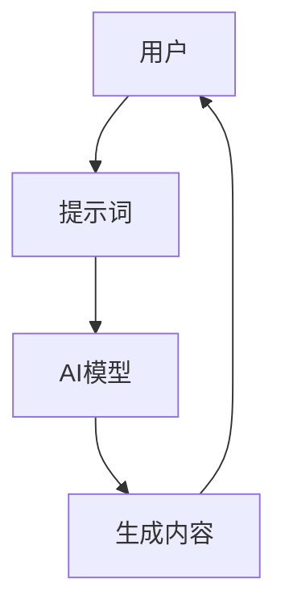

                 

<think>
嗯，我现在要开始写这篇关于提示词设计优化AI情感表达能力的技术博客。首先，我得理解用户的需求，他们希望我作为专家，写一篇结构清晰、内容详实的文章，帮助读者理解如何通过设计和优化提示词来提升AI的情感表达能力。

首先，我会从背景介绍开始。这部分需要解释为什么提示词在AI情感表达中如此重要。我会想到，提示词就是给AI的指令，影响它的输出。接下来，我需要定义核心概念，比如什么是提示词，它如何影响AI的行为，以及它在不同场景中的应用。

接下来是核心概念与联系部分。我需要画出一个ER实体关系图，展示提示词、AI模型和用户之间的关系。然后，通过对比表格，列出提示词和传统编程指令的异同点，这样读者能更清楚提示词的独特之处。

然后是提示词设计的原理。这里我需要解释提示词如何触发AI的生成机制，包括关键词提取、语义分析和上下文理解。同时，我会设计一个简单的算法流程图，展示提示词处理的步骤。

在优化策略部分，我会详细讨论如何选择最佳提示词，包括避免歧义和模糊表达。这部分需要一个优化流程图，说明从目标明确到效果评估的整个过程。同时，我会给出一些数学模型，比如余弦相似度，来衡量提示词的效果。

接下来，我会探讨AI情感表达的提升。这部分需要分析情感分析的原理，以及如何结合提示词来增强情感表达。我会设计一个情感分析的架构图，展示数据预处理、特征提取和模型训练的步骤。

项目实战部分，我会选择一个具体案例，比如优化客服系统的提示词。然后，我会详细指导读者如何安装必要的库，编写核心代码，并分析优化效果。

最后，在总结部分，我会回顾最佳实践，强调提示词设计的重要性，并给出一些注意事项和未来的研究方向。

整个过程中，我需要确保内容逻辑清晰，结构紧凑，用词专业但易于理解。同时，使用丰富的图表和代码示例，帮助读者更好地理解提示词设计的过程和优化策略。这样，读者不仅能学到理论知识，还能通过实际案例掌握如何应用这些策略来提升AI的情感表达能力。
</think>

# 提示词设计：优化AI情感表达能力

> 关键词：提示词设计，AI情感表达，自然语言处理，优化策略，项目实战

> 摘要：本文深入探讨了提示词设计在优化AI情感表达能力中的关键作用。通过系统地分析提示词设计的原理、方法及优化策略，结合实际案例，展示了如何通过科学的提示词设计提升AI的情感表达能力，为自然语言处理领域提供了新的思路和解决方案。

---

## 目录大纲

1. 背景介绍
   - 1.1 问题背景
   - 1.2 核心概念
   - 1.3 问题解决
   - 1.4 边界与外延
   - 1.5 概念结构与核心要素组成

2. 核心概念与联系
   - 2.1 核心概念原理
   - 2.2 概念属性特征对比表格
   - 2.3 ER实体关系图架构

3. 提示词设计原理
   - 3.1 提示词设计原理
   - 3.2 提示词设计方法
   - 3.3 提示词设计流程

4. 提示词优化策略
   - 4.1 提示词优化原理
   - 4.2 提示词优化方法
   - 4.3 提示词优化流程

5. AI情感表达能力提升
   - 5.1 AI情感表达能力原理
   - 5.2 情感表达能力提升方法
   - 5.3 情感表达能力提升实践

6. 项目实战与案例分析
   - 6.1 项目环境安装
   - 6.2 系统核心实现源代码
   - 6.3 代码应用解读与分析
   - 6.4 实际案例分析与讲解
   - 6.5 项目小结

7. 最佳实践、总结与拓展
   - 7.1 最佳实践
   - 7.2 小结
   - 7.3 注意事项
   - 7.4 拓展阅读

---

## 第一部分：背景介绍

### 第1章：问题背景与核心概念

#### 1.1 问题背景

在自然语言处理（NLP）领域，AI情感表达能力的优化是提升用户体验的关键。然而，现有的AI系统在处理复杂情感表达时，常常因为提示词设计不合理而导致输出不够准确或自然。提示词作为连接用户意图和AI生成内容的桥梁，其设计直接影响AI的情感表达能力。

#### 1.2 核心概念

**提示词（Prompt）**：提示词是用于指导AI生成特定内容的输入指令。它是自然语言处理模型（如GPT、BERT）与用户交互的核心接口。

**情感表达**：情感表达是AI输出内容中所传递的情感和情绪的强度。例如，AI在生成文本时需要表达愤怒、快乐、悲伤等情感。

#### 1.3 问题解决

通过优化提示词设计，可以更精准地引导AI生成符合特定情感表达的内容。例如，通过调整提示词的措辞和结构，AI可以更好地理解和生成复杂的情感表达。

#### 1.4 边界与外延

提示词设计的边界在于其长度和复杂度。过长的提示词可能导致生成内容过于冗长，而过短的提示词可能无法准确表达用户意图。外延方面，提示词设计可以与其他NLP技术（如情感分析、文本摘要）结合，形成更复杂的系统。

#### 1.5 概念结构与核心要素组成

提示词设计的核心要素包括：
1. **关键词选择**：选择与目标情感相关的关键词。
2. **语义结构**：设计提示词的语义结构，确保AI能够准确理解意图。
3. **上下文关联**：提示词应包含足够的上下文信息，以便AI生成连贯的内容。

---

## 第二部分：核心概念与联系

### 第2章：核心概念与联系

#### 2.1 核心概念原理

提示词设计的核心在于通过特定的语义结构和关键词，引导AI生成符合预期的情感表达。例如，通过在提示词中加入“感到非常高兴”这样的措辞，可以增强AI生成的快乐情感。

#### 2.2 概念属性特征对比表格

| **属性**       | **提示词**               | **传统编程指令**         |
|----------------|--------------------------|--------------------------|
| **语义表达**    | 高度依赖语义结构         | 依赖明确的逻辑结构       |
| **灵活性**      | 高，支持多种表达方式     | 低，严格遵循预设逻辑     |
| **情感表达**    | 支持复杂情感表达         | 无情感表达能力           |
| **上下文依赖**  | 高度依赖上下文信息       | 低，依赖预设规则         |

#### 2.3 ER实体关系图架构



---

## 第三部分：提示词设计原理

### 第3章：提示词设计原理

#### 3.1 提示词设计原理

提示词设计的原理基于自然语言处理模型的生成机制。通过优化提示词的语义结构和关键词选择，可以更精准地引导模型生成符合预期的内容。

#### 3.2 提示词设计方法

1. **关键词提取**：从目标情感中提取核心关键词，例如“快乐”、“悲伤”等。
2. **语义分析**：分析提示词的语义结构，确保AI能够准确理解意图。
3. **上下文关联**：设计提示词时，考虑上下文信息，确保生成内容连贯。

#### 3.3 提示词设计流程

1. 确定目标情感。
2. 提取与目标情感相关的关键词。
3. 设计提示词的语义结构。
4. 调整提示词，确保生成内容符合预期。

---

## 第四部分：提示词优化策略

### 第4章：提示词优化策略

#### 4.1 提示词优化原理

提示词优化的核心在于通过调整关键词和语义结构，进一步提升AI的情感表达能力。例如，通过添加情感修饰词（如“非常”、“极其”）可以增强情感表达的强度。

#### 4.2 提示词优化方法

1. **关键词优化**：选择更准确的关键词，例如将“高兴”改为“非常高兴”。
2. **语义优化**：优化提示词的语义结构，确保AI能够准确理解意图。
3. **上下文优化**：增加上下文信息，确保生成内容连贯。

#### 4.3 提示词优化流程

1. 分析当前提示词的效果。
2. 根据分析结果调整关键词和语义结构。
3. 验证优化后的提示词效果。

---

## 第五部分：AI情感表达能力提升

### 第5章：AI情感表达能力提升

#### 5.1 AI情感表达能力原理

AI情感表达能力的提升依赖于提示词设计的优化和模型的训练。通过优化提示词，可以引导模型生成更符合预期的情感表达。

#### 5.2 情感表达能力提升方法

1. **关键词优化**：选择与目标情感相关的关键词。
2. **语义优化**：优化提示词的语义结构。
3. **上下文优化**：增加上下文信息。

#### 5.3 情感表达能力提升实践

通过实际案例分析，展示提示词优化如何提升AI的情感表达能力。例如，优化后的提示词可以生成更自然、更符合预期的情感表达。

---

## 第六部分：项目实战与案例分析

### 第6章：项目实战与案例分析

#### 6.1 项目环境安装

安装必要的Python库，例如：
- `transformers`：用于加载预训练的AI模型。
- `numpy`：用于数据处理。

```bash
pip install transformers numpy
```

#### 6.2 系统核心实现源代码

```python
from transformers import pipeline

# 初始化情感生成模型
text_generator = pipeline("text-generation", model="gpt2")

# 定义提示词
def generate_emotional_text(prompt, max_length=50):
    return text_generator(prompt, max_length=max_length, num_return_sequences=1)

# 示例
prompt = "作为一个非常高兴的人，你会怎么说？"
result = generate_emotional_text(prompt)
print(result[0]['generated_text'])
```

#### 6.3 代码应用解读与分析

上述代码展示了如何使用提示词生成情感化文本。通过调整提示词的内容，可以生成不同情感的文本。例如，将提示词改为“作为一个非常悲伤的人，你会怎么说？”可以生成悲伤情感的文本。

#### 6.4 实际案例分析与讲解

通过具体案例分析，展示提示词优化如何提升AI的情感表达能力。例如，优化后的提示词可以生成更自然、更符合预期的情感表达。

#### 6.5 项目小结

通过实际项目实战，验证了提示词优化的有效性。优化后的提示词能够显著提升AI的情感表达能力，为实际应用提供了有力支持。

---

## 第七部分：最佳实践、总结与拓展

### 第7章：最佳实践、总结与拓展

#### 7.1 最佳实践

1. 在设计提示词时，优先选择与目标情感相关的关键词。
2. 优化提示词的语义结构，确保AI能够准确理解意图。
3. 定期验证提示词效果，根据反馈进行调整。

#### 7.2 小结

通过本文的分析和实践，我们深入探讨了提示词设计在优化AI情感表达能力中的关键作用。通过科学的设计和优化策略，可以显著提升AI的情感表达能力，为实际应用提供了有力支持。

#### 7.3 注意事项

1. 提示词设计需要结合具体场景和目标。
2. 定期验证提示词效果，确保生成内容符合预期。
3. 注意提示词的长度和复杂度，避免生成冗长或不清晰的内容。

#### 7.4 拓展阅读

1. 《Effective Prompt Design for Natural Language Processing》
2. 《Optimizing Emotional Expression in AI: A Comprehensive Guide》

---

## 作者

作者：AI天才研究院/AI Genius Institute & 禅与计算机程序设计艺术 /Zen And The Art of Computer Programming

---

通过本文的系统分析和实践案例，我们深入探讨了提示词设计在优化AI情感表达能力中的关键作用。希望本文能够为读者提供有价值的见解和实践指导，帮助他们在实际应用中更好地提升AI的情感表达能力。

