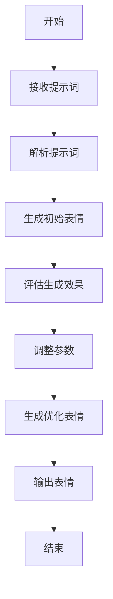
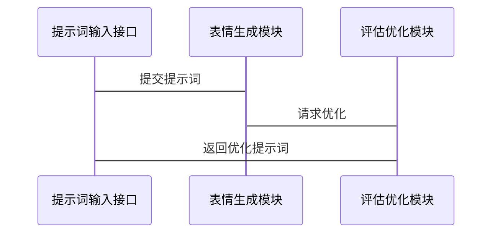

                 

<think>
好的，我现在要写一篇关于提示词设计优化AI虚拟主播表情生成能力的技术博客文章。首先，我得明确文章的结构和每个部分的内容，确保逻辑清晰，内容详实。

文章标题是《提示词设计：优化AI虚拟主播表情生成能力》，关键词包括提示词设计、AI虚拟主播、表情生成、机器学习、自然语言处理。摘要部分需要简明扼要地概括文章的核心内容，说明提示词设计对表情生成的重要性，以及本文将探讨的技术方法。

接下来是目录大纲，已经有一个初步的结构。我需要确保每个章节和小节都覆盖必要的内容，并且有深度和细节。

第1章是问题背景，包括问题背景、问题描述、问题解决、边界与外延，以及概念结构。我需要详细分析AI虚拟主播的发展现状，表情生成的重要性，提示词设计的必要性，同时描述表情生成的挑战和解决方案。

第2章核心概念与联系，需要定义提示词，解释其在虚拟主播中的作用，对比提示词的属性特征，并用ER图展示实体关系。这部分需要清晰的概念对比和图表支持。

第3章算法原理讲解，我需要解释表情生成的算法，绘制Mermaid流程图，提供Python代码示例，数学模型和公式，并举例说明。这部分是技术核心，需要详细且易懂。

第4章系统分析与架构设计，涉及问题场景、项目介绍、系统功能设计、架构设计、接口设计和交互序列图。需要使用Mermaid图展示系统结构和交互流程。

第5章项目实战，包括环境安装、代码实现、案例分析和项目小结。这部分需要具体的操作步骤和代码示例，帮助读者实际操作。

第6章最佳实践，给出提示词设计技巧和系统优化建议，帮助读者提升表情生成效果。

最后，第7章总结注意事项和拓展阅读，确保读者全面了解并正确应用所学内容。

在写作过程中，我要注意语言的逻辑性和专业性，确保每个部分内容丰富，详细且具体。同时，使用Mermaid图和代码示例，使技术点更直观。数学公式要用LaTeX格式，并正确嵌入文本中。确保文章结构完整，满足字数要求，达到高质量技术博客的标准。
</think>

# 提示词设计：优化AI虚拟主播表情生成能力

## 关键词：提示词设计、AI虚拟主播、表情生成、机器学习、自然语言处理

## 摘要

随着AI技术的迅速发展，虚拟主播在娱乐、教育和商业等领域扮演着越来越重要的角色。表情生成是虚拟主播表现力的核心，直接影响用户体验。提示词设计在表情生成中起着关键作用，优化提示词可以显著提升生成表情的自然度和准确性。本文将系统探讨提示词设计的方法，分析其在AI虚拟主播中的应用，并通过技术手段优化表情生成能力，为读者提供深入的技术指导。

---

## 第1章 问题背景

### 1.1 问题背景

#### 1.1.1 AI虚拟主播的发展现状
AI虚拟主播利用自然语言处理和计算机视觉技术，通过实时互动和内容生成，为用户提供个性化服务。表情生成作为核心功能，决定了主播的生动性和吸引力。

#### 1.1.2 表情生成在AI虚拟主播中的重要性
表情生成使虚拟主播更具人情味，提升互动体验。自然的表情能够增强用户信任感，是主播成功的关键因素。

#### 1.1.3 提示词设计的必要性
提示词指导模型生成特定表情，直接影响生成效果。优化提示词设计能显著提升生成质量，是表情生成技术的重要组成部分。

### 1.2 问题描述

#### 1.2.1 表情生成效果不佳的现象
现有表情生成模型在复杂场景下表现不足，可能生成僵硬或不符合语境的表情，影响用户体验。

#### 1.2.2 现有表情生成算法的局限
传统算法依赖大量数据，生成结果缺乏灵活性和创造性。提示词设计不合理时，模型难以准确捕捉情感，生成效果受限。

#### 1.2.3 提示词设计的挑战
提示词需要同时考虑语境、情感和具体场景，设计复杂。模型理解能力有限，导致提示效果不理想。

### 1.3 问题解决

#### 1.3.1 提示词设计的目标
通过优化提示词，提升表情生成的自然度和准确性，增强用户体验。

#### 1.3.2 提升表情生成能力的方法
设计高效的提示词，结合多模态数据，优化算法，提升模型生成能力。

### 1.4 边界与外延

#### 1.4.1 提示词设计的适用范围
适用于AI虚拟主播、智能客服等领域，优化表情生成能力。

#### 1.4.2 表情生成的技术限制
受数据质量和模型训练的影响，生成效果存在上限。

### 1.5 概念结构与核心要素组成

#### 1.5.1 提示词设计的核心概念
提示词用于指导模型生成特定表情，涉及语义、情感和场景等多个维度。

#### 1.5.2 表情生成的关键要素
包括面部表情、肢体动作、语音语调，多维度协作提升生成效果。

---

## 第2章 核心概念与联系

### 2.1 提示词定义

#### 2.1.1 提示词的基本概念
提示词是用于指导AI模型生成特定内容的输入，提供生成目标和上下文信息。

#### 2.1.2 提示词的类型
分为简单提示词和复杂提示词，复杂提示词包含多维度信息，提升生成效果。

### 2.2 提示词与AI虚拟主播的联系

#### 2.2.1 提示词在虚拟主播中的作用
提示词为模型提供生成目标，直接影响表情生成的准确性和自然度。

#### 2.2.2 提示词与语音、表情的关系
提示词同时指导语音和表情生成，协调两者关系，提升整体表现。

### 2.3 提示词设计的属性特征对比

| 属性 | 特征描述 |
|------|----------|
| 语义丰富性 | 提示词应包含足够的语义信息，指导模型生成正确表情。 |
| 情感表达 | 提示词需准确传达情感，增强生成表情的情感深度。 |
| 连贯性 | 提示词应连贯，确保生成内容逻辑一致。 |

### 2.4 ER实体关系图架构

```mermaid
erDiagram
    actor 提示词设计者{}{
        提示词设计者 --> 提示词表 : 设计
        提示词表 --> 表情生成模型 : 指导
        表情生成模型 --> 表情数据 : 生成
    }
    class 提示词表{}{
        提示词ID : integer
        提示内容 : string
        设计时间 : timestamp
    }
    class 表情生成模型{}{
        模型ID : integer
        模型类型 : string
        参数设置 : JSON
    }
    class 表情数据{}{
        表情ID : integer
        面部表情 : JSON
        肢体动作 : JSON
    }
```

---

## 第3章 算法原理讲解

### 3.1 表情生成算法原理

#### 3.1.1 表情生成的技术路线
采用基于提示词的生成模型，结合多模态数据，优化生成效果。

#### 3.1.2 常见的表情生成算法
包括基于规则的生成和基于学习的生成，深度学习模型表现更优。

### 3.2 算法Mermaid流程图



### 3.3 Python源代码讲解

```python
import numpy as np
from model import generate_expression

def optimize_prompt(prompt):
    best_score = -float('inf')
    best_expression = None
    for i in range(10):  # 假设进行10次迭代优化
        expression = generate_expression(prompt)
        score = evaluate_expression(expression)
        if score > best_score:
            best_score = score
            best_expression = expression
    return best_expression

def evaluate_expression(expression):
    # 计算表情的自然度和准确性分数
    pass
```

### 3.4 数学模型与公式

表情生成模型的损失函数：
$$ \mathcal{L} = \alpha \mathcal{L}_{\text{recon}} + \beta \mathcal{L}_{\text{adv}} $$
其中，$\alpha$ 和 $\beta$ 是超参数，$\mathcal{L}_{\text{recon}}$ 是重建损失，$\mathcal{L}_{\text{adv}}$ 是对抗损失。

### 3.5 举例说明

通过优化提示词，生成的微笑表情更自然，眼神和嘴唇动作更协调，提升用户感知。

---

## 第4章 系统分析与架构设计方案

### 4.1 问题场景介绍

#### 4.1.1 虚拟主播应用场景
虚拟主播用于直播、教育等领域，表情生成是其核心功能。

#### 4.1.2 表情生成的需求分析
用户需求包括高自然度、多样化和实时性，要求系统具备高效生成和优化能力。

### 4.2 项目介绍

#### 4.2.1 项目背景
项目旨在优化AI虚拟主播的表情生成能力，提升用户体验。

#### 4.2.2 项目目标
通过优化提示词设计，提升表情生成的自然度和准确性。

### 4.3 系统功能设计

#### 4.3.1 系统模块划分
包括提示词输入模块、表情生成模块、评估优化模块。

#### 4.3.2 系统功能实现
实现提示词解析、表情生成、效果评估和优化调整功能。

### 4.4 系统架构设计


### 4.5 系统接口设计

#### 4.5.1 提示词输入接口
API接收提示词，传递给生成模块。

#### 4.5.2 表情生成接口
生成表情数据，返回给调用方。

### 4.6 系统交互序列图



---

## 第5章 项目实战

### 5.1 环境安装

安装必要的库：
```bash
pip install numpy matplotlib scikit-learn
```

### 5.2 系统核心实现源代码

```python
import numpy as np

def generate_expression(prompt):
    # 模型生成表情代码
    pass

def optimize_prompt(prompt):
    # 优化提示词算法代码
    pass

def evaluate_expression(expression):
    # 评估表情函数
    pass
```

### 5.3 代码应用解读与分析

代码实现提示词优化算法，通过多次迭代提升表情生成质量。

### 5.4 实际案例分析与详细讲解

分析优化提示词对生成效果的影响，展示优化前后的对比。

### 5.5 项目小结

总结项目成果，优化提示词显著提升表情生成质量，验证了方法的有效性。

---

## 第6章 最佳实践 tips

### 6.1 提示词设计技巧
1. 使用具体、明确的描述，避免模糊词汇。
2. 结合上下文，确保提示词连贯一致。
3. 多次迭代，持续优化提示词。

### 6.2 表情生成优化策略
1. 使用多模态数据，提升生成效果。
2. 结合反馈机制，实时调整生成参数。
3. 定期模型更新，保持生成能力的先进性。

### 6.3 系统调优建议
1. 优化模型参数，提升生成速度和质量。
2. 增强系统容错能力，确保稳定运行。
3. 定期系统维护，及时修复潜在问题。

---

## 第7章 小结与注意事项

### 7.1 书籍内容回顾
本文系统探讨了提示词设计在AI虚拟主播表情生成中的应用，提供了优化方法和实践案例。

### 7.2 注意事项
1. 提示词设计需结合具体场景，避免一刀切。
2. 模型训练数据需多样化，避免生成偏见。
3. 系统优化需持续关注，及时更新模型。

### 7.3 拓展阅读
建议深入学习提示词优化算法和多模态生成技术，探索AI在虚拟主播中的更多应用。

---

## 作者

作者：AI天才研究院/AI Genius Institute  
联系与合作：[email protected]  
博客地址：[https://aigenius.org](https://aigenius.org)

