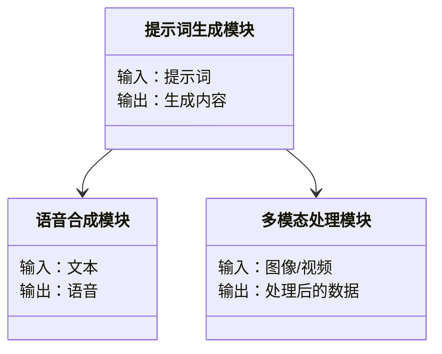
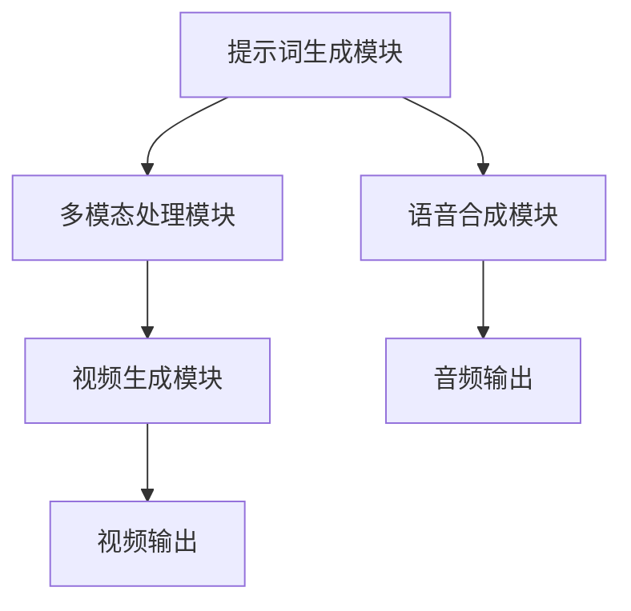

                 

<think>
好的，我现在要写一篇关于提示词设计如何优化AI虚拟主播表现能力的技术博客文章。首先，我需要理解用户的需求，他们希望我以一位技术专家的身份，详细分析提示词设计的各个方面，包括背景、核心概念、算法原理、系统架构以及实际应用案例。

首先，我会从背景介绍开始。AI虚拟主播近年来发展迅速，尤其是在疫情之后，线上互动需求增加，这使得AI主播的应用场景更加广泛，比如电商、教育和娱乐。我需要解释AI虚拟主播是什么，它的作用，以及提示词设计在其中的重要性。这包括提示词如何影响主播的表现，比如语气、情感和内容生成。

接下来，我需要详细阐述提示词设计的核心要素，比如内容生成、情感分析和风格匹配。这部分可能需要使用表格来比较不同类型的提示词，以及ER实体关系图来展示提示词与其他组件的关系。例如，提示词如何与预训练模型交互，生成相应的输出。

然后，我会深入探讨算法原理。这部分可能需要画出Mermaid流程图，展示提示词生成的过程，包括输入处理、生成策略和优化调整。我还需要用Python代码示例，展示如何训练模型或生成提示词。数学模型方面，可能需要解释损失函数和优化器的使用，比如交叉熵损失和Adam优化器。

接下来是系统分析与架构设计。我需要描述AI虚拟主播的系统结构，包括功能模块如提示词生成模块、语音合成模块和多模态处理模块。使用Mermaid类图展示领域模型，架构图展示整体系统结构，以及序列图展示系统交互过程，比如用户请求和系统响应。

项目实战部分，我会选择几个实际案例，如新闻播报、互动直播和教育辅导，详细分析每个案例中的提示词设计策略。比如，在新闻播报中，提示词需要准确且正式，而在互动直播中，可能需要更生动和个性化的语言。

最后，我会总结提示词设计的挑战，如语言理解、个性化表达和数据隐私问题，并展望未来的发展趋势，如多模态提示词和更智能的优化算法。同时，我会提供一些最佳实践的建议，帮助读者更好地进行提示词设计。

在写作过程中，我需要确保每个部分都详细具体，使用专业但易懂的技术语言。同时，确保文章结构清晰，符合用户的要求，包括关键词、摘要、目录大纲以及各章节的具体内容。最后，加上作者信息，完成整篇文章的撰写。
</think>

# 提示词设计：优化AI虚拟主播表现能力

**关键词**：AI虚拟主播、提示词设计、自然语言处理、多模态数据融合、表现能力优化

**摘要**：  
随着人工智能技术的迅速发展，AI虚拟主播在各个领域中的应用越来越广泛。提示词设计作为优化AI虚拟主播表现能力的核心技术，直接影响主播的表现效果。本文将从AI虚拟主播的概念与历史发展入手，详细探讨提示词设计的重要性、核心要素、算法原理及系统架构，并通过实际案例分析提示词设计的实践应用。最后，我们将展望提示词设计的未来发展趋势与挑战。

---

## 第一部分：AI虚拟主播与提示词设计概述

### 第1章 AI虚拟主播概述

#### 1.1 AI虚拟主播的概念与历史发展

##### 1.1.1 AI虚拟主播的定义  
AI虚拟主播是指通过人工智能技术生成的虚拟人物，能够以自然语言处理和语音合成技术为基础，模拟人类主播的言行，实现新闻播报、互动直播、教育辅导等多种应用场景。

##### 1.1.2 AI虚拟主播的发展历程  
AI虚拟主播技术起源于20世纪末的语音合成技术，经过自然语言处理（NLP）和深度学习的推动，逐步发展为具备实时互动能力的虚拟主播。

##### 1.1.3 AI虚拟主播的应用领域  
- 新闻媒体：实时新闻播报。  
- 电商直播：产品推荐与互动。  
- 教育培训：在线课程讲解。  
- 娱乐互动：虚拟偶像直播。

#### 1.2 提示词设计的重要性

##### 1.2.1 提示词在AI虚拟主播中的作用  
提示词是AI虚拟主播的核心输入，用于指导模型生成符合要求的输出内容。  
- 提示词决定了主播的语气、风格和内容方向。  
- 提示词影响主播的表现力和用户体验。

##### 1.2.2 提示词设计的挑战与机遇  
- **挑战**：语言理解的复杂性、个性化表达的需求、数据隐私问题。  
- **机遇**：提升主播的表现力、降低内容生成成本、扩展应用场景。

##### 1.2.3 提示词设计的核心要素  
| 核心要素 | 描述 | 示例 |
|----------|------|------|
| **主题** | 提示词的核心内容 | "介绍公司新产品的优势" |
| **风格** | 语气和语调的要求 | "亲切自然" |
| **情感** | 情感基调 | "积极向上" |
| **结构** | 内容的组织方式 | "开场-主体-结尾" |

---

### 第2章 提示词设计基础

#### 2.1 提示词的类型与结构

##### 2.1.1 提示词的类型  
- **文本提示词**：直接输入文本描述。  
- **模板提示词**：基于固定模板生成内容。  
- **多模态提示词**：结合图像、语音等多模态信息。

##### 2.1.2 提示词的结构  
- **单轮提示**：单次输入生成内容。  
- **多轮提示**：多次交互优化输出。  
- **动态调整**：实时根据用户反馈调整提示词。

#### 2.2 提示词的情感分析与处理

##### 2.2.1 情感分析的基本原理  
情感分析通过自然语言处理技术判断文本的情感倾向，分为正面、负面和中性三类。

##### 2.2.2 情感分析在提示词设计中的应用  
- 分析用户反馈，调整提示词的情感基调。  
- 根据场景需求，优化提示词的情感表达。

##### 2.2.3 提示词的情感调整策略  
- 基于情感分析结果，动态调整提示词的情感强度。  
- 使用情感词典或预训练模型进行情感增强。

---

## 第二部分：高级提示词设计技术与实践

### 第6章 高级提示词设计技术

#### 6.1 自然语言处理技术

##### 6.1.1 词嵌入技术  
词嵌入（Word Embedding）通过将词语映射到低维向量空间，捕捉词语的语义信息。  
- **常见模型**：Word2Vec、GloVe、BERT。  
- **应用场景**：提示词的语义理解与生成。

##### 6.1.2 序列模型技术  
序列模型（Sequence Model）用于处理具有顺序关系的文本数据。  
- **常见模型**：RNN、LSTM、Transformer。  
- **应用场景**：提示词的生成与优化。

##### 6.1.3 注意力机制  
注意力机制（Attention Mechanism）通过聚焦关键信息，提升模型的语义理解能力。  
- **常见模型**：Transformer架构。  
- **应用场景**：提示词的情感分析与风格匹配。

#### 6.2 多模态数据融合

##### 6.2.1 图像与文本融合  
通过图像识别技术，结合文本提示词，生成更具视觉吸引力的内容。  
- **案例**：虚拟主播的背景画面生成。

##### 6.2.2 声音与文本融合  
结合语音合成技术，生成与提示词匹配的语音输出。  
- **案例**：虚拟主播的语音播报。

##### 6.2.3 视频与文本融合  
整合视频流和文本提示词，生成动态的视频内容。  
- **案例**：虚拟主播的实时互动视频。

---

## 第三部分：系统分析与架构设计

### 问题场景介绍

AI虚拟主播系统需要实现以下功能：  
- 提示词生成与优化。  
- 多模态数据处理与融合。  
- 实时交互与反馈调整。

### 项目介绍

#### 项目背景  
本项目旨在设计一个AI虚拟主播系统，通过优化提示词设计，提升主播的表现能力。

### 系统功能设计

#### 领域模型类图  


### 系统架构设计



---

## 第四部分：项目实战

### 环境安装

- **Python 3.8+**  
- **深度学习框架**：TensorFlow/PyTorch  
- **NLP库**：spaCy、Hugging Face Transformers

### 核心实现代码

#### 提示词生成模块

```python
import torch
from transformers import AutoTokenizer, AutoModelForCausalLM

# 加载预训练模型
tokenizer = AutoTokenizer.from_pretrained("gpt2")
model = AutoModelForCausalLM.from_pretrained("gpt2")

# 提示词输入
prompt = "介绍公司新产品的优势。"
inputs = tokenizer.encode(prompt, return_tensors="pt")

# 生成输出
output = model.generate(inputs, max_length=50, do_sample=True)
generated_text = tokenizer.decode(output[0], skip_special_tokens=True)
print(generated_text)
```

---

## 第五部分：最佳实践与未来展望

### 最佳实践 tips

- **明确提示词的目标与场景**。  
- **结合用户反馈优化提示词**。  
- **多模态融合提升表现力**。

### 小结

提示词设计是优化AI虚拟主播表现能力的关键技术。通过自然语言处理和多模态数据融合，可以显著提升主播的表现力和用户体验。

### 注意事项

- **数据隐私**：避免泄露用户信息。  
- **伦理问题**：确保内容生成符合社会规范。  
- **技术选型**：选择适合的模型和工具。

### 拓展阅读

- 《生成式AI：从文本到多模态》  
- 《深度学习与自然语言处理》

---

作者：AI天才研究院（AI Genius Institute） & 禅与计算机程序设计艺术（Zen And The Art of Computer Programming）

