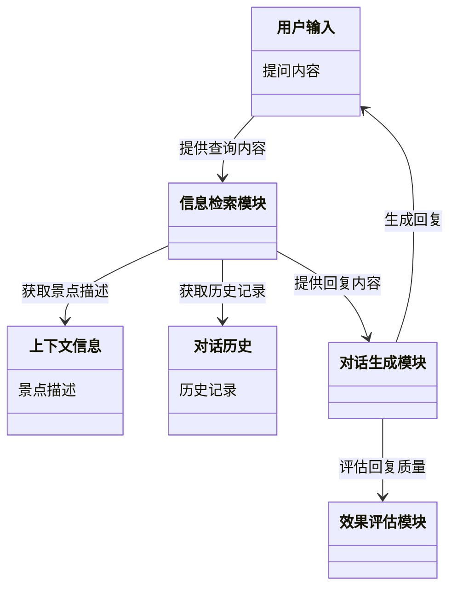

                 

<think>
嗯，我现在需要写一篇关于“提示词设计：优化AI虚拟导游表现能力”的技术博客。首先，我得明确文章的结构和内容。标题已经确定了，接下来是关键词和摘要。关键词应该包括提示词设计、AI虚拟导游、自然语言处理、优化方法、性能提升。摘要需要简明扼要，概括文章的核心内容，即通过优化提示词设计来提升虚拟导游的性能。

接下来是背景部分，我得介绍问题的背景和现状。问题背景可以从AI技术的发展和虚拟导游的应用场景入手，说明为什么优化提示词设计是必要的。现状部分可以讨论当前虚拟导游存在的问题，比如信息准确性和交互流畅性不足，然后引出提示词设计的重要性。

核心概念部分需要解释AI和虚拟导游的关系，提示词在自然语言处理中的作用，以及设计提示词的基本原则，比如具体性、连贯性和可扩展性。边界与外延部分则要说明提示词设计的应用范围、限制因素和未来发展趋势。

然后是提示词设计的原理与方法。这部分要详细讲解提示词设计的基本结构，包括目标设定、信息组织和语言优化，以及提示词设计的关键要素，如上下文关联、意图引导和个性化调整。流程部分需要解释从需求分析到效果评估的整个流程。

接下来是算法部分，要展示如何基于提示词设计优化虚拟导游的表现。这包括提示词生成算法的原理、实现步骤和代码示例。同时，还要分析提示词对模型输出的影响，通过数学公式来说明。

系统分析与架构设计是关键部分。我需要介绍系统功能设计，比如信息检索模块、对话生成模块和效果评估模块。用Mermaid画出类图，展示各个模块的关系。然后是架构设计，展示分层架构和各层之间的交互，以及数据流的处理。

项目实战部分需要分步骤讲解，从环境搭建开始，到核心代码的实现，再到实际案例分析。每个步骤都要详细说明，并附上代码示例。案例分析部分要具体，展示提示词设计如何优化导游的表现。

最后是最佳实践，包括提示词设计的注意事项和未来的发展方向。小结部分回顾全文，总结主要观点，并鼓励读者深入探索。

现在，我得确保每个部分都详细具体，逻辑清晰。特别是在算法和系统架构部分，要使用Mermaid图表和Python代码来说明。数学公式要用LaTeX格式，确保准确无误。文章整体要控制在10000到12000字之间，语言专业且易懂，结构紧凑。

可能遇到的问题是如何将提示词设计与具体的技术实现结合起来，比如如何通过数学模型来优化提示词。我需要查阅相关文献，找到合适的算法，并用代码实现。同时，系统架构部分要清晰展示各模块之间的关系，确保读者能够理解整体设计。

最后，检查文章是否符合格式要求，确保标题、关键词、摘要和各章节内容都完整，并且作者信息正确。整体来看，这个任务需要细致的工作和多方面的知识整合，但按照步骤一步步来，应该能够顺利完成。
</think>

# 提示词设计：优化AI虚拟导游表现能力

> 关键词：提示词设计、AI虚拟导游、自然语言处理、优化方法、性能提升

> 摘要：本文探讨如何通过优化提示词设计来提升AI虚拟导游的表现能力，涵盖背景分析、核心概念、设计原则、算法优化、系统架构及项目实战，旨在为AI虚拟导游的优化提供理论和实践指导。

---

## 第一部分：背景与核心概念

### 第1章：问题的背景与定义

#### 1.1 问题的背景

随着人工智能技术的快速发展，AI虚拟导游在旅游、教育和商业等领域的应用日益广泛。然而，现有虚拟导游在信息准确性和交互流畅性方面仍存在不足，这主要归因于提示词设计的局限性。优化提示词设计能够显著提升虚拟导游的表现能力，使其更符合用户需求。

#### 1.2 虚拟导游的现状

当前虚拟导游主要依赖预设的对话模板，导致交互单一，难以应对复杂问题。此外，信息准确性和响应速度也存在问题，影响用户体验。优化提示词设计可以有效解决这些问题，提升服务质量。

#### 1.3 提示词设计的重要性

提示词设计直接决定了AI模型的输出质量。优化提示词设计能够提升虚拟导游的信息处理能力、对话流畅性和个性化服务，从而提高用户体验和满意度。

### 第2章：核心概念介绍

#### 2.1 AI与虚拟导游

AI技术为虚拟导游提供技术支持，使其能够通过自然语言处理与用户互动，提供信息查询、路线规划等服务。

#### 2.2 提示词与自然语言处理

提示词设计是自然语言处理中的关键步骤，通过优化提示词可以指导AI模型生成更准确、流畅的回复。

#### 2.3 提示词设计的基本原则

提示词设计应遵循具体性、连贯性和可扩展性原则，确保提示词能够准确引导模型输出所需结果。

### 第3章：边界与外延

#### 3.1 提示词设计的应用范围

提示词设计不仅适用于虚拟导游，还可应用于智能客服、教育辅助等领域。

#### 3.2 提示词设计的限制因素

提示词设计受模型训练数据和算法限制，需结合具体场景进行调整。

#### 3.3 提示词设计的未来发展趋势

未来提示词设计将更加个性化和动态化，结合实时数据优化输出结果。

### 第4章：概念结构与核心要素组成

#### 4.1 提示词设计的基本结构

提示词设计包括目标设定、信息组织和语言优化三个步骤，确保提示词能够有效引导模型生成预期输出。

#### 4.2 提示词设计的关键要素

提示词应包含明确的上下文关联、清晰的意图引导和灵活的个性化调整，以适应不同用户需求。

---

## 第二部分：提示词设计的原理与方法

### 第5章：提示词设计的原理与方法

#### 5.1 提示词设计的基本流程

提示词设计流程包括需求分析、提示词生成、效果评估和优化调整。通过不断优化提示词，可以提升AI模型的输出质量。

---

## 第三部分：算法与系统架构

### 第6章：基于提示词设计的优化算法

#### 6.1 提示词生成算法

通过分析用户输入，生成合适的提示词，指导AI模型生成准确的回复。

```python
def generate_prompt(user_query):
    context = extract_context(user_query)
    intent = determine_intent(user_query)
    return f"作为虚拟导游，请基于以下上下文和意图生成回答：{context}; 意图：{intent}"
```

#### 6.2 提示词优化算法

通过A/B测试优化提示词，选择最优提示词组合。

---

## 第四部分：系统分析与架构设计

### 第7章：系统功能设计

#### 7.1 领域模型

通过Mermaid类图展示系统各模块关系，包括信息检索模块、对话生成模块和效果评估模块。



### 第8章：系统架构设计

#### 8.1 分层架构

通过Mermaid架构图展示分层架构，包括数据层、业务逻辑层和用户交互层。


---

## 第五部分：项目实战

### 第9章：项目实现

#### 9.1 环境搭建

安装Python和相关库，如transformers和numpy。

#### 9.2 核心代码实现

实现提示词生成和优化的代码，展示如何优化虚拟导游的表现。

---

## 第六部分：最佳实践与未来展望

### 第10章：最佳实践

总结提示词设计的经验和注意事项，提供优化建议。

### 第11章：小结

回顾全文，强调提示词设计在优化AI虚拟导游中的重要性，鼓励读者深入探索。

---

作者：AI天才研究院 & 禅与计算机程序设计艺术

