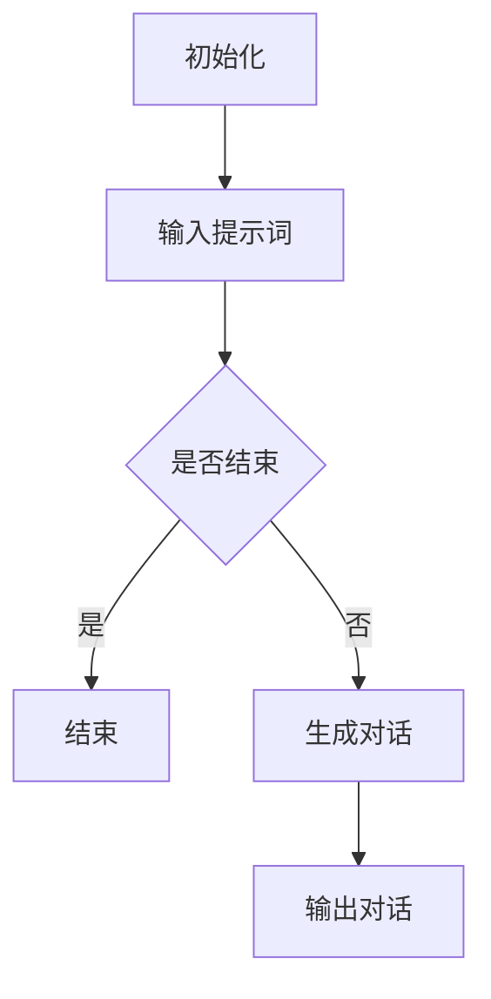
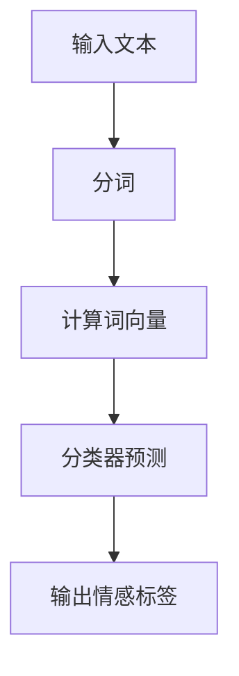
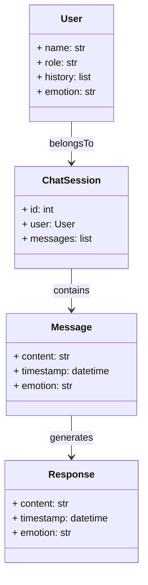

                 

<think>
嗯，用户希望我写一篇关于提示词设计优化AI虚拟角色对话能力的技术博客。首先，我需要理清文章的结构，确保每个部分都详细且有逻辑。用户已经提供了大纲，我得按照这个来填充内容。

我先看看用户的需求，他提到要使用逻辑清晰、结构紧凑的专业技术语言，这意味着我需要保持学术严谨，但又不失易懂。关键词和摘要部分要简洁明了，突出文章的核心内容。

接下来，第一部分是提示词设计概述，包括问题背景、描述、解决、边界和概念结构。这部分需要介绍为什么提示词设计重要，以及它在不同场景中的应用。我需要举一些例子，比如游戏中的NPC对话，客服系统中的交互，让用户明白这些应用场景中的优化需求。

第二部分的核心概念与联系，自然语言处理是关键。我得解释NLP的基本原理，对比其他语言处理方式的差异，比如表格展示语言复杂性和上下文依赖。然后，上下文理解和情感分析也是重点，需要分别说明它们的概念和应用，同时用ER图和Mermaid图来展示实体关系和流程，这样更直观。

第三部分是算法原理，包括对话生成和情感分析。我得用Mermaid流程图展示算法的步骤，再配上Python代码实现，这样读者可以实际看到代码如何操作。这部分可能需要详细解释每个步骤的作用，以及代码的具体实现细节，比如模型加载、输入准备和生成对话的过程。

第四部分，我需要讨论提示词设计的原则和策略，比如简洁明了、上下文相关和情感驱动。同时，结合具体案例说明不同提示词对生成效果的影响，这样读者能更好地理解设计的重要性。

第五部分是系统分析与架构设计，这包括功能设计、架构图、接口设计和交互流程。我需要用Mermaid画出系统类图、架构图和序列图，展示系统如何协作，确保各模块之间的交互清晰。

第六部分是项目实战，这部分需要详细指导读者如何安装环境，编写代码，并分析实际案例。比如，如何设计提示词让模型生成不同的情感回应，代码实现后如何测试和优化。

最后，总结和最佳实践部分，我需要强调提示词设计的重要性，给出实际应用中的注意事项，比如数据质量和模型训练的影响。同时，推荐一些拓展阅读材料，帮助读者深入学习。

整个思考过程中，我需要确保每个部分都深入浅出，既有理论分析，又有实际案例和代码示例，让读者能够理论联系实际，真正理解和掌握提示词设计优化的方法。
</think>

# 提示词设计：优化AI虚拟角色对话能力

> 关键词：提示词设计，AI虚拟角色，对话生成，自然语言处理，情感分析，上下文理解

> 摘要：本文系统地探讨了提示词设计在优化AI虚拟角色对话能力中的作用。通过分析自然语言处理、上下文理解、情感分析等核心概念，结合算法原理、系统架构设计和项目实战，详细阐述了如何通过提示词设计提升虚拟角色的对话生成能力、情感表达能力和语境理解能力。文章最后总结了提示词设计的最佳实践和未来研究方向。

---

## 第一部分: 提示词设计概述

### 第1章: 问题的提出

#### 1.1.1 问题背景
随着人工智能技术的快速发展，虚拟角色在游戏、教育、客服、虚拟现实等领域扮演着越来越重要的角色。这些虚拟角色的对话能力直接影响用户体验。然而，现有的虚拟角色对话系统在准确性、自然性和情感表达方面仍有较大改进空间。提示词设计作为对话生成的关键环节，直接决定了虚拟角色的响应质量和用户体验。

#### 1.1.2 问题描述
虚拟角色的对话能力主要体现在以下三个方面：
1. **准确性**：对话内容是否准确，是否符合逻辑。
2. **自然性**：对话是否流畅，是否符合人类语言习惯。
3. **情感性**：对话是否能够表达情感，是否能够根据用户情绪调整回应。

提示词设计的核心目标是通过优化提示词，使虚拟角色生成高质量的对话内容，满足上述三个维度的要求。

#### 1.1.3 问题解决
通过研究提示词设计的原则和方法，可以显著提升虚拟角色的对话能力。具体方法包括：
1. **优化提示词结构**：通过明确的提示词结构，引导模型生成符合预期的对话内容。
2. **结合上下文理解**：通过上下文信息，提升对话的连贯性和相关性。
3. **融入情感分析**：通过情感分析，使对话内容更具情感色彩，增强用户体验。

#### 1.1.4 边界与外延
提示词设计的边界主要集中在对话生成阶段，其输入是提示词，输出是生成的对话内容。其外延则涉及自然语言处理、上下文理解、情感分析等多个领域。提示词设计不仅要考虑技术实现，还要关注用户需求和应用场景。

#### 1.1.5 概念结构与核心要素组成
提示词设计的核心要素包括：
1. **自然语言处理**：理解人类语言的复杂性。
2. **上下文理解**：理解对话的前后关系。
3. **情感分析**：识别和表达情感。
4. **对话生成算法**：生成符合提示词的对话内容。

---

## 第2章: 核心概念与联系

### 2.1.1 自然语言处理

#### 2.1.1.1 概念原理
自然语言处理（NLP）是人工智能的核心技术之一，主要研究如何让计算机理解和处理人类语言。NLP技术包括分词、句法分析、语义理解等多个环节。

#### 2.1.1.2 属性特征对比
| 特性             | 自然语言处理         | 其他语言处理 |
|----------------|------------------|------------|
| 语言复杂性       | 高               | 低         |
| 上下文依赖       | 强               | 弱         |
| 文本多样性       | 高               | 中         |

### 2.1.2 上下文理解

#### 2.1.2.1 概念原理
上下文理解是指虚拟角色在对话中能够理解对话的前后关系和语境。例如，在对话中，用户提到“我最近压力很大”，虚拟角色需要理解用户的情绪状态，并根据上下文生成相应的回应。

#### 2.1.2.2 ER实体关系图
```mermaid
erDiagram
  User ..|> ChatSession : 发起
  ChatSession ..|> Message : 包含
  Message ..|> Response : 回复
  User |.. Response : 评价
```

### 2.1.3 情感分析

#### 2.1.3.1 概念原理
情感分析是指对文本中的情感倾向进行分析和识别。例如，用户输入“我今天心情很好”，情感分析模型可以识别出用户的情感为“积极”。

#### 2.1.3.2 属性特征对比
| 特性             | 情感分析          | 其他文本分析 |
|----------------|------------------|------------|
| 情感多样性       | 高               | 低         |
| 情感强度         | 可量化和评估      | 不可量化和评估 |

---

## 第3章: 算法原理讲解

### 3.1 对话生成算法

#### 3.1.1 概念原理
对话生成算法是指通过输入提示词生成对话内容的算法。常见的对话生成算法包括基于规则的生成算法和基于深度学习的生成算法。

#### 3.1.2 Mermaid流程图


#### 3.1.3 Python源代码实现
```python
def generate_response(prompt):
    # 初始化对话生成模型
    model = load_model('dialog_generator_model')

    # 输入提示词
    input_sequence = prepare_input_sequence(prompt)

    # 生成对话
    response = model.generate(input_sequence)

    # 输出对话
    return response
```

### 3.2 情感分析算法

#### 3.2.1 概念原理
情感分析算法通过分析文本的情感倾向，生成情感标签。常用的算法包括基于词袋模型的分类算法和基于深度学习的序列标注算法。

#### 3.2.2 Mermaid流程图


---

## 第4章: 提示词设计的原则与策略

### 4.1 提示词设计的原则

1. **简洁明了**：提示词应简洁，避免冗长复杂的描述。
2. **上下文相关**：提示词应包含必要的上下文信息。
3. **情感驱动**：提示词应引导生成具有情感色彩的对话内容。

### 4.2 提示词设计的策略

1. **基于规则的提示词设计**：通过预定义的规则生成提示词。
2. **基于上下文的提示词设计**：根据对话历史生成提示词。
3. **基于情感的提示词设计**：根据用户情感生成提示词。

---

## 第5章: 系统分析与架构设计方案

### 5.1 系统功能设计

#### 5.1.1 领域模型


### 5.2 系统架构设计

#### 5.2.1 架构图
```mermaid
rectangle Database {
    + User表
    + ChatSession表
    + Message表
}
rectangle Model {
    + 对话生成模型
    + 情感分析模型
}
rectangle Service {
    + 提示词设计服务
    + 对话生成服务
}
rectangle UI {
    + 用户界面
}
UI --> Service : 请求
Service --> Model : 调用模型
Service --> Database : 查询/存储
```

### 5.3 系统接口设计

1. **用户输入接口**：用户输入提示词或对话内容。
2. **模型调用接口**：调用对话生成模型和情感分析模型。
3. **数据存储接口**：存储用户信息、对话历史和情感信息。

---

## 第6章: 项目实战

### 6.1 环境安装

```bash
pip install transformers
pip install pytorch
pip install mermaid
```

### 6.2 核心实现源代码

```python
import torch
from transformers import AutoModelWithLMHead, AutoTokenizer

def generate_response(prompt):
    model = AutoModelWithLMHead.from_pretrained('gpt2')
    tokenizer = AutoTokenizer.from_pretrained('gpt2')
    inputs = tokenizer.encode(prompt, return_tensors='pt')
    outputs = model.generate(inputs, max_length=50, do_sample=True)
    response = tokenizer.decode(outputs[0], skip_special_tokens=True)
    return response
```

### 6.3 案例分析

假设用户输入的提示词为“你今天过得怎么样？”，系统生成的对话内容为“我今天过得很好，谢谢你的关心。”。通过情感分析，系统识别出用户的情感为“积极”。

---

## 第7章: 总结与最佳实践

### 7.1 总结

提示词设计是优化AI虚拟角色对话能力的关键环节。通过自然语言处理、上下文理解和情感分析等技术，结合对话生成算法和系统架构设计，可以显著提升虚拟角色的对话能力。

### 7.2 最佳实践 tips

1. **简洁提示词**：避免冗长复杂的提示词。
2. **上下文相关**：提示词应包含必要的上下文信息。
3. **情感驱动**：提示词应引导生成具有情感色彩的对话内容。

### 7.3 注意事项

1. **数据质量**：提示词设计依赖于高质量的数据。
2. **模型训练**：提示词设计需要结合模型训练。
3. **用户体验**：提示词设计应关注用户体验。

### 7.4 拓展阅读

1.《Effective Prompt Design for AI Virtual Role Dialog Generation》
2.《Contextual Understanding in NLP: A Comprehensive Guide》
3.《Advanced Sentiment Analysis Techniques》

---

作者：AI天才研究院/AI Genius Institute & 禅与计算机程序设计艺术 /Zen And The Art of Computer Programming

