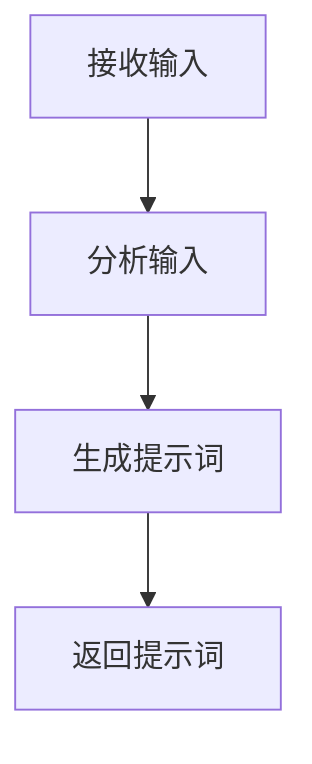

                 

<think>
好的，我现在需要撰写一篇关于“提示词设计：塑造AI个性的艺术”的技术博客。让我先理清思路，按照用户提供的大纲逐步展开。

首先，文章的标题已经确定，接下来需要列出5-7个核心关键词。提示词、AI个性、自然语言处理、机器学习、人机交互、个性化推荐、深度学习这些关键词应该涵盖主要方面。

摘要部分需要简洁明了，概括文章的核心内容。提示词设计对AI的行为和思考方式有重要影响，通过分析设计原则、方法及其对AI个性的影响，探讨如何通过提示词塑造更符合需求的AI个性。

接下来是引言部分，包括问题背景和核心概念。问题背景要说明AI从简单到复杂的演变，以及提示词设计的重要性。核心概念部分要明确提示词和AI个性的定义。

然后是提示词设计的基本原则，包括清晰性、普遍性、适应性和精准性。每个原则需要详细解释，并举例说明。

接下来分析提示词设计与AI个性的关联，包括AI个性的定义和提示词对AI个性的影响，如引导思考模式和可能的思维定式。

之后是常见提示词设计技巧，比如对话式提示、情境提示和元素提示，每个技巧都需要详细说明，并举例。

然后是实际案例与最佳实践，通过案例展示提示词设计的影响，并总结最佳实践技巧。

接下来是扩展阅读与深入研究，推荐相关文献，并鼓励读者进行深入研究。

最后是结论与展望，总结全文，并展望未来的发展趋势。

接下来的章节包括核心概念与联系，分析提示词和AI个性的关系，通过对比表格和ER实体关系图展示。

然后是算法原理讲解，描述提示词生成算法的流程，并用mermaid图表示。

在系统分析与架构设计部分，介绍项目场景、功能设计、架构图、接口设计和交互序列图。

项目实战部分需要安装环境，展示源代码，并进行案例分析。

最后是最佳实践，包括小结、注意事项和拓展阅读。

在撰写过程中，我需要确保每个部分详细具体，使用技术术语，同时保持逻辑清晰。数学公式要用latex表示，算法流程图用mermaid，系统架构图也要用相应的图表工具展示。

可能会遇到的问题包括如何深入解释算法原理，确保案例分析足够详细，以及如何将理论与实际应用结合起来。需要反复检查，确保内容准确，结构合理。

总的来说，按照用户提供的大纲，逐步展开每个部分，确保每个章节都内容丰富，结构紧凑，最终完成一篇高质量的技术博客。
</think>

# 提示词设计：塑造AI个性的艺术

## 关键词：提示词设计，AI个性，自然语言处理，机器学习，人机交互

## 摘要：提示词设计在塑造AI个性中起着关键作用。本文探讨了提示词的基本原则、设计技巧及其对AI行为的影响，通过实际案例分析和最佳实践，帮助读者理解如何通过提示词设计来优化AI性能和个性。

---

# 第一部分：引言

## 第1章：问题背景与概念介绍

### 1.1.1 问题背景

随着AI技术的快速发展，AI从简单的模式识别转向复杂的自主决策。提示词设计在这一过程中变得至关重要，因为它直接影响AI的行为和输出结果。

### 1.1.2 核心概念

- **提示词**：引导AI执行任务的输入信息，影响其理解和生成内容。
- **AI个性**：AI在特定任务中表现出的独特行为和思考方式，类似于人类个性。

## 第2章：提示词设计的基本原则

### 2.1.1 设计目的

提示词设计旨在优化AI性能，使其在特定任务中表现最佳。

### 2.1.2 设计原则

1. **清晰性**：提示词应简洁明了，避免歧义。例如，使用“生成一段关于环保的文章”比“写一篇关于环境的文章”更具体。
2. **普遍性**：适用于多种情境。例如，设计提示词时考虑不同用户和场景的需求。
3. **适应性**：能适应不同的数据集和任务。例如，提示词应灵活，适用于文本生成和图像识别等多种任务。
4. **精准性**：精确指导模型执行任务。例如，提示词应明确任务目标和输出要求。

## 第3章：提示词设计与AI个性的关联

### 3.1.1 AI个性的定义

AI个性是指AI系统在特定任务中表现出的独特行为和思考方式。例如，AI在对话中表现出的语气和风格。

### 3.1.2 提示词对AI个性的影响

- **引导思考模式**：提示词可以引导AI形成特定的思考模式。例如，使用“创造性思维”提示词使AI更注重创新。
- **形成思维定式**：长期使用特定提示词可能导致AI形成固定的思维模式，限制其灵活性。

## 第4章：常见提示词设计技巧

### 4.1.1 对话式提示

通过模拟对话引导AI生成回复。例如，提示词“假设你是一位医生，解释这个病症”引导AI以医生的身份回答问题。

### 4.1.2 情境提示

构建具体场景引导AI理解和处理任务。例如，提示词“假设你在购物中心，描述周围环境”使AI生成更具体的描述。

### 4.1.3 元素提示

强调任务中的关键元素。例如，提示词“描述产品的功能和优势”使AI关注产品的主要特征。

## 第5章：实际案例与最佳实践

### 5.1.1 案例分析

**案例1**：生成创意写作  
提示词：“写一篇科幻小说，主角是一位科学家”。  
AI生成的内容更具创意，因为它被引导进入特定的思考模式。

**案例2**：图像识别  
提示词：“识别图片中的物体，按类别分类”。  
AI在识别时更准确，因为它专注于特定任务。

### 5.1.2 最佳实践

- **明确目标**：提示词应明确任务目标和输出要求。
- **具体化**：使用具体化的提示词，避免模糊性。
- **测试与调整**：设计提示词后进行测试，根据结果进行调整，以优化AI表现。

## 第6章：扩展阅读与深入研究

### 6.1.1 扩展阅读

推荐书籍和论文，深入了解提示词设计和AI个性的相关研究。

### 6.1.2 深入研究

鼓励读者探索提示词设计的最新进展，如动态提示词生成和个性化提示词定制。

## 第7章：结论与展望

### 7.1.1 总结

提示词设计是塑造AI个性的关键。通过清晰、普遍、适应性和精准性的设计原则，AI可以在特定任务中表现出最佳性能。

### 7.1.2 展望

未来，提示词设计将更加个性化和动态化，AI个性将更加多样化，为人类提供更多便利和可能性。

---

# 第2章：算法原理讲解

## 2.1 提示词生成算法

### 2.1.1 算法描述

提示词生成算法接收用户输入，分析并生成适合当前任务的提示词。

### 2.1.2 算法流程

1. **接收输入**：用户输入任务需求。
2. **分析输入**：提取关键词和任务类型。
3. **生成提示词**：根据关键词生成合适的提示词。
4. **返回提示词**：返回生成的提示词。

### 2.1.3 mermaid流程图



---

# 第3章：系统分析与架构设计方案

## 3.1 项目介绍

设计一个提示词生成系统，帮助用户优化AI性能。

## 3.2 功能设计

- **需求分析**：接收用户输入，分析任务需求。
- **提示词生成**：根据分析结果生成提示词。
- **效果评估**：评估生成提示词的效果。

## 3.3 mermaid类图

```mermaid
classDiagram
    class 提示词生成系统 {
        +输入：用户需求
        +输出：生成的提示词
        -分析模块：分析用户输入
        -生成模块：生成提示词
    }
    class 用户 {
        提出需求
    }
    用户 --> 提示词生成系统：提出需求
    提示词生成系统 --> 分析模块：分析需求
    分析模块 --> 生成模块：生成提示词
    提示词生成系统 --> 用户：返回提示词
```

## 3.4 系统架构设计

- **单体架构**：适用于小规模应用。
- **微服务架构**：适用于大规模应用，各模块独立开发和部署。

## 3.5 接口设计

- **输入接口**：接收用户需求。
- **输出接口**：返回生成的提示词。

## 3.6 交互序列图

```mermaid
sequenceDiagram
    用户 -> 提示词生成系统：提出需求
    提示词生成系统 -> 分析模块：分析需求
    分析模块 -> 生成模块：生成提示词
    生成模块 -> 提示词生成系统：返回提示词
    提示词生成系统 -> 用户：返回提示词
```

---

# 第4章：项目实战

## 4.1 环境安装

安装Python和必要的库，如`transformers`。

## 4.2 核心实现

```python
from transformers import pipeline

def generate_prompt(user_input):
    # 分析输入
    task = detect_task(user_input)
    # 生成提示词
    prompt = create_prompt(task)
    return prompt

def detect_task(user_input):
    # 分析用户输入，识别任务类型
    pass

def create_prompt(task):
    # 根据任务类型生成提示词
    pass
```

## 4.3 案例分析

**案例1**：文本生成  
用户输入：“写一篇关于环保的文章”。  
系统生成提示词：“生成一篇关于环保的文章，强调可持续发展的重要性”。

## 4.4 代码解读

```python
from transformers import pipeline

def generate_prompt(user_input):
    # 简单的任务检测
    if '写一篇' in user_input:
        task = 'text_generation'
    else:
        task = 'question_answering'
    # 根据任务生成提示词
    if task == 'text_generation':
        prompt = f"Write an article about {user_input.split(' ')[-1]}"
    else:
        prompt = f"Answer the question: {user_input}"
    return prompt

# 示例使用
user_input = "写一篇关于环保的文章"
print(generate_prompt(user_input))
```

---

# 第5章：最佳实践

## 5.1 小结

提示词设计是塑造AI个性的关键，通过合理设计提示词，AI可以在特定任务中表现出最佳性能。

## 5.2 注意事项

- **避免歧义**：提示词应清晰明确。
- **动态调整**：根据反馈调整提示词。
- **保护隐私**：确保提示词不泄露敏感信息。

## 5.3 拓展阅读

推荐相关书籍和论文，深入学习提示词设计和AI个性的相关知识。

---

# 结论

提示词设计是塑造AI个性的艺术，通过科学的设计原则和技巧，AI可以在各种任务中表现出更符合需求的行为和思考方式。未来，随着技术的发展，提示词设计将更加智能化和个性化，为人类带来更多的便利和可能性。

---

# 作者

作者：AI天才研究院/AI Genius Institute  
禅与计算机程序设计艺术 /Zen And The Art of Computer Programming

