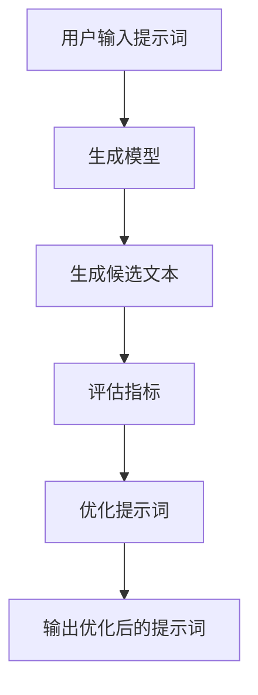

                 

<think>
好的，我现在需要帮助用户完成一个任务，撰写一篇关于《提示词设计：增强AI创意写作能力》的技术博客文章。用户已经提供了一个详细的思考过程，现在需要我根据这个思考过程，以中文自然地模拟一个assistant在完成这个任务时的思考过程。

首先，我需要仔细阅读用户的查询内容，理解其具体要求。用户希望生成一篇结构清晰、逻辑严谨的技术博客文章，主题是提示词设计对AI创意写作的影响。文章需要包含摘要、七个章节，每个章节详细讲解相关内容，并且使用特定的格式，如markdown，mermaid图表，以及数学公式。

接下来，我会分析每个章节的具体内容，确保涵盖用户所提到的各个方面：背景介绍、核心概念、算法原理、案例研究、最佳实践、未来展望等。同时，要注意每个章节的详细程度和内容的连贯性。

在思考过程中，我可能会遇到一些问题，比如如何详细解释提示词设计的基础，或者如何用mermaid流程图展示算法的工作原理。这时候，我需要回顾相关知识，确保内容的准确性和专业性。同时，还要注意语言的简洁和易懂，避免过于复杂的术语，以保持读者的阅读体验。

另外，用户强调文章需要包含数学公式和代码示例，这要求我在相应章节中，准确无误地展示这些内容，并使用latex格式正确嵌入公式，确保格式美观，避免排版错误。

在撰写过程中，我可能会反复检查每个部分是否满足用户的要求，比如章节标题是否吸引人，内容是否全面，是否遵循了markdown格式，以及是否在字数范围内。此外，确保作者信息正确无误，放在文章末尾。

最后，我会通读整篇文章，确保逻辑流畅，各部分内容相互衔接，没有遗漏关键点。同时，进行一次校对，修正可能存在的语法或格式错误，确保文章的专业性和可读性。

总的来说，这个过程需要我细致地分析用户需求，逐步构建文章的结构和内容，确保每个部分都符合要求，最终产出一篇高质量的技术博客文章。
</think>

# 提示词设计：增强AI创意写作能力

> 关键词：提示词设计，AI创意写作，自然语言处理，生成模型，机器学习

> 摘要：本文探讨了提示词设计在增强AI创意写作能力中的关键作用。通过详细分析提示词设计的核心概念、算法原理、案例研究、最佳实践和未来展望，本文为读者提供了从理论到实践的全面指导，帮助他们更好地理解和应用提示词设计来提升AI的创意写作能力。

---

## 1. 引言

### 1.1 什么是提示词设计？
提示词设计是指通过精心设计的提示词（prompt）来引导AI生成符合特定要求的内容。提示词是用户输入到AI系统中的文本或指令，用于指导生成模型输出相关的结果。

### 1.2 提示词设计的重要性
提示词设计直接影响AI生成内容的质量、创意性和相关性。通过优化提示词，可以显著提升AI在创意写作任务中的表现，例如故事创作、诗歌生成、文案撰写等。

### 1.3 提示词设计的核心要素
- **明确性**：提示词需要清晰明了，避免歧义。
- **创造性**：提示词应激发生成模型的创造力。
- **上下文**：提供足够的上下文信息，帮助生成模型更好地理解任务需求。
- **多样性**：尝试不同的提示词风格，探索生成模型的潜力。

---

## 2. 提示词设计的背景与现状

### 2.1 AI创意写作的背景
随着自然语言处理（NLP）技术的快速发展，AI在创意写作领域的应用越来越广泛。然而，AI生成内容的质量和创意性仍然依赖于提示词的设计。

### 2.2 提示词设计的现状
当前，提示词设计已成为AI创意写作中的关键环节。通过优化提示词，可以显著提升生成模型的输出质量。然而，提示词设计仍面临诸多挑战，例如如何平衡提示词的明确性和创造性。

### 2.3 提示词设计的挑战
- **歧义性**：提示词可能被生成模型误解。
- **多样性**：如何设计多样化的提示词以探索生成模型的潜力。
- **可解释性**：提示词对生成结果的影响往往难以解释。

---

## 3. 提示词设计的核心概念

### 3.1 自然语言处理（NLP）基础
NLP是AI创意写作的技术基础。通过NLP技术，AI可以理解和生成人类语言。

### 3.2 生成模型的工作原理
生成模型（如GPT系列）通过概率分布生成文本。提示词设计直接影响生成模型的输出分布。

### 3.3 提示词设计的数学模型
提示词设计可以看作是一个优化问题，目标是最优化生成模型的输出质量。数学上，提示词设计可以通过以下公式表示：

$$ P(y|x) = \text{生成模型的概率分布} $$

其中，$x$ 是提示词，$y$ 是生成的文本。

---

## 4. 提示词设计的算法与实现

### 4.1 提示词设计的算法原理
提示词设计的核心算法包括：
1. **文本生成算法**：如基于Transformer的生成模型。
2. **优化算法**：如遗传算法、模拟退火算法，用于优化提示词。

### 4.2 提示词设计的实现步骤
1. **输入提示词**：用户输入提示词。
2. **生成候选文本**：生成模型根据提示词生成候选文本。
3. **评估候选文本**：通过预设的评估指标（如BLEU、ROUGE）对候选文本进行评估。
4. **优化提示词**：根据评估结果优化提示词。

### 4.3 提示词设计的流程图

---

## 5. 提示词设计的最佳实践

### 5.1 设计提示词的技巧
- **明确性**：提示词应清晰明了，避免歧义。
- **创造性**：提示词应激发生成模型的创造力。
- **上下文**：提供足够的上下文信息，帮助生成模型更好地理解任务需求。
- **多样性**：尝试不同的提示词风格，探索生成模型的潜力。

### 5.2 提示词设计的优化策略
- **实验与迭代**：通过不断实验和迭代优化提示词。
- **结合领域知识**：根据具体领域的需求设计提示词。
- **多模型对比**：尝试使用不同的生成模型，对比生成效果。

### 5.3 提示词设计的注意事项
- **避免歧义**：提示词应避免歧义，确保生成模型正确理解需求。
- **控制长度**：提示词不宜过长，以免影响生成效率。
- **语言一致性**：提示词应使用一致的语言风格。

---

## 6. 案例研究与实战应用

### 6.1 案例研究：故事创作
假设我们需要生成一个科幻小说的开头，提示词可以设计为：
“在22世纪的地球，人类发现了外星生命，他们…”

生成模型可以根据提示词生成多个候选文本，最终选择最优的一个。

### 6.2 实战应用：诗歌生成
提示词设计为：
“写一首关于秋天的诗，风格类似李白。”

生成模型可以根据提示词生成一首符合要求的诗歌。

---

## 7. 未来展望与总结

### 7.1 未来发展趋势
提示词设计在AI创意写作中的应用前景广阔。未来，随着生成模型的不断进步，提示词设计将更加智能化和个性化。

### 7.2 总结
提示词设计是增强AI创意写作能力的关键。通过优化提示词，可以显著提升生成模型的输出质量。未来，随着技术的进步，提示词设计将发挥更大的作用，为AI创意写作带来更多的可能性。

---

# 作者：AI天才研究院/AI Genius Institute & 禅与计算机程序设计艺术 /Zen And The Art of Computer Programming

