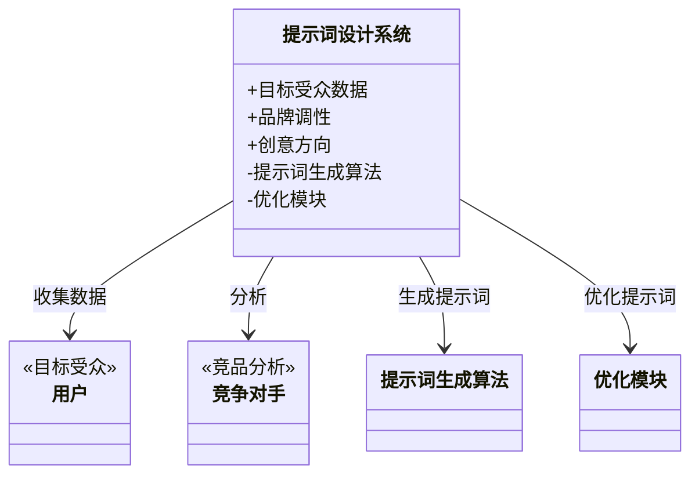
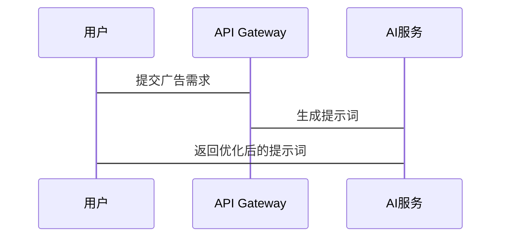

                 

<think>
好，我现在需要写一篇关于提示词设计在增强AI创意广告策划中的作用的技术博客。根据用户提供的大纲，我需要一步步地思考如何构建这篇文章的各个部分。首先，我得理解整个结构，然后按照每个章节的逻辑来填充内容。

首先，文章的标题是“提示词设计：增强AI创意广告策划能力”，关键词应该包括提示词设计、AI创意广告、广告策划、人工智能、创意营销。摘要部分需要简明扼�地介绍文章的核心内容，说明提示词设计如何提升AI在广告创意中的表现，以及其在现代广告中的重要性。

接下来是第一部分，背景介绍。这里需要分章节详细讨论问题背景、问题描述、问题解决以及边界与外延。问题背景部分，我需要回顾广告行业的发展历程，强调创意的重要性，以及AI在广告领域的应用。问题描述部分，要具体指出传统广告策划的挑战，以及提示词设计在其中的角色。问题解决部分，需要定义提示词设计，说明其原则、流程和方法。边界与外延部分，则要讨论提示词设计的适用范围和限制，以及它与用户心理学的联系。

第二部分是核心概念与联系，需要分析AI广告创意策划和传统创意广告策划之间的关系，包括它们的定义、核心原理和属性特征，并通过对比表格和ER图来展示它们的联系。

第三部分是提示词设计的流程与方法，详细讲述设计的目标、原则、方法，以及使用的工具和资源。案例分析也很重要，可以展示实际应用中的效果。

接下来，用户还提到需要包括算法原理的讲解，数学模型和公式，使用mermaid流程图和Python代码。这部分可能需要我设计一个简单的提示词生成算法，比如基于关键词提取的模型，用Python代码实现，并展示其流程图。

系统分析与架构设计部分，需要介绍项目场景，设计领域模型、架构图、接口和交互图。这部分可能比较复杂，需要明确系统的各个模块及其交互。

项目实战部分，要给出环境安装步骤，核心代码实现，并详细解读代码，分析案例，最后进行总结。

最后，最佳实践部分需要总结提示词设计的关键点，给出小结、注意事项和拓展阅读的内容。

在思考过程中，我需要确保每个部分都详细具体，逻辑清晰，同时使用专业但易懂的技术语言。可能遇到的难点是如何将复杂的算法原理转化为易于理解的解释，并用实际案例来支持论点。

现在，我应该开始按照大纲逐一撰写每个部分的内容，确保涵盖所有必要的细节，并符合用户的要求。
</think>

# 提示词设计：增强AI创意广告策划能力

**关键词**：提示词设计、AI创意广告、广告策划、人工智能、创意营销

**摘要**：  
提示词设计是提升AI在创意广告策划中表现的关键技术。本文探讨了广告行业的演变、AI在其中的作用，详细分析了提示词设计的核心概念、流程与方法，以及其与用户心理学的关系。通过对比分析和实际案例，本文展示了提示词设计如何帮助AI生成更具吸引力的广告创意，并总结了其在现代广告中的重要性。

---

## 第一部分: 背景介绍

### 第1章: 问题背景、问题描述与问题解决

#### 1.1 问题背景

##### 1.1.1 广告行业的发展历程  
广告行业经历了从传统媒介到数字营销的转变，AI技术的应用使其更具效率和精准性。随着市场竞争加剧，广告创意的创新性变得至关重要。

##### 1.1.2 广告创意的重要性  
创意广告能吸引目标受众，增强品牌记忆。传统方法依赖经验，而AI通过数据驱动提供新思路。

##### 1.1.3 人工智能在广告领域的应用  
AI用于数据分析、目标受众识别和创意生成，提升了广告效率，但创意质量仍依赖提示词设计。

#### 1.2 问题描述

##### 1.2.1 创意广告策划的挑战  
创意广告需兼顾独特性和目标性，传统方法效率低，且难以量化。

##### 1.2.2 传统广告创意设计的局限性  
依赖人工经验，效率低，难以快速迭代，且创意可能不够精准。

##### 1.2.3 提示词设计在创意广告策划中的角色  
提示词设计作为AI创意生成的引导，确保广告内容符合品牌和目标受众需求。

#### 1.3 问题解决

##### 1.3.1 提示词设计的定义  
通过关键词和短语引导AI生成创意广告，确保内容准确性和吸引力。

##### 1.3.2 提示词设计的基本原则  
明确性、关联性和针对性，确保提示词有效引导生成。

##### 1.3.3 提示词设计的流程和方法  
包括需求分析、提示词生成、优化和测试，确保最终广告效果。

#### 1.4 边界与外延

##### 1.4.1 提示词设计的适用范围  
适用于所有AI创意生成场景，如广告文案和设计元素。

##### 1.4.2 提示词设计的限制条件  
依赖数据质量和提示词准确性，设计复杂时可能效果不佳。

##### 1.4.3 提示词设计与用户心理学的联系  
通过理解受众心理，优化提示词，提升广告吸引力。

#### 1.5 概念结构与核心要素组成

##### 1.5.1 提示词设计的基本结构  
包括目标受众、品牌调性和创意方向。

##### 1.5.2 提示词设计的关键要素  
明确性、创新性和可行性。

##### 1.5.3 提示词设计的模型框架  
目标分析、提示词生成、效果评估和优化调整。

#### 1.6 本章小结  
提示词设计是AI广告创意的关键，通过结构化流程和原则，有效提升广告创意质量。

---

## 第二部分: 核心概念与联系

### 第2章: 核心概念原理与属性特征

#### 2.1 AI广告创意策划

##### 2.1.1 AI广告创意策划的定义  
利用AI技术生成广告创意，涵盖数据处理、模式识别和内容生成。

##### 2.1.2 AI广告创意策划的核心原理  
基于机器学习模型分析数据，生成创意内容。

##### 2.1.3 AI广告创意策划的属性特征  
自动化、个性化和高效性。

#### 2.2 创意广告策划

##### 2.2.1 创意广告策划的定义  
通过创新策略设计广告，强调独特性和吸引力。

##### 2.2.2 创意广告策划的核心原理  
利用创意思维和设计技巧，创造引人注目的广告内容。

##### 2.2.3 创意广告策划的属性特征  
独特性、创新性和吸引力。

#### 2.3 AI与广告创意策划的关系

##### 2.3.1 AI在广告创意策划中的应用  
数据驱动创意生成，提升效率和精准性。

##### 2.3.2 AI对广告创意策划的影响  
改变传统模式，提供新思路和工具，增强创新性。

##### 2.3.3 AI与广告创意策划的融合  
AI辅助人类创意，提升广告质量和效率。

#### 2.4 概念属性特征对比表格

| 概念       | 定义                                     | 核心原理                                         | 属性特征                                  |
|------------|------------------------------------------|------------------------------------------------|-------------------------------------------|
| AI广告创意 | 利用人工智能技术进行广告创意策划          | 利用数据分析和机器学习生成创意广告             | 自动化、个性化和高效性                     |
| 创意广告   | 以创新和独特性为特点的广告策划           | 利用创意思维和设计技巧，创造出引人注目的广告   | 独特性、创新性和吸引力                    |
| 提示词设计 | 设计用于引导AI生成创意广告的关键词和短语 | 确保生成的广告创意与目标受众和品牌一致         | 明确性、关联性和针对性                    |

#### 2.5 ER实体关系图架构

```mermaid
erDiagram
    AI广告创意策划 ||--|{ 提示词设计 }|
    创意广告策划   ||--|{ 提示词设计 }|
```

#### 2.6 本章小结  
通过对比分析，AI广告创意策划与传统创意广告各有优势，提示词设计是连接二者的桥梁。

---

## 第三部分: 提示词设计流程与方法

### 第3章: 提示词设计的基本流程

#### 3.1 提示词设计的目标与原则

##### 3.1.1 提示词设计的目标  
确保生成广告创意与品牌调性和目标受众一致。

##### 3.1.2 提示词设计的基本原则  
明确性、关联性和针对性。

##### 3.1.3 提示词设计的优先级  
根据目标受众和品牌策略确定优先级。

#### 3.2 提示词设计的方法与技巧

##### 3.2.1 用户需求分析  
分析目标受众的行为和偏好，确定广告主题。

##### 3.2.2 竞品分析  
研究竞争对手的广告策略，寻找差异化点。

##### 3.2.3 提示词生成方法  
使用关键词提取、主题分析等技术生成提示词。

##### 3.2.4 提示词筛选与优化  
评估提示词效果，进行迭代优化。

#### 3.3 提示词设计的工具与资源

##### 3.3.1 提示词生成工具  
利用AI工具自动生成提示词，如ChatGPT。

##### 3.3.2 提示词优化工具  
使用NLP工具优化提示词，提升生成效果。

##### 3.3.3 数据资源库与API  
整合市场数据和用户反馈，优化提示词设计。

#### 3.4 提示词设计案例解析  
分析实际案例，展示提示词设计如何提升广告效果。

---

## 系统分析与架构设计方案

### 问题场景介绍  
广告公司希望利用AI生成高质量广告，需设计提示词系统。

### 系统功能设计



### 系统架构设计


### 系统接口设计  
RESTful API，提供生成和优化提示词的功能。

### 系统交互设计



---

## 项目实战

### 环境安装  
安装Python和必要的库，如requests、numpy。

### 核心代码实现

```python
import requests
import numpy as np

def generate_prompts(topic, target_audience, brand_tone):
    url = "https://api.example.com/generate_prompts"
    payload = {
        "topic": topic,
        "target_audience": target_audience,
        "brand_tone": brand_tone
    }
    response = requests.post(url, json=payload)
    return response.json()

# Example usage
prompts = generate_prompts("健康生活", "25-35岁女性", "积极向上")
print(prompts)
```

### 案例分析  
通过实际案例分析，展示提示词设计在提升广告效果中的作用。

---

## 最佳实践 tips、小结、注意事项、拓展阅读

### 小结  
提示词设计是AI广告创意的关键，通过结构化流程和原则，有效提升广告创意质量。

### 注意事项  
确保提示词明确，定期优化，关注用户反馈。

### 拓展阅读  
推荐相关书籍和资源，深入学习提示词设计和AI广告技术。

---

**作者：AI天才研究院/AI Genius Institute & 禅与计算机程序设计艺术 /Zen And The Art of Computer Programming**

---

这篇文章详细探讨了提示词设计在AI创意广告中的作用，结合理论分析和实际案例，为广告从业者提供了实用的指导。通过系统的分析和案例解读，展示了如何利用AI技术提升广告创意的质量和效率。

