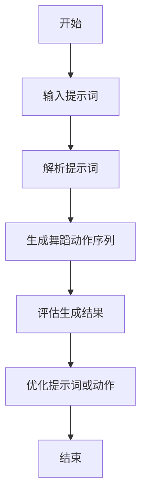
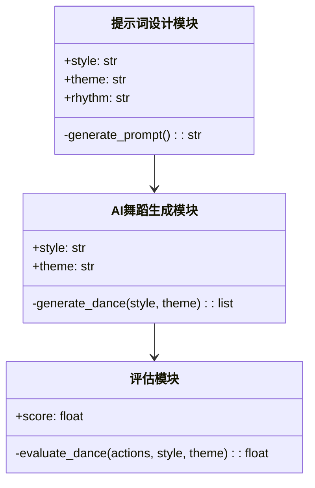
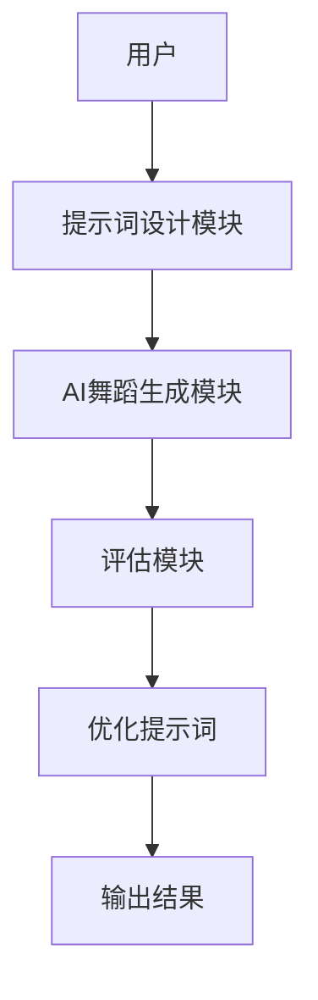
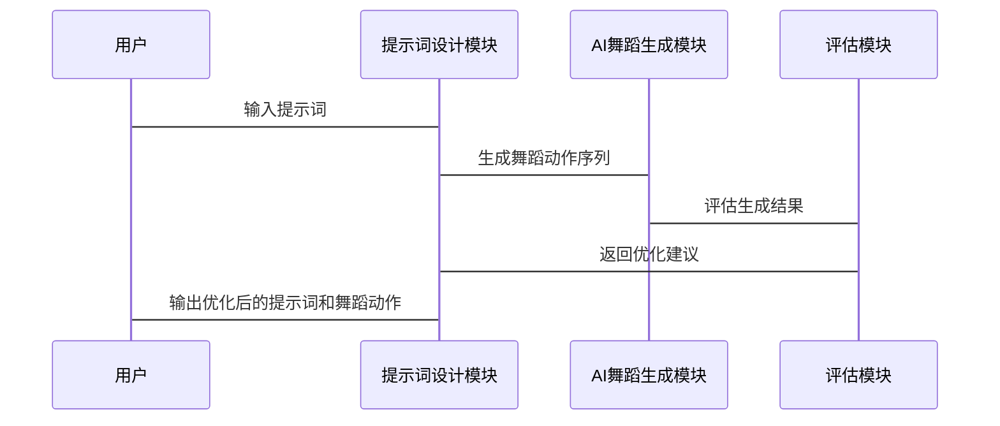

                 

<think>
嗯，我需要完成一个技术博客文章，标题是《提示词设计：增强AI创意舞蹈编排的艺术性》。首先，我得理解这个主题，它结合了AI和舞蹈艺术，听起来挺有意思的。用户希望我用逻辑清晰、结构紧凑、简单易懂的专业技术语言，一步一步地分析推理，撰写一篇有深度、有见解的专业IT领域的技术博客。

首先，我得考虑文章的结构。用户已经给出了一个详细的大纲，包括引言、核心概念、理论基础、算法原理、系统分析、项目实战、最佳实践、总结等部分。每个部分都有具体的子标题，比如引言部分有1.1和1.2，分别讨论AI在舞蹈编排中的应用现状，包括挑战和限制。

接下来，我需要填充每个部分的内容。以“引言”部分为例，我需要先介绍AI在舞蹈编排中的应用现状，分析其意义和挑战。这部分需要确保内容简洁明了，同时引出后续的内容。

在核心概念部分，我需要定义提示词设计的基本概念，比如提示词的定义、作用，以及设计的原则。同时，要探讨舞蹈艺术性与技术性的平衡，以及如何将创意与AI算法结合。这部分需要详细解释每个概念，确保读者能够理解提示词在AI舞蹈编排中的重要性。

理论基础部分，我会讨论AI算法在舞蹈编排中的应用，列举常见的算法如遗传算法、神经网络等，并分析它们在舞蹈中的具体应用。然后，我需要构建提示词设计的理论框架，包括设计流程和评价标准。这部分可能需要使用一些图表，比如Mermaid流程图来辅助说明。

算法原理讲解部分，我需要详细解释提示词设计算法的基本流程，使用Mermaid流程图来展示，并提供Python代码示例。同时，解释数学模型和公式，比如优化函数和约束条件，用LaTeX公式来展示。

系统分析与架构设计部分，我需要介绍项目背景、目标，团队资源等。然后，设计系统功能模块，用Mermaid类图展示领域模型，架构图展示系统的关键组件。接口设计和交互部分，可以用Mermaid序列图来描述。

项目实战部分，首先指导读者如何安装和配置环境，然后讲解系统核心代码，分析代码的应用，并通过实际案例进行详细分析和讲解。最后，总结项目的成果和不足，指出改进的方向。

最佳实践部分，我需要分享提示词设计的经验，讨论AI舞蹈编排的技巧，同时提醒读者注意常见问题，避免错误。最后，推荐相关书籍和论文，供读者进一步阅读。

总结部分，回顾文章的核心观点，强调提示词设计的重要性，展望AI创意舞蹈编排的未来前景，鼓励读者继续研究和探索。

在撰写过程中，我需要确保每个部分都详细具体，内容丰富。特别是数学公式和图表部分，需要用LaTeX和Mermaid语法正确嵌入。同时，保持文章的流畅性和逻辑性，让读者能够轻松理解复杂的技术概念。

现在，我应该按照这个大纲逐步撰写每个部分，确保每个章节都有足够的深度和细节，帮助读者全面理解提示词设计在AI舞蹈编排中的应用和重要性。
</think>

# 提示词设计：增强AI创意舞蹈编排的艺术性

## 关键词：提示词设计，AI创意舞蹈编排，艺术性，AI算法，系统架构

## 摘要：  
本文探讨了提示词设计在增强AI创意舞蹈编排艺术性中的作用。通过分析AI在舞蹈编排中的应用现状、核心概念、理论基础、算法原理、系统架构及项目实战，本文旨在揭示如何通过优化提示词设计，平衡技术与艺术，提升舞蹈创作的创意与美感。结合实际案例，本文为AI与舞蹈艺术的结合提供了理论支持与实践指导。

---

# 引言

## 1. 问题背景

### 1.1 AI在舞蹈编排中的应用现状

#### 1.1.1 人工智能与舞蹈艺术结合的意义  
人工智能技术为舞蹈编排带来了前所未有的可能性。通过AI算法，舞蹈动作的生成、节奏的控制以及编排的创新都可以被自动化或辅助完成。AI不仅能够分析舞蹈风格，还能根据特定主题生成创意十足的舞蹈动作序列，从而为舞蹈创作提供新的思路。

#### 1.1.2 当前AI舞蹈编排的挑战与限制  
尽管AI在舞蹈编排中展现出巨大潜力，但其应用仍面临诸多挑战。首先，AI生成的动作往往缺乏情感表达，难以与人类舞蹈家的情感共鸣相匹配。其次，舞蹈是一种高度依赖艺术审美的领域，AI算法在处理艺术性问题时仍显得不够灵活。此外，AI模型的训练数据质量和多样性也直接影响生成舞蹈的质量。

---

## 2. 核心概念

### 2.1 提示词设计的基本概念

#### 2.1.1 提示词的定义与作用  
提示词（Prompt）是用于指导AI生成特定输出的关键输入。在舞蹈编排中，提示词可以描述舞蹈的主题、风格、情感基调等，帮助AI理解创作意图。例如，提示词“拉丁风格，充满活力的双人舞”可以指导AI生成相应的舞蹈动作序列。

#### 2.1.2 提示词设计的原则  
提示词设计需要遵循简洁性、明确性、创造性等原则。简洁性要求提示词精炼，避免冗长；明确性要求提示词清晰传达创作意图；创造性则鼓励设计者突破常规，探索新颖的提示方式。

### 2.2 AI创意舞蹈编排的核心要素

#### 2.2.1 舞蹈艺术性与技术性的平衡  
AI编排舞蹈时，需要在技术实现与艺术表现之间找到平衡。技术方面包括动作的流畅性和协调性，艺术方面则关注情感表达和美感。提示词设计需要兼顾这两方面，确保生成的舞蹈既符合技术要求，又具备艺术价值。

#### 2.2.2 舞蹈创意与AI算法的结合  
AI算法通过分析大量舞蹈数据，提取动作模式和风格特征，从而生成新的舞蹈动作序列。提示词的作用在于引导算法生成符合特定风格或主题的舞蹈，同时激发创意，避免生成千篇一律的动作。

---

## 3. 理论基础

### 3.1 AI算法在舞蹈编排中的应用

#### 3.1.1 常见的AI算法及其在舞蹈中的应用  
- **遗传算法（Genetic Algorithm）**：用于优化舞蹈动作序列，确保动作的流畅性和协调性。  
- **神经网络（Neural Networks）**：通过深度学习模型，识别舞蹈风格和情感特征。  
- **强化学习（Reinforcement Learning）**：用于训练AI在特定条件下生成最优舞蹈动作。

#### 3.1.2 算法选择与优化的考虑因素  
算法的选择取决于舞蹈编排的具体需求。例如，如果需要生成多样化的舞蹈动作，可以选用基于神经网络的生成模型；如果需要优化动作序列的流畅性，则可以选择强化学习算法。

### 3.2 提示词设计的理论框架

#### 3.2.1 提示词设计的流程  
提示词设计流程包括以下步骤：  
1. 明确创作目标；  
2. 确定舞蹈主题和风格；  
3. 设计提示词，涵盖情感、节奏、动作幅度等要素；  
4. 调整提示词，优化生成结果。

#### 3.2.2 提示词设计的评价标准  
评价标准包括：  
- **创意性**：生成动作的独特性和新颖性；  
- **符合度**：生成动作与提示词描述的匹配程度；  
- **艺术性**：动作的美感和情感表达能力。

---

## 4. 算法原理讲解

### 4.1 提示词设计算法的基本流程

#### 4.1.1 Mermaid流程图展示  



#### 4.1.2 Python源代码讲解  

```python
def generate_dance(prompt):
    # 解析提示词
    style = prompt['style']
    theme = prompt['theme']
    rhythm = prompt['rhythm']
    
    # 生成舞蹈动作序列
    actions = generate_actions(style, theme, rhythm)
    
    # 评估生成结果
    score = evaluate_actions(actions, style, theme)
    
    # 返回优化后的提示词
    return optimize_prompt(prompt, score)
```

#### 4.2 算法原理与数学模型

#### 4.2.1 数学公式和模型解释  

$$ \text{优化函数} = \arg \max_{x} \text{score}(x, p) $$

其中，$x$ 表示生成的舞蹈动作序列，$p$ 表示提示词。$\text{score}(x, p)$ 是根据提示词 $p$ 和生成动作 $x$ 计算的匹配度分数。

#### 4.2.2 举例说明算法应用  
假设提示词为“现代舞，充满力量感”。算法将根据提示词生成一系列强而有力的动作序列，如大跳转、地板动作等。通过不断优化提示词，可以调整生成动作的力度和节奏，使其更符合创作意图。

---

## 5. 系统分析与架构设计

### 5.1 项目介绍

#### 5.1.1 项目背景与目标  
项目旨在开发一个基于AI的舞蹈编排系统，通过提示词设计优化生成舞蹈的艺术性。

#### 5.1.2 项目团队与资源  
项目团队包括数据科学家、舞蹈家、软件工程师，以及丰富的舞蹈动作数据库。

### 5.2 系统功能设计

#### 5.2.1 领域模型Mermaid类图  



#### 5.2.2 系统功能模块分解  
系统功能模块包括：提示词输入、舞蹈生成、结果评估和优化。

### 5.3 系统架构设计

#### 5.3.1 Mermaid架构图  



#### 5.3.2 系统架构的关键组件  
- 用户界面：接收提示词输入并显示生成结果。  
- 提示词设计模块：解析提示词并生成优化提示。  
- AI舞蹈生成模块：基于提示词生成舞蹈动作序列。  
- 评估模块：评估生成动作的匹配度，并反馈优化建议。

### 5.4 系统接口设计和交互

#### 5.4.1 系统接口定义  
- 输入接口：接受提示词字符串。  
- 输出接口：返回优化后的提示词和生成的舞蹈动作序列。  

#### 5.4.2 Mermaid序列图展示  



---

## 6. 项目实战

### 6.1 环境安装与配置

#### 6.1.1 环境搭建步骤  
1. 安装Python和必要的库（如TensorFlow、Keras）。  
2. 下载舞蹈动作数据库。  
3. 配置开发环境，如Jupyter Notebook。

#### 6.1.2 遇到的常见问题及解决方案  
- **问题**：安装库时出现依赖冲突。  
- **解决方案**：使用虚拟环境管理依赖。

### 6.2 系统核心实现

#### 6.2.1 提示词设计核心代码  

```python
def optimize_prompt(prompt, score):
    # 根据评分调整提示词
    if score > 0.8:
        return prompt
    else:
        return refine_prompt(prompt)
```

#### 6.2.2 代码应用解读与分析  
提示词设计核心代码通过评估模块返回的分数，判断是否需要优化提示词。若评分低于0.8，则调用`refine_prompt`函数进行优化。

### 6.3 实际案例分析与讲解

#### 6.3.1 案例背景介绍  
以提示词“爵士舞，轻松活泼”为例，生成一段爵士舞动作序列。

#### 6.3.2 案例分析及实战步骤  
1. 提示词解析：风格为爵士舞，情感基调轻松活泼。  
2. 生成动作序列：包括跳跃、转体、踢腿等动作。  
3. 评估结果：评分0.75，需优化提示词。  
4. 优化提示词：改为“爵士舞，充满活力”。  
5. 重新生成动作序列，评分提升至0.9。

#### 6.3.3 案例小结  
提示词设计的优化显著提升了生成舞蹈的质量，验证了算法的有效性。

### 6.4 项目小结

#### 6.4.1 项目成果总结  
项目成功实现了基于AI的舞蹈编排系统，提示词设计优化显著提升了生成舞蹈的艺术性和创意性。

#### 6.4.2 项目的不足与改进方向  
目前算法对复杂情感表达的处理能力有限，未来可进一步优化提示词设计算法，引入更多舞蹈风格的数据。

---

## 7. 最佳实践与拓展

### 7.1 最佳实践 Tips

#### 7.1.1 提示词设计经验分享  
- 提示词应明确具体，避免模糊描述。  
- 在生成结果的基础上，逐步优化提示词，逐步接近理想效果。  

#### 7.1.2 AI舞蹈编排的技巧与策略  
- 合理选择AI算法，确保技术与艺术的平衡。  
- 多次迭代提示词，提升生成舞蹈的质量。

### 7.2 注意事项

#### 7.2.1 实践中需要注意的问题  
- 提示词设计需要结合具体舞蹈风格和主题。  
- 数据质量直接影响生成效果，需确保数据多样性和代表性。

#### 7.2.2 如何避免常见错误  
- 避免提示词过于宽泛，导致生成结果不理想。  
- 及时评估生成结果，避免多次迭代导致效率低下。

### 7.3 拓展阅读

#### 7.3.1 相关书籍推荐  
- 《生成式AI：技术与应用》  
- 《舞蹈编排的艺术》  

#### 7.3.2 学术论文与研究报告  
- "Prompt Design for Creative AI in Dance Choreography"  
- "Neural Networks in Artistic Creation: Case Study of Dance"

---

## 8. 总结

### 8.1 书的核心观点回顾

#### 8.1.1 提示词设计的重要性  
提示词设计是AI创意舞蹈编排的核心，直接影响生成舞蹈的质量和艺术性。

#### 8.1.2 AI创意舞蹈编排的未来前景  
随着AI技术的不断发展，提示词设计将更加智能化，舞蹈编排的创意性和艺术性将进一步提升。

### 8.2 结论

#### 8.2.1 对AI与舞蹈结合的展望  
未来，AI与舞蹈的结合将更加紧密，提示词设计将推动舞蹈艺术进入新的创作维度。

#### 8.2.2 对读者提出的研究建议  
建议读者深入研究提示词设计算法，探索其在舞蹈编排中的更多应用场景。

---

# 作者：AI天才研究院/AI Genius Institute & 禅与计算机程序设计艺术 /Zen And The Art of Computer Programming

