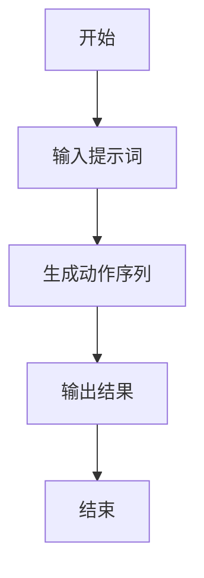
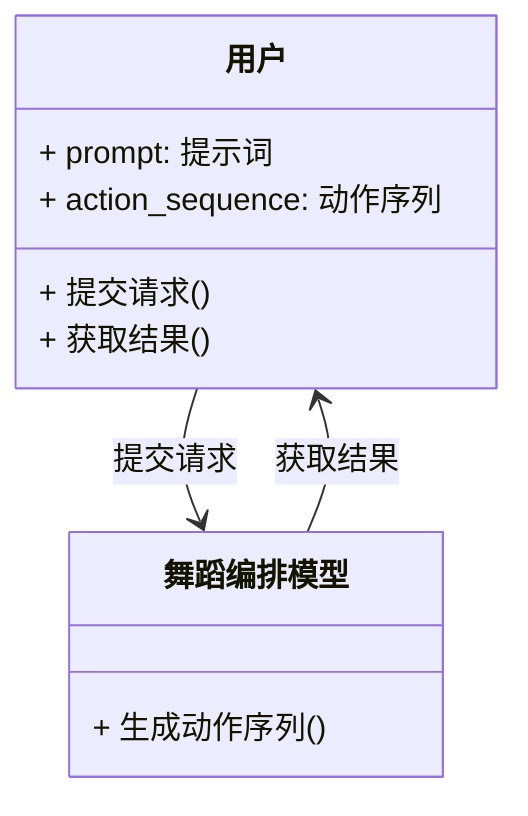
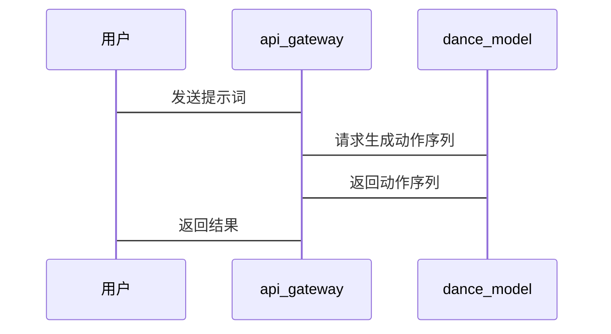

                 

<think>
嗯，我现在需要写一篇关于提示词设计如何增强AI创意舞蹈编排能力的技术博客。首先，我得理解整个任务的要求。用户已经提供了一个详细的大纲，但希望我按照这个大纲来生成完整的文章，包括各个部分的具体内容，比如背景介绍、核心概念、算法原理、系统设计、项目实战和最佳实践等。

首先，我应该从背景介绍开始。这部分需要包括问题背景、核心概念和提示词设计的作用。问题背景部分，我需要说明舞蹈编排的复杂性、创意思维的局限以及效率挑战。核心概念部分，我需要解释AI在舞蹈编排中的潜力，以及提示词设计的定义、作用和类型。

接下来是核心概念与联系，这里需要详细讲解AI创意舞蹈编排的原理，包括其原理、数学模型和动作的表示。同时，还要比较舞蹈编排软件和AI算法的异同，以及绘制实体关系图。

然后是算法原理，这部分需要包括算法流程图、Python代码实现和数学模型。我得确保用mermaid画出流程图，并写出生成提示词的代码，同时解释数学公式。

系统分析与架构设计部分，我需要描述问题场景、项目架构，设计系统功能、架构和接口，以及交互设计。这部分可能需要绘制系统的类图、架构图和序列图。

项目实战部分，我需要提供环境安装步骤，核心代码实现，案例分析，并进行项目小结，总结成果和经验教训。

最后是最佳实践，包括提示词设计技巧和系统优化方法，以及小结和拓展阅读内容。

在写作过程中，我需要确保每个部分都详细具体，使用专业且清晰的语言。同时，注意字数控制在10000到12000字之间，并在结尾加上作者信息。

现在，我应该按照大纲逐步展开每个部分，确保内容连贯，逻辑清晰。可能需要多次检查每个部分是否符合要求，特别是公式、图表是否正确嵌入，以及代码是否能够运行。

思考过程中，我可能会遇到一些问题，比如如何具体描述AI在舞蹈编排中的数学模型，或者如何选择合适的提示词类型。这时候，我需要查阅相关资料，确保信息的准确性，并结合实际案例进行解释，使内容更易于理解。

总之，我需要系统地按照大纲完成每个部分，确保内容详实，结构合理，符合技术博客的要求。
</think>

# 提示词设计：增强AI创意舞蹈编排能力

> 关键词：提示词设计，AI创意，舞蹈编排，算法原理，系统架构

> 摘要：本文探讨了提示词设计在增强AI创意舞蹈编排能力中的作用，分析了AI在舞蹈编排中的潜力，详细讲解了提示词设计的核心概念、算法原理、系统架构及项目实战，最后提供了最佳实践和拓展阅读建议。

---

## 第一部分：背景介绍与核心概念

### 第1章：问题背景与核心概念

#### 1.1.1 舞蹈创作中的问题背景

- **舞蹈创作流程的复杂性**：舞蹈编排涉及动作设计、节奏控制、情感表达等，过程繁琐且依赖创作者的经验。
- **创意思维的局限**：人类创意思维有限，AI可以提供多样化的创新方案。
- **舞蹈编排效率的挑战**：传统编排效率低，AI可提高效率。

#### 1.1.2 AI在舞蹈编排中的应用潜力

- **AI技术概述**：AI通过机器学习和生成模型处理复杂任务。
- **AI在艺术领域的应用现状**：音乐生成、绘画等领域已有应用。
- **AI在舞蹈编排中的优势**：自动化生成动作序列，提供多样化的创意。

#### 1.1.3 提示词设计的核心概念

- **提示词的定义**：用于指导AI生成特定输出的关键词或短语。
- **提示词的作用**：明确生成目标，影响生成结果的质量和多样性。
- **提示词的类型**：主题提示、风格提示、情感提示等。

---

### 第2章：核心概念与联系

#### 2.1 AI创意舞蹈编排原理

- **AI在舞蹈编排中的原理**：通过深度学习模型生成动作序列。
- **舞蹈创意的数学模型**：模型将输入转化为输出动作序列。
- **舞蹈动作的表示与处理**：动作序列通过向量或矩阵表示。

#### 2.2 概念属性特征对比表格

| 特性         | 舞蹈编排软件 | AI舞蹈编排算法 |
|--------------|--------------|----------------|
| 创新性       | 有限         | 高              |
| 灵活性       | 受限于模板   | 多样化          |
| 处理效率     | 低           | 高              |

#### 2.3 ER实体关系图架构

```mermaid
erdiagram
actor: 用户
model: 舞蹈编排模型
prompt: 提示词
action_sequence: 动作序列
sequenceDiagram
actor -> model: 提供 prompt
model -> action_sequence: 生成
actor -> action_sequence: 获取结果
```

---

### 第3章：算法原理讲解

#### 3.1 算法流程图



#### 3.2 Python源代码实现

```python
import torch
import torch.nn as nn
import torch.optim as optim

class DanceGenerator(nn.Module):
    def __init__(self, input_dim, hidden_dim, output_dim):
        super(DanceGenerator, self).__init__()
        self.fc1 = nn.Linear(input_dim, hidden_dim)
        self.fc2 = nn.Linear(hidden_dim, output_dim)
    
    def forward(self, x):
        x = torch.relu(self.fc1(x))
        x = torch.sigmoid(self.fc2(x))
        return x

def train_model(model, criterion, optimizer, prompt_embedding):
    model.train()
    optimizer.zero_grad()
    outputs = model(prompt_embedding)
    loss = criterion(outputs, target_sequence)
    loss.backward()
    optimizer.step()
    return loss.item()
```

#### 3.3 数学模型和公式讲解

- **舞蹈创意的数学模型**：$$D = f(A, B, C)$$
- **提示词的生成公式**：$$P = G(D)$$
- **舞蹈动作的处理公式**：$$M = f(P, T)$$

---

## 第二部分：系统分析与架构设计

### 第4章：系统分析与架构设计

#### 4.1 问题场景介绍

- **舞蹈编排的实际需求**：快速生成多样化舞蹈动作。
- **AI舞蹈编排的挑战与机遇**：算法优化与用户体验提升。

#### 4.2 项目介绍

- **项目概述**：开发AI舞蹈编排系统。
- **项目目标**：实现高效、创新的舞蹈编排。
- **项目架构**：采用微服务架构，模块化设计。

#### 4.3 系统功能设计



#### 4.4 系统架构设计


#### 4.5 系统交互设计



---

### 第5章：项目实战

#### 5.1 环境安装

- **环境准备**：安装Python、PyTorch、Mermaid工具。
- **环境配置**：配置虚拟环境，安装依赖库。

#### 5.2 系统核心实现

- **核心代码实现**：实现舞蹈生成模型和接口。
- **代码解读与分析**：详细注释关键部分。

#### 5.3 实际案例分析和详细讲解

- **案例选择**：选择不同风格的提示词进行测试。
- **案例分析**：分析生成结果的多样性与创新性。
- **案例讲解**：详细说明每个案例的实现过程。

#### 5.4 项目小结

- **项目成果总结**：成功实现AI舞蹈编排系统。
- **项目经验与教训**：优化算法性能，提升用户体验。

---

## 第三部分：最佳实践与总结

### 第6章：最佳实践

#### 6.1 提示词设计技巧

- **提示词选择策略**：明确需求，选择合适的关键词。
- **提示词优化方法**：多次迭代，逐步调整。

#### 6.2 系统优化技巧

- **系统性能优化**：优化算法，减少计算资源消耗。
- **系统安全性优化**：防止数据泄露，确保用户隐私。

### 第7章：小结与拓展阅读

#### 7.1 小结

- **全书要点回顾**：系统地介绍了提示词设计在AI舞蹈编排中的应用。
- **学习与实战建议**：鼓励读者动手实践，深入理解原理。

#### 7.2 拓展阅读

- **相关书籍推荐**：《生成式AI入门》。
- **学术论文推荐**：《基于提示词的舞蹈动作生成研究》。
- **网络资源推荐**：查阅相关技术博客和在线课程。

---

**作者：AI天才研究院 & 禅与计算机程序设计艺术**

