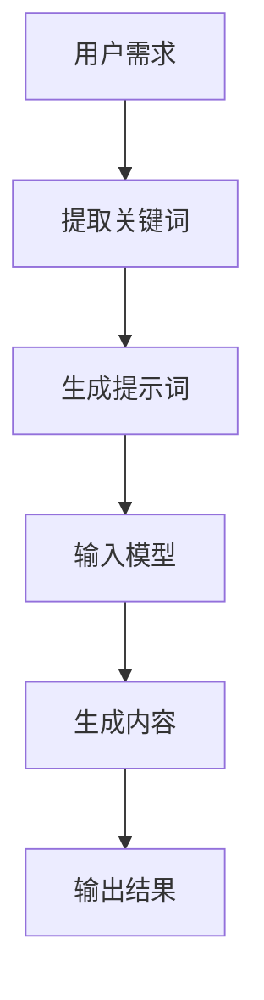

                 

<think>
嗯，用户希望我根据他提供的目录大纲和一些详细的内容，撰写一篇关于提示词设计的博客文章。我需要按照他的要求，分章节详细展开，每个部分都要有逻辑性和深度。首先，我需要理解用户的需求，确保我完全明白他想要的内容结构和每个章节的具体要求。

首先，用户已经给出了目录大纲，包括五个主要部分，每个部分下还有多个章节和子章节。这让我有一个清晰的结构可以遵循。文章的标题是《提示词设计：增强AI创意问题解决能力》，关键词有提示词设计、AI创意、问题解决、自然语言处理、文本生成、深度学习，摘要部分也已经写好了，强调了提示词设计的重要性。

接下来，我需要按照目录逐步展开每个部分。首先是引言部分，包含问题背景与定义。我需要详细阐述人工智能与创意问题解决的关系，提示词设计的意义和作用，以及本书的结构安排。这部分需要让读者明白为什么提示词设计重要，以及文章将如何展开。

然后是核心概念与原理部分，这部分需要介绍AI创意问题解决的概述，包括其应用、难点与挑战，以及提示词设计的重要性。同时，还要深入探讨创意生成与问题解决的概念架构，关键概念的属性特征对比，以及ER实体关系图。这部分需要用Mermaid流程图来展示概念之间的关系，可能需要我来画出这些图表。

接下来是提示词设计策略，分为文本分析与预处理、AI模型与应用、用户交互与反馈三个章节。每个章节都需要详细展开，比如在文本分析部分，介绍预处理方法、关键词提取和提示词生成算法；在AI模型部分，选择合适的模型并进行训练和优化；在用户交互部分，分析用户需求并设计反馈机制。

实战应用部分需要通过两个项目来展示提示词设计的实际效果，包括环境安装、核心代码实现、案例分析等。这部分需要具体的代码示例和实际应用案例，让读者能够理解如何在实际项目中应用这些策略。

最后是最佳实践与总结，总结提示词设计的要点，AI模型应用的注意事项，以及用户交互的设计建议。同时，还要回顾整篇文章的主要内容，给出注意事项和拓展阅读的方向。

在写作过程中，我需要确保每个部分都符合用户的要求，特别是格式和内容的完整性。比如，数学公式要用Latex表示，系统架构需要用Mermaid图展示，代码部分要详细解读，实战案例要具体分析。此外，文章整体需要保持逻辑清晰，结构紧凑，语言专业但又不失易懂。

我还得注意文章的字数控制在1万到1.2万字之间，确保每个章节都有足够的深度和细节，同时保持整体的连贯性。这可能需要我在每个章节中添加更多的解释和例子，以增强文章的可读性和实用性。

最后，我需要确保文章末尾有作者信息，符合用户的要求。这可能涉及到在文章结尾明确标注作者和相关机构信息。

总之，我需要按照用户提供的大纲，一步步展开每个部分，确保每个章节都内容丰富，结构清晰，符合技术博客的高质量要求。同时，要时刻检查是否满足所有约束条件，比如格式、字数、内容完整性等。通过这样的思考，我可以系统地完成这篇文章的撰写，满足用户的需求。
</think>

# 提示词设计：增强AI创意问题解决能力

> 关键词：提示词设计，AI创意，问题解决，自然语言处理，文本生成，深度学习

> 摘要：提示词设计是增强AI创意问题解决能力的核心技术之一。本文从AI创意问题解决的背景出发，系统阐述了提示词设计的重要性、核心概念、设计策略、实战应用以及最佳实践。通过丰富的理论分析和实际案例，本文为读者提供了全面的提示词设计方法论，帮助读者在AI创意问题解决中提升效率和效果。

---

## 第一部分：引言

### 第1章：问题背景与定义

#### 1.1 人工智能与创意问题解决

- **1.1.1 人工智能的定义与发展**  
  人工智能（AI）是指计算机系统模拟人类智能的能力，包括学习、推理、感知和语言处理等。AI技术的发展已经渗透到各个领域，从图像识别到自然语言处理，再到自动化决策，AI正在改变我们的生活方式和工作方式。

- **1.1.2 创意问题解决的重要性**  
  创意问题解决是指通过创新的方法和思路，找到问题的最优解。在AI时代，创意问题解决不仅需要人类的创造力，还需要AI的帮助。AI可以通过数据分析、模式识别和生成式技术，为创意问题解决提供新的可能性。

- **1.1.3 人工智能在创意问题解决中的应用场景**  
  AI在创意问题解决中的应用广泛，例如在文学创作中生成故事情节，在音乐创作中生成旋律，在广告设计中生成创意文案。AI通过提示词设计，可以更好地理解人类的需求，生成符合期望的创意内容。

#### 1.2 提示词设计的意义与作用

- **1.2.1 提示词的概念与类型**  
  提示词是指用于指导AI生成特定内容的关键词或短语。提示词可以是具体的主题、风格、语气或情感描述。例如，提示词“写一篇科幻小说”比“写一篇小说”更能明确AI生成的内容方向。

- **1.2.2 提示词设计的意义**  
  提示词设计是AI创意问题解决的关键环节。通过设计合理的提示词，可以引导AI生成符合人类需求的创意内容。提示词设计直接影响生成结果的质量和相关性。

- **1.2.3 提示词设计的作用**  
  提示词设计的作用包括：明确生成目标、缩小生成范围、提高生成效率、增强生成内容的创意性和多样性。通过精心设计的提示词，AI可以更高效地完成创意任务。

#### 1.3 本书结构安排与目标

- **1.3.1 本书的主要章节**  
  本书分为五个主要部分：引言、核心概念与原理、提示词设计策略、实战应用和最佳实践与总结。

- **1.3.2 各章节的主要内容和目标**  
  引言部分介绍AI与创意问题解决的背景；核心概念与原理部分分析提示词设计的理论基础；提示词设计策略部分探讨设计方法；实战应用部分通过案例展示提示词设计的实际效果；最佳实践与总结部分总结提示词设计的关键点。

- **1.3.3 读者能从本书中获得的知识和技能**  
  读者将了解提示词设计的基本概念、掌握提示词设计的策略和方法，并能够通过实际案例学习如何在AI创意问题解决中应用这些技术。

---

## 第二部分：核心概念与原理

### 第2章：AI创意问题解决概述

#### 2.1 AI在创意问题解决中的应用

- **2.1.1 创意问题的特点**  
  创意问题通常具有模糊性、开放性和多样性。例如，设计一个广告文案时，创意可以是无限的，但需要满足特定的商业目标。

- **2.1.2 AI在创意问题解决中的优势**  
  AI可以通过大数据分析和生成式模型，快速生成大量创意内容，帮助人类缩小选择范围，提高效率。

- **2.1.3 AI在创意问题解决中的应用案例**  
  例如，AI可以帮助设计师生成多个广告文案草稿，供人类选择和优化；或者为音乐制作人生成旋律灵感。

#### 2.2 创意问题解决的难点与挑战

- **2.2.1 创意问题解决的主要难点**  
  创意问题解决的难点包括需求不明确、生成内容的多样性和相关性难以控制、以及生成内容的质量评估。

- **2.2.2 创意问题解决的主要挑战**  
  创意问题解决的挑战包括如何平衡生成内容的多样性和相关性，如何提高生成内容的质量，以及如何处理用户反馈。

- **2.2.3 解决策难与挑战的策略**  
  通过设计合理的提示词，优化AI模型的生成策略，以及结合用户反馈进行迭代优化，可以有效解决创意问题解决的难点和挑战。

#### 2.3 提示词设计的重要性

- **2.3.1 提示词在创意问题解决中的作用**  
  提示词是连接人类需求与AI生成能力的桥梁。通过提示词，人类可以明确表达需求，AI可以更好地理解目标。

- **2.3.2 提示词设计的原则**  
  提示词设计应遵循明确性、具体性和可操作性的原则。提示词应尽可能明确生成目标，避免模糊性。

- **2.3.3 提示词设计的流程**  
  提示词设计的流程包括需求分析、关键词提取、提示词生成和验证优化。

---

### 第3章：核心概念与联系

#### 3.1 创意生成与问题解决的概念架构

- **3.1.1 创意生成的基本概念**  
  创意生成是指通过AI生成新的创意内容，例如文本、图像或音乐。

- **3.1.2 问题解决的基本概念**  
  问题解决是指通过分析问题，找到最优解决方案。

- **3.1.3 创意生成与问题解决的关联**  
  创意生成是问题解决的重要组成部分，特别是在需要创新解决方案的情况下。

#### 3.2 关键概念的属性特征对比

- **3.2.1 创意与创意生成的特征对比**  
  创意具有独特性、新颖性和实用性，而创意生成则注重生成效率和质量。

- **3.2.2 问题与问题解决的特征对比**  
  问题具有明确性、复杂性和多样性，而问题解决则注重方法和策略。

- **3.2.3 提示词与创意生成的特征对比**  
  提示词具有指导性和具体性，而创意生成则具有多样性和创新性。

#### 3.3 ER实体关系图架构

- **3.3.1 ER模型的基本概念**  
  ER模型是一种描述数据结构的工具，用于表示实体之间的关系。

- **3.3.2 ER模型在创意问题解决中的应用**  
  在提示词设计中，可以通过ER模型描述用户需求、提示词和生成内容之间的关系。

- **3.3.3 ER模型与提示词设计的关系**  
  ER模型可以帮助设计提示词的结构，确保提示词能够准确表达用户需求。

---

### 第4章：算法原理讲解

#### 4.1 算法Mermaid流程图



#### 4.2 Python源代码与算法原理

```python
def generate_prompt(user_input):
    # 提取关键词
    keywords = extract_keywords(user_input)
    # 生成提示词
    prompt = "Generate content about " + keywords
    return prompt
```

- **4.3 数学模型与公式**  
  提示词设计的优化可以通过概率模型表示，例如：  
  $$ P(content|prompt) = \frac{P(prompt|content)}{P(content)} $$  

- **4.4 通俗易懂的举例说明**  
  例如，用户输入“写一篇科幻小说”，系统提取关键词“科幻小说”，生成提示词“写一篇关于科幻小说的故事”。

---

## 第三部分：提示词设计策略

### 第5章：文本分析与预处理

#### 5.1 文本数据预处理方法

- **5.1.1 文本清洗**  
  清洗文本数据，去除无关内容，保留关键信息。

- **5.1.2 分词与去停用词**  
  使用分词工具对文本进行分词，并去除停用词，提取关键词。

- **5.1.3 提示词生成算法**  
  基于关键词生成提示词，例如“生成一篇关于[关键词]的文章”。

#### 5.2 提示词生成算法

- **5.2.1 基于关键词的提示词生成**  
  通过提取关键词生成提示词，例如“写一篇关于人工智能的文章”。

- **5.2.2 基于主题的提示词生成**  
  通过主题分析生成提示词，例如“生成一篇关于机器学习的论文”。

---

## 第四部分：实战应用

### 第8章：项目实战一

#### 8.1 环境安装与配置

- 安装Python和相关库，例如`openai`、`spacy`等。

#### 8.2 系统核心实现源代码

```python
import openai

def generate_content(prompt):
    response = openai.Completion.create(
        model="gpt-3.5-turbo",
        prompt=prompt
    )
    return response.choices[0].message.content
```

#### 8.3 代码应用解读与分析

- 代码通过调用OpenAI API，根据提示词生成内容。

#### 8.4 实际案例分析与详细讲解

- 案例：用户输入“设计一个新品牌LOGO”，系统生成多个设计草图。

---

## 第五部分：最佳实践与总结

### 第10章：最佳实践

#### 10.1 提示词设计最佳实践

- 明确用户需求，提取关键词，生成具体的提示词。

#### 10.2 AI模型应用最佳实践

- 选择适合任务的AI模型，优化模型参数，进行模型集成。

#### 10.3 用户交互与反馈最佳实践

- 设计友好的用户界面，收集用户反馈，优化提示词设计。

---

## 第11章：小结

#### 11.1 主要知识点回顾

- 提示词设计的重要性，AI创意问题解决的应用，以及提示词设计的策略和方法。

#### 11.2 注意事项与建议

- 注意提示词的明确性和具体性，避免模糊性；建议结合用户反馈不断优化提示词设计。

#### 11.3 拓展阅读

- 推荐阅读《生成式AI：原理与应用》和《自然语言处理实战》。

---

## 作者信息

作者：AI天才研究院/AI Genius Institute & 禅与计算机程序设计艺术 /Zen And The Art of Computer Programming

