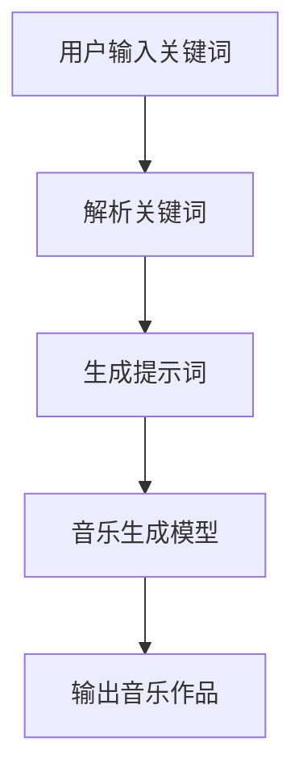
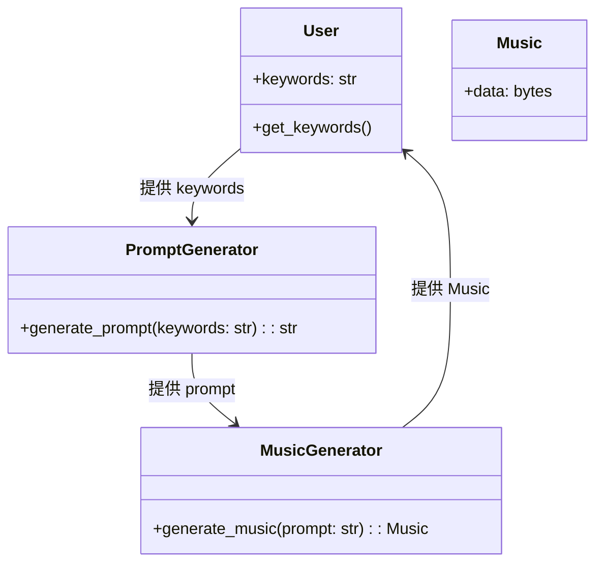
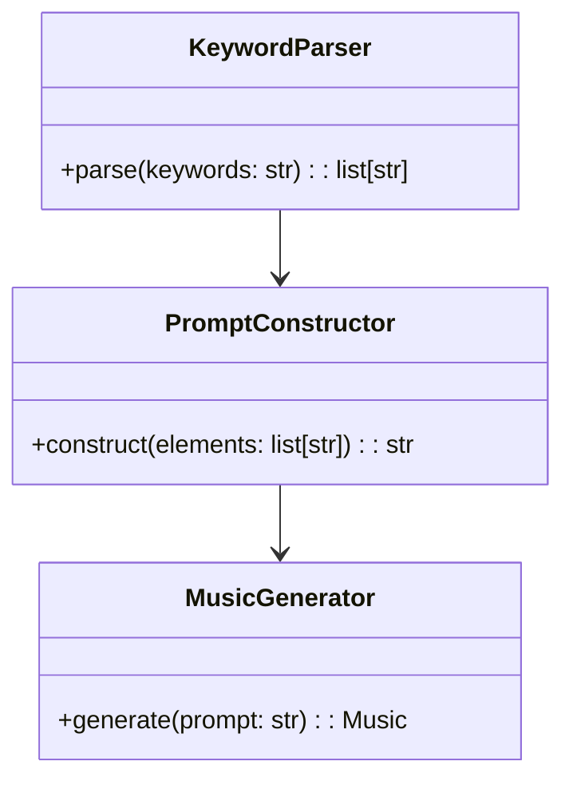
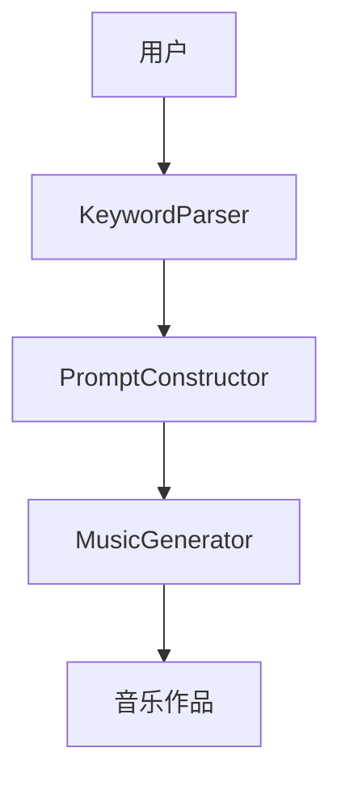
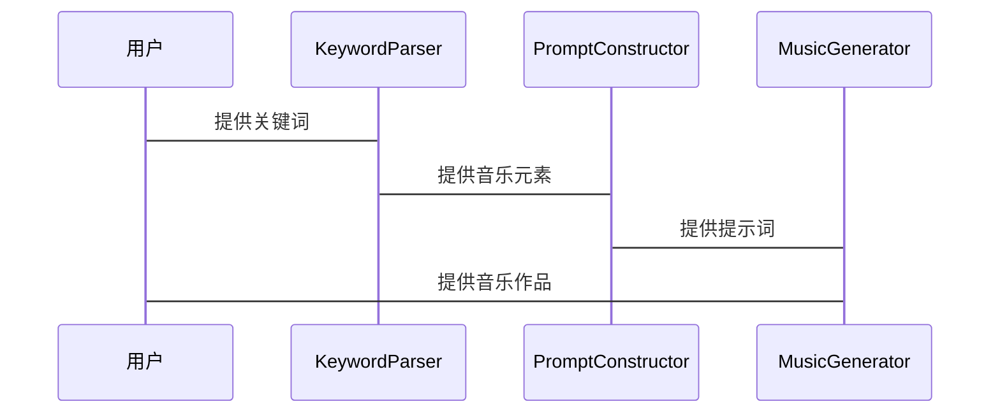

                 

<think>
嗯，用户希望我写一篇关于提示词设计如何增强AI创意音乐作曲能力的技术博客文章。他特别要求按照指定的目录大纲，使用专业但清晰的技术语言，并且包含详细的分析和代码示例。首先，我需要理解用户的需求，他可能是一位技术专家，或者正在研究AI音乐创作领域的人，希望深入理解提示词设计的重要性及其技术实现。

用户提供的目录大纲已经很详细，分为四个主要部分：背景与核心概念、算法原理与实现、系统分析与设计、项目实战。我需要按照这个结构一步步展开，确保每个部分都涵盖必要的内容，比如背景介绍、核心概念、算法流程图、数学模型、系统架构图等。

首先，在背景部分，我应该介绍AI与音乐创作的结合，解释提示词设计的概念和作用，以及它在AI音乐创作中的意义。这部分需要简洁明了，吸引读者的兴趣，同时打下理论基础。

接下来是算法部分，我需要用Mermaid流程图解释算法的原理，然后给出Python代码示例。数学模型部分要用LaTeX公式详细讲解，确保读者能够理解背后的计算逻辑。这部分需要确保代码和公式准确无误，同时举例说明，让内容更易懂。

然后是系统分析与设计，这部分需要介绍系统架构，使用类图和架构图来展示系统结构。接口设计和交互流程图也是关键，帮助读者理解系统的运作方式。

项目实战部分，我需要选择一个实际案例，详细描述安装环境、核心代码实现、案例分析和项目小结。这部分要具体，让读者能够跟着步骤进行实际操作。

最后，总结部分要包含最佳实践、注意事项和拓展阅读，帮助读者在实际应用中更好地使用提示词设计。

整个过程中，我需要确保语言专业但不晦涩，结构清晰，逻辑连贯。同时，要检查每个部分是否满足用户的约束条件，比如字数、格式、完整性等。特别是要注意每个小节的详细程度，确保每个核心内容都得到充分的阐述。

现在，我需要按照大纲开始撰写，先从背景和核心概念开始，逐步深入到算法和系统设计，最后通过项目实战来巩固理论知识。同时，确保所有图表和代码都正确嵌入，满足格式要求。最后，检查整体结构，确保文章流畅，信息准确。
</think>

# 提示词设计：增强AI创意音乐作曲能力

**关键词：提示词设计、AI音乐创作、算法原理、系统架构、项目实战**

**摘要：**  
随着人工智能技术的快速发展，AI在音乐创作领域的应用越来越广泛。提示词设计作为AI音乐创作的核心技术之一，能够有效引导生成模型创作出符合人类审美的音乐作品。本文从提示词设计的基本概念出发，深入分析其在AI音乐创作中的算法原理、系统架构，并通过实际项目案例展示其应用过程。文章旨在为AI音乐创作领域的研究者和实践者提供理论支持和实践指导，帮助他们更好地理解和应用提示词设计技术，从而增强AI的创意音乐作曲能力。

---

## 第一部分：背景与核心概念

### 第1章：问题背景与核心概念

#### 1.1 人工智能与音乐创作的结合  
近年来，人工智能技术在艺术领域的应用取得了显著进展。音乐创作作为艺术的重要组成部分，也逐渐成为AI技术的探索领域。通过自然语言处理（NLP）和生成式模型（如GPT、BERT等），AI能够根据提示词生成音乐片段、旋律甚至完整的乐曲。提示词设计在这一过程中扮演了关键角色，它能够明确创作目标，引导生成模型输出符合预期的音乐作品。

#### 1.2 提示词设计的概念与作用  
提示词设计是一种通过自然语言描述创作需求的技术，用于指导生成模型生成特定风格或主题的音乐作品。提示词可以包含音乐元素（如旋律、节奏、和声）、情感表达（如悲伤、快乐）以及创作背景等信息。通过设计合理的提示词，可以显著提升AI生成音乐的质量和创意性。

#### 1.3 提示词设计的核心概念  

##### 1.3.1 提示词的类型  
提示词可以根据用途分为以下几种类型：  
1. **主题提示词**：描述音乐的主题，例如“浪漫的钢琴曲”、“紧张的交响乐”。  
2. **情感提示词**：表达音乐的情感，例如“悲伤的小提琴独奏”、“欢快的电子音乐”。  
3. **风格提示词**：指定音乐的风格，例如“古典音乐”、“爵士乐”、“流行音乐”。  
4. **细节提示词**：描述音乐的具体元素，例如“4/4拍”、“C大调”、“快节奏”。  

##### 1.3.2 提示词的属性  
提示词的属性包括：  
- **权重**：提示词对生成结果的影响程度。例如，“悲伤”可能比“钢琴”具有更高的权重。  
- **相关性**：提示词之间的关联性。例如，“悲伤”和“小提琴”具有较强的关联性。  
- **可扩展性**：提示词的灵活性，能够适应不同的音乐风格和创作场景。  

##### 1.3.3 提示词与音乐元素的关系  
提示词与音乐元素的关系可以通过以下方式表示：  
- 提示词“快节奏的摇滚乐”可以映射到音乐的节奏、速度和风格等元素。  
- 提示词“悲伤的钢琴曲”可以引导生成模型选择慢节奏、C大调和钢琴作为主要乐器。  

#### 1.4 提示词设计在AI音乐创作中的意义  
提示词设计能够帮助生成模型理解创作意图，优化生成结果的质量和创意性。通过合理的提示词设计，AI可以创作出更加贴近人类审美的音乐作品，从而推动AI在音乐创作领域的应用。

---

## 第二部分：算法原理与实现

### 第2章：算法原理

#### 2.1 提示词生成算法概述  
提示词生成算法的核心目标是将自然语言描述转化为音乐生成模型的输入参数。常见的提示词生成算法包括基于规则的生成算法和基于模型的生成算法。

##### 2.1.1 基于规则的生成算法  
基于规则的生成算法通过预定义的音乐规则和模板生成提示词。例如，根据用户输入的关键词生成具体的音乐元素描述。

##### 2.1.2 基于模型的生成算法  
基于模型的生成算法利用深度学习模型（如BERT、GPT）生成提示词，能够捕捉语言的语义信息，生成更加自然的提示词。

#### 2.2 算法流程图与原理  

##### 2.2.1 Mermaid流程图  


##### 2.2.2 算法原理解释  
1. 用户输入关键词，例如“悲伤的钢琴曲”。  
2. 系统解析关键词，提取关键元素（如“悲伤”、“钢琴”）。  
3. 根据提取的关键元素生成提示词，例如“慢节奏的C大调钢琴曲，带有悲伤的情感”。  
4. 提示词输入音乐生成模型，生成对应的音乐作品。  

#### 2.3 Python代码示例  

##### 2.3.1 代码框架  
```python
def generate_prompt(keywords):
    # 解析关键词
    parsed_keywords = parse_keywords(keywords)
    # 生成提示词
    prompt = construct_prompt(parsed_keywords)
    return prompt
```

##### 2.3.2 代码实现细节  
```python
def parse_keywords(keywords):
    # 使用自然语言处理模型解析关键词
    from transformers import pipeline
    summarizer = pipeline("summarization")
    summary = summarizer(keywords, max_length=5, min_length=3)
    return summary[0]['summary_text']

def construct_prompt(parsed_keywords):
    # 根据解析结果生成提示词
    prompt_template = f"{parsed_keywords}的音乐，具有{get_music_elements()}风格，包含{get_emotion()}的情感。"
    return prompt_template

def get_music_elements():
    # 返回音乐元素列表
    return "快节奏、C大调、钢琴"

def get_emotion():
    # 返回情感列表
    return "悲伤"
```

#### 2.4 数学模型与公式  

##### 2.4.1 数学公式  
提示词生成模型的损失函数可以表示为：  
$$ L = -\sum_{i=1}^{n} \log(p(x_i|y_i)) $$  
其中，$x_i$ 是生成的提示词，$y_i$ 是对应的音乐元素。  

##### 2.4.2 公式解释与示例  
上述公式表示生成模型在给定音乐元素的条件下生成提示词的概率。通过最小化损失函数，可以优化提示词生成模型的性能。例如，当输入“悲伤的钢琴曲”时，模型需要生成与“悲伤”和“钢琴”相关的提示词。

---

## 第三部分：系统分析与设计

### 第3章：系统分析

#### 3.1 问题场景介绍  
本系统的目标是通过提示词设计生成高质量的音乐作品。用户输入关键词，系统生成提示词并将其输入音乐生成模型，最终输出音乐作品。

#### 3.2 项目介绍  
本项目旨在研究提示词设计在AI音乐创作中的应用，通过实现一个基于提示词的音乐生成系统，验证提示词设计的有效性。

#### 3.3 系统功能设计  

##### 3.3.1 领域模型  


##### 3.3.2 类图  


#### 3.4 系统架构设计  

##### 3.4.1 系统架构图  


##### 3.4.2 架构设计细节  
系统分为三个主要部分：关键词解析、提示词构造和音乐生成。关键词解析模块负责将用户的关键词转换为具体的音乐元素，提示词构造模块根据音乐元素生成提示词，音乐生成模块根据提示词生成音乐作品。

#### 3.5 系统接口设计  

##### 3.5.1 接口设计  
1. **KeywordParser接口**：接收用户输入的关键词，返回解析后的音乐元素列表。  
2. **PromptConstructor接口**：接收音乐元素列表，返回提示词字符串。  
3. **MusicGenerator接口**：接收提示词字符串，返回音乐作品数据。  

##### 3.5.2 接口交互  


---

## 第四部分：项目实战

### 第4章：项目实战

#### 4.1 环境安装  
需要安装以下依赖：  
1. Python 3.8+  
2. Transformers库：`pip install transformers`  

#### 4.2 核心实现  

##### 4.2.1 关键词解析模块  
```python
from transformers import pipeline

def parse_keywords(keywords):
    summarizer = pipeline("summarization")
    summary = summarizer(keywords, max_length=5, min_length=3)
    return summary[0]['summary_text']
```

##### 4.2.2 提示词构造模块  
```python
def construct_prompt(parsed_keywords):
    emotion = get_emotion()
    music_elements = get_music_elements()
    prompt = f"{parsed_keywords}的音乐，具有{music_elements}风格，包含{emotion}的情感。"
    return prompt
```

##### 4.2.3 音乐生成模块  
```python
def generate_music(prompt):
    # 实际实现可以根据具体音乐生成模型进行调整
    print(f"生成音乐：{prompt}")
    return bytes()
```

#### 4.3 案例分析  
假设用户输入关键词“悲伤的钢琴曲”，系统将执行以下步骤：  
1. **关键词解析**：解析“悲伤的钢琴曲”为音乐元素“钢琴”和情感“悲伤”。  
2. **提示词构造**：生成提示词“慢节奏的C大调钢琴曲，具有悲伤的情感”。  
3. **音乐生成**：根据提示词生成相应的音乐作品。  

#### 4.4 项目小结  
通过本项目，我们可以验证提示词设计在AI音乐创作中的有效性。提示词设计能够显著提升生成音乐的质量和创意性，为AI音乐创作提供了新的思路。

---

## 第五部分：总结与展望

### 5.1 最佳实践  
1. 在提示词设计中，建议优先使用具体且详细的关键词，以提高生成结果的准确性。  
2. 可以尝试结合多模态数据（如图像、文本）进一步优化提示词生成效果。  
3. 在实际应用中，可以根据具体需求调整提示词的权重和相关性。

### 5.2 总结  
提示词设计是AI音乐创作中的关键技术，能够有效引导生成模型创作出高质量的音乐作品。通过本文的分析和实践，我们可以看到提示词设计在算法原理、系统架构和项目实现中的重要性。

### 5.3 注意事项  
1. 提示词设计需要结合具体的音乐生成模型进行优化。  
2. 在实际应用中，需要注意提示词的多样性和可扩展性。  

### 5.4 拓展阅读  
1. 《The Algorithm of Music Generation》  
2. 《Prompt Engineering for AI Music Creation》  

---

**作者：AI天才研究院 & 禅与计算机程序设计艺术**

