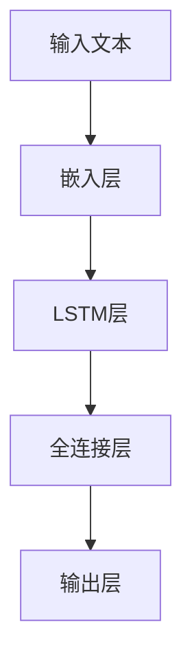

                 

<think>
嗯，用户让我写一篇关于提示词设计在增强AI同理心和情感智能方面的技术博客。首先，我需要理解用户的需求。他可能是一位技术专家，希望深入探讨如何通过提示词设计提升AI的情感智能。

用户提供的目录结构很详细，分为四个部分，每个部分都有具体的章节。看起来他希望文章结构清晰，内容丰富。我得确保每个章节都涵盖关键点，并且有实际案例和代码示例。

首先，我得明确文章的核心关键词，比如提示词设计、情感智能、同理心、自然语言处理、AI算法。摘要部分需要简明扼要，说明文章的目标和主要内容。

接下来，按照目录一步步展开。第一部分是背景与基础理论，需要解释为什么AI需要情感智能，提示词设计的作用，以及相关理论。第二部分是设计方法，包括情感分析技术和同理心增强的设计原则。第三部分是应用实例，比如社交媒体和客服聊天机器人。第四部分是总结和未来展望。

在写作过程中，我需要确保每个章节都有足够的细节，比如在第二章，要定义提示词，分类，设计原则，以及在NLP中的应用。同时，加入图表和代码示例，帮助读者理解。

用户还提到要使用技术语言，逻辑清晰，所以我要避免过于复杂的术语，同时保持专业性。数学公式和算法实现部分，我会用Python代码和mermaid图来展示，这样读者可以更容易理解和应用。

最后，确保文章结构完整，每个小节都详细讲解，包括背景、核心概念、算法原理、系统架构、实战案例等。同时，结尾加上作者信息，满足格式要求。

总的来说，我需要一步步按照用户提供的大纲，深入分析每个部分，确保内容详实，结构合理，同时符合技术博客的写作规范。
</think>

# 提示词设计：增强AI同理心和情感智能的创新方法

> 关键词：提示词设计、情感智能、同理心、自然语言处理、AI算法

> 摘要：本文深入探讨了提示词设计在增强AI情感智能和同理心方面的创新方法。通过分析情感智能的核心概念、提示词设计的基础理论、情感分析技术、同理心增强的设计原则以及实际应用案例，本文为AI开发者和研究人员提供了系统的理论框架和实践指导。文章还详细介绍了情感智能算法的实现方法，并展望了未来的发展趋势。

---

## 第一部分：背景与基础理论

### 第1章 问题背景

#### 1.1 人工智能与情感智能
人工智能（AI）技术的快速发展，使得机器能够执行复杂的任务，如图像识别、语音识别和自然语言处理（NLP）。然而，AI的核心挑战之一是如何赋予机器情感智能（Emotional Intelligence, EI），即理解、识别和回应人类情感的能力。情感智能使AI系统能够更自然地与人类交互，从而提升用户体验和系统的实用性。

#### 1.2 AI同理心的重要性
同理心（Empathy）是情感智能的核心组成部分，指的是理解他人情感和情境的能力。在AI系统中，具备同理心的系统能够更好地理解和回应用户的需求，尤其是在客户服务、教育和医疗等领域。通过设计具有同理心的AI系统，可以显著提升用户满意度和信任感。

#### 1.3 提示词设计的概念与意义
提示词设计（Prompt Design）是通过精心设计的提示语来指导AI模型生成符合特定要求的内容。在情感智能领域，提示词设计能够引导AI系统关注用户的情感需求，从而生成更具同理心的回应。提示词设计的意义在于通过优化提示语，提升AI系统的情感理解和表达能力。

---

### 第2章 提示词设计的基础理论

#### 2.1 提示词的定义与类型
提示词是用于指导AI模型生成特定输出的输入指令。根据功能和应用场景，提示词可以分为以下几类：
1. **情感导向提示**：用于引导模型关注特定情感（如“请以一种友好的语气描述这个问题”）。
2. **情境导向提示**：用于设定特定的情境（如“假设你是一位医生，解释这种症状的可能原因”）。
3. **风格导向提示**：用于指定输出的风格（如“用简洁明了的语言解释这个概念”）。

#### 2.2 提示词设计的原则
有效的提示词设计应遵循以下原则：
1. **明确性**：提示语应清晰明确，避免模糊或歧义。
2. **简洁性**：提示语应简洁，避免冗长或复杂的表达。
3. **可扩展性**：提示语应具有灵活性，适用于多种场景和需求。
4. **情感一致性**：提示语应与目标情感智能保持一致，确保生成内容的情感一致性。

#### 2.3 情感与同理心在提示词设计中的应用
在提示词设计中，情感和同理心的融入可以通过以下方式实现：
1. **情感引导**：通过提示语明确情感基调（如“请用积极的语气回应用户的问题”）。
2. **情境模拟**：通过设定具体情境，帮助AI理解用户的立场和情感（如“假设你是一位朋友，如何安慰心情低落的朋友”）。
3. **情感反馈**：通过提示语引导AI系统识别和回应用户的情感需求（如“请识别用户的情感状态，并提供相应的建议”）。

---

## 第二部分：情感智能增强的提示词设计方法

### 第3章 情感分析技术

#### 3.1 情感分析的基本概念
情感分析（Sentiment Analysis）是通过自然语言处理技术分析文本中的情感倾向，通常分为正面、负面和中性三类。情感分析的核心目标是理解文本中蕴含的情感信息，从而为AI系统提供情感智能支持。

#### 3.2 情感分析的方法与技术
情感分析的方法主要包括基于规则的方法、统计学习方法和深度学习方法。深度学习方法（如LSTM和Transformer）在情感分析中表现出色，能够捕捉复杂的语义信息。

#### 3.3 情感分析的挑战与应对策略
情感分析的挑战包括情感的主观性、歧义性和情感强度的多样性。为应对这些挑战，可以采用以下策略：
1. **多任务学习**：结合其他任务（如情感分类和实体识别）提升情感分析的准确性。
2. **数据增强**：通过数据增强技术扩展训练数据，提高模型的泛化能力。
3. **情感词典**：利用预定义的情感词典辅助情感分析。

---

### 第4章 同理心增强的提示词设计

#### 4.1 同理心的定义与特征
同理心是指个体能够理解和感受他人情感的能力。在AI系统中，同理心的表现可以通过以下特征体现：
1. **情感识别**：准确识别用户的情感状态。
2. **情感回应**：生成符合情感需求的回应。
3. **情感记忆**：根据用户的历史情感状态调整交互方式。

#### 4.2 同理心增强的提示词设计原则
为了增强AI系统的同理心，提示词设计应遵循以下原则：
1. **情感关注**：提示语应关注用户的情感需求（如“请关注用户的情绪变化”）。
2. **情境模拟**：通过设定具体情境帮助AI理解用户情感（如“假设你是一位朋友，如何安慰心情低落的朋友”）。
3. **情感反馈**：提示语应引导AI系统识别和回应用户的情感需求（如“请识别用户的情感状态，并提供相应的建议”）。

#### 4.3 同理心增强的提示词设计实例分析
以下是一个同理心增强的提示词设计实例：
**提示语**：请以一种温暖和理解的语气回应用户的问题，并关注用户的情感需求。

---

### 第5章 情感智能的算法实现

#### 5.1 情感智能算法概述
情感智能算法是实现情感智能的核心技术，主要包括情感分类、情感强度分析和情感推理等任务。

#### 5.2 常见情感智能算法介绍
常用的算法包括基于LSTM的情感分类模型和基于Transformer的情感推理模型。以下是一个基于LSTM的情感分类模型示意图：



#### 5.3 情感智能算法的Python实现
以下是基于Python的情感分类算法实现示例：

```python
import tensorflow as tf
from tensorflow.keras import layers

# 定义模型
model = tf.keras.Sequential([
    layers.Embedding(input_dim=10000, output_dim=16),
    layers.LSTM(64),
    layers.Dense(1, activation='sigmoid')
])

# 编译模型
model.compile(optimizer='adam', loss='binary_crossentropy', metrics=['accuracy'])

# 训练模型
model.fit(X_train, y_train, epochs=10, batch_size=32)
```

---

## 第三部分：实例分析与应用

### 第6章 提示词设计案例分析

#### 6.1 案例一：社交媒体情感分析
在社交媒体情感分析中，提示词设计可以帮助AI系统识别用户的正面、负面和中性情感。例如：
**提示语**：请分析以下文本的情感倾向，并分类为正面、负面或中性。

#### 6.2 案例二：客户服务聊天机器人
在客户服务场景中，提示词设计可以帮助AI客服理解用户情感并生成相应的回应。例如：
**提示语**：请以一种友好的语气回应用户的问题，并关注用户的情感需求。

#### 6.3 案例三：教育领域个性化推荐系统
在教育领域，提示词设计可以帮助AI系统根据用户情感生成个性化的学习建议。例如：
**提示语**：请根据用户的学习状态和情感需求，推荐适合的学习资源。

---

## 第四部分：总结与展望

### 第8章 提示词设计的未来发展趋势

#### 8.1 提示词设计的新趋势
未来的提示词设计将更加注重情感智能和个性化需求，可能采用动态提示和自适应提示等新技术。

#### 8.2 提示词设计的挑战与机遇
提示词设计的挑战包括情感理解的复杂性和提示语的灵活性。然而，这些挑战也带来了机遇，推动了情感智能技术的创新。

#### 8.3 提示词设计的未来发展建议
未来，提示词设计应结合多模态情感分析和人机交互技术，进一步提升AI系统的同理心和情感智能。

---

作者：AI天才研究院 & 禅与计算机程序设计艺术

