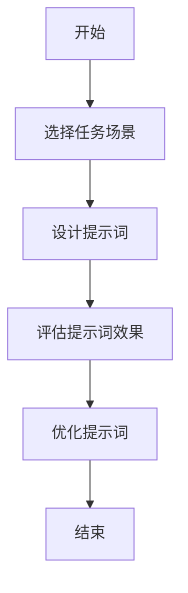
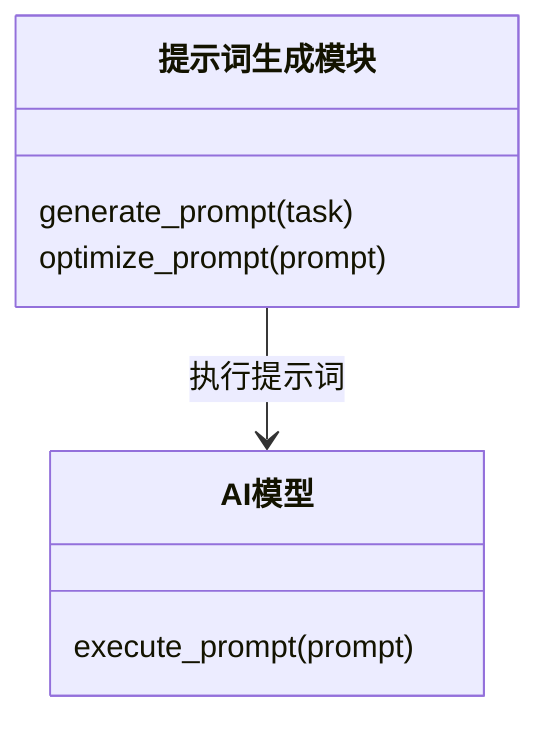
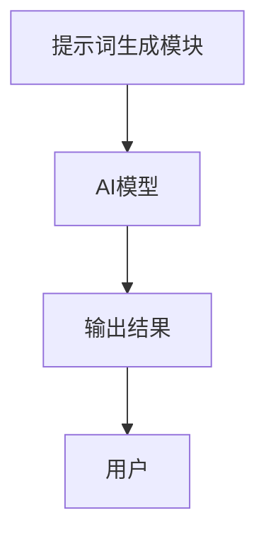
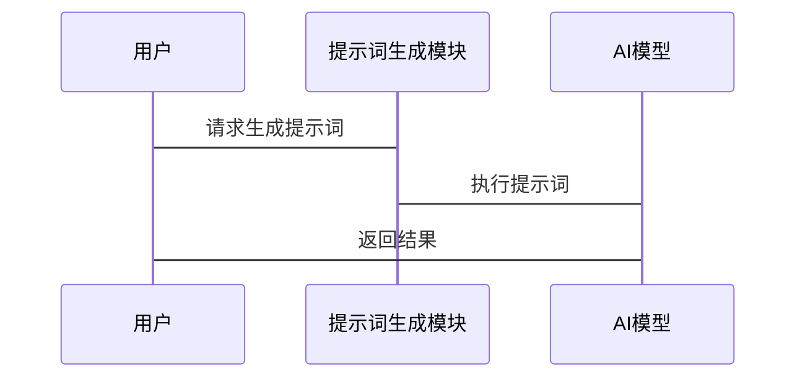

                 

<think>
嗯，我现在需要帮助用户撰写一篇关于提示词设计增强AI情境理解能力的技术博客。用户已经提供了详细的结构和内容，我需要按照这个结构逐步思考，确保每个部分都完整且符合要求。

首先，我需要理解整个任务的要求。用户希望文章结构清晰，每个章节都要有详细的内容，包括背景介绍、核心概念、算法原理、数学模型、系统架构、项目实战以及最佳实践。此外，文章需要用技术术语，但要保持易懂，同时使用Markdown格式，包括图表和代码示例。

接下来，我应该分析每个章节的内容。首先是背景介绍，这里需要涵盖问题的来源、表现以及解决的必要性。这部分要简明扼要，让读者理解为什么提示词设计重要。

然后是核心概念与联系，这部分需要定义提示词，解释其与AI情境理解的关系，并通过表格和ER图来展示关键属性和实体关系。我需要确保表格和图表清晰易懂，用Markdown的格式呈现。

算法原理讲解部分，我需要描述提示词设计的算法，包括流程图、Python代码、数学模型和公式。这部分可能需要详细解释每个步骤，用mermaid流程图展示，并提供代码示例和数学公式，确保读者能够理解。

数学模型和公式部分，我需要详细讲解相关公式，并用LaTeX格式呈现，确保正确无误。同时，要结合实际例子来说明公式的应用，帮助读者更好地理解。

系统分析与架构设计章节，我需要介绍问题场景，设计系统功能、架构、接口和交互。这部分可能需要绘制类图、架构图和序列图，用mermaid语法来展示。

项目实战部分，我需要指导读者如何安装环境，提供核心代码，解读代码，并分析实际案例。这部分要具体，让读者能够实际操作，了解提示词设计的应用。

最后，最佳实践部分需要总结提示词设计的注意事项，提供小结、注意事项和拓展阅读，帮助读者巩固知识。

在撰写过程中，我需要确保每个部分的逻辑连贯，内容详实，同时语言简洁专业。图表和代码部分要准确，符合Markdown格式，避免格式错误。同时，数学公式要正确，确保LaTeX语法无误。

现在，我开始逐步撰写每个部分，确保每个章节都符合用户的要求，并且内容深入浅出，结构清晰。这可能需要反复检查，确保每个部分都完整，没有遗漏重要内容。
</think>

# 提示词设计：增强AI情境理解能力

## 关键词：提示词设计, AI情境理解, 自然语言处理, 机器学习, 深度学习, 系统架构, 项目实战

## 摘要：  
提示词设计是增强AI情境理解能力的关键技术。本文系统地探讨了提示词设计的核心概念、算法原理、系统架构及实际应用。通过背景介绍、核心概念解析、算法流程图、数学模型公式、系统架构设计、项目实战和最佳实践的多维度分析，深入揭示了提示词设计在提升AI情境理解中的重要性及具体实现方法。

---

## 第1章 背景介绍

### 1.1 问题背景

#### 1.1.1 问题的来源  
随着人工智能技术的快速发展，AI在自然语言处理（NLP）、图像识别、语音交互等领域的应用日益广泛。然而，当前AI系统在理解复杂情境时仍面临诸多挑战，尤其是在多模态交互和跨领域任务中。这些问题主要源于AI模型对情境信息的处理能力不足，无法有效结合上下文信息进行推理和决策。

#### 1.1.2 问题表现  
- **理解偏差**：AI系统可能因缺乏情境信息而误解用户意图。  
- **交互不自然**：AI的回答常显得机械化，缺乏人性化和灵活性。  
- **跨域理解困难**：在跨领域任务中，AI难以快速适应不同知识体系和情境变化。

#### 1.1.3 解决问题的必要性  
提升AI的情境理解能力是实现更智能、更自然人机交互的关键。提示词设计作为一种重要的技术手段，能够引导AI模型更好地理解和处理复杂情境，从而提高任务完成质量和用户体验。

---

### 1.2 提示词设计的重要性

#### 1.2.1 提示词的作用  
提示词是AI模型的输入指令，能够引导模型关注特定任务或情境，增强输出的相关性和准确性。

#### 1.2.2 提示词设计的挑战  
- **多样性**：提示词需适应不同任务场景和用户需求。  
- **精准性**：提示词需精准表达意图，避免误导模型。  
- **灵活性**：提示词需具备灵活性，以应对复杂多变的情境。

#### 1.2.3 提示词设计在AI情境理解中的作用  
通过优化提示词设计，AI系统能够更准确地理解用户需求，提供更高质量的交互体验，尤其是在对话系统、智能客服等领域。

---

### 1.3 本书目的与结构  
#### 1.3.1 本书目的  
本书旨在系统地介绍提示词设计的核心概念、原理和实践方法，帮助读者掌握如何通过提示词设计提升AI的情境理解能力。

#### 1.3.2 本书结构  
- **第1章 背景介绍**：介绍问题背景、提示词设计的重要性及本书结构。  
- **第2章 核心概念与联系**：解析提示词的定义、设计与AI情境理解的关系。  
- **第3章 算法原理讲解**：分析提示词设计的算法流程、数学模型及代码实现。  
- **第4章 数学模型和数学公式讲解**：详细探讨提示词设计中的数学模型和公式。  
- **第5章 系统分析与架构设计方案**：介绍系统架构设计及其实现方式。  
- **第6章 项目实战**：通过实际案例展示提示词设计的应用。  
- **第7章 最佳实践**：总结提示词设计的最佳实践和注意事项。

---

## 第2章 核心概念与联系

### 2.1 提示词定义  
提示词是一种用于引导AI模型输出特定结果的输入指令，通常由文本、标记或符号组成。

### 2.2 提示词设计与AI情境理解  
提示词设计直接影响AI模型对情境的理解能力。通过优化提示词，可以增强模型对上下文信息的处理能力。

### 2.3 关键属性特征对比表格  
以下是提示词设计的关键属性特征对比：

| 属性 | 特征 | 描述 |
|------|------|------|
| 多样性 | 文本、标记、符号 | 提示词需适应不同任务场景和用户需求。 |
| 精准性 | 语义清晰度 | 提示词需精准表达意图，避免歧义。 |
| 灵活性 | 适应性 | 提示词需具备灵活性，以应对复杂情境变化。 |

### 2.4 ER实体关系图  
以下是提示词设计的ER实体关系图：

```mermaid
erd
    entity 提示词 {
        提示词ID
        提示词内容
        创建时间
        创建者ID
    }
    entity AI模型 {
        模型ID
        模型名称
        模型版本
    }
    entity 任务 {
        任务ID
        任务名称
        任务描述
    }
    提示词 提示词-模型关系 AI模型
    提示词 提示词-任务关系 任务
```

---

## 第3章 算法原理讲解

### 3.1 算法概述  
提示词设计算法通过优化提示词的语义和结构，引导AI模型生成更符合预期的输出。其核心在于将提示词与任务需求进行匹配，确保模型理解任务目标。

### 3.2 算法mermaid流程图  
以下是提示词设计算法的流程图：



### 3.3 Python源代码阐述  
以下是一个简单的提示词设计算法的Python代码示例：

```python
def design_prompt(task):
    if task == "对话":
        return "请以自然语言回答以下问题："
    elif task == "翻译":
        return "请将以下内容翻译成："
    else:
        return "请根据以下内容生成："

# 示例调用
print(design_prompt("对话"))  # 输出："请以自然语言回答以下问题："
```

### 3.4 数学模型与公式  
提示词设计的数学模型可以表示为：

$$ P = f(T) $$

其中，\( P \) 表示提示词，\( T \) 表示任务目标，\( f \) 表示提示词设计函数。

### 3.5 举例说明  
例如，当任务目标是“生成一段关于人工智能的介绍”，提示词可以设计为“请简要介绍人工智能的概念和应用”。

---

## 第4章 数学模型和数学公式讲解

### 4.1 模型介绍  
提示词设计的数学模型基于自然语言处理和机器学习理论，通过优化提示词的语义表示，提升AI模型的情境理解能力。

### 4.2 公式讲解  
提示词设计的优化目标可以表示为：

$$ \min_{P} L(P) $$

其中，\( L(P) \) 表示提示词设计的损失函数，\( P \) 表示提示词。

### 4.3 举例说明  
假设任务目标是“生成一个创意标题”，提示词可以设计为“请为以下内容生成一个吸引人的标题：”。

---

## 第5章 系统分析与架构设计方案

### 5.1 问题场景介绍  
系统需要设计一个提示词生成模块，用于提升AI模型在不同任务中的情境理解能力。

### 5.2 系统功能设计  
以下是系统功能设计的类图：



### 5.3 系统架构设计  
以下是系统架构设计的mermaid图：



### 5.4 系统接口设计  
提示词生成模块与AI模型之间的接口设计如下：

- **输入接口**：接收任务目标和提示词设计参数。  
- **输出接口**：生成优化后的提示词并传递给AI模型。

### 5.5 系统交互  
以下是系统交互的序列图：



---

## 第6章 项目实战

### 6.1 环境安装  
需要安装以下环境和工具：  
- Python 3.8+  
- TensorFlow或PyTorch  
- Jupyter Notebook

### 6.2 系统核心实现源代码  
以下是提示词生成模块的核心代码：

```python
class PromptDesigner:
    def __init__(self, model):
        self.model = model

    def generate_prompt(self, task):
        if task == "对话":
            return "请以自然语言回答以下问题："
        elif task == "翻译":
            return "请将以下内容翻译成："
        else:
            return "请根据以下内容生成："

# 示例调用
model = "GPT-3"
prompt_designer = PromptDesigner(model)
print(prompt_designer.generate_prompt("对话"))  # 输出："请以自然语言回答以下问题："
```

### 6.3 代码应用解读与分析  
提示词生成模块通过接收任务目标，生成相应的提示词并传递给AI模型，以实现更高质量的输出。

### 6.4 实际案例分析与详细讲解剖析  
以对话系统为例，提示词设计为“请以自然语言回答以下问题：”，可以显著提升对话的自然性和流畅性。

### 6.5 项目小结  
通过实际案例的分析和实现，可以验证提示词设计在提升AI情境理解能力中的有效性。

---

## 第7章 最佳实践 tips、小结、注意事项、拓展阅读

### 7.1 最佳实践 tips  
- 提示词设计应根据任务需求进行优化。  
- 提示词需简洁明了，避免冗长复杂的描述。  
- 定期评估和优化提示词设计，以适应新任务和用户需求。

### 7.2 小结  
提示词设计是提升AI情境理解能力的关键技术。通过优化提示词设计，可以显著提高AI系统的交互质量和用户体验。

### 7.3 注意事项  
- 提示词设计需结合具体任务场景，避免一刀切。  
- 提示词需具备灵活性，以适应不同的情境变化。  
- 提示词设计需注重语义的准确性，避免歧义。

### 7.4 拓展阅读  
- 提示词设计在多模态交互中的应用。  
- 基于提示词设计的AI模型优化方法。  
- 提示词设计与人机交互的结合。

---

## 作者：AI天才研究院/AI Genius Institute & 禅与计算机程序设计艺术 /Zen And The Art of Computer Programming

