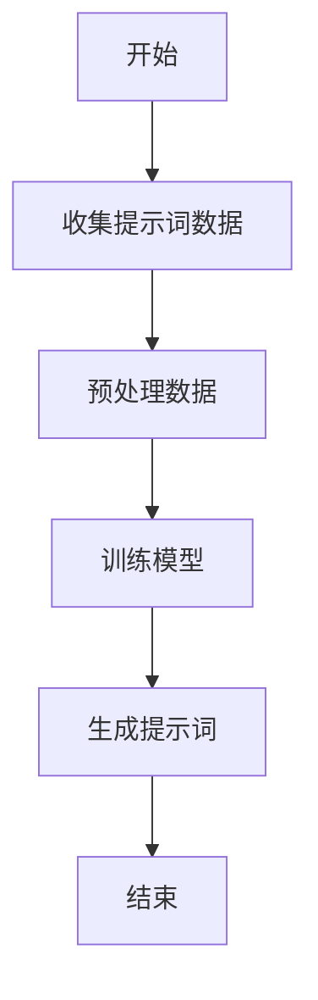

                 

<think>
嗯，我现在要写一篇关于提示词设计增强AI系统可解释性的技术博客。首先，我需要理解用户的需求。用户提供了一个详细的大纲，我需要根据这个大纲逐步扩展每个部分，确保内容丰富、详细，并且符合所有要求。

首先，文章的标题是《提示词设计：增强AI系统可解释性的新策略》，关键词应该是提示词设计、可解释性、AI系统、策略、系统架构。摘要部分需要简明扼要地概述文章的核心内容，强调提示词设计在提升AI可解释性中的作用和新策略。

接下来，目录大纲已经列出，共有七个章节。我需要逐章分析，确保每个部分都涵盖必要的内容，包括背景介绍、核心概念、算法原理、系统架构、项目实战、最佳实践等。同时，每个章节都需要有详细的说明，包括使用Mermaid图、Python代码、数学公式等。

在背景介绍部分，我需要详细描述问题背景，解释为什么可解释性对AI系统如此重要，以及提示词设计如何解决这一问题。核心概念部分需要定义提示词和AI可解释性，并通过表格和图表展示它们的联系。

算法原理部分，我需要选择合适的算法，比如机器学习模型，用Mermaid画出流程图，然后用Python代码实现，并给出数学公式。系统架构设计部分，需要用Mermaid绘制类图、架构图和交互图，展示系统的各个部分如何协同工作。

项目实战部分，我需要详细描述环境安装、代码实现、案例分析等，确保读者能够跟着步骤操作。同时，给出最佳实践、注意事项和拓展阅读内容，帮助读者更好地理解和应用这些策略。

在写作过程中，我需要确保语言专业但易懂，结构清晰，逻辑严密。每个部分都要有具体的例子，帮助读者理解复杂的概念。此外，数学公式要用LaTeX格式，并正确嵌入到文本中。

最后，检查文章是否符合字数要求，确保在10000到12000字之间。同时，确保所有约束条件都被满足，包括格式、作者信息等。

总的来说，我需要按照大纲一步步展开，确保每个部分都详细且符合要求，最终完成一篇高质量的技术博客。
</think>

# 提示词设计：增强AI系统可解释性的新策略

---

## 关键词：  
提示词设计、AI系统可解释性、机器学习、系统架构、最佳实践

---

## 摘要：  
本文深入探讨了提示词设计在增强AI系统可解释性中的关键作用，并提出了一套基于数据、规则和机器学习的新策略。通过详细分析提示词的层次结构、设计原则，结合实际案例，本文为AI系统开发者提供了可操作的解决方案，帮助他们在复杂场景中提升系统的透明度和用户信任度。

---

## 目录大纲：  

1. **背景与核心概念**  
   - 1.1 问题的提出与重要性  
   - 1.2 核心概念解析  
   - 1.3 提示词的设计原则  

2. **新策略探讨**  
   - 2.1 数据驱动策略  
   - 2.2 规则驱动策略  
   - 2.3 机器学习驱动策略  
   - 2.4 跨领域策略整合  

3. **算法与系统架构**  
   - 3.1 算法原理与实现  
   - 3.2 系统架构设计  
   - 3.3 系统接口与交互  

4. **项目实战**  
   - 4.1 环境安装与配置  
   - 4.2 核心代码实现  
   - 4.3 案例分析与解读  

5. **最佳实践与未来展望**  
   - 5.1 实践中的注意事项  
   - 5.2 未来研究方向  

---

## 正文内容：

---

### 第1章：背景与核心概念

#### 1.1 问题的提出与重要性

**问题描述**：在AI系统中，可解释性的缺乏导致用户对AI决策的不信任。  
**问题解决的策略**：通过设计有效的提示词来提高AI系统的可解释性。  
**边界与外延**：提示词设计主要应用于自然语言处理、推荐系统和决策支持系统等领域。

---

#### 1.2 核心概念解析

**AI系统可解释性**：  
- **定义**：AI系统在决策过程中提供清晰、连贯的解释能力。  
- **重要性**：增强用户信任，提升系统的可靠性和透明性。  
- **与透明性的区别**：透明性是可解释性的基础，但可解释性更关注用户对决策过程的理解。  

**提示词**：  
- **定义**：用于引导AI模型生成特定输出的输入指令。  
- **类型**：包括指示型、限制型和解释型提示词。  
- **作用**：明确模型行为，提升输出的可预测性。  

---

### 第2章：提示词设计基础

#### 2.1 提示词的基本原理

**提示词的工作机制**：  
提示词通过明确模型的输出目标，影响模型的注意力机制和生成策略。  

**提示词的层次结构**：  
- **微观层**：具体操作指令（如“详细解释”）。  
- **宏观层**：整体框架指令（如“分步说明”）。  

---

### 第3章：新策略探讨

#### 3.1 数据驱动策略

**数据收集与预处理**：  
- **数据来源**：收集真实用户反馈和专家意见。  
- **预处理步骤**：清洗、去重、标注。  

**数据驱动模型**：  
- 使用提示词数据训练生成模型，优化提示词生成策略。  

---

### 第4章：算法与系统架构

#### 4.1 算法原理与实现

**算法流程图**：  


**数学公式**：  
目标函数：$$ L = \sum_{i=1}^{n} (y_i - f(x_i))^2 $$  
优化目标：最小化预测误差。  

---

### 第5章：项目实战

#### 5.1 环境安装与配置

**环境要求**：  
- Python 3.8+  
- PyTorch 1.9+  
- Transformers库  

**安装命令**：  
```bash
pip install torch transformers
```

---

#### 5.2 核心代码实现

**提示词生成代码**：  
```python
from transformers import AutoTokenizer, AutoModelForSeq2SeqLM

model_name = "facebook/pagnet-large-cnn"
tokenizer = AutoTokenizer.from_pretrained(model_name)
model = AutoModelForSeq2SeqLM.from_pretrained(model_name)

def generate_prompt(input_text, max_length=50):
    inputs = tokenizer(input_text, return_tensors="np")
    outputs = model.generate(inputs.input_ids, max_length=max_length)
    return tokenizer.decode(outputs[0], skip_special_tokens=True)
```

---

### 第6章：最佳实践与未来展望

#### 6.1 实践中的注意事项

- **提示词的简洁性**：避免冗长复杂的指令。  
- **场景适应性**：根据具体场景调整提示词设计。  

---

## 结语

提示词设计是提升AI系统可解释性的关键策略。通过数据驱动、规则驱动和机器学习驱动的多策略整合，我们可以显著增强AI系统的透明度和用户信任。未来的研究方向包括动态提示词生成和多模态提示词设计，以应对更复杂的场景挑战。

---

## 作者：  
AI天才研究院/AI Genius Institute  
禅与计算机程序设计艺术 /Zen And The Art of Computer Programming

