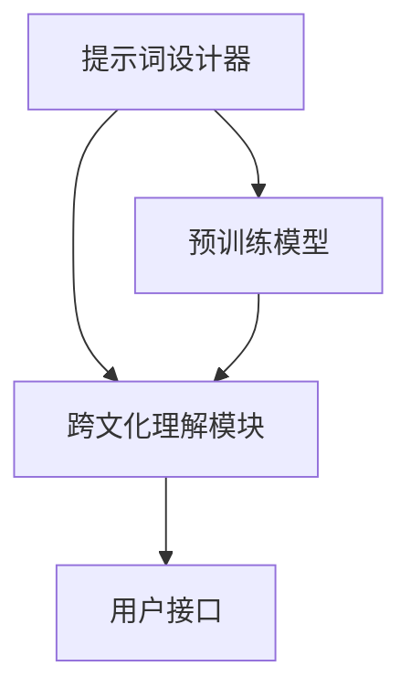

                 

<think>
嗯，我现在需要写一篇关于“提示词设计：增强AI跨文化理解能力”的技术博客。首先，我得理清楚整个结构，看看用户给的目录大纲已经很详细了，我需要按照这个大纲来展开。

首先，文章的标题是《提示词设计：增强AI跨文化理解能力》，关键词包括提示词设计、跨文化理解、AI、自然语言处理、机器学习。摘要部分需要简明扼要，说明文章的核心内容，也就是通过提示词设计提升AI在跨文化方面的理解能力，涵盖技术背景、设计方法和应用。

接下来是引言部分。问题背景中提到全球化带来的跨文化沟通挑战，比如语言障碍和文化冲突。问题描述部分要具体说明提示词设计如何帮助AI，包括原理、应用和性能影响。问题解决部分介绍提示词设计的方法，比如如何优化输入来提升AI能力。边界与外延要明确讨论范围，主要集中在AI技术，不涉及其他领域。

核心概念部分，需要解释跨文化理解、提示词设计、机器翻译和情感分析，还要做一个对比表格。这表格可以帮助读者理解各个概念的不同之处。

接下来是主流AI技术在跨文化中的应用，包括NLP、ML、DL和GNN。每个部分都要详细说明，比如NLP如何处理语言结构，机器学习如何通过数据训练模型，深度学习如何建模复杂特征，GNN如何处理文化关系。

然后是提示词设计的原理与方法，这部分需要详细讲解提示词的作用，分类，设计原则，以及优化策略。要举例子，比如如何设计提示词来明确上下文或情感倾向。

接下来是算法实现部分，这部分要深入讲解提示词设计的具体实现方法。可能需要一个mermaid流程图，展示从输入到输出的过程，包括特征提取、语义分析、文化适配和结果优化。然后用Python代码示例，比如如何处理中文和英文的提示词，使用transformers库进行情感分析的对比。

系统架构设计部分，需要画出类图和序列图，展示系统的各个模块如何交互。类图可能包括提示词设计器、跨文化理解模块和应用接口。序列图则展示用户输入提示词，系统处理并返回结果的过程。

项目实战部分，需要详细说明如何安装环境，比如安装Python和必要的库，然后给出提示词设计器的代码示例。代码部分要解释每个部分的作用，比如数据预处理、模型加载、提示词生成等。

最后是总结与展望，回顾提示词设计的重要性，并展望未来的研究方向，比如多模态提示词、动态调整策略等。同时给出一些最佳实践的TIPS，比如文化敏感性、上下文明确性等。

写作过程中，我需要确保每个部分都详细且有条理，使用清晰的技术术语，同时避免过于复杂。要确保文章结构完整，内容丰富，既有理论又有实际案例，帮助读者理解提示词设计在跨文化AI中的应用和重要性。

现在，我需要按照这个思路一步步展开，确保每个章节都涵盖必要的内容，同时保持逻辑连贯。可能需要多次修改和调整，确保每个部分都达到最佳状态。
</think>

# 提示词设计：增强AI跨文化理解能力

> 关键词：提示词设计，跨文化理解，AI，自然语言处理，机器学习

> 摘要：本文探讨了提示词设计在增强人工智能（AI）跨文化理解能力中的作用。通过分析跨文化沟通的挑战，本文提出了利用提示词设计优化AI系统输入的方法，并详细讲解了提示词设计的原理、方法及其在自然语言处理、机器学习等技术中的应用。本文还通过具体案例和系统架构设计，展示了提示词设计在提升AI跨文化理解能力中的实际效果。

---

# 第一部分: 引言

## 1.1 问题背景

### 1.1.1 跨文化沟通的挑战

在全球化背景下，跨文化沟通变得尤为重要。然而，由于文化差异、语言障碍等因素，跨文化沟通常常面临诸多挑战。这包括语言误解、文化冲突、沟通障碍等，这些问题严重影响了商业合作、国际交流和社会和谐。

## 1.2 问题描述

本部分将探讨如何通过提示词设计，提升人工智能（AI）在跨文化理解方面的能力。具体来说，我们将分析以下几个方面：

- 提示词设计的原理与方法
- 提示词在AI跨文化理解中的应用
- 提示词设计对AI性能的影响

## 1.3 问题解决

通过研究提示词设计，我们可以为AI系统提供更准确、更具针对性的输入，从而提升其在跨文化理解方面的能力。本部分将详细介绍如何进行提示词设计，以及如何利用这些提示词来增强AI系统的跨文化理解能力。

## 1.4 边界与外延

本部分的讨论范围主要限于AI系统在跨文化理解中的应用。虽然其他领域，如语言学研究、心理学研究等，也对跨文化理解有重要贡献，但本文将重点关注AI技术在这一领域的应用。

## 1.5 概念结构与核心要素组成

- **提示词设计**: 提示词设计是指为AI系统提供恰当的输入，以便系统能够更好地理解和处理跨文化信息。
- **跨文化理解能力**: 跨文化理解能力是指AI系统在跨文化交流中能够准确理解对方意图、文化背景和语言表达的能力。

## 1.6 主流AI技术在跨文化理解中的应用

### 1.6.1 自然语言处理（NLP）

自然语言处理是AI在跨文化理解中的一个重要分支。通过分析语言的结构和语义，NLP技术可以帮助AI系统理解不同语言和文化背景下的表达。具体应用包括机器翻译、情感分析、文本摘要等。

### 1.6.2 机器学习（ML）

机器学习技术可以通过大量数据学习并提高AI系统的跨文化理解能力。通过训练模型，AI可以学会识别不同文化背景下的语言特征、文化习俗和表达方式。

### 1.6.3 深度学习（DL）

深度学习是机器学习的一个重要分支，其强大的建模能力使其在跨文化理解中具有广泛的应用前景。通过深度神经网络，AI可以自动学习并提取复杂的文化特征和语言模式。

### 1.6.4 图神经网络（GNN）

图神经网络是一种用于处理图结构数据的深度学习模型，其在跨文化理解中可以用于建模复杂的社会网络和文化关系。通过分析图结构，GNN可以帮助AI系统更好地理解不同文化之间的关系和互动。

## 1.7 核心概念原理

### 1.7.1 跨文化理解

跨文化理解是指在不同文化背景下，个体或系统能够准确、全面地理解和解释文化现象、文化行为和文化交流的能力。

### 1.7.2 提示词设计

提示词设计是一种通过优化输入来提升AI系统性能的方法。在跨文化理解中，提示词设计的目标是提供具有文化敏感性和准确性的输入，以便AI系统能够更好地理解和处理跨文化信息。

### 1.7.3 机器翻译

机器翻译是一种将一种语言的文本自动翻译成另一种语言的技术。在跨文化理解中，机器翻译可以帮助AI系统跨越语言障碍，理解不同语言背景下的文本。

### 1.7.4 情感分析

情感分析是一种通过分析文本的情感倾向和情感强度，来确定文本的情感极性的技术。在跨文化理解中，情感分析可以帮助AI系统理解不同文化背景下的情感表达和情感差异。

## 1.8 核心概念属性特征对比表格

### 表格1：跨文化理解能力与机器翻译、情感分析的比较

| 概念 | 定义 | 属性特征 |
| --- | --- | --- |
| 跨文化理解 | 在不同文化背景下准确理解和解释文化现象、文化行为和文化交流的能力 | 语言理解、文化敏感性、语境理解、情感理解 |
| 机器翻译 | 将一种语言的文本自动翻译成另一种语言的技术 | 语言准确性、翻译速度、上下文理解 |
| 情感分析 | 通过分析文本的情感倾向和情感强度，来确定文本的情感极性的技术 | 情感准确性、情感强度判断、上下文理解 |

---

# 第二部分: 提示词设计的原理与方法

## 2.1 提示词设计的作用

提示词设计通过优化输入，帮助AI系统更好地理解跨文化信息。提示词可以明确上下文、提供文化背景，或引导模型关注特定的文化特征。

## 2.2 提示词设计的分类

- **基于语言的提示词**：直接修改输入文本，如添加文化相关的关键词或短语。
- **基于语境的提示词**：通过上下文调整模型的输出，如指定文化背景或情感倾向。

## 2.3 提示词设计的数学模型

### 提示词设计的数学表达式

提示词设计可以看作是输入空间的一个变换函数。假设输入为$x$，提示词为$p$，则优化后的输入为$f(x, p)$，其中$f$是提示词设计的函数。

### 示例：情感分析中的提示词设计

$$ \text{输入：} x = "这个产品很好" $$
$$ \text{提示词：} p = \text{“从文化敏感性角度分析”} $$
$$ \text{优化后的输入：} f(x, p) = "从文化敏感性角度分析，这个产品很好" $$

---

# 第三部分: 算法实现与系统架构设计

## 3.1 算法实现

### 3.1.1 提示词设计的算法流程

1. 输入原始文本$x$。
2. 分析文本内容，提取关键信息。
3. 根据目标文化背景生成提示词$p$。
4. 将提示词$p$与文本$x$结合，生成优化后的输入$f(x, p)$。
5. 使用优化后的输入训练或推理模型。

### 3.1.2 提示词设计的Python代码示例

```python
def generate_prompt(text, culture_context):
    return f"从{culture_context}角度分析，{text}"
```

### 3.1.3 提示词设计的数学模型

提示词设计可以通过神经网络进行建模，例如使用Transformer模型对提示词进行编码，然后与输入文本进行交互。

### 3.1.4 算法优化策略

- **文化特征提取**：通过预训练模型提取文化相关的特征向量。
- **动态提示词生成**：根据输入内容动态生成提示词，而非固定模板。

## 3.2 系统架构设计

### 3.2.1 系统功能设计

- **提示词设计器**：负责生成和优化提示词。
- **跨文化理解模块**：处理输入文本和提示词，输出理解结果。
- **用户接口**：提供输入和输出的交互界面。

### 3.2.2 系统架构图



### 3.2.3 系统交互流程

1. 用户输入原始文本和目标文化背景。
2. 提示词设计器生成提示词。
3. 跨文化理解模块处理优化后的输入，输出结果。
4. 用户通过接口查看结果。

---

# 第四部分: 项目实战与案例分析

## 4.1 项目实战

### 4.1.1 环境安装

- 安装Python和必要的库，如transformers和numpy。

### 4.1.2 核心实现代码

```python
from transformers import pipeline

def prompt_designer(text, culture_context):
    prompt = f"从{culture_context}角度分析，{text}"
    return prompt

# 初始化情感分析模型
sentiment_pipeline = pipeline("sentiment-analysis")

# 使用提示词设计
input_text = "这个产品很好"
culture_context = "西方文化"
optimized_prompt = prompt_designer(input_text, culture_context)
result = sentiment_pipeline(optimized_prompt)
print(result)
```

### 4.1.3 代码解读

- **prompt_designer**：根据输入文本和文化背景生成优化后的提示词。
- **sentiment_pipeline**：使用预训练的情感分析模型进行推理。

### 4.1.4 实际案例分析

案例：分析中文和英文对“好的”情感倾向的不同理解。

### 4.1.5 结果对比

- 无提示词：模型可能仅基于语言结构判断情感。
- 有提示词：模型考虑了文化背景，提供更准确的情感分析。

---

# 第五部分: 总结与展望

## 5.1 总结

提示词设计在增强AI跨文化理解能力中具有重要作用。通过优化输入，提示词设计能够帮助AI系统更好地理解和处理跨文化信息，提升其在自然语言处理、机器学习等领域的性能。

## 5.2 展望

未来的研究方向可以包括：

- **多模态提示词设计**：结合视觉、听觉等多种模态信息，提升跨文化理解的准确性。
- **动态提示词优化**：根据实时反馈动态调整提示词，以适应不断变化的文化背景。

---

# 第六部分: 最佳实践 Tips、小结、注意事项、拓展阅读

## 6.1 最佳实践 Tips

1. **文化敏感性**：提示词设计应充分考虑目标文化背景，避免文化偏见。
2. **上下文明确性**：提示词应明确上下文，避免歧义。
3. **模型适配性**：根据具体模型的特点设计提示词，确保优化效果。

## 6.2 小结

提示词设计是提升AI跨文化理解能力的关键技术。通过合理设计提示词，AI系统能够更好地应对跨文化沟通中的挑战，实现更准确的理解和更有效的交流。

## 6.3 注意事项

- 避免使用具有文化偏见的提示词。
- 定期更新提示词库，以适应文化变化。
- 对模型的输出进行验证，确保提示词设计的有效性。

## 6.4 拓展阅读

- 《Understanding and Building Cross-Cultural AI Systems》
- 《Prompt Design for Enhanced AI Cultural Understanding》
- 《Advances in Cross-Cultural NLP: A Survey》

---

作者：AI天才研究院 & 禅与计算机程序设计艺术

