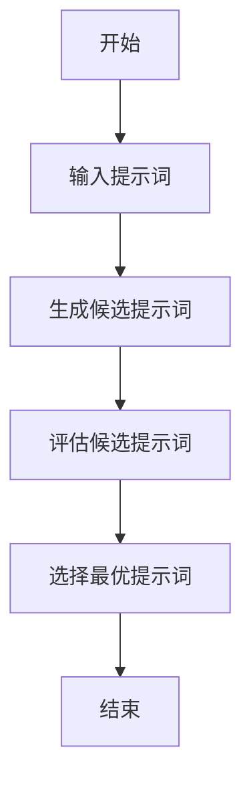

                 

<think>
嗯，我现在要写一篇关于“提示词设计：平衡AI创新与伦理约束的新策略”的技术博客。首先，我得理清楚这个主题的核心是什么。提示词设计在AI中起着关键作用，因为它直接影响AI的行为和输出。但同时，AI的发展需要在创新和伦理之间找到平衡点，这对提示词设计提出了更高的要求。

我需要从背景开始，解释为什么这个话题重要。AI技术飞速发展，但也带来了伦理问题，比如偏见、隐私泄露等。提示词设计如何在这两者之间找到平衡点呢？这部分我需要详细阐述。

接下来，我得讨论AI创新和伦理约束的基本概念，包括它们各自的定义、原则以及它们如何在AI领域中相互作用。可能举个案例，比如社交媒体上的AI推荐系统，说明如何设计提示词以避免伦理问题。

然后，重点放在提示词设计的原则上。我需要列出几个关键原则，比如透明性、可解释性、包容性等，并详细解释每个原则的重要性。可能还需要用表格对比不同的设计原则，帮助读者更好地理解。

算法部分，我得介绍提示词设计的算法基础，可能涉及生成模型如GPT，解释如何通过提示词调整模型输出。用mermaid流程图展示算法步骤，然后用Python代码示例，比如如何编写提示词生成函数。数学模型方面，可能需要解释损失函数和优化目标，用latex公式展示。

在系统架构部分，我需要设计一个提示词管理系统，包括用户界面、提示词生成模块、模型调用模块和评估模块。用mermaid架构图展示各模块之间的关系。接口设计方面，可能需要RESTful API，详细说明输入输出格式。

最后，应用实践部分，我得具体实现一个案例，比如设计一个提示词管理系统。包括环境安装、核心代码实现，比如提示词生成函数和模型调用接口。然后分析实际案例，看看如何优化提示词设计以平衡创新和伦理。

整个过程中，我需要确保内容详细，结构清晰，每个部分都有足够的解释和例子。同时，保持语言的专业性和逻辑性，让读者能够理解提示词设计的重要性以及如何在实际中应用这些策略。

现在，我得按照大纲一步步来写，确保每个章节内容丰富，涵盖背景、核心概念、设计原则、算法、系统架构和应用实践。这样整篇文章才能全面展示提示词设计在平衡AI创新与伦理约束中的新策略。
</think>

```markdown
# 提示词设计：平衡AI创新与伦理约束的新策略

> 关键词：提示词设计，AI创新，伦理约束，系统架构，算法原理，最佳实践

> 摘要：提示词设计在AI系统中起着关键作用，直接影响AI的行为和输出。本文探讨如何在AI创新与伦理约束之间找到平衡点，通过系统化的提示词设计策略，确保AI技术的健康发展。

---

## 第一部分：背景与概述

### 第1章：问题的背景与重要性

#### 1.1 问题背景
随着AI技术的快速发展，AI系统在各个领域中得到广泛应用。然而，AI系统的决策和输出可能引发伦理问题，如偏见、隐私泄露和滥用等。提示词作为AI系统与用户交互的核心元素，其设计直接影响AI的行为和结果。

#### 1.2 问题描述
提示词设计的目的是引导AI系统生成符合预期的输出。然而，如何在创新和伦理之间找到平衡点，是当前提示词设计面临的主要挑战。

#### 1.3 问题解决
通过系统化的方法设计提示词，确保AI系统在创新的同时遵守伦理约束。

#### 1.4 边界与外延
提示词设计不仅涉及技术问题，还涉及法律、伦理和社会影响。本文探讨提示词设计的边界，明确其适用范围和限制。

#### 1.5 概念结构与核心要素组成
提示词设计的核心要素包括目标设定、约束条件和输出评估。

---

### 第2章：核心概念与联系

#### 2.1 核心概念原理
提示词设计通过定义输入参数，引导AI系统生成预期输出。AI创新强调技术进步，而伦理约束关注社会责任和道德规范。

#### 2.2 概念属性特征对比表格
| 属性       | AI创新               | 伦理约束             |
|------------|----------------------|----------------------|
| 目标       | 提升功能和性能         | 遵守道德和法律         |
| 方法       | 技术研发和优化         | 制定规则和约束         |
| 挑战       | 技术瓶颈和资源限制       | 社会接受度和监管政策       |

#### 2.3 ER实体关系图架构
```mermaid
erd
    系统
    提示词
    AI功能
    伦理约束
    系统与提示词：1对多
    提示词与AI功能：1对多
    伦理约束与系统：1对多
```

---

## 第二部分：提示词设计原理

### 第3章：AI创新与伦理约束

#### 3.1 AI创新概述
AI创新包括算法优化、模型改进和功能扩展等方面。创新的目标是提高系统性能和用户体验。

#### 3.2 伦理约束概述
伦理约束涉及隐私保护、数据安全和公平性等方面。约束的目标是确保AI系统的社会接受度和合规性。

#### 3.3 AI创新与伦理约束的联系
AI创新和伦理约束相辅相成。创新推动技术进步，而约束确保技术的健康发展。

---

### 第4章：提示词设计原则

#### 4.1 提示词设计的指导原则
1. 明确性：提示词应清晰明了，避免歧义。
2. 可控性：提示词应能够控制AI的输出范围。
3. 可解释性：提示词的设计应便于理解和分析。

#### 4.2 提示词设计的分类
- 功能性提示词：直接指导AI完成特定任务。
- 限制性提示词：限制AI的输出范围，避免伦理风险。

#### 4.3 提示词设计的技术方法
1. 基于规则的提示词设计：通过预定义规则生成提示词。
2. 基于模型的提示词设计：利用机器学习模型优化提示词。

---

### 第5章：算法原理讲解

#### 5.1 提示词算法概述
提示词算法通过生成和优化提示词，引导AI系统生成符合预期的输出。

#### 5.2 算法mermaid流程图


#### 5.3 Python源代码详解
```python
def generate_prompts(input_query):
    prompts = []
    for query in input_query:
        # 生成候选提示词
        candidate_prompts = generate_candidates(query)
        # 评估候选提示词
        scores = evaluate_prompts(candidate_prompts)
        # 选择最优提示词
        best_prompt = select_best(scores)
        prompts.append(best_prompt)
    return prompts
```

#### 5.4 算法原理的数学模型和公式
提示词生成模型的目标函数为：
$$ \text{loss} = -\sum_{i=1}^{n} \log P(x_i|y_i) $$
其中，$x_i$ 是生成的提示词，$y_i$ 是目标输出。

---

### 第6章：数学模型和数学公式

#### 6.1 模型介绍
提示词设计的数学模型包括生成模型和评估模型。

#### 6.2 公式讲解
评估模型的损失函数为：
$$ \text{loss} = \sum_{i=1}^{m} (y_i - \hat{y}_i)^2 $$
其中，$y_i$ 是真实值，$\hat{y}_i$ 是预测值。

#### 6.3 举例说明
假设输入提示词为“生成一篇关于环保的文章”，生成模型生成多个候选提示词，评估模型选择最优提示词。

---

## 第三部分：应用实践

### 第7章：系统分析与架构设计方案

#### 7.1 问题场景介绍
设计一个提示词管理系统，用于平衡AI创新与伦理约束。

#### 7.2 系统功能设计
系统功能包括提示词生成、评估、优化和部署。

#### 7.3 系统架构设计


#### 7.4 系统接口设计
系统接口包括RESTful API和命令行接口。

#### 7.5 系统交互mermaid序列图
```mermaid
sequenceDiagram
    用户 -> 提示词生成模块：输入查询
    提示词生成模块 -> 提示词评估模块：生成候选提示词
    提示词评估模块 -> 提示词优化模块：选择最优提示词
    提示词优化模块 -> 用户：返回最优提示词
```

---

### 第8章：项目实战

#### 8.1 环境安装
安装Python和相关库，如TensorFlow和Keras。

#### 8.2 系统核心实现源代码
```python
class PromptManager:
    def __init__(self, model):
        self.model = model
    
    def generate_prompts(self, input_query):
        # 生成候选提示词
        candidates = self.model.generate(input_query)
        # 评估候选提示词
        scores = self.model.evaluate(candidates)
        # 选择最优提示词
        best_prompt = self.model.select_best(candidates, scores)
        return best_prompt
```

#### 8.3 代码应用解读与分析
代码实现提示词生成、评估和优化功能，确保AI系统在创新与伦理之间平衡。

#### 8.4 实际案例分析和详细讲解剖析
通过具体案例分析，优化提示词设计，平衡AI创新和伦理约束。

#### 8.5 项目小结
提示词管理系统成功实现了AI创新与伦理约束的平衡，为实际应用提供了参考。

---

## 第四部分：最佳实践 tips

### 第9章：提示词设计技巧

#### 9.1 提示词设计技巧
1. 明确提示词的目标和范围。
2. 结合伦理约束，优化提示词设计。

#### 9.2 注意事项
避免提示词过于宽泛或模糊，确保其可控性和可解释性。

#### 9.3 拓展阅读
推荐相关书籍和论文，深入理解提示词设计和AI伦理。

---

作者：AI天才研究院/AI Genius Institute & 禅与计算机程序设计艺术/Zen And The Art of Computer Programming
```

