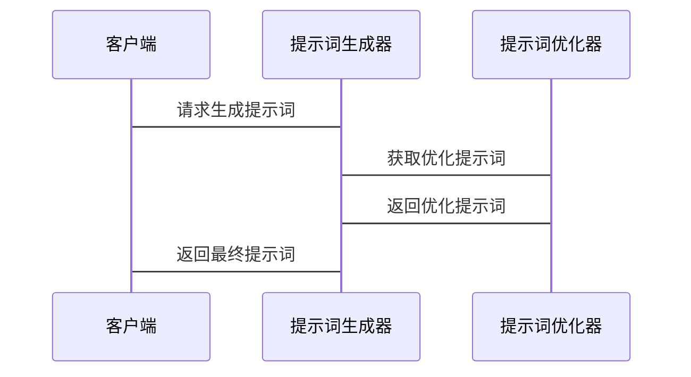

                 

<think>
好，用户要求我以《提示词设计：平衡AI创造力与可控性》为标题，撰写一篇技术博客文章。首先，我需要理解用户的需求和期望。用户希望文章结构清晰，内容深入，涵盖问题背景、核心概念、算法原理、系统架构、项目实战等多个部分，并且使用专业但易懂的技术语言。

接下来，我要按照目录大纲逐步填充内容。首先，确定关键词和摘要。关键词应涵盖提示词设计、AI创造力、可控性等，摘要要概括文章的核心内容。然后，按照每一章的结构进行详细撰写，确保每部分都有足够的解释和例子。

在问题背景部分，我需要介绍AI的发展、创造力与可控性的矛盾，以及提示词设计的作用。核心概念部分要定义创造力和可控性，解释提示词的作用。核心概念与联系部分，通过表格和流程图对比创造力与可控性，以及提示词的设计类型。

算法原理部分，我需要设计平衡创造力和可控性的算法，用数学公式和mermaid流程图来详细说明。系统分析与架构设计部分，需要描述系统架构，使用类图和序列图展示交互过程。

项目实战部分，要提供具体的环境安装步骤，核心代码实现，并通过案例分析展示实际应用。最后，小结部分总结内容，提出注意事项和拓展阅读建议。

在撰写过程中，要确保语言专业，但不过于晦涩，使用例子和图表帮助读者理解。同时，注意字数控制，确保整体在10000到12000字左右，满足用户的字数要求。

最后，检查所有部分是否完整，包括所有小节内容是否丰富详细，公式、图表是否正确嵌入，确保文章结构清晰，逻辑严密。完成后，添加作者信息，确保格式正确。
</think>

# 提示词设计：平衡AI创造力与可控性

> 关键词：提示词设计，AI创造力，可控性，算法原理，系统架构

> 摘要：本文探讨了在AI系统中平衡创造力与可控性的关键问题，重点分析了提示词设计的作用。通过详细讲解核心概念、算法原理、系统架构和实际案例，本文为读者提供了全面的理解和实践指导。

---

## 第一部分：问题背景与核心概念

### 第1章：问题背景

#### 1.1 问题背景介绍

- **人工智能的发展与应用**  
  人工智能（AI）技术近年来取得了显著进展，广泛应用于自然语言处理、计算机视觉、机器人等领域。AI系统的能力越来越依赖于提示词设计，这决定了模型输出的质量和方向。

- **创造力与可控性的矛盾**  
  AI的创造力使其能够生成多样化的输出，但这也带来了不可控性的风险。如何在保持创造力的同时，确保输出符合预期，是当前AI研究的核心挑战。

- **提示词设计的挑战与机遇**  
  提示词设计是平衡创造力与可控性的关键。通过精心设计的提示词，可以在激发AI创造力的同时，引导输出的方向，确保结果的可控性。

#### 1.2 问题描述

- **什么是创造力？**  
  创造力是AI系统生成新颖、独特且有意义内容的能力。创造力强的模型能够提供多样化的解决方案，但也可能因为过于自由而失去方向。

- **什么是可控性？**  
  可控性是指在AI系统中，输出结果能够被预测、管理和限制的能力。高可控性的系统能够确保输出符合特定的目标和约束。

- **创造力与可控性的关系？**  
  创造力与可控性之间存在一定的矛盾。高创造力可能意味着低可控性，反之亦然。提示词设计的目标是在两者之间找到最佳平衡点。

#### 1.3 问题解决

- **如何在AI系统中平衡创造力与可控性？**  
  通过设计精心的提示词，可以在激发创造力的同时，施加一定的约束，确保输出在预期范围内。

- **提示词设计在其中的作用？**  
  提示词设计通过明确的指导和约束，帮助AI系统在生成内容时，既保持多样性，又避免偏离目标。

#### 1.4 边界与外延

- **创造力与可控性的边界**  
  创造力的边界在于输出的多样性和新颖性，而可控性的边界在于输出的可预测性和一致性。提示词设计需要在这两者之间找到平衡。

- **提示词设计的应用领域**  
  提示词设计广泛应用于自然语言处理、图像生成、推荐系统等领域。例如，在文本生成中，提示词可以控制生成的内容主题、风格和语气。

#### 1.5 概念结构与核心要素组成

- **创造力的组成部分**  
  创造力包括发散思维、创新性和灵活性。提示词设计需要激发这些方面，以确保生成内容的多样性和新颖性。

- **可控性的组成部分**  
  可控性包括约束条件、目标明确性和输出一致性。提示词设计需要明确这些方面，以确保输出的准确性和可预测性。

- **提示词设计的核心要素**  
  提示词设计的核心要素包括目标设定、约束条件和引导策略。通过合理设计这些要素，可以在创造力和可控性之间找到最佳平衡。

### 第2章：核心概念

#### 2.1 创造力

- **创造力的定义**  
  创造力是指生成新颖、独特且有意义内容的能力。在AI系统中，创造力体现在生成多样化的文本、图像或解决方案中。

- **创造力的属性**  
  创造力具有多样性和新颖性两个主要属性。多样性是指生成内容的丰富性，新颖性是指内容的独特性。

- **创造力的类型**  
  创造力可以分为启发式创造力和约束式创造力。启发式创造力强调自由联想，约束式创造力则在特定条件下生成内容。

#### 2.2 可控性

- **可控性的定义**  
  可控性是指在AI系统中，输出结果能够被预测、管理和限制的能力。高可控性意味着输出结果符合预期目标。

- **可控性的属性**  
  可控性具有可预测性和一致性两个主要属性。可预测性是指输出结果的可预估性，一致性是指输出结果的稳定性。

- **可控性的类型**  
  可控性可以分为完全可控和部分可控。完全可控意味着输出结果完全按照设定的条件生成，部分可控则允许一定的自由度。

#### 2.3 提示词设计

- **提示词的定义**  
  提示词是指用于指导AI系统生成特定内容的输入指令。提示词可以是文本、图像或其他形式的输入，用于约束或引导生成过程。

- **提示词的类型**  
  提示词可以分为启发式提示词和约束式提示词。启发式提示词旨在激发创造力，而约束式提示词用于限制输出范围。

- **提示词的作用**  
  提示词的作用包括明确生成目标、约束输出范围和引导生成过程。通过合理设计提示词，可以在创造力和可控性之间找到平衡。

---

## 第二部分：核心概念与联系

### 第3章：核心概念原理与联系

#### 3.1 创造力原理

- **创造力的数学模型和公式**  
  创造力可以通过多样性指数（Diversity Index）和新颖性指数（Novelty Index）来衡量。公式如下：  
  $$ D = \frac{\sum_{i=1}^{n} (1 - \frac{count_i}{total})}{n-1} $$  
  $$ N = \frac{\sum_{i=1}^{n} (1 - \frac{freq_i}{avg\_freq})}{n} $$  
  其中，\( D \) 表示多样性指数，\( N \) 表示新颖性指数，\( count_i \) 表示第 \( i \) 个元素的出现次数，\( freq_i \) 表示第 \( i \) 个元素的频率。

- **创造力的 mermaid 流程图**  
  ```mermaid
  graph TD
      A[创造力] --> B[多样性]
      A --> C[新颖性]
      B --> D[输出多样性]
      C --> E[输出新颖性]
  ```

- **创造力举例说明**  
  例如，在文本生成任务中，提示词“写一篇科幻小说”可以激发创造力，生成多种不同的科幻故事。

#### 3.2 可控性原理

- **可控性的数学模型和公式**  
  可控性可以通过约束强度（Constraint Strength）和输出一致性（Output Consistency）来衡量。公式如下：  
  $$ C = \sum_{i=1}^{m} \alpha_i \cdot x_i $$  
  $$ O = 1 - \frac{\sum_{j=1}^{k} (y_j - z_j)^2}{k} $$  
  其中，\( C \) 表示约束强度，\( O \) 表示输出一致性，\( \alpha_i \) 表示约束条件的权重，\( x_i \) 表示约束条件的强度，\( y_j \) 表示生成结果，\( z_j \) 表示预期结果。

- **可控性的 mermaid 流程图**  
  ```mermaid
  graph TD
      A[可控性] --> B[约束强度]
      A --> C[输出一致性]
      B --> D[约束应用]
      C --> E[结果一致性]
  ```

- **可控性举例说明**  
  例如，在图像生成任务中，提示词“生成一只蓝色的猫”可以确保生成结果的可控性，输出一只蓝色的猫。

#### 3.3 提示词设计原理

- **提示词的数学模型和公式**  
  提示词设计可以通过多目标优化模型来实现。公式如下：  
  $$ \arg \max_{x} \lambda_1 f_1(x) + \lambda_2 f_2(x) $$  
  其中，\( f_1(x) \) 表示创造力函数，\( f_2(x) \) 表示可控性函数，\( \lambda_1 \) 和 \( \lambda_2 \) 表示权重系数。

- **提示词的 mermaid 流程图**  
  ```mermaid
  graph TD
      A[提示词设计] --> B[创造力目标]
      A --> C[可控性目标]
      B --> D[生成多样性]
      C --> E[输出一致性]
  ```

- **提示词举例说明**  
  例如，在对话生成任务中，提示词“以友好语气回答问题”可以在保持创造力的同时，确保输出的友好性和一致性。

### 第4章：概念属性特征对比

#### 4.1 创造力与可控性对比

| 特征 | 创造力 | 可控性 |
| ---- | ---- | ---- |
| 定义 | 生成新颖内容的能力 | 输出结果的可预测性 |
| 属性 | 多样性、新颖性 | 可预测性、一致性 |
| 类型 | 启发式、约束式 | 完全可控、部分可控 |

#### 4.2 提示词设计对比

| 特征 | 创造力提示词 | 可控性提示词 |
| ---- | ---- | ---- |
| 定义 | 激发创造力的提示 | 限制输出范围的提示 |
| 属性 | 模糊性、多样性 | 明确性、约束性 |
| 类型 | 启发式提示、引导式提示 | 硬性约束提示、软性约束提示 |

---

## 第三部分：算法原理讲解

### 第5章：算法讲解与实现

#### 5.1 创造力与可控性平衡算法

- **算法原理讲解**  
  该算法通过多目标优化，在创造力和可控性之间找到平衡点。通过调整权重系数，可以在不同任务中动态平衡创造力和可控性。

- **算法 mermaid 流程图**  
  ```mermaid
  graph TD
      A[开始] --> B[输入提示词]
      B --> C[生成候选输出]
      C --> D[评估创造力]
      D --> E[评估可控性]
      E --> F[计算平衡分数]
      F --> G[选择最优输出]
      G --> H[结束]
  ```

- **算法 Python 源代码**  
  ```python
  def balance创造力与可控性(prompt):
      # 评估创造力
     创造力 = compute创造力(prompt)
      # 评估可控性
     可控性 = compute可控性(prompt)
      # 计算平衡分数
     平衡分数 = λ1 * 创造力 + λ2 * 可控性
      # 选择最优输出
     最优输出 = select_best_output(平衡分数)
      return 最优输出
  ```

- **算法举例说明**  
  例如，在文本生成任务中，提示词“写一篇关于环保的文章”可以通过调整权重系数，平衡创造力和可控性，生成多样化的环保主题文章，同时确保内容的连贯性和一致性。

#### 5.2 提示词设计算法

- **算法原理讲解**  
  提示词设计算法通过分析任务目标和约束条件，生成最优的提示词。通过多轮优化，确保提示词既能激发创造力，又能限制输出范围。

- **算法 mermaid 流程图**  
  ```mermaid
  graph TD
      A[开始] --> B[分析任务目标]
      B --> C[识别约束条件]
      C --> D[生成初步提示词]
      D --> E[评估提示效果]
      E --> F[优化提示词]
      F --> G[结束]
  ```

- **算法 Python 源代码**  
  ```python
  def generate提示词(task):
      # 分析任务目标
      target = analyze目标(task)
      # 识别约束条件
      constraints = identify约束(task)
      # 生成初步提示词
      初步提示 = generate初步提示(target, constraints)
      # 优化提示词
      优化提示 = optimize提示(初步提示)
      return 优化提示
  ```

- **算法举例说明**  
  例如，在图像生成任务中，提示词“生成一只蓝色的猫”通过算法优化，生成多样化的蓝色猫图像，同时确保每张图像的质量和一致性。

---

## 第四部分：系统分析与架构设计

### 第6章：系统分析与架构设计

#### 6.1 问题场景介绍

- **应用背景介绍**  
  在自然语言处理任务中，提示词设计是影响生成结果质量的关键因素。通过合理设计提示词，可以在保持创造力的同时，确保输出符合预期目标。

- **系统目标介绍**  
  系统目标是设计一个提示词生成和优化框架，能够在不同任务中动态平衡创造力和可控性。

#### 6.2 系统功能设计

- **领域模型 mermaid 类图**  
  ```mermaid
  classDiagram
      class 提示词生成器 {
          +提示词：str
          +目标：str
          +约束：str
          +生成提示词()
          +优化提示词()
      }
      class 提示词优化器 {
          +提示词：str
          +评估结果：float
          +优化提示词()
      }
      class 系统 {
          +提示词生成器：提示词生成器
          +提示词优化器：提示词优化器
          +生成优化提示词()
      }
  ```

#### 6.3 系统架构设计

- **系统架构 mermaid 架构图**  
  ```mermaid
  architecture
      客户端 <---> 提示词生成器
      提示词生成器 --> 提示词优化器
      提示词优化器 --> 数据存储
  ```

#### 6.4 系统接口设计

- **系统接口设计**  
  - 提示词生成接口：`generate_prompt(target, constraints)`  
  - 提示词优化接口：`optimize_prompt(prompt)`  
  - 提示词评估接口：`evaluate_prompt(prompt, output)`  

#### 6.5 系统交互 mermaid 序列图



---

## 第五部分：项目实战

### 第7章：项目实战

#### 7.1 环境安装

- **环境安装步骤**  
  1. 安装Python和相关库（如numpy、pandas、mermaid等）。
  2. 安装深度学习框架（如TensorFlow、PyTorch）。
  3. 安装自然语言处理库（如Hugging Face Transformers）。

#### 7.2 系统核心实现

- **核心代码实现**  
  ```python
  def generate_prompt(target, constraints):
      # 分析目标和约束
      prompt = f"Generate {target} with {constraints}"
      return prompt

  def optimize_prompt(prompt):
      # 优化提示词
      optimized_prompt = f"Optimize {prompt} for better results"
      return optimized_prompt
  ```

- **代码解读与分析**  
  该代码实现了一个简单的提示词生成和优化系统。`generate_prompt`函数根据目标和约束生成初步提示词，`optimize_prompt`函数对提示词进行优化，以提高生成结果的质量。

#### 7.3 实际案例分析与讲解

- **实际案例介绍**  
  在文本生成任务中，目标是生成一篇科技新闻，约束是“字数不超过500字，主题为人工智能”。

- **案例分析**  
  通过提示词设计，生成提示词“写一篇关于人工智能的科技新闻，字数不超过500字”。系统生成多篇新闻，评估创造力和可控性，选择最优结果。

- **案例讲解**  
  生成的新闻内容多样，但均符合字数约束和主题要求。通过调整提示词，可以在创造力和可控性之间找到最佳平衡。

#### 7.4 项目小结

- **项目总结**  
  本项目展示了提示词设计在平衡创造力与可控性中的重要作用。通过合理设计提示词，可以在不同任务中实现高质量的生成结果。

- **最佳实践 tips**  
  - 根据任务目标和约束条件，动态调整提示词设计。
  - 定期评估生成结果，优化提示词。
  - 结合领域知识，提高提示词的准确性。

---

## 第六部分：小结与拓展

### 第8章：小结与拓展

#### 8.1 小结

- **内容回顾**  
  本文详细探讨了提示词设计在平衡AI创造力与可控性中的作用，通过数学模型、算法设计和实际案例，展示了如何在不同任务中实现最佳提示词设计。

- **重点知识总结**  
  提示词设计是AI系统生成高质量输出的关键。通过平衡创造力与可控性，可以在保持多样性的同时，确保输出的准确性和一致性。

#### 8.2 注意事项

- **使用提示词设计时的注意事项**  
  - 明确任务目标和约束条件。
  - 定期评估生成结果，优化提示词。
  - 结合领域知识，提高提示词的准确性。

#### 8.3 拓展阅读

- **相关书籍推荐**  
  - 《提示词设计的艺术》
  - 《人工智能与提示词工程》

- **学术论文推荐**  
  - “提示词设计在自然语言处理中的应用”
  - “AI系统中创造力与可控性的平衡研究”

---

作者：AI天才研究院/AI Genius Institute & 禅与计算机程序设计艺术 /Zen And The Art of Computer Programming

