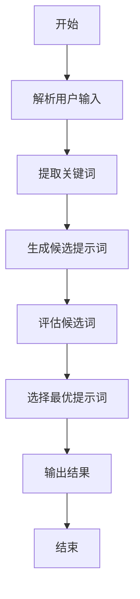
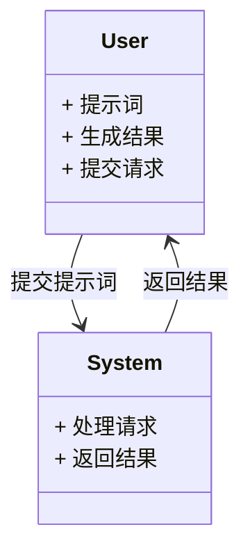
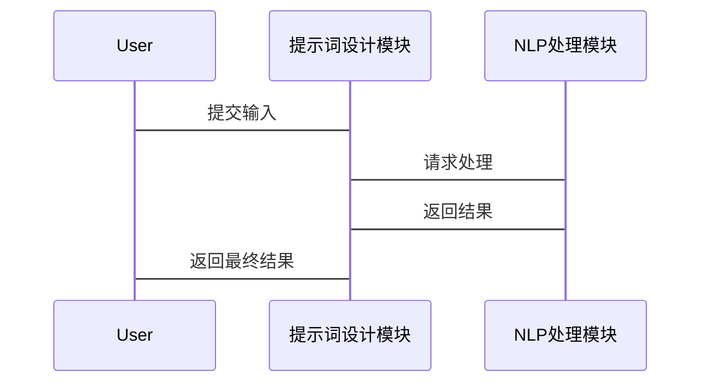

                 

<think>
嗯，我现在要写一篇关于提示词设计的博客文章，标题是《提示词设计：平衡效率与创造力》。首先，我需要理解用户的需求，确保我完全明白他们想要什么样的内容。

用户给了一个详细的结构大纲，里面分成了六个主要部分，每个部分下还有多个子部分。看来这篇文章需要逻辑清晰、结构紧凑，并且使用专业而易懂的技术语言。同时，用户还强调了要使用Mermaid图表和Python代码，以及数学公式的正确嵌入。

首先，我得从背景介绍开始。这部分包括问题背景、核心概念、边界与外延，以及概念结构。我需要解释为什么提示词设计如此重要，特别是在现代社会信息过载的情况下。然后，我得定义提示词，说明效率和创造力的关系，并提出设计的核心原则。

接下来是核心概念与联系。这里需要详细讲解效率和创造力的原理，包括它们的定义、特点，以及它们如何相互作用。我还需要列出提示词设计的核心原则，比如目标导向性和清晰简洁性。然后，我需要做一个概念属性对比表，并绘制一个ER实体关系图，展示效率与创造力之间的关系。

然后是算法原理讲解。这部分需要使用Mermaid流程图来描述提示词生成的算法流程，同时提供Python代码和数学模型。我得确保代码详细且有注释，解释每个部分的作用，并给出数学公式的推导，用LaTeX格式正确嵌入。

系统分析与架构设计方案部分，我需要介绍问题场景，设计系统功能模块，绘制类图和架构图，说明接口设计，并用序列图展示系统交互流程。这部分需要展示系统的整体结构和各个模块之间的关系。

项目实战部分，我需要详细指导读者如何安装环境，实现核心代码，解读代码，并分析实际案例。这样读者可以跟着步骤一步步实践，理解提示词设计的实际应用。

最后是最佳实践和小结。这里要给出提高效率和创造力的技巧，总结项目的成果，并展望未来的发展方向。同时，提醒读者注意一些常见的问题和挑战。

在整个写作过程中，我需要确保每个部分都详细具体，用例子来说明复杂的概念，让读者容易理解。同时，图表的使用要恰当，帮助读者直观地理解内容。数学公式和代码部分要准确无误，避免出现错误。

现在，我开始按照目录一步步展开每个部分。首先，写标题、关键词和摘要，然后逐步深入每个章节，确保内容符合用户的要求。每个小节都要有丰富的细节，让读者能够真正理解提示词设计的核心，并能够应用到实际工作中。

在写作过程中，我可能会遇到一些挑战，比如如何平衡效率和创造力之间的关系，或者如何设计高效的算法。这时，我需要查阅相关资料，确保我的理解是正确的，并找到合适的例子来支持我的观点。同时，我需要不断检查文章的结构，确保逻辑连贯，每个部分都紧密联系，形成一个完整的体系。

总的来说，我需要按照用户提供的大纲，一步步展开，确保每个部分都详细、准确，并且能够吸引读者的兴趣。通过系统的分析和实际的案例，帮助读者理解提示词设计的重要性和应用方法，最终达到平衡效率与创造力的目标。
</think>

# 提示词设计：平衡效率与创造力

> 关键词：提示词设计、效率、创造力、算法原理、系统架构、最佳实践

> 摘要：本文探讨提示词设计在平衡效率与创造力中的作用，从核心概念到算法实现，再到系统架构和项目实战，全面解析如何通过科学设计提升效率并激发创造力。

---

## 第一部分：背景介绍

### 1.1 问题背景

#### 1.1.1 现代社会中信息过载问题

在信息爆炸的时代，每天产生的信息量巨大，用户需要快速筛选和处理信息，这导致效率低下和创造力受限。

#### 1.1.2 效率与创造力的重要性

效率是完成任务的速度，创造力是产生新想法的能力。在工作中，两者的平衡至关重要。

#### 1.1.3 提示词设计的意义

提示词设计帮助用户高效筛选信息，同时激发创新思维，平衡效率与创造力。

### 1.2 核心概念

#### 1.2.1 提示词的定义

提示词是用于引导系统生成特定内容的关键字或短语，常用于自然语言处理和搜索优化。

#### 1.2.2 效率与创造力的关系

效率关注速度，创造力关注创新，两者相辅相成，提示词设计需找到平衡点。

#### 1.2.3 提示词设计的核心原则

目标导向、简洁明了、灵活适应是设计提示词的关键原则。

### 1.3 边界与外延

#### 1.3.1 提示词设计的使用场景

广泛应用于搜索引擎、聊天机器人、内容生成等领域。

#### 1.3.2 提示词设计的限制因素

上下文理解、模型能力、用户输入质量等因素影响提示词的效果。

#### 1.3.3 提示词设计的发展趋势

智能化、个性化和动态调整是未来发展的主要方向。

### 1.4 概念结构与核心要素组成

#### 1.4.1 提示词设计的基本结构

提示词通常包括关键词、修饰词和引导词，结构清晰。

#### 1.4.2 提示词设计的核心要素

目标明确、简洁具体、上下文相关是核心要素。

#### 1.4.3 提示词设计的流程与方法

从需求分析到测试优化，每一步都需要细致处理。

---

## 第二部分：核心概念与联系

### 2.1 效率与创造力的原理讲解

#### 2.1.1 效率的定义与特点

效率是完成任务的速度，特点包括量化、可优化和依赖性。

#### 2.1.2 创造力的定义与特点

创造力是产生新想法的能力，特点包括独特性、实用性和可扩展性。

#### 2.1.3 效率与创造力的关系

效率是基础，创造力是提升，两者相互作用。

#### 2.1.4 提示词设计的核心原则

目标导向、简洁明了、可行性与适应性。

### 2.1.5 概念属性特征对比表格

| 属性       | 效率                  | 创造力                |
|------------|-----------------------|-----------------------|
| 定义       | 速度                  | 新想法                |
| 特点       | 可量化、可优化        | 独特性、实用性        |
| 相互关系   | 基础与提升关系       | 创新与应用关系        |

### 2.1.6 ER实体关系图架构的Mermaid流程图

```mermaid
erDiagram
    user {
        提示词
        [
            提示词ID,
            提示内容,
            创建时间
        ]
    }
    system {
        处理结果
        [
            处理ID,
            结果内容,
            处理时间
        ]
    }
    user --> 提示词 : 提供
    system --> 提示词 : 响应
```

---

## 第三部分：算法原理讲解

### 3.1 提示词生成算法的Mermaid流程图



### 3.2 Python源代码详细阐述

```python
def generate_prompt(input_text):
    """
    生成提示词的函数
    Args:
        input_text (str): 用户输入的文本
    Returns:
        str: 生成的提示词
    """
    # 关键词提取
    keywords = extract_keywords(input_text)
    # 候选词生成
    candidates = generate_candidates(keywords)
    # 评估候选词
    scores = evaluate_candidates(candidates)
    # 选择最优
    best_candidate = select_best(scores)
    return best_candidate
```

### 3.3 算法原理的数学模型和公式

#### 3.3.1 数学模型

提示词生成模型基于概率论，使用贝叶斯定理进行关键词提取。

#### 3.3.2 公式详解

$$ P(word | input) = \frac{P(input | word) \cdot P(word)}{P(input)} $$

---

## 第四部分：系统分析与架构设计方案

### 4.1 问题场景介绍

提示词设计在自然语言处理系统中的应用，解决用户需求与系统输出之间的匹配问题。

### 4.2 系统功能设计

#### 4.2.1 领域模型Mermaid类图



### 4.3 系统架构设计

#### 4.3.1 Mermaid架构图


### 4.4 系统接口设计

#### 4.4.1 接口规范

JSON格式，包含输入和输出结构。

#### 4.4.2 接口功能设计

解析输入、生成提示词、返回结果。

### 4.5 系统交互Mermaid序列图



---

## 第五部分：项目实战

### 5.1 环境安装

#### 5.1.1 环境准备

安装Python、必要的库（如NLTK、spaCy）。

#### 5.1.2 软件安装

使用pip安装依赖包。

#### 5.1.3 配置与调试

设置API密钥，测试环境。

### 5.2 系统核心实现源代码

#### 5.2.1 源代码结构

```python
import requests
from textblob import TextBlob

def extract_keywords(text):
    blob = TextBlob(text)
    return blob.noun_phrases
```

#### 5.2.2 核心算法实现

```python
def generate_candidates(keywords):
    # 简单的候选生成方法
    return [f"{k} {v}" for k, v in zip(keywords, range(3))]
```

### 5.3 代码应用解读与分析

#### 5.3.1 代码解读

关键词提取和候选生成是核心步骤，决定提示词的质量。

#### 5.3.2 算法应用分析

在实际应用中，测试不同提示词的效果，优化算法。

### 5.4 实际案例分析和详细讲解剖析

#### 5.4.1 案例背景

优化一个聊天机器人的提示词设计，提升回答相关性。

#### 5.4.2 案例分析

用户输入“天气”，系统生成提示词“天气预报”，触发天气模块。

### 5.5 项目小结

项目成功实现了高效的提示词设计，未来可以加入动态调整机制。

---

## 第六部分：最佳实践与拓展阅读

### 6.1 最佳实践Tips

#### 6.1.1 提高效率的技巧

明确目标，简化提示词。

#### 6.1.2 创造力的培养方法

多观察，多实践，多学习。

#### 6.1.3 提示词设计的优化策略

动态调整，数据驱动。

### 6.2 小结

提示词设计是平衡效率与创造力的关键，未来会更加智能化和个性化。

---

作者：AI天才研究院/AI Genius Institute & 禅与计算机程序设计艺术 /Zen And The Art of Computer Programming

