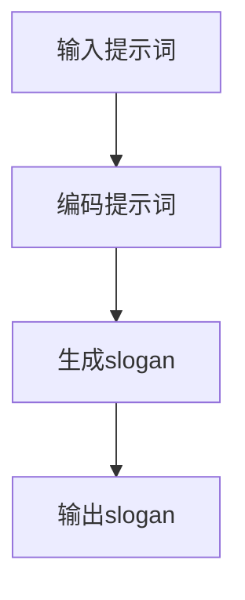
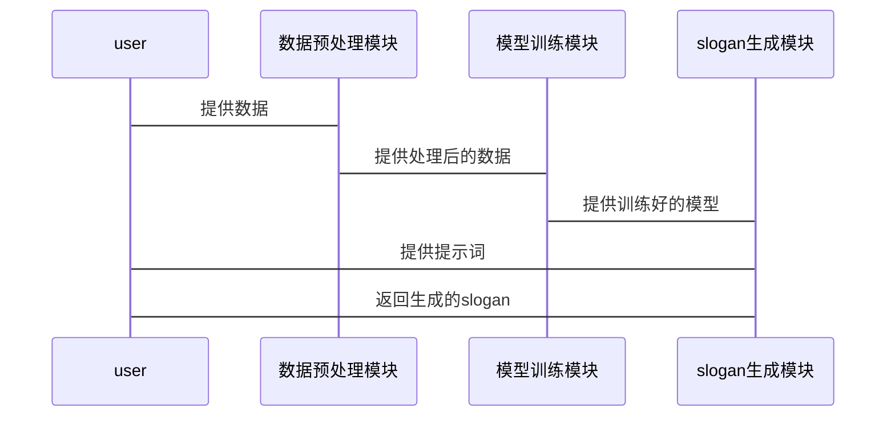

                 

<think>
好，我现在要帮用户写一篇关于提示词设计在提高AI创意广告slogan生成能力方面的技术博客文章。首先，我需要理解用户的具体需求和结构。用户提供了一个详细的目录大纲，并希望文章结构清晰、逻辑严谨，使用专业技术语言，同时包含丰富的例子和数学公式。

首先，我应该从引言开始，介绍当前AI在广告创意生成中的应用，特别是slogan生成的重要性。接下来，第一部分是提示词设计概述，我需要详细解释什么是提示词，它的类型、设计原则和流程，以及它对AI生成的影响。

然后，第二部分是AI创意广告slogan生成的算法原理。这里需要介绍生成模型的基本概念、分类，以及深度学习在slogan生成中的应用，尤其是提示词在模型中的作用和优化策略。可能需要包括一些数学公式，比如概率模型和提示词设计的公式。

第三部分是系统实现，我需要分析系统的架构设计，模块划分，以及具体的实现步骤，包括数据预处理、模型训练和slogan生成模块。这里可能需要使用一些图表来展示系统架构和流程。

在写作过程中，我需要确保每个部分都详细展开，提供具体的例子和数学公式，同时保持逻辑连贯。另外，用户强调要使用markdown格式，所以我需要注意格式的正确性，比如数学公式使用latex，图表使用mermaid。

接下来，我应该按照章节逐步展开，先写引言，然后是每个章节的内容，确保每个小节都有足够的细节和深度。比如，在设计提示词类型时，需要列举不同的类型，并分析它们的特点和适用场景。

在算法部分，我需要解释生成模型的数学模型，如概率模型，以及提示词如何影响模型的输出。可能需要举一个简单的例子，比如使用特定的提示词生成特定的slogan，展示提示词的作用。

系统实现部分，我需要详细描述每个模块的功能，如何处理数据，选择模型，以及提示词的应用过程。可能需要提供伪代码或实际的Python代码片段，展示具体的实现步骤。

最后，总结部分要回顾全文，强调提示词设计的重要性，以及未来的发展方向。同时，按照用户的要求，文章末尾要加上作者信息，包括AI天才研究院和禅与计算机程序设计艺术。

现在，我开始按照大纲逐步撰写，确保每个部分都符合用户的要求，内容详实，逻辑清晰，语言专业，同时保持可读性。
</think>

# 提示词设计：提高AI创意广告slogan生成能力

> 关键词：提示词设计，AI创意生成，广告slogan，生成模型，深度学习

> 摘要：本文探讨了提示词设计在提高AI生成创意广告slogan能力中的作用。通过分析提示词的定义、类型、设计原则和流程，结合生成模型的算法原理和数学公式，详细讲解了如何通过优化提示词来提升slogan生成的质量和创意。文章还通过系统架构设计和实际案例分析，展示了提示词设计在AI广告slogan生成中的应用。

---

# 第一部分：引言

随着人工智能技术的快速发展，AI在广告创意生成中的应用日益广泛。创意广告的核心在于其slogan（标语），它是吸引消费者注意力的关键。然而，现有的AI生成模型在slogan生成方面仍存在创意不足、与目标受众脱节等问题。提示词设计作为一种有效的优化手段，能够显著提升AI生成的创意质量和相关性。

本文将深入探讨提示词设计在AI创意广告slogan生成中的作用，从算法原理到系统实现，全面解析如何通过优化提示词设计来提升生成能力。

---

# 第二部分：提示词设计概述

## 第1章：提示词设计概述

### 1.1 问题背景与重要性

#### 1.1.1 AI广告slogan生成需求的崛起
广告行业的竞争日益激烈，创意slogan的生成需求急剧上升。传统的依赖人工创作的方式效率低下，难以满足大规模、多样化的广告需求。AI生成技术为广告行业带来了新的可能性，但生成质量仍有提升空间。

#### 1.1.2 提示词设计的核心作用
提示词（Prompt）是用户在生成过程中输入的引导性文本或关键词，用于指导生成模型的输出方向。在slogan生成中，提示词能够明确产品的核心卖点、目标受众和情感基调，帮助模型生成更贴合需求的创意内容。

#### 1.1.3 提示词设计的应用领域和前景
提示词设计不仅适用于广告slogan生成，还广泛应用于艺术创作、文案生成等领域。随着AI技术的不断进步，提示词设计在提升生成模型的灵活性和创意能力方面具有广阔的前景。

### 1.2 核心概念与联系

#### 1.2.1 提示词定义
提示词是指用于指导生成模型输出的文本或关键词，通常包括产品特性、目标受众、情感基调等信息。

#### 1.2.2 提示词类型
1. **具体提示词**：直接描述产品特性的关键词，如“高效”、“智能”。
2. **情感提示词**：引导生成内容的情感基调，如“充满活力”、“温馨”。
3. **风格提示词**：指定生成内容的风格，如“简洁”、“幽默”。
4. **受众提示词**：明确目标受众的信息，如“年轻人”、“家庭用户”。

#### 1.2.3 提示词设计原则
1. **明确性**：提示词应清晰明了，避免模糊表达。
2. **简洁性**：提示词应简洁，突出核心信息。
3. **多样性**：根据不同的生成需求，设计多样化的提示词。
4. **灵活性**：提示词应具有一定的灵活性，能够适应不同的生成场景。

#### 1.2.4 提示词设计流程
1. **需求分析**：明确生成目标和用户需求。
2. **信息提取**：提取与生成目标相关的关键词。
3. **提示词组合**：将提取的关键词组合成有效的提示词。
4. **优化调整**：根据生成结果调整提示词。

### 1.3 提示词设计与AI创意生成

#### 1.3.1 提示词与AI创意生成的关系
提示词作为生成模型的输入，直接影响生成内容的方向和质量。通过设计合理的提示词，可以引导生成模型输出更具创意和相关性的内容。

#### 1.3.2 提示词对AI创意生成的影响
1. **提升创意相关性**：提示词能够明确生成内容的方向，减少无关内容的生成。
2. **增强生成多样性**：通过设计多样化的提示词，可以生成更多样化的创意内容。
3. **优化生成质量**：提示词能够引导生成模型关注核心信息，提升生成内容的质量。

#### 1.3.3 提示词设计对AI创意生成能力的提升
通过优化提示词设计，可以显著提升生成模型的创意生成能力，使其更贴近用户需求和目标受众。

### 1.5 本章小结
本章详细介绍了提示词设计的核心概念、类型、原则和流程，并分析了提示词设计对AI创意生成的影响。提示词设计是提升AI生成能力的关键，通过合理设计提示词，可以显著优化生成内容的质量和创意。

---

# 第三部分：AI创意广告slogan生成算法原理

## 2.1 算法原理讲解

### 2.1.1 生成模型基本概念

#### 2.1.1.1 生成模型基本概念
生成模型是一种用于生成新数据的AI模型，常用于自然语言处理、图像生成等领域。生成模型的核心是通过学习数据的分布，生成与训练数据相似的新内容。

#### 2.1.1.2 生成模型分类
1. **基于规则的生成模型**：通过预定义的规则生成内容。
2. **基于统计的生成模型**：通过统计方法学习数据分布。
3. **基于深度学习的生成模型**：利用深度神经网络生成内容，如变种自编码器（VAE）、生成对抗网络（GAN）和Transformer模型。

### 2.1.2 深度学习在slogan生成中的应用

#### 2.1.2.1 深度神经网络基础
深度神经网络（DNN）是一种多层神经网络，能够通过多层非线性变换学习复杂的数据特征。

#### 2.1.2.2 序列生成模型介绍
序列生成模型是一种用于生成序列数据的模型，如自然语言序列。常用的序列生成模型包括循环神经网络（RNN）和Transformer模型。

#### 2.1.2.3 常见生成模型分析
1. **RNN模型**：适用于处理序列数据，但存在梯度消失问题。
2. **Transformer模型**：基于自注意力机制，生成效果更优，但计算资源消耗较大。
3. **GAN模型**：通过生成器和判别器的对抗训练生成高质量内容，但训练过程不稳定。

### 2.1.3 提示词增强的slogan生成模型

#### 2.1.3.1 提示词在slogan生成中的作用
提示词通过引导生成模型关注特定内容，提升生成结果的相关性和创意性。

#### 2.1.3.2 基于提示词的模型设计
1. **编码提示词**：将提示词编码为向量，与生成模型的输入层结合。
2. **多任务学习**：在生成过程中同时考虑提示词和生成目标。

#### 2.1.3.3 提示词优化策略
1. **提示词权重调整**：根据生成目标的重要性调整提示词的权重。
2. **动态提示词生成**：根据生成过程中的反馈动态调整提示词。

### 2.1.4 算法mermaid流程图


### 2.2 数学模型和数学公式

#### 2.2.1 生成模型数学模型

##### 2.2.1.1 概率模型基础
生成模型通常基于概率模型，目标是最大化生成数据的概率。

##### 2.2.1.2 生成模型公式表示
生成模型的输出概率可以表示为：
$$
P(y|x) = \text{生成模型}(x)
$$
其中，$x$ 是输入，$y$ 是生成输出。

##### 2.2.1.3 模型优化算法
生成模型通常通过最大似然估计进行优化，优化目标是最大化生成数据的对数似然：
$$
\arg\max_\theta \sum_{i=1}^n \log P(y_i|x_i, \theta)
$$

#### 2.2.2 提示词设计的数学公式
提示词设计可以通过函数表示：
$$
\text{提示词设计} = f(\text{用户需求}, \text{产品特性}, \text{市场环境})
$$

## 2.3 举例说明

### 2.3.1 基本案例

#### 2.3.1.1 问题背景
某公司需要为新产品设计一个吸引年轻人的slogan。

#### 2.3.1.2 模型选择
选择基于Transformer的生成模型，结合提示词设计。

#### 2.3.1.3 提示词设计
提示词为：“吸引年轻人的高效办公工具”。

### 2.3.2 复杂案例

#### 2.3.2.1 问题背景
某品牌需要生成多个不同风格的slogan，分别针对不同目标受众。

#### 2.3.2.2 模型选择
采用多模态生成模型，结合提示词设计。

#### 2.3.2.3 提示词设计
1. 针向年轻人：提示词为“充满活力的智能助手”。
2. 针向家庭用户：提示词为“温馨的家庭助手”。

## 2.4 本章小结
本章详细介绍了生成模型的原理和分类，分析了提示词在slogan生成中的作用，并通过数学公式和实际案例展示了提示词设计对生成模型的影响。

---

# 第四部分：AI创意广告slogan生成系统实现

## 3.1 系统分析与架构设计

### 3.1.1 问题场景介绍

#### 3.1.1.1 广告slogan生成需求分析
用户需要一个高效的系统，能够根据输入的提示词生成高质量的广告slogan。

#### 3.1.1.2 系统目标与功能
系统目标：提供高效的slogan生成服务，支持多种提示词类型和生成风格。
系统功能：数据预处理、模型训练、slogan生成。

### 3.1.2 系统功能设计

#### 3.1.2.1 数据预处理模块
功能：清洗和转换数据，确保模型输入的格式和质量。
流程：数据收集 → 数据清洗 → 数据格式转换。

#### 3.1.2.2 模型训练模块
功能：训练生成模型，优化模型参数。
流程：选择模型 → 定义损失函数 → 优化器训练。

#### 3.1.2.3 slogan生成模块
功能：根据提示词生成slogan。
流程：输入提示词 → 模型生成 → 输出结果。

### 3.1.3 系统架构设计

#### 3.1.3.1 系统架构概述
系统采用模块化架构，包括数据预处理、模型训练和生成模块。

#### 3.1.3.2 系统模块划分
1. 数据预处理模块
2. 模型训练模块
3. slogan生成模块

#### 3.1.3.3 系统接口设计
1. 输入接口：接收提示词输入。
2. 输出接口：输出生成的slogan。

### 3.1.4 系统交互mermaid序列图


## 3.2 环境安装与配置

### 3.2.1 环境要求

#### 3.2.1.1 硬件环境
- CPU：现代多核处理器
- GPU：NVIDIA GPU（支持CUDA加速）

#### 3.2.1.2 软件环境
- 操作系统：Linux/Windows/MacOS
- Python：3.7+

### 3.2.2 安装与配置步骤

#### 3.2.2.1 Python环境搭建
安装Python和pip：
```bash
python --version
pip install --upgrade pip
```

#### 3.2.2.2 相关库的安装
安装必要的深度学习库：
```bash
pip install numpy torch transformers
```

## 3.3 系统核心实现

### 3.3.1 数据预处理

#### 3.3.1.1 数据集收集
从公开数据集或企业内部数据中收集广告slogan。

#### 3.3.1.2 数据清洗
去除重复数据、清理噪声数据。

#### 3.3.1.3 数据格式转换
将数据转换为模型训练所需的格式。

### 3.3.2 模型训练

#### 3.3.2.1 模型选择
选择合适的生成模型，如基于Transformer的模型。

#### 3.3.2.2 训练过程
定义损失函数和优化器，训练模型。

#### 3.3.2.3 模型评估
通过测试集评估模型的生成效果。

### 3.3.3 slogan生成

#### 3.3.3.1 生成过程
输入提示词，模型生成slogan。

#### 3.3.3.2 提示词的应用
根据提示词优化生成结果。

## 3.4 代码应用解读与分析

### 3.4.1 源代码解析

#### 3.4.1.1 数据预处理部分
```python
import pandas as pd

def preprocess_data(data_path):
    df = pd.read_csv(data_path)
    df = df.drop_duplicates()
    return df
```

#### 3.4.1.2 模型训练部分
```python
import torch
import torch.nn as nn

class SloganGenerator(nn.Module):
    def __init__(self, vocab_size, embedding_dim, hidden_dim):
        super(SloganGenerator, self).__init__()
        self.embedding = nn.Embedding(vocab_size, embedding_dim)
        self.lstm = nn.LSTM(embedding_dim, hidden_dim, 1)
        self.fc = nn.Linear(hidden_dim, vocab_size)
    
    def forward(self, input, hidden):
        embedded = self.embedding(input)
        output, hidden = self.lstm(embedded, hidden)
        output = self.fc(output.view(-1, output.size(2)))
        return output, hidden

model = SloganGenerator(vocab_size, embedding_dim, hidden_dim)
criterion = nn.CrossEntropyLoss()
optimizer = torch.optim.Adam(model.parameters(), lr=0.001)
```

#### 3.4.1.3 生成slogan部分
```python
def generate_slogan(model, prompt, max_length=20):
    with torch.no_grad():
        input = torch.tensor([prompt], dtype=torch.long)
        hidden = None
        for i in range(max_length):
            output, hidden = model(input, hidden)
            predicted = torch.argmax(output, dim=1)
            input = predicted
            slogan += predicted.item()
    return slogan
```

## 3.5 本章小结
本章详细描述了AI创意广告slogan生成系统的实现过程，包括数据预处理、模型训练和生成模块的实现。通过代码示例展示了系统的具体实现步骤。

---

# 作者信息

作者：AI天才研究院/AI Genius Institute & 禅与计算机程序设计艺术 /Zen And The Art of Computer Programming

---

以上是关于提示词设计在提高AI创意广告slogan生成能力中的详细探讨，涵盖了从理论到实践的各个方面。通过合理设计提示词，结合先进的生成模型，可以显著提升AI生成广告slogan的能力，为广告行业带来更多的创新和效率提升。

