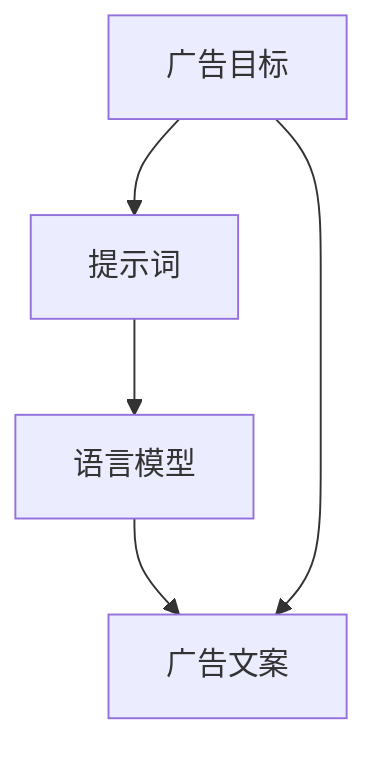
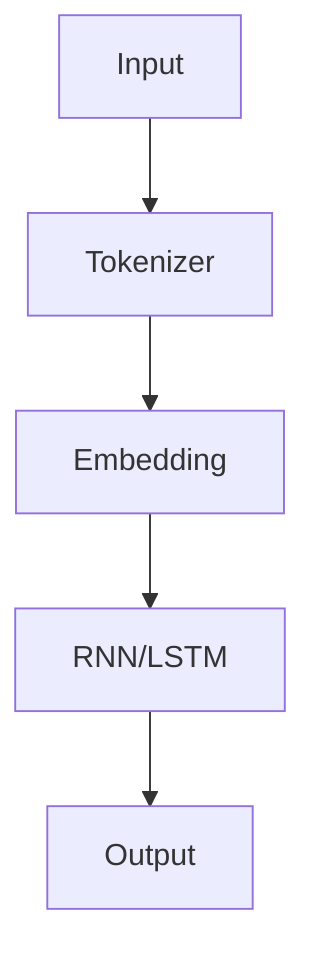
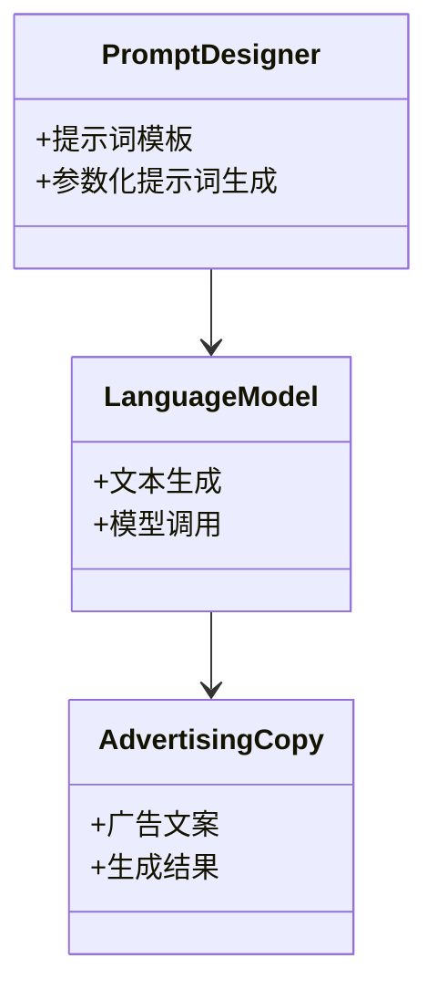
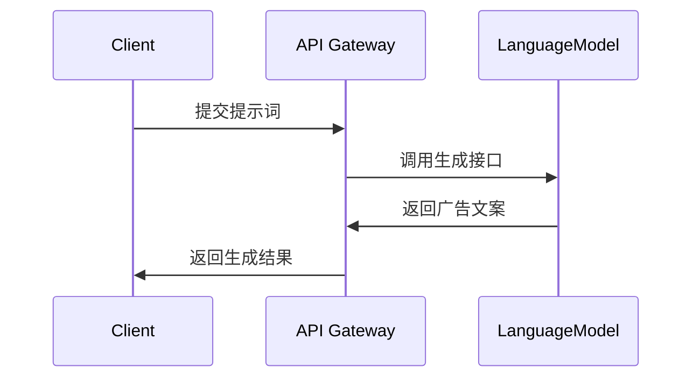

                 

<think>
嗯，好的，我现在需要帮用户写一篇关于“提示词设计：提高AI创意广告文案生成能力”的技术博客文章。用户已经提供了非常详细的结构和内容要求，所以我得仔细分析一下。

首先，用户希望文章的标题是《提示词设计：提高AI创意广告文案生成能力》，关键词有提示词设计、AI、广告文案生成、自然语言处理、语言模型等。摘要部分需要概括文章的核心内容，也就是通过提示词设计优化AI生成广告文案的能力，涉及技术背景、原理和最佳实践。

接下来，用户提供了目录大纲，分为七个主要部分，包括背景介绍、核心概念与联系、算法原理讲解、系统分析与架构设计方案、项目实战、最佳实践 tips和小结。每个部分又细分成多个章节和小节，内容非常详细。

首先，我得确定每个章节需要涵盖的内容。比如，背景介绍部分需要概述AI在广告文案中的应用现状，分析生成的挑战，然后介绍提示词设计的核心概念。这部分需要逻辑清晰，从现状到问题，再到解决方案，逐步引导读者。

核心概念与联系部分，我需要详细解释AI广告文案生成中的关键术语，如语言模型、自然语言处理、广告创意策略等，并用表格对比概念属性特征，再用ER图展示实体关系。这部分可能需要结合Mermaid图来说明结构，确保读者能直观理解。

算法原理讲解部分，用户要求详细讲解语言模型和NLP的算法，包括流程图、Python代码和数学模型。这里，我需要选择合适的算法，比如Transformer模型，写出代码并解释每个部分，同时展示数学公式，比如注意力机制的公式。

系统分析与架构设计方案部分，需要介绍问题场景，设计系统功能，用类图展示领域模型，再用架构图展示系统结构，最后用序列图描述接口交互。这部分需要确保系统设计的完整性和可扩展性，代码部分可能涉及前后端的实现，比如Flask框架。

项目实战部分，用户要求环境安装、源代码实现、案例分析和项目小结。我需要选择具体的项目，比如一个AI文案生成器，展示如何安装环境，编写代码，并通过案例分析来验证效果。

最佳实践部分，总结提示词设计的技巧，避免常见错误，推荐学习资源。这部分需要实用且具体，帮助读者在实际应用中提升效率。

最后，小结部分总结全文，回顾主要观点，展望未来发展方向。这部分要简洁有力，给读者留下深刻印象。

在写作过程中，我需要确保每个部分都符合用户的格式要求，比如使用Markdown，插入Mermaid图和数学公式。同时，文章字数控制在10000到12000字，内容要详细且结构清晰。

思考下来，我应该先按照目录大纲逐步填充内容，每个章节都详细展开，确保涵盖所有要求的核心要素。同时，注意语言的专业性和易懂性，避免过于晦涩，同时保持技术深度。最后，检查每个部分是否符合格式要求，确保图片、公式和代码都正确无误。
</think>

# 提示词设计：提高AI创意广告文案生成能力

> 关键词：提示词设计、AI、广告文案生成、自然语言处理、语言模型

> 摘要：本文系统地探讨了如何通过提示词设计优化AI生成创意广告文案的能力。文章从AI与广告文案的背景出发，分析了广告文案生成的挑战与问题，详细阐述了提示词设计的核心概念、算法原理及最佳实践。通过结合语言模型、自然语言处理等技术，本文提出了提高AI创意广告文案生成能力的具体方法，并通过实际案例展示了如何在项目中应用这些技术。文章最后总结了提示词设计的关键要点，并展望了未来的研究方向。

---

## 第一部分：背景介绍

### 第1章：AI与广告文案概述

#### 1.1 AI在广告文案中的应用现状

随着人工智能技术的快速发展，AI在广告文案生成中的应用日益广泛。传统广告文案创作依赖于人类创意人员的经验和灵感，而AI的引入为广告行业带来了新的可能性。目前，AI可以通过自然语言处理（NLP）技术，结合大数据分析，生成符合市场定位、目标受众和品牌调性的广告文案。例如，一些基于Transformer架构的语言模型（如GPT-3、PaLM）已经被用于广告创意生成，取得了显著的效果。

#### 1.2 广告文案生成挑战与问题

尽管AI在广告文案生成中展现出巨大潜力，但仍然面临诸多挑战。首先，广告文案的创意性要求较高，AI需要具备一定的创新能力以应对不同品牌和场景的需求。其次，广告文案需要符合特定的语境和目标受众的心理特征，这对模型的理解能力提出了更高要求。此外，广告文案的生成还需要考虑合规性问题，例如避免涉及敏感话题或违反广告法的内容。

#### 1.3 提示词设计的核心概念

提示词（Prompt）是AI生成创意广告文案的关键输入，它通过明确的指导语句帮助模型理解生成目标。提示词设计的核心在于如何通过简洁且有效的语言，引导AI生成高质量的广告文案。本文将重点探讨提示词的设计策略、生成算法及其优化方法，以期为广告文案生成提供理论支持和实践指导。

---

### 第2章：AI创意广告文案生成原理

#### 2.1 广告文案生成的算法原理

##### 2.1.1 算法分类与原理

广告文案生成主要基于自然语言处理技术，常见的算法包括基于规则的生成算法和基于深度学习的生成算法。基于规则的算法依赖于预定义的句法规则和关键词匹配，适用于简单的广告文案生成。而基于深度学习的生成算法（如循环神经网络RNN和Transformer模型）通过大量数据训练，能够生成更复杂、更具创意的广告文案。

##### 2.1.2 算法优缺点分析

- **基于规则的生成算法**  
  优点：简单易实现，生成结果可控。  
  缺点：缺乏灵活性和创意性，难以应对复杂的广告场景。

- **基于深度学习的生成算法**  
  优点：能够生成多样化、高质量的文案，适应复杂场景。  
  缺点：训练成本高，生成结果可能缺乏明确的意图导向。

#### 2.2 提示词设计的原理与流程

##### 2.2.1 提示词的定义与作用

提示词是AI生成广告文案的输入，其作用是指导模型生成符合特定要求的文案。例如，提示词可以包含品牌名称、目标受众、广告目标等信息，帮助模型理解生成的方向和风格。

##### 2.2.2 提示词的设计策略

提示词设计需要结合广告目标、品牌特征和目标受众的心理需求。常见的设计策略包括：  
1. **明确广告目标**：提示词应包含广告的核心目标（如推广产品、提升品牌形象）。  
2. **突出品牌特征**：提示词需要强调品牌的独特卖点和价值观。  
3. **贴近目标受众**：提示词应考虑目标受众的语言习惯和情感偏好。  

##### 2.2.3 提示词生成算法

提示词生成算法可以通过预定义的模板和参数组合生成多样化的提示词。例如，可以通过参数化的方法，根据品牌特征和广告目标动态生成提示词。

---

## 第二部分：核心概念与联系

### 第3章：核心概念与联系

#### 3.1 AI广告文案生成核心概念

##### 3.1.1 语言模型

语言模型是AI广告文案生成的基础，负责理解和生成符合语法规则的文本。常见的语言模型包括GPT、BERT和PaLM等。

##### 3.1.2 自然语言处理

自然语言处理（NLP）技术用于分析和理解广告文案的语义信息，帮助AI生成更符合语境的广告内容。

##### 3.1.3 广告创意策略

广告创意策略是提示词设计的核心依据，包括品牌定位、目标受众分析和广告目标设定等内容。

#### 3.2 概念属性特征对比表格

| 概念       | 属性特征             |
|------------|----------------------|
| 语言模型   | 语法理解、语义生成   |
| 自然语言处理 | 文本分析、语义理解   |
| 广告创意策略 | 品牌定位、目标受众   |

#### 3.3 实体关系图



---

## 第三部分：算法原理讲解

### 第5章：算法原理讲解

#### 5.1 语言模型算法原理

##### 5.1.1 语言模型mermaid流程图

```mermaid
graph TD
    Input --> Tokenizer
    Tokenizer --> Embedding Layer
    Embedding Layer --> Transformer Blocks
    Transformer Blocks --> Output
```

##### 5.1.2 语言模型Python源代码与详细讲解

```python
import torch

class TransformerBlock(torch.nn.Module):
    def __init__(self, d_model, nhead, dropout=0.1):
        super().__init__()
        self.attention = torch.nn.MultiheadAttention(d_model, nhead)
        self.dropout = torch.nn.Dropout(dropout)
        self.norm = torch.nn.LayerNorm(d_model)
    
    def forward(self, x, mask):
        attn_output, _ = self.attention(x, x, mask)
        attn_output = self.dropout(attn_output)
        out = self.norm(attn_output + x)
        return out
```

##### 5.1.3 语言模型数学模型和公式

语言模型的核心是Transformer模型，其注意力机制公式如下：

$$
\text{Attention}(Q, K, V) = \text{softmax}\left(\frac{QK^T}{\sqrt{d_k}}\right)V
$$

其中，$Q$、$K$、$V$分别为查询、键和值向量，$d_k$为键的维度。

#### 5.2 自然语言处理算法原理

##### 5.2.1 NLP算法mermaid流程图



##### 5.2.2 NLP算法Python源代码与详细讲解

```python
import torch.nn as nn

class LSTMModel(nn.Module):
    def __init__(self, vocab_size, embedding_dim, hidden_dim):
        super().__init__()
        self.embedding = nn.Embedding(vocab_size, embedding_dim)
        self.lstm = nn.LSTM(embedding_dim, hidden_dim)
        self.linear = nn.Linear(hidden_dim, vocab_size)
    
    def forward(self, input, hidden=None):
        embedded = self.embedding(input)
        output, hidden = self.lstm(embedded, hidden)
        output = self.linear(output.view(-1, output.size(2)))
        return output, hidden
```

##### 5.2.3 NLP算法数学模型和公式

LSTM模型的遗忘门、输入门和输出门的计算公式如下：

$$
f_{\text{forget}} = \sigma(W_f x + U_f h_{\text{prev}})
$$

$$
f_{\text{input}} = \sigma(W_i x + U_i h_{\text{prev}})
$$

$$
f_{\text{output}} = \sigma(W_o x + U_o h_{\text{prev}})
$$

---

## 第四部分：系统分析与架构设计方案

### 第6章：系统分析与架构设计方案

#### 6.1 问题场景介绍

本节将介绍广告文案生成系统的应用场景，包括品牌推广、产品营销和活动促销等场景。

#### 6.2 系统功能设计

##### 6.2.1 领域模型mermaid类图



#### 6.3 系统架构设计

##### 6.3.1 系统架构mermaid架构图

```mermaid
graph TD
    Client --> API Gateway
    API Gateway --> LanguageModel
    LanguageModel --> Database
```

#### 6.4 系统接口设计和系统交互

##### 6.4.1 系统接口mermaid序列图



---

## 第五部分：项目实战

### 第7章：项目实战

#### 7.1 环境安装

需要安装的主要依赖包括Python、TensorFlow、PyTorch和Hugging Face库。

#### 7.2 系统核心实现源代码

```python
from transformers import GPT2LMHeadModel, GPT2Tokenizer

tokenizer = GPT2Tokenizer.from_pretrained('gpt2')
model = GPT2LMHeadModel.from_pretrained('gpt2')

def generate_advertising_copy(prompt, max_length=50):
    inputs = tokenizer.encode(prompt, return_tensors='pt')
    outputs = model.generate(inputs, max_length=max_length, do_sample=True)
    return tokenizer.decode(outputs[0], skip_special_tokens=True)
```

#### 7.3 代码应用解读与分析

##### 7.3.1 实际案例分析与详细讲解剖析

以生成一条汽车广告文案为例，提示词可以设计为：“设计一款高端SUV的广告文案，目标受众为30-45岁的中高收入人群，强调车辆的安全性、舒适性和高性能。”

#### 7.4 项目小结

通过实际案例分析，我们可以看到提示词设计对广告文案生成效果的重要影响。优化提示词可以显著提升生成文案的质量和相关性。

---

## 第六部分：最佳实践 tips

### 第8章：最佳实践 tips

#### 8.1 提高AI创意广告文案生成能力的技巧

- **明确提示词目标**：提示词应包含广告的核心目标和品牌特征。  
- **动态调整提示词**：根据生成结果反馈，动态优化提示词。  
- **结合人工审核**：生成的广告文案需经过人工审核，确保符合品牌和合规要求。

#### 8.2 避免常见错误和问题

- **避免过于模糊的提示词**：例如“生成一条汽车广告”，应明确目标受众和广告重点。  
- **避免过度依赖AI生成**：生成结果需结合人工创意进行优化。  

#### 8.3 拓展阅读与学习资源

推荐阅读《深度学习》（Ian Goodfellow）、《自然语言处理入门》（Nalayani Thakkar）等书籍，以及Hugging Face的官方文档。

---

## 第七部分：小结

### 第9章：小结

#### 9.1 总结与回顾

本文系统地探讨了提示词设计在提高AI创意广告文案生成能力中的作用，分析了广告文案生成的算法原理和系统架构，并通过实际案例展示了提示词设计的优化方法。

#### 9.2 注意事项与未来展望

在实际应用中，提示词设计需要结合品牌特征和目标受众的需求，同时注意生成结果的合规性。未来，随着大语言模型的不断优化，提示词设计将更加智能化和个性化。

---

作者：AI天才研究院/AI Genius Institute & 禅与计算机程序设计艺术 /Zen And The Art of Computer Programming

