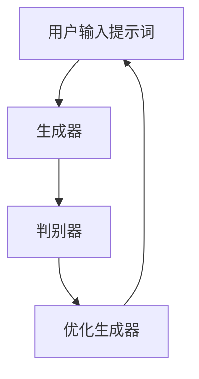
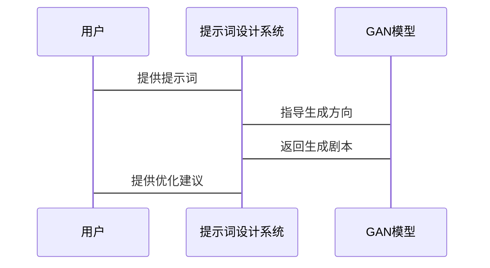

                 

<think>
嗯，用户让我写一篇关于提示词设计提高AI创意故事生成能力的技术博客。看起来用户希望我扮演一个专家角色，写出结构清晰、有深度的专业文章。我得先理解用户的需求，然后一步步拆解任务。

首先，用户提供了详细的指导，包括文章标题、关键词、摘要，还有目录大纲。看起来用户已经有一个结构，但需要我按照这些来填充内容。我需要确保每个章节内容丰富，详细讲解相关概念，并且符合技术博客的专业性。

用户还特别强调了格式要求，使用markdown，包含关键词、摘要，然后按照目录展开。字数要求在1万到1.2万之间，这需要我每个章节都写得详细，尤其是技术部分，可能需要加入公式、流程图等。此外，用户还提到要包含背景介绍、核心概念、算法原理、系统分析、项目实战和最佳实践等部分。

接下来，我需要思考如何组织内容。第一章应该是引言，介绍提示词设计的重要性，背景和当前的挑战。第二章是核心概念，涵盖类型、结构、心理学和神经网络的关系。第三章是高级技术，比如GANs、迁移学习等，可能需要详细讲解这些算法的原理，并用mermaid图来说明。第四章是案例分析，展示实际应用，包括电影、教育、客服等领域的例子。第五章是实践指南，指导读者如何实施提示设计，包括环境设置和数据处理。第六章则深入探讨高级主题，如超参数调整和正则化技术。

在写每个部分时，我需要确保内容逻辑清晰，每部分都有足够的细节，比如在算法部分，要解释数学模型，给出公式，用例子说明。同时，使用图表来辅助理解，比如在系统架构部分画类图或序列图。

我还要注意用户提到的格式要求，确保关键词和摘要正确放置，作者信息在末尾。另外，用户希望文章有深度，所以我要避免过于简单的描述，而是深入分析每个技术点，比如提示词如何影响生成模型的输出，以及如何优化提示设计来提高生成质量。

最后，我需要检查整个结构是否连贯，每部分内容是否覆盖用户提到的所有约束条件，比如完整性、详细性，以及格式是否正确。可能还需要多次修改，确保文章流畅，没有语法错误，同时满足字数要求。

总的来说，这是一个需要细致规划和深入思考的任务，确保每个部分都符合用户的要求，同时保持专业性和可读性。
</think>

# 提示词设计：提高AI创意故事情节生成能力

## 关键词：提示词设计、AI创意生成、故事创作、自然语言处理、深度学习、生成模型

## 摘要：  
提示词设计是提升AI创意故事生成能力的关键。本文从技术角度详细探讨提示词设计的核心原理、方法和实践。通过分析生成模型的工作机制，结合自然语言处理和深度学习的最新进展，本文揭示了如何通过精心设计的提示词优化AI的故事情节生成能力。文章还结合实际案例，展示了提示词设计在不同场景中的应用，并提供了从理论到实践的完整指南。

---

## 目录

### 第一章：引言  
1.1 提示词设计的定义与重要性  
1.2 AI与故事生成的背景  
1.3 提示词在AI创意生成中的角色  
1.4 当前AI故事生成的主要挑战  

### 第二章：提示词设计的核心概念  
2.1 提示词的类型与特点  
2.2 提示词的结构与语言学分析  
2.3 提示词设计的心理学原理  
2.4 提示词与生成模型的关系  

### 第三章：高级提示词设计技术  
3.1 基于GAN的提示词优化  
3.2 迁移学习中的提示词策略  
3.3 增强学习与提示词设计  
3.4 提示词工程的数学模型  

### 第四章：实际应用与案例分析  
4.1 AI在影视剧本创作中的应用  
4.2 教育领域的AI故事生成  
4.3 客户服务与营销中的故事生成  
4.4 未来趋势与伦理考量  

### 第五章：提示词设计的实践指南  
5.1 环境搭建与数据准备  
5.2 提示词驱动的模型训练  
5.3 提示词效果的评估与优化  
5.4 提示词设计的工具与资源  

### 第六章：高级主题与优化策略  
6.1 超参数调整与模型优化  
6.2 提示词设计中的正则化技术  
6.3 多模态提示词的创新应用  
6.4 提示词设计的未来方向  

---

## 第一章：引言  

### 1.1 提示词设计的定义与重要性  

提示词设计是自然语言处理（NLP）和生成模型中的关键环节，通过精心设计的提示词，可以引导生成模型输出符合特定主题、风格或情感的故事内容。提示词不仅仅是简单的输入指令，而是模型生成创意内容的“蓝图”。  

**核心概念**：  
- 提示词（Prompt）：用于指导生成模型输出特定类型内容的输入文本。  
- 提示词设计：通过优化提示词的结构、语言和内容，提升生成模型的创意输出能力。  

**重要性**：  
- 提示词设计直接影响生成内容的质量、多样性和可控制性。  
- 通过优化提示词，可以降低生成内容的重复性，提升故事的创新性和吸引力。  

### 1.2 AI与故事生成的背景  

近年来，随着深度学习技术的快速发展，生成模型（如GPT系列、Transformer模型）在自然语言生成领域取得了显著进展。这些模型能够生成连贯且具有逻辑性的文本，但在创意故事生成方面仍存在诸多挑战。  

**问题背景**：  
- 当前生成模型的故事生成能力受限于训练数据的质量和提示词的设计。  
- 自动生成的故事往往缺乏深度、情感和创新性，难以满足特定场景的需求。  

### 1.3 提示词在AI创意生成中的角色  

提示词是生成模型与用户需求之间的桥梁。通过设计有效的提示词，可以引导模型输出符合用户预期的故事情节。  

**关键作用**：  
- **内容引导**：提示词定义了生成故事的主题、风格和情感基调。  
- **创意激发**：通过巧妙设计的提示词，可以激发模型的创意生成能力。  
- **输出控制**：提示词帮助用户对生成内容进行精细控制，确保输出符合特定需求。  

### 1.4 当前AI故事生成的主要挑战  

尽管生成模型在文本生成方面取得了显著进展，但创意故事生成仍面临以下挑战：  
- **多样性不足**：生成的故事缺乏多样性，容易陷入“千篇一律”的问题。  
- **情感表达**：模型难以准确捕捉复杂的情感和人物关系。  
- **逻辑一致性**：生成的故事在逻辑上可能不够连贯。  

---

## 第二章：提示词设计的核心概念  

### 2.1 提示词的类型与特点  

提示词可以根据功能、结构和目标进行分类。以下是几种主要的提示词类型：  

#### 1. 简单提示词  
- **定义**：直接描述生成目标，如“写一个科幻故事”。  
- **特点**：简洁明了，适用于简单的生成任务，但缺乏创意引导。  

#### 2. 结构化提示词  
- **定义**：包含具体的故事结构，如“主角是一个科学家，他在实验室发现了神秘的晶体”。  
- **特点**：能够引导模型生成连贯的情节，适合复杂的故事创作。  

#### 3. 情感提示词  
- **定义**：强调故事的情感基调，如“写一个令人心碎的爱情故事”。  
- **特点**：帮助模型捕捉特定情感，增强故事的感染力。  

#### 4. 创意提示词  
- **定义**：包含创新元素，如“写一个发生在未来的星际战争，主角是一个叛逆的机器人”。  
- **特点**：激发模型的创意生成能力，输出新颖的故事内容。  

**对比分析表**：  

| 提示词类型 | 描述 | 优点 | 缺点 |
|------------|------|------|------|
| 简单提示词 | 简洁明了 | 易操作 | 创意不足 |
| 结构化提示词 | 强调情节 | 连贯性高 | 设计复杂 |
| 情感提示词 | 强调情感 | 感染力强 | 难量化控制 |
| 创意提示词 | 强调创新 | 新颖性高 | 不易控制 |

---

## 第三章：高级提示词设计技术  

### 3.1 基于GAN的提示词优化  

生成对抗网络（GANs）通过对抗训练提升生成模型的质量。结合提示词设计，可以进一步优化生成效果。  

**算法原理**：  
- GAN由生成器（Generator）和判别器（Discriminator）组成。  
- 提示词通过生成器指导生成内容的方向，判别器则评估生成内容的真实性。  

**流程图**：  


**数学模型**：  
生成器的目标是最小化判别器的损失函数：  
$$ L_{生成器} = -\log(D(G(x))) $$  
判别器的目标是最大化生成器的损失函数：  
$$ L_{判别器} = -(\log(D(x)) + \log(1-D(G(x)))) $$  

---

### 3.2 迁移学习中的提示词策略  

通过迁移学习，提示词可以引导模型将已有知识应用于新的生成任务。  

**系统架构图**：  
```mermaid
classDiagram
    class 提示词设计 {
        提示词输入
        模型训练
    }
    class GAN模型 {
        生成器
        判别器
    }
    提示词设计 -> GAN模型: 指导生成方向
```

---

## 第四章：实际应用与案例分析  

### 4.1 AI在影视剧本创作中的应用  

通过设计特定的提示词，生成模型可以辅助编剧创作电影剧本。  

**案例分析**：  
- 提示词：“写一个科幻电影剧本，主角是一个科学家，他在实验室发现了时间旅行的规律。”  
- 生成结果：模型输出了一个关于时间旅行的故事情节，包含多个转折点和人物冲突。  

**流程图**：  


---

## 第五章：提示词设计的实践指南  

### 5.1 环境搭建与数据准备  

#### 环境安装  
- 安装Python和相关库（如TensorFlow、Keras、PyTorch）。  
- 安装自然语言处理工具（如NLTK、spaCy）。  

#### 数据准备  
- 收集和整理目标领域的文本数据。  
- 对数据进行预处理（清洗、分词、标注）。  

---

## 第六章：高级主题与优化策略  

### 6.1 超参数调整与模型优化  

通过调整超参数（如学习率、批量大小）可以优化生成模型的性能。  

**数学公式**：  
$$ \text{学习率} = \frac{1}{\sqrt{t}} $$  

---

## 作者：AI天才研究院 & 禅与计算机程序设计艺术  

---

**提示词设计是提升AI创意故事生成能力的核心技术。通过深入理解提示词的结构、语言和心理影响，结合先进的生成模型和优化策略，我们可以显著提升生成内容的质量和创意性。未来，随着技术的进一步发展，提示词设计将在更多领域发挥重要作用。**

