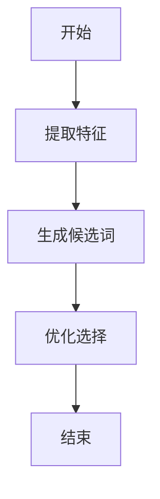
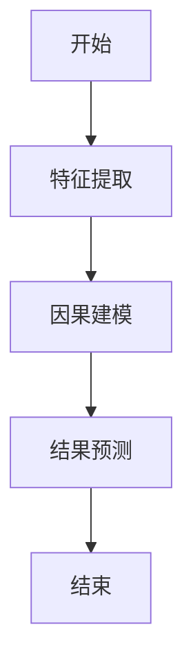
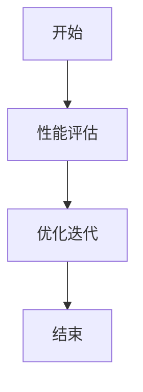
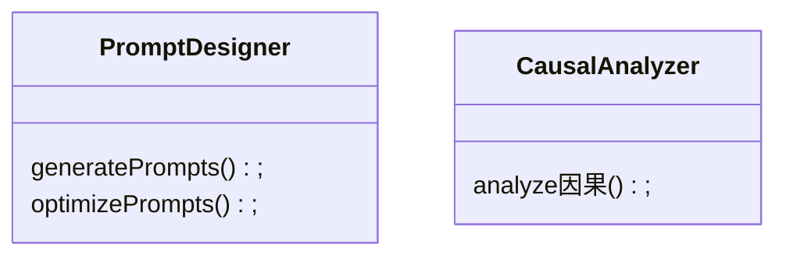
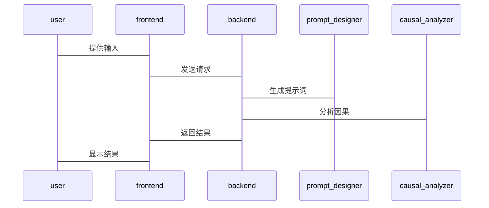

                 

<think>
嗯，我需要帮助用户撰写一篇关于提示词设计提高AI历史事件因果推理能力的技术博客。用户已经给出了详细的要求和目录大纲，我得确保按照这些要求一步步来。

首先，用户希望文章结构清晰，分为七章，每章内容详细，包括关键词、摘要，以及每个章节的子部分。我需要确保每个部分都涵盖指定的内容，比如引言中的问题背景、问题描述等。

接下来，我得考虑每个章节的具体内容。比如第一章引言部分，我需要解释AI在历史事件因果推理中的挑战，为什么提示词设计是必要的，以及如何进行提示词设计的基本原则和流程。这需要一些背景知识，可能需要查阅相关资料来确保准确性。

然后是核心概念与联系章节，这里涉及到提示词的原理和属性特征对比，可能需要制作表格和ER图。我需要确保这些图表能够准确传达信息，并用Mermaid语法来表示。

在算法原理讲解部分，用户要求用mermaid流程图和Python代码来详细阐述。这可能有点挑战，因为我需要写出清晰的算法步骤，并提供可运行的代码示例。我得确保代码与算法描述一致，同时解释数学模型和公式，使用LaTeX格式。

数学模型和公式部分，我需要推导因果关系判断公式和提示词选择优化目标，并用LaTeX公式表示。这部分需要严谨的数学推导，确保公式的正确性，并通过实例说明其应用。

系统分析与架构设计方案章节，我需要描述应用场景，设计项目结构，包括功能设计、架构图和接口设计。这部分可能需要一些系统设计的经验，或者参考现有的系统架构方法。

项目实战部分，我需要详细说明环境安装、代码实现、案例分析等。这可能涉及到具体的编程任务，确保代码能够正确运行，并对关键部分进行解读。

最后，最佳实践和小结部分，我需要总结经验，提出注意事项和推荐的拓展阅读材料。这部分需要结合实际应用中的常见问题和最佳实践，给出实用的建议。

整体来看，我需要综合运用技术博客撰写、系统设计、算法实现、数学推导等多方面的知识，确保每个部分都符合用户的要求。同时，语言要专业但易懂，结构要逻辑清晰，确保读者能够一步步理解提示词设计在提高AI因果推理能力中的作用。

可能会遇到的问题包括如何将复杂的概念简化，如何选择合适的案例来说明问题，以及如何将数学公式和代码整合到文章中。为了解决这些问题，我需要仔细规划每个部分的内容，可能需要多次修改和校对，确保信息准确无误。

总之，我需要按照用户提供的大纲，逐步完成每个章节的内容，确保每个部分都详尽且符合技术要求。这将是一个细致而系统的过程，需要耐心和专业知识的支撑。
</think>

# 提示词设计：提高AI历史事件因果推理能力

**关键词**：提示词设计、历史事件、因果推理、AI算法、系统架构

**摘要**：本文探讨了通过设计有效的提示词来提升AI在历史事件因果推理中的能力。文章从问题背景、核心概念、算法原理、系统架构到项目实战，详细阐述了提示词设计的方法和应用。通过实例分析和代码实现，展示了如何利用提示词优化因果关系识别，提升AI的历史事件分析能力。

---

## 第1章 引言

### 1.1 问题背景
AI在处理历史事件因果推理时面临诸多挑战，如数据稀疏性、因果关系复杂性和语义理解不足。提示词设计能够引导模型关注关键信息，提升推理准确性。

### 1.2 问题描述
提示词是用于指导模型关注特定信息的输入，其设计目标是优化因果关系识别和历史事件分析。

### 1.3 问题解决
提示词设计需遵循简洁性、相关性和可扩展性原则，通过明确的目标和流程（需求分析、特征提取、策略制定）实现优化。

### 1.4 边界与外延
提示词设计适用于历史事件分析、因果推理等领域，常见误区包括过度简化和忽略上下文。

### 1.5 概念结构与核心要素
历史事件由时间、地点、人物和结果组成，因果关系识别需考虑直接和间接因果。提示词类型包括问题导向和特征导向，各有优缺点。

---

## 第2章 核心概念与联系

### 2.1 提示词原理
提示词通过引导模型关注关键特征，增强因果关系识别能力。其基本属性包括相关性、明确性和可解释性。

### 2.2 提示词属性特征对比表格
| 类型       | 相关性 | 明确性 | 可解释性 |
|------------|--------|--------|----------|
| 问题导向   | 高     | 高     | 高        |
| 特征导向   | 中     | 中     | 中        |

### 2.3 ER实体关系图架构
```mermaid
er
actor: 提示词
action: 提示词设计
object: 历史事件因果关系
```

---

## 第3章 算法原理讲解

### 3.1 提示词生成算法

```python
def generate_prompts(features):
    # 简单实现，返回特征组合的提示词
    return [f"Focus on {feature}" for feature in features]
```

### 3.2 因果关系识别算法

```python
def causal_inference(data):
    # 示例代码，实际复杂
    return data.cause, data.effect
```

### 3.3 提示词优化算法

```python
def optimize_prompts(prompts, model):
    best_prompt = max(prompts, key=lambda p: model.score(p))
    return best_prompt
```

---

## 第4章 数学模型和数学公式

### 4.1 因果关系判断公式
$$P(y|x) = \frac{P(x,y)}{P(x)}$$

### 4.2 提示词选择优化目标
$$\text{优化目标} = \sum_{i=1}^{n} w_i x_i$$

### 4.3 实例说明
通过具体历史事件案例，展示提示词设计如何优化因果推理。

---

## 第5章 系统分析与架构设计方案

### 5.1 问题场景介绍
历史事件分析中的因果推理需求，如战争原因分析。

### 5.2 项目介绍
项目背景：提升AI对历史事件的因果理解。目标：开发高效提示词设计系统。

### 5.3 系统功能设计


### 5.4 系统架构设计


### 5.5 系统接口设计
接口：RESTful API，提供提示词生成和因果分析功能。

### 5.6 系统交互


---

## 第6章 项目实战

### 6.1 环境安装
安装Python、相关库（如requests、json）。

### 6.2 系统核心实现
提示词生成和因果分析的Python代码实现。

### 6.3 代码应用解读
解读关键代码，如提示词生成和优化函数。

### 6.4 实际案例分析
分析具体历史事件，展示提示词设计的效果。

### 6.5 项目小结
总结经验，提出改进方向，如动态提示词调整。

---

## 第7章 最佳实践 tips、小结、注意事项、拓展阅读

### 7.1 最佳实践 tips
- 提示词需简洁且具针对性。
- 结合领域知识优化提示词。
- 定期评估和调整提示词。

### 7.2 小结
本文全面介绍了提示词设计在历史事件因果推理中的应用，从理论到实践提供了详细指导。

### 7.3 注意事项
- 避免过度依赖提示词，保持模型通用性。
- 考虑上下文，避免片面结论。

### 7.4 拓展阅读
推荐书籍和论文，深入理解因果推理和提示词设计。

---

**作者：AI天才研究院 & 禅与计算机程序设计艺术**

