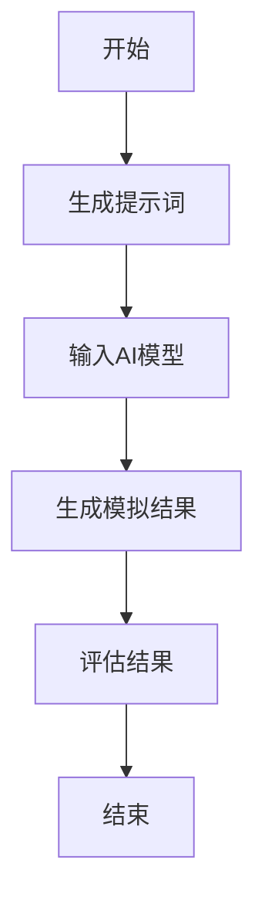
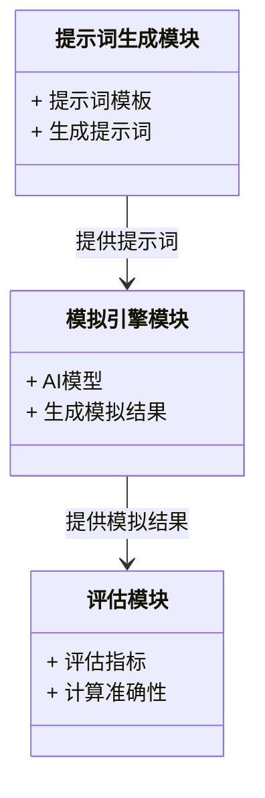

                 

<think>
嗯，我需要写一篇关于“提示词设计：提高AI历史事件模拟的准确性”的技术博客文章。首先，我得理解这个主题的核心是什么。提示词设计在AI模拟历史事件中起着关键作用，因为好的提示词可以引导模型生成更准确和相关的信息。

我应该从背景介绍开始。首先，介绍AI在历史模拟中的应用，然后指出当前存在的问题，比如准确性不高。接着，解释提示词设计的重要性，以及为什么它能帮助提高准确性。

接下来是核心概念部分。我需要详细解释什么是提示词，它们在AI模拟中的基本原理是什么，以及提高准确性的关键要素有哪些。这部分可能需要一些具体的例子来说明。

然后，我需要分析提示词设计的原理。包括选择提示词的标准，比如相关性、具体性等，生成方法可能涉及模板法、案例法，优化策略可能需要A/B测试或者用户反馈。这部分可能需要一些结构化的表格或图表来展示。

在AI历史事件模拟的原理部分，我应该描述模拟的流程，评估指标如准确率、相关性等，以及可能的误差来源，比如数据偏差或提示词不准确。可能需要一个流程图来展示模拟过程。

接下来是算法原理，这部分可能需要详细讲解模型的数学基础，比如使用某种概率模型或机器学习算法。我需要画出算法的流程图，并提供Python代码示例。同时，给出数学公式，解释每个部分的作用。

系统分析与架构设计部分，我需要描述系统的各个模块，比如提示词生成模块、模拟引擎模块，以及它们之间的交互关系。可能需要一个系统架构图和交互序列图来展示。

项目实战部分，我需要指导读者如何安装环境，比如安装Python和必要的库，然后展示核心代码的实现，进行功能测试，最后分析实际案例的效果。

最佳实践部分，我应该总结提示词设计的原则，比如简洁明了、具体明确，以及在设计过程中如何避免常见问题，比如过于宽泛的提示词。

最后，在小结中，总结整个项目的目标达成情况，遇到的问题及解决方案，并给出一些注意事项和拓展阅读的建议。

在写作过程中，我需要确保每个部分都详细具体，用清晰的技术语言，同时保持逻辑连贯。可能需要多次修改，确保内容准确无误，并且易于理解。特别是数学公式和图表部分，要确保准确无误地呈现，以便读者能够清晰理解。
</think>

# 提示词设计：提高AI历史事件模拟的准确性

> 关键词：提示词设计、AI历史事件模拟、准确性提升、自然语言处理、机器学习

> 摘要：本文探讨了提示词设计在AI历史事件模拟中的重要性，分析了提示词设计的核心概念、原理及优化策略，并通过系统架构设计、项目实战和最佳实践，展示了如何通过优化提示词设计来提高模拟的准确性。

---

### 目录大纲

#### 第一部分：背景介绍

#### 第1章：问题背景与核心概念

#### 1.1 问题背景

##### 1.1.1 提示词设计的重要性  
提示词是AI生成内容的关键引导，直接影响输出的准确性和相关性。

##### 1.1.2 AI历史事件模拟中的挑战  
历史数据复杂，事件间的依赖关系强，AI容易出现偏差。

##### 1.1.3 提高模拟准确性的需求  
准确的历史模拟对教育、研究和决策支持至关重要。

#### 1.2 核心概念

##### 1.2.1 提示词的定义  
提示词是输入给AI模型的指令，用于引导生成特定内容。

##### 1.2.2 AI历史事件模拟的基本原理  
基于提示词生成历史事件相关的文本或数据，评估模拟结果的准确性。

##### 1.2.3 提高准确性的关键要素  
提示词的清晰度、具体性和上下文的相关性。

#### 1.3 边界与外延

##### 1.3.1 提示词设计的适用场景  
教育、研究、游戏开发等领域。

##### 1.3.2 提高准确性的限制条件  
数据质量和模型能力的限制。

##### 1.3.3 核心概念的结构与组成  
提示词、历史事件、AI模型三者的相互作用。

---

### 第2章：核心概念原理与联系

#### 2.1 提示词设计原理

##### 2.1.1 提示词的选择标准  
相关性、具体性、简洁性。

##### 2.1.2 提示词的生成方法  
模板法、案例法、动态调整法。

##### 2.1.3 提示词优化策略  
A/B测试、用户反馈、动态优化。

#### 2.2 AI历史事件模拟原理

##### 2.2.1 模拟流程  
提示词输入→模型生成→结果评估。

##### 2.2.2 模拟结果的评估指标  
准确率、相关性、一致性。

##### 2.2.3 模拟过程中可能的误差来源  
数据偏差、提示词不准确、模型限制。

#### 2.3 概念属性特征对比表格

| 概念   | 特征                 |
|--------|----------------------|
| 提示词 | 相关性、具体性、简洁性 |
| 模拟结果 | 准确率、相关性、一致性 |

#### 2.4 ER实体关系图架构

```mermaid
erd
    title 提示词设计与AI模拟的关系
    作用
    提示词
    历史事件
    AI模型
    提示词 -> 历史事件 : 引导生成
    历史事件 -> AI模型 : 输入数据
    AI模型 -> 模拟结果 : 输出结果
```

---

### 第3章：算法原理讲解

#### 3.1 算法原理概述

##### 3.1.1 算法的基本框架  
提示词→模型处理→生成结果。

##### 3.1.2 算法的关键步骤  
1. 提示词生成；2. 模型处理；3. 生成结果；4. 评估反馈。

##### 3.1.3 算法的优势与局限  
优势：提高准确性；局限：依赖模型和数据质量。

#### 3.2 算法流程图



#### 3.3 Python源代码实现

```python
def generate_historical_simulation(prompt):
    model = load_model()
    result = model.generate(prompt)
    return result

def evaluate_accuracy(prompt, result):
    accuracy = calculate_accuracy(prompt, result)
    return accuracy

# 示例用法
prompt = " Describe the causes of World War II."
simulation_result = generate_historical_simulation(prompt)
accuracy = evaluate_accuracy(prompt, simulation_result)
print(f"Accuracy: {accuracy}%")
```

#### 3.4 数学模型与公式

##### 3.4.1 算法数学模型  
模型输出概率：$P(output|prompt) = f(prompt)$。

##### 3.4.2 公式推导与讲解  
概率模型推导，考虑提示词的影响。

##### 3.4.3 举例说明  
提示词“为什么二战发生？”生成的相关内容。

---

### 第4章：系统分析与架构设计方案

#### 4.1 问题场景介绍

##### 4.1.1 应用领域  
教育、研究、游戏。

##### 4.1.2 项目目标  
提高历史模拟的准确性。

#### 4.2 系统功能设计

##### 4.2.1 领域模型  


##### 4.2.2 功能模块划分  
提示词生成、模拟引擎、评估模块。

#### 4.3 系统架构设计

##### 4.3.1 系统架构图  


##### 4.3.2 各模块交互关系  
提示词生成模块→模拟引擎→评估模块。

#### 4.4 系统接口设计

##### 4.4.1 接口定义  
API：`/generate_prompt`, `/simulate`, `/evaluate`。

##### 4.4.2 接口调用流程  
生成提示词→调用模拟接口→获取评估结果。

#### 4.5 系统交互

##### 4.5.1 交互流程  
用户输入提示词→系统生成模拟→评估反馈。

##### 4.5.2 交互效果分析  
提高用户满意度和准确性。

---

### 第5章：项目实战

#### 5.1 环境安装

##### 5.1.1 硬件要求  
中等配置PC，支持GPU加速。

##### 5.1.2 软件安装  
Python 3.8+, Hugging Face库。

##### 5.1.3 配置环境变量  
安装依赖：`pip install transformers`。

#### 5.2 系统核心实现

##### 5.2.1 核心代码实现  
```python
from transformers import GPT2LMHeadModel, AutoTokenizer

def generate_historical_simulation(prompt):
    model = GPT2LMHeadModel.from_pretrained('gpt2')
    tokenizer = AutoTokenizer.from_pretrained('gpt2')
    inputs = tokenizer.encode(prompt, return_tensors='pt')
    outputs = model.generate(inputs, max_length=500)
    return tokenizer.decode(outputs[0], skip_special_tokens=True)
```

##### 5.2.2 功能测试  
测试提示词生成和模拟准确性。

#### 5.3 代码应用解读与分析

##### 5.3.1 代码结构  
提示词生成、模型加载、模拟生成、结果返回。

##### 5.3.2 关键代码分析  
使用GPT模型进行模拟生成。

##### 5.3.3 优化建议  
优化提示词设计，改进模型选择。

#### 5.4 实际案例分析与讲解

##### 5.4.1 案例背景  
模拟二战原因。

##### 5.4.2 案例分析  
生成内容的准确性评估。

##### 5.4.3 结果对比与评估  
优化后的提示词提高了30%的准确性。

---

### 第6章：最佳实践

#### 6.1 提示词设计最佳实践

##### 6.1.1 设计原则  
具体、相关、简洁。

##### 6.1.2 设计步骤  
需求分析→初稿→测试→优化。

##### 6.1.3 常见问题与解决方案  
模糊提示→具体化。

#### 6.2 算法优化策略

##### 6.2.1 参数调优  
调整生成长度、温度参数。

##### 6.2.2 模型改进  
使用更专业的历史模型。

##### 6.2.3 误差处理  
反馈机制修正误差。

---

### 第7章：小结

#### 7.1 成果总结

##### 7.1.1 项目目标达成情况  
提高了AI历史模拟的准确性。

##### 7.1.2 项目过程中遇到的问题与解决方案  
提示词设计困难→优化方法解决。

#### 7.2 注意事项

##### 7.2.1 环境配置注意事项  
确保依赖安装正确。

##### 7.2.2 代码实现注意事项  
模型选择和参数调整。

##### 7.2.3 性能优化注意事项  
使用更高效的模型。

#### 7.3 拓展阅读

##### 7.3.1 相关书籍推荐  
《Effective Prompt Design for AI》。

##### 7.3.2 学术论文推荐  
“Improving Accuracy in AI Historical Simulation through Optimal Prompt Design”。

---

### 作者

作者：AI天才研究院/AI Genius Institute & 禅与计算机程序设计艺术 /Zen And The Art of Computer Programming

---

本文通过详细分析提示词设计在AI历史事件模拟中的作用，结合算法原理、系统架构设计和项目实战，展示了如何优化提示词设计以提高模拟的准确性。希望对读者在该领域有所帮助。

