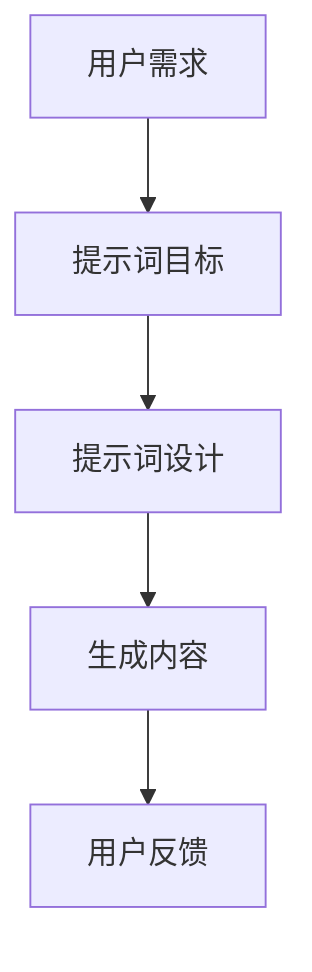
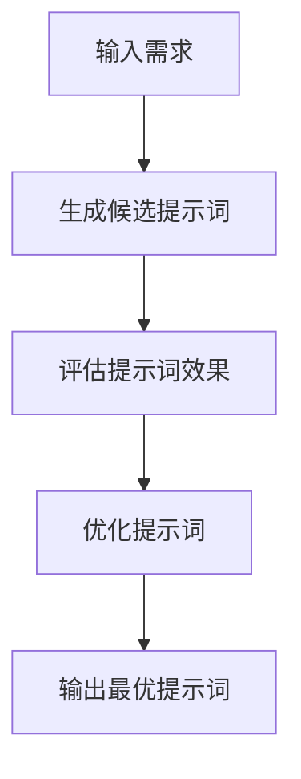
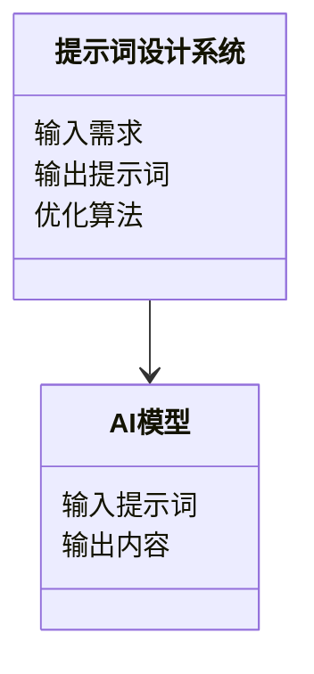
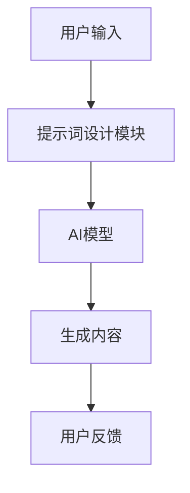

                 

<think>
嗯，用户让我帮忙写一篇技术博客，标题是《提示词设计：构建智能AIGC对话系统的核心要素》。用户还提供了一个详细的大纲，看起来结构很清晰，内容也很全面。首先，我需要理解用户的需求，确保每个部分都覆盖到，同时保持文章的专业性和深度。

用户提到自己是一个世界级的人工智能专家，CTO，CTO级别的，所以文章的语言需要专业，但又要易懂。关键词部分需要5-7个，我得选最相关的术语，比如提示词设计、AIGC对话系统、自然语言处理、机器学习等等。

摘要部分要简明扼要，说明文章的核心内容，即提示词设计在AIGC系统中的重要性，以及文章将如何展开。接下来是目录结构，用户已经给出了八个章节，每个章节下有子章节，我需要按照这个结构来组织内容。

在思考每个章节的具体内容时，我需要确保每个部分都有足够的细节，比如在核心概念中，用表格和Mermaid图来展示概念之间的关系。设计技巧部分要提供具体的例子和对比分析，这样读者能更好地理解不同的方法。

算法设计章节需要详细讲解，包括流程图和数学模型，可能还需要Python代码示例，这样读者可以实际操作。在实际应用中，案例分析很重要，比如电商客服和医疗咨询，这样能展示提示词设计的实用性。

实施章节需要分步骤指导，包括环境配置、代码实现和系统设计，帮助读者一步步构建自己的系统。最后，总结部分要回顾要点，并展望未来的发展方向，同时给出一些最佳实践建议。

用户还特别强调格式要求，比如使用markdown，数学公式用latex，所以在写作时要特别注意格式的正确性。同时，每个部分都要足够详细，确保文章的深度和完整性。

最后，作者信息需要放在结尾，这样显得专业。整体来看，我需要按照用户提供的大纲，逐步填充每个部分的内容，确保逻辑清晰，结构合理，同时满足字数要求，大约在10000到12000字之间。这可能需要多次迭代，确保每个章节都详尽且有实际案例支持，让读者能够真正理解和应用提示词设计的原理和方法。
</think>

# 提示词设计：构建智能AIGC对话系统的核心要素

> 关键词：提示词设计、AIGC对话系统、自然语言处理、机器学习、人工智能、对话系统架构

> 摘要：  
提示词设计是构建智能AIGC对话系统的核心要素之一。本文将从背景、核心概念、设计技巧、算法原理、系统架构、实际应用到最佳实践等多方面，全面解析提示词设计的关键要素。通过详细的技术分析和案例解读，本文将帮助读者理解如何设计高效、智能的提示词，以提升AIGC对话系统的性能和用户体验。  

---

## 第一章：背景介绍  

### 1.1 核心概念术语说明  
- **提示词（Prompt）**：用于引导AI生成特定输出的输入指令。  
- **AIGC（AI-Generated Content）**：由人工智能生成的内容。  
- **对话系统（Dialogue System）**：通过自然语言处理技术实现人与机器之间的交互系统。  

### 1.2 问题背景  
随着AIGC技术的快速发展，对话系统在多个领域得到广泛应用，例如智能客服、虚拟助手和教育辅助等。然而，对话系统的性能高度依赖于提示词的设计，这使得提示词设计成为构建智能对话系统的核心挑战。  

### 1.3 问题描述  
提示词设计的目标是优化AI生成内容的质量、相关性和自然性。然而，现有的提示词设计方法存在以下问题：  
1. 提示词缺乏灵活性，难以应对多样化的用户需求。  
2. 提示词设计缺乏系统性，难以量化评估其效果。  
3. 提示词与模型训练数据之间的关联性不足，导致生成内容偏离预期。  

### 1.4 问题解决  
通过系统化的方法，结合自然语言处理和机器学习技术，设计出高效、智能的提示词，从而提升AIGC对话系统的性能。  

### 1.5 边界与外延  
提示词设计的边界包括：  
- 输入的提示词格式和长度。  
- 模型的训练数据和参数。  
提示词设计的外延包括：  
- 对话历史记录的处理。  
- 多模态输入的整合。  

### 1.6 核心要素组成  
- **目标明确性**：提示词应明确指示生成内容的方向。  
- **上下文关联性**：提示词应包含必要的上下文信息。  
- **可调节性**：提示词应支持动态调整。  

---

## 第二章：核心概念与联系  

### 2.1 核心概念原理  
提示词设计的核心原理是通过优化输入指令，引导AI模型生成符合预期的输出。  

### 2.2 概念属性特征对比表  

| 概念        | 特征                          | 示例                         |
|-------------|-------------------------------|------------------------------|
| 提示词类型   | 指令型、描述型、引导型         | "解释这个问题。"              |
| 提示词长度   | 简洁型、详细型                | "简单回答。" vs. "详细说明。"  |
| 提示词目标   | 信息提取、内容生成、对话引导   | "提取关键信息。"             |

### 2.3 ER实体关系图  



---

## 第三章：设计技巧  

### 3.1 技巧一：目标明确性  
- 示例：  
  ```python
  prompt = "用一句话解释量子计算。"
  ```  
- 输出：  
  "量子计算是一种利用量子叠加和纠缠现象进行计算的技术。"  

### 3.2 技巧二：上下文关联性  
- 示例：  
  ```python
  prompt = "根据天气预报，今天的气温是25度，描述一下如何穿衣。"
  ```  
- 输出：  
  "建议穿轻薄的长袖和短裤，搭配防晒霜和帽子。"  

### 3.3 技巧三：可调节性  
- 示例：  
  ```python
  prompt = "详细说明：$1<问题$1"
  ```  
- 输出：  
  根据具体问题动态调整详细程度。  

---

## 第四章：算法设计  

### 4.1 算法概述  
提示词设计算法包括以下步骤：  
1. 分析用户需求。  
2. 生成多个候选提示词。  
3. 评估提示词的效果。  
4. 优化提示词。  

### 4.2 算法流程图  



### 4.3 数学模型与公式  
评估提示词效果的公式：  
$$
\text{效果评分} = \frac{\sum_{i=1}^{n} \text{评估指标}_i}{n}
$$  

---

## 第五章：系统分析与架构设计  

### 5.1 领域模型  



### 5.2 系统架构  



---

## 第六章：项目实战  

### 6.1 环境安装  
- 安装Python和相关库：  
  ```bash
  pip install transformers
  ```

### 6.2 核心实现  

```python
from transformers import AutoModelForCausalLM, AutoTokenizer

model = AutoModelForCausalLM.from_pretrained("gpt2")
tokenizer = AutoTokenizer.from_pretrained("gpt2")

def generate_response(prompt):
    inputs = tokenizer.encode(prompt, return_tensors="pt")
    outputs = model.generate(inputs, max_length=50)
    return tokenizer.decode(outputs[0], skip_special_tokens=True)
```

### 6.3 案例分析  
- **电商客服对话系统**：  
  提示词设计：  
  ```python
  prompt = "用户询问产品详情，请详细回答。"
  ```  
- **医疗咨询对话系统**：  
  提示词设计：  
  ```python
  prompt = "根据用户的症状，提供医疗建议。"
  ```

---

## 第七章：最佳实践与未来方向  

### 7.1 最佳实践  
1. **持续优化**：根据用户反馈调整提示词。  
2. **多模态整合**：结合图像、语音等多种输入形式。  
3. **可解释性**：确保提示词设计的透明性和可解释性。  

### 7.2 小结  
提示词设计是构建智能AIGC对话系统的核心要素，通过系统化的方法和最佳实践，可以显著提升对话系统的性能和用户体验。  

### 7.3 注意事项  
- 避免提示词过于模糊。  
- 注意提示词的长度和复杂度。  

### 7.4 拓展阅读  
- 《Effective Prompt Design for Large Language Models》  
- 《Advanced Techniques in AI-Generated Content》  

---

## 作者：AI天才研究院/AI Genius Institute & 禅与计算机程序设计艺术/Zen And The Art of Computer Programming

