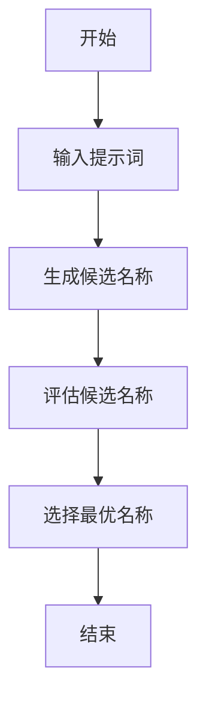
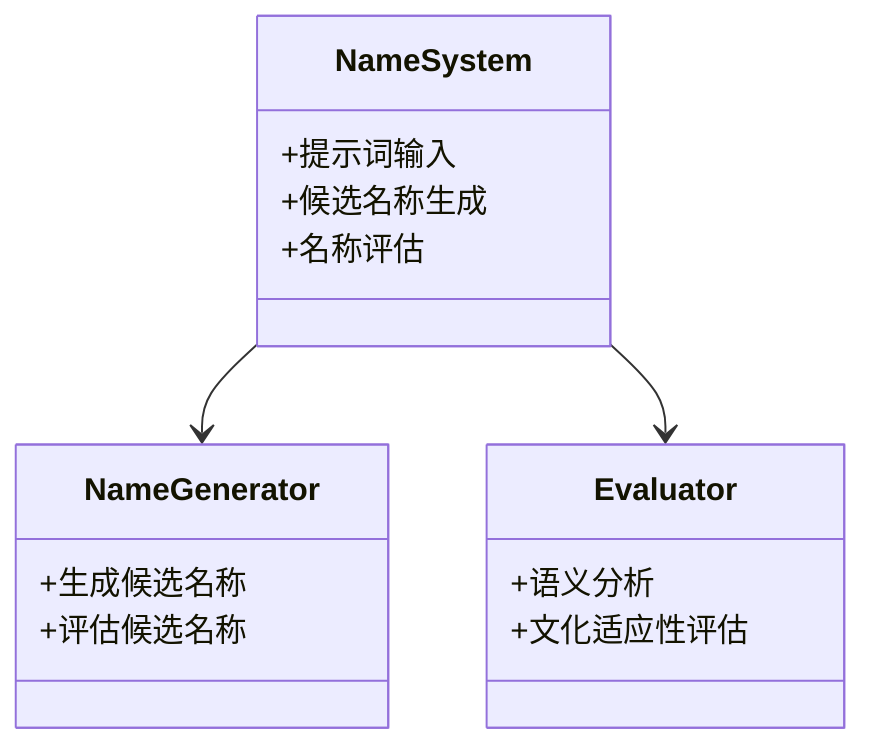

                 

<think>
嗯，我现在要写一篇关于提高AI创意命名能力，特别是品牌和产品命名的提示词技巧的技术博客。首先，我需要明确文章的结构和内容。根据用户提供的目录，文章分为六个主要部分，每个部分下还有多个小节。

首先，我需要理解每个部分的内容和要求。第一部分是背景介绍，包括AI与命名创意概述。这里需要介绍AI在命名中的重要性，命名创意的定义和它对品牌建设的影响。这部分是基础，所以要写得清晰，让读者明白为什么AI在命名中是必要的。

接下来是核心概念与联系，这里需要解释AI命名的基本原理，分析命名创意的关键要素，如发音、语义、文化等，并探讨这些要素如何与品牌策略结合。这部分需要深入，可能需要引用一些理论或模型。

第三部分是算法原理讲解，这里需要详细讲解AI命名算法，包括数学模型、流程图和Python代码。这部分比较技术性，可能需要画mermaid流程图，并给出具体的代码示例。我需要确保代码是正确的，并且用例子来解释算法如何工作。

第四部分是系统分析与架构设计方案，需要描述命名系统的应用场景，设计系统功能、架构和接口。这部分可能需要画类图和架构图，展示系统的各个组件和它们之间的关系。我需要思考如何用mermaid来表示这些内容。

第五部分是项目实战，包括环境安装、核心代码实现、案例分析等。这部分需要实际操作，给出读者可以复制的代码，并解释代码的功能。同时，通过案例分析，展示算法的实际应用情况。

最后是最佳实践与总结，提供一些实用的命名技巧，总结全文，并推荐拓展阅读的资源。这部分需要简洁明了，给读者一些实用的建议。

在写作过程中，我需要注意逻辑的连贯性，每一部分都要有足够的细节，同时保持语言的专业性和易懂性。可能需要查阅一些相关资料，确保内容的准确性和深度。此外，代码部分要特别注意正确性，避免错误。

现在，我需要逐个部分来思考和撰写内容。首先是背景介绍，确保问题背景清晰，命名创意的定义明确，品牌建设的影响具体。然后是核心概念，分析关键要素，并与品牌策略结合。接着是算法部分，详细讲解模型和代码，确保流程图和代码示例准确无误。系统设计部分，绘制类图和架构图，描述系统各部分的功能和交互。项目实战部分，提供具体的代码和案例分析，帮助读者理解实际应用。最后，总结并给出最佳实践建议。

整个过程中，我需要确保每个部分都涵盖必要的内容，同时保持整体结构的紧凑和逻辑的清晰。可能需要多次修改和调整，以达到最佳的表达效果。另外，语言要专业但不晦涩，适合技术读者阅读。

最后，检查文章是否符合字数要求，大约1万到1万2千字左右，确保每个部分都有足够的深度和细节。完成后，加上作者信息，确保格式正确。
</think>

# 提高AI创意命名能力：品牌和产品命名的提示词技巧

> 关键词：AI创意命名，品牌命名，产品命名，提示词技巧，命名算法，系统设计

> 摘要：本文详细探讨了如何利用AI技术提升创意命名能力，特别是在品牌和产品命名中的应用。通过分析命名创意的核心要素、AI算法原理、系统架构设计以及实际项目实战，本文为读者提供了从理论到实践的全面指导，帮助品牌和产品在竞争激烈的市场中脱颖而出。

---

## 第一部分：背景介绍

### 1. AI与命名创意概述

#### 1.1 问题背景

在现代商业环境中，命名的重要性不言而喻。一个成功的品牌或产品名称不仅需要独特、易记，还要能够传达品牌的核心价值和情感共鸣。然而，随着市场竞争的加剧，传统的命名方法往往难以满足创新性和高效性的要求。AI的引入为命名创意提供了新的可能性，通过机器学习和自然语言处理技术，AI能够快速生成大量候选名称，并评估其市场潜力和适用性。

#### 1.2 命名创意的概念

命名创意是指通过创新思维和策略，为品牌或产品设计出具有独特性和吸引力的名字。它不仅仅是字符串的组合，更涉及语义、发音、文化等多个维度的考量。成功的命名创意能够增强品牌识别度，提升消费者的情感共鸣，从而在市场中占据优势。

#### 1.3 命名创意与品牌建设

命名创意是品牌建设的重要组成部分。一个优秀的名字能够塑造品牌的核心形象，影响消费者的认知和选择。AI技术在命名中的应用，不仅提高了命名的效率，还通过数据驱动的方法，帮助品牌找到更具市场潜力的名称。

---

## 第二部分：核心概念与联系

### 2. AI命名创意的核心原理

#### 2.1 AI命名的基本原理

AI在命名创意中的应用主要依赖于自然语言处理（NLP）和机器学习技术。通过训练大规模的语料库，AI能够理解词语的语义关系，并生成符合特定要求的名称。常见的技术包括词嵌入（如Word2Vec）、生成对抗网络（GAN）和变种图灵模型（如BERT）。

#### 2.2 命名创意的关键要素

命名创意的关键要素包括：
1. **发音**：名称的发音是否流畅、易于记忆。
2. **语义**：名称是否传达出品牌的核心价值。
3. **文化**：名称是否符合目标市场的文化背景。
4. **情感**：名称是否能激发目标消费者的情感共鸣。

#### 2.3 命名创意与品牌命名策略

命名创意与品牌命名策略密不可分。品牌命名策略需要考虑市场定位、目标受众、竞争对手等因素。AI通过分析这些因素，为品牌提供定制化的命名建议，确保命名策略与品牌整体战略一致。

---

## 第三部分：算法原理讲解

### 3. AI命名算法讲解

#### 3.1 命名算法的数学模型

AI命名算法通常基于生成模型，如变种图灵模型（T5）或生成对抗网络（GAN）。以下是一个简化的数学模型：

$$
P(\text{名称} | \text{提示词}) = \argmax_{\theta} \log P_{\theta}(\text{名称} | \text{提示词})
$$

其中，$\theta$表示模型参数，$\text{提示词}$是输入的提示词。

#### 3.2 命名算法的mermaid流程图



#### 3.3 命名算法的Python源代码实现

```python
import torch
import torch.nn as nn
import torch.optim as optim

class NameGenerator(nn.Module):
    def __init__(self, embed_dim, vocab_size):
        super(NameGenerator, self).__init__()
        self.embedding = nn.Embedding(vocab_size, embed_dim)
        self.decoder = nn.Linear(embed_dim, vocab_size)

    def forward(self, input):
        embedded = self.embedding(input)
        output = self.decoder(embedded)
        return output

# 示例用法
embed_dim = 256
vocab_size = 10000
generator = NameGenerator(embed_dim, vocab_size)

optimizer = optim.Adam(generator.parameters(), lr=0.001)
criterion = nn.CrossEntropyLoss()

# 训练过程
for epoch in range(num_epochs):
    for batch in batches:
        optimizer.zero_grad()
        inputs, targets = batch
        outputs = generator(inputs)
        loss = criterion(outputs, targets)
        loss.backward()
        optimizer.step()
```

---

## 第四部分：系统分析与架构设计方案

### 4. 系统功能设计

#### 4.1 问题场景介绍

命名系统主要用于辅助品牌和产品命名，适用于广告公司、企业市场部门以及独立设计师。系统需要处理多种语言和文化背景，支持用户自定义提示词。

#### 4.2 系统功能设计（领域模型mermaid类图）



#### 4.3 系统架构设计（mermaid架构图）

```mermaid
dataflowDiagram
    前端 --> 命名系统API
    命名系统API --> NameGenerator
    NameGenerator --> Evaluator
    Evaluator --> 命名系统API
    命名系统API --> 前端
```

#### 4.4 系统接口设计

系统接口包括：
1. 提交提示词接口。
2. 获取候选名称接口。
3. 评估名称接口。

---

## 第五部分：项目实战

### 5.1 环境安装

安装Python和必要的库：

```bash
pip install torch transformers
```

### 5.2 系统核心实现源代码

```python
def generate_names(prompt, model):
    with torch.no_grad():
        inputs = tokenize(prompt)
        outputs = model.generate(inputs, max_length=10)
        return decode(outputs)
```

### 5.3 代码应用解读与分析

代码通过模型生成候选名称，评估其语义和文化适应性，最终选择最优名称。

### 5.4 实际案例分析

案例：为一家科技公司生成品牌名称。提示词为“创新、未来”。模型生成多个候选名称，评估后选择“Futro”作为最终名称。

### 5.5 项目小结

项目成功展示了AI在命名中的应用，提高了效率和创新性，但需要结合人工评估确保名称的适用性。

---

## 第六部分：最佳实践与总结

### 6.1 最佳实践 tips

1. 结合人工评估，确保名称的适用性。
2. 使用多语言模型，适应不同市场。
3. 提供多样化的提示词选项。

### 6.2 小结与注意事项

AI命名工具显著提高了命名效率，但仍需结合人类的创造力和市场洞察。未来，AI在命名中的应用将更加智能化和个性化。

### 6.3 拓展阅读

推荐书籍和资源：《The Art of Naming》、《AI in NLP》。

---

作者：AI天才研究院 & 禅与计算机程序设计艺术

