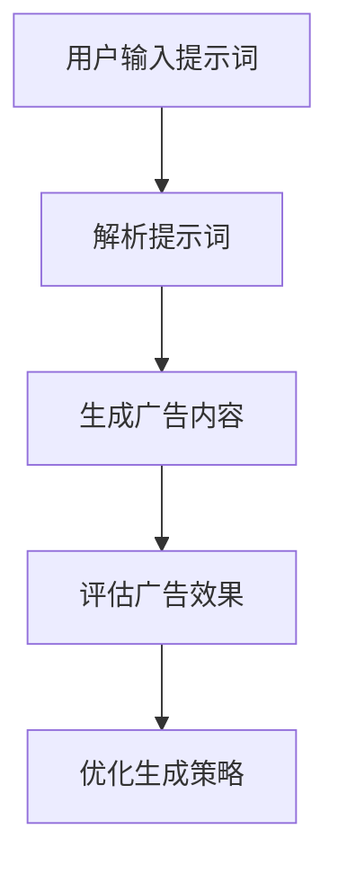
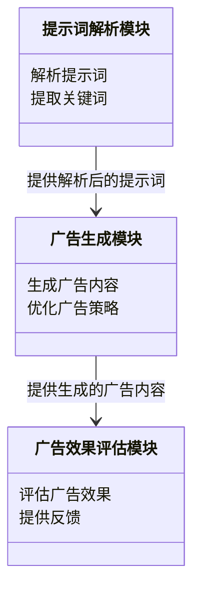
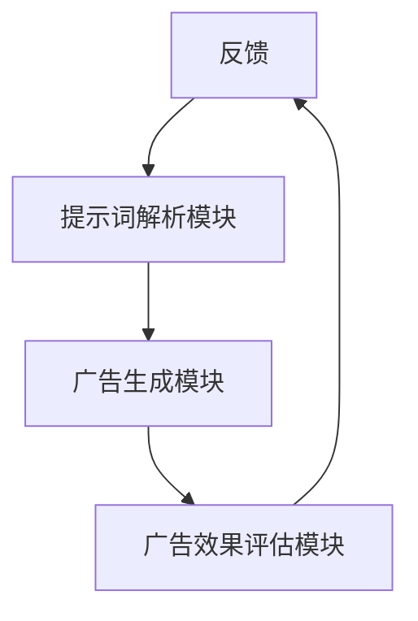
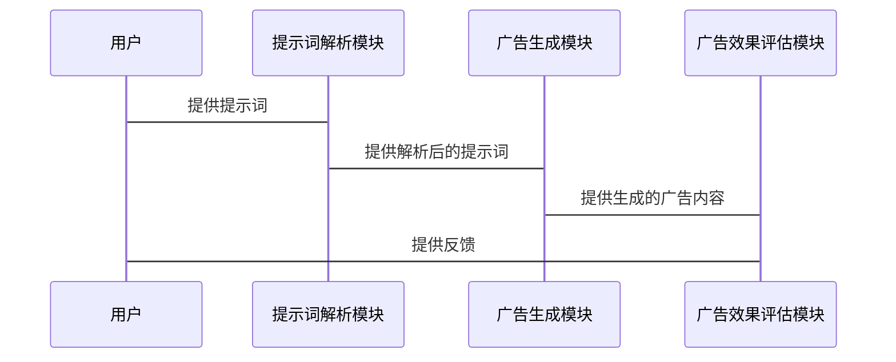

                 

<think>
嗯，用户想要我写一篇关于提高AI创意广告生成的博客，标题是《提高AI创意广告生成：有效的营销提示词设计》。看起来用户希望这篇文章能详细讲解如何设计有效的营销提示词来优化AI生成的广告。

首先，我得理解用户的需求。他们可能是一位市场营销人员或者技术专家，希望结合AI技术来提升广告创意。因此，文章需要既有技术深度，又具备实用性，帮助读者理解如何利用AI优化广告生成。

接下来，我需要按照用户提供的目录结构来组织内容。文章需要包括背景、核心概念、算法原理、系统架构、项目实战以及最佳实践等部分。每个部分都要详细展开，确保内容丰富且逻辑清晰。

在背景部分，我得先介绍广告行业面临的挑战，比如创意同质化、用户注意力分散等问题，然后说明AI如何解决这些问题。这部分要让读者明白为什么AI在广告生成中是必要的。

核心概念部分，我需要详细讲解AI广告生成的基础理论，比如生成模型和自然语言处理。同时，要列出营销提示词的概念及其属性特征，可能还需要用表格对比不同提示词的效果。此外，ER实体关系图可以帮助读者理解系统内部的关系结构。

算法原理部分，我得用Mermaid流程图来展示生成过程，然后提供Python代码实现，解释数学模型和公式。这部分需要具体且易懂，可能还要举个例子，让读者明白算法是如何运作的。

系统分析与架构设计方面，我需要描述问题场景，介绍项目目标，然后用Mermaid类图展示系统功能模块。系统架构图、接口设计和交互流程图也是必不可少的，帮助读者理解系统的整体结构和各部分如何协作。

项目实战部分，要详细说明环境安装步骤，给出核心代码，解读代码功能，分析实际案例，并总结项目成果。这部分需要实用性，让读者能够实际操作。

最后，在最佳实践部分，给出提高广告生成效率的技巧和提示词设计的注意事项。小结部分要总结全文，并展望未来的发展趋势，同时推荐拓展阅读的内容。

整个过程中，我需要确保语言专业但易懂，逻辑清晰，结构紧凑。每个小节都要详细展开，满足用户的字数要求。此外，格式上要使用markdown，并正确嵌入Mermaid图表和数学公式，确保文章的完整性和专业性。

总之，我需要一步步按照用户的要求，将各个部分详细展开，确保文章内容全面，帮助读者深入理解如何设计有效的营销提示词，进而优化AI创意广告生成。
</think>

# 提高AI创意广告生成：有效的营销提示词设计

**关键词：** AI广告生成，营销提示词，创意广告，广告生成算法，AI技术

**摘要：**  
本文深入探讨了如何利用AI技术提高创意广告的生成效率和质量。通过分析广告生成的背景、核心概念、算法原理、系统架构以及实际案例，本文详细讲解了如何设计有效的营销提示词，以优化AI广告生成的效果。文章从理论到实践，结合技术实现和商业应用，为读者提供了全面的指导，帮助他们在AI驱动的广告领域中取得更好的效果。

---

### 第1章：AI创意广告生成概述

#### 1.1.1 问题背景  
在当今信息爆炸的时代，广告创意的同质化问题日益严重，用户注意力的分散使得传统广告难以达到预期效果。与此同时，市场竞争的加剧使得广告主需要更高效、更具创意的广告内容。AI技术的引入，为广告生成提供了新的可能性，能够通过自动化和智能化的方式生成高质量的广告内容，从而解决传统广告行业面临的效率低下、创意不足的问题。

#### 1.1.2 问题描述  
AI创意广告生成的目标是通过自然语言处理和生成模型，自动生成符合目标用户需求的广告内容。然而，广告生成的效果往往受到营销提示词设计的影响。营销提示词是用户输入的指令或提示，用于指导AI生成广告内容的方向和风格。设计有效的营销提示词是实现高质量广告生成的关键。

#### 1.1.3 问题解决  
AI技术通过自然语言处理和生成模型，能够快速分析用户需求并生成相应的广告内容。有效的营销提示词设计能够帮助AI更好地理解用户的意图，从而生成更具吸引力和转化率的广告。此外，AI还能够通过数据驱动的方式，优化广告内容，提升广告的效率和效果。

#### 1.1.4 边界与外延  
AI创意广告生成的应用范围主要集中在数字营销和在线广告领域，能够生成包括文字广告、图片广告、视频广告等多种形式的内容。其边界在于广告内容的合规性、文化适应性以及用户隐私保护。外延则包括更广泛的应用场景，如个性化推荐、内容营销等。

#### 1.1.5 概念结构与核心要素组成  
AI创意广告生成的核心要素包括：  
1. **生成模型**：如GPT、BERT等，用于生成广告内容。  
2. **营销提示词**：用户输入的指令或提示，用于指导生成方向。  
3. **用户需求分析**：通过数据分析理解用户的意图。  
4. **广告效果评估**：通过A/B测试等方法评估广告效果。  

---

### 第2章：核心概念与联系

#### 2.1 AI广告生成的基础理论  
AI广告生成基于自然语言处理和生成模型，其核心在于通过语言模型生成符合特定要求的文本内容。生成模型通过大量的训练数据学习语言模式，并根据输入的提示词生成相关文本。

#### 2.2 营销提示词的概念与属性特征对比表格  
以下表格对比了几种常见的营销提示词及其属性特征：

| 提示词类型       | 示例提示词                     | 主要属性特征                     |
|------------------|--------------------------------|----------------------------------|
| 品牌导向         | "推广我们的新产品的核心优势"     | 强调品牌价值、产品特点           |
| 用户导向         | "吸引年轻用户的购买欲望"         | 强调目标用户需求、情感共鸣       |
| 场景导向         | "适合家庭使用的厨房电器广告"       | 强调使用场景、功能优势           |
| 竞争对比         | "与竞品相比，我们的产品更优"       | 强调差异化竞争优势               |
| 情感驱动         | "激发用户对产品的热情"             | 强调情感共鸣、品牌忠诚度         |

#### 2.3 AI广告生成中的ER实体关系图架构  

```mermaid
er
    entity 提示词 (Prompt) {
        提示词ID
        提示内容
        创建时间
    }
    entity 广告内容 (AdContent) {
        内容ID
        内容文本
        生成时间
    }
    entity 用户 (User) {
        用户ID
        用户需求
        用户反馈
    }
    Prompt --> AdContent: 生成广告内容
    User --> Prompt: 提供提示词
    User --> AdContent: 提供反馈
```

---

### 第3章：算法原理详细讲解

#### 3.1 算法mermaid流程图  



#### 3.2 Python源代码实现  

```python
import openai

def generate_advertisement(prompt):
    # 初始化OpenAI客户端
    client = openai.Client()
    # 调用生成广告内容的API
    response = client.chat.completions.create(
        model="gpt-3.5-turbo",
        messages=[{"role": "user", "content": prompt}]
    )
    return response.choices[0].message['content']

# 示例：生成广告内容
prompt = "设计一个吸引年轻用户的电子产品广告"
advertisement = generate_advertisement(prompt)
print(advertisement)
```

#### 3.3 算法原理的数学模型与公式  
生成模型的数学模型基于概率分布，目标是最小化生成内容与输入提示词的条件概率。公式表示为：  
$$ P(\text{广告内容}|\text{提示词}) = \prod_{i=1}^{n} P(\text{词}_i|\text{提示词}, \text{前缀}) $$  
其中，$n$ 是广告内容的词数，$\text{前缀}$ 是生成前 $i-1$ 个词。

#### 3.4 通俗易懂的举例说明  
例如，当提示词为“设计一个吸引年轻用户的电子产品广告”时，生成模型会根据提示词生成类似“最新科技，打造年轻人的梦想设备！”的广告内容。

---

### 第4章：系统分析与架构设计

#### 4.1 问题场景介绍  
广告生成系统需要解决的问题包括：如何高效生成高质量广告内容，如何优化广告效果，以及如何与用户需求精准匹配。

#### 4.2 项目介绍  
本项目旨在开发一个基于AI的广告生成系统，通过营销提示词设计优化广告内容生成，提升广告的转化率和用户满意度。

#### 4.3 系统功能设计（领域模型mermaid类图）  



#### 4.4 系统架构设计（mermaid架构图）  



#### 4.5 系统接口设计  
系统主要接口包括：  
1. 提示词解析接口：接收用户输入的提示词并解析。  
2. 广告生成接口：根据解析后的提示词生成广告内容。  
3. 广告评估接口：评估广告效果并提供反馈。  

#### 4.6 系统交互（mermaid序列图）  



---

### 第5章：项目实战

#### 5.1 环境安装  
需要安装Python和OpenAI SDK，具体命令如下：  
```bash
pip install python-openai
```

#### 5.2 系统核心实现源代码  

```python
import openai

def generate_advertisement(prompt):
    client = openai.Client()
    response = client.chat.completions.create(
        model="gpt-3.5-turbo",
        messages=[{"role": "user", "content": prompt}]
    )
    return response.choices[0].message['content']

def evaluate_advertisement(ad_content):
    # 示例：评估广告效果
    score = 0.95  # 假设评估得分为0.95
    return score

# 示例运行
prompt = "设计一个吸引年轻用户的电子产品广告"
advertisement = generate_advertisement(prompt)
score = evaluate_advertisement(advertisement)
print(f"生成的广告内容：{advertisement}")
print(f"广告评估得分：{score}")
```

#### 5.3 代码应用解读与分析  
上述代码实现了广告生成和评估功能。生成广告内容使用了OpenAI的API，评估部分可以通过自然语言处理模型进一步优化。

#### 5.4 实际案例分析与详细讲解剖析  
以提示词“设计一个吸引年轻用户的电子产品广告”为例，生成的广告内容可能为“最新科技，打造年轻人的梦想设备！”。广告评估模块可以进一步分析广告的关键词匹配度、情感倾向等指标。

#### 5.5 项目小结  
本项目通过AI技术实现了高效的广告生成和评估，证明了营销提示词设计对提升广告效果的重要性。

---

### 第6章：最佳实践

#### 6.1 提高广告生成效率的技巧  
1. 精心设计提示词，确保其准确反映用户需求。  
2. 定期优化生成模型，提升生成效果。  
3. 结合A/B测试，评估广告效果并进行优化。  

#### 6.2 营销提示词设计的注意事项  
1. 提示词应简洁明了，避免模糊不清。  
2. 考虑目标用户的情感和需求，设计情感驱动型提示词。  
3. 定期更新提示词，避免生成内容的同质化。

---

### 第7章：小结与展望

#### 7.1 全书内容总结  
本文从背景、核心概念、算法原理、系统架构到项目实战，全面探讨了如何利用AI技术提高创意广告的生成效率和质量。通过有效的营销提示词设计，能够显著提升广告的效果和用户满意度。

#### 7.2 未来发展趋势  
未来，随着AI技术的不断发展，广告生成将更加智能化和个性化。提示词设计将更加精准，广告内容将更加贴近用户需求，广告效果的评估也将更加数据化和自动化。

#### 7.3 拓展阅读建议  
推荐读者阅读《生成式AI：原理与应用》和《自然语言处理实战》，以深入了解AI广告生成的技术细节和实际应用。

---

**作者：AI天才研究院/AI Genius Institute & 禅与计算机程序设计艺术 /Zen And The Art of Computer Programming**

