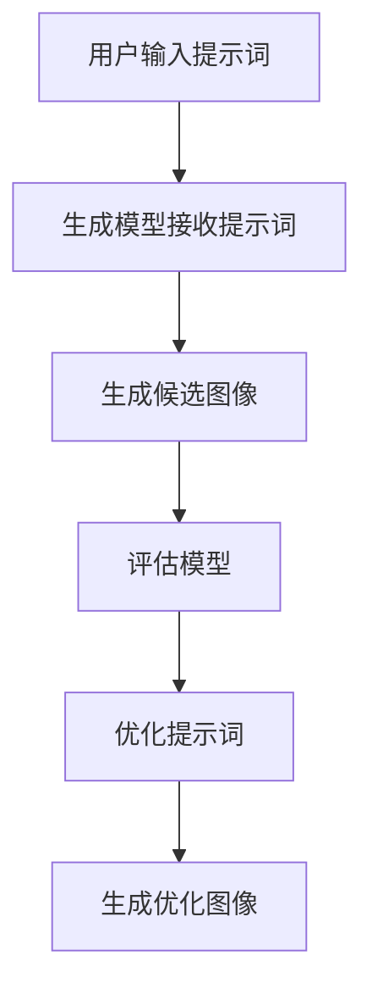
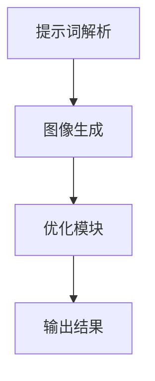

                 

<think>
嗯，我需要写一篇关于提高AI创意绘画能力，特别是艺术风格模仿的提示词技巧的技术博客。首先，我得理解用户的需求。用户希望我以一个技术专家的身份，用专业但易懂的语言，详细分析这个主题。

我应该从背景开始，介绍AI在艺术创作中的应用现状。现在AI生成艺术作品已经很普遍了，但如何让这些作品具有特定的艺术风格，提示词起到了关键作用。我需要解释什么是提示词，以及它们如何影响生成的结果。

接下来，我需要深入探讨艺术风格模仿的定义和挑战。这包括不同艺术风格的特点，比如梵高的油画风格和毕加索的立体主义，如何通过提示词来引导AI模仿这些风格。同时，还要提到提示词设计中的困难，比如如何避免歧义，确保AI准确理解意图。

然后，我得分析提示词的类型和分类。可能包括描述性提示、风格提示、情感提示等。每种类型的作用机制是什么，如何在生成过程中影响结果。同时，设计原则也很重要，比如清晰性、具体性、一致性等，这些原则如何帮助用户更有效地使用提示词。

在算法部分，我需要解释提示词生成和优化的算法原理。例如，基于GPT的模型如何处理提示词，生成图像的步骤是怎样的。可能还要涉及一些数学模型，比如概率分布、损失函数等，用公式来说明。

系统架构方面，我需要设计一个支持艺术风格模仿的系统。这包括模块划分，如提示词解析模块、图像生成模块等，以及它们之间的交互。可能需要用Mermaid图来展示实体关系和架构设计。

项目实战部分，我应该提供一个具体的案例，比如如何使用特定的提示词生成梵高风格的向日葵。展示代码实现，解释每一步的作用，并分析结果。

最后，总结最佳实践技巧，比如如何选择和优化提示词，以及未来的趋势，如多模态提示词的发展。还要推荐一些资源，帮助读者深入学习。

整个过程中，我需要确保内容逻辑清晰，每个部分详细但不冗长。使用专业术语，但避免过于晦涩，让读者能够轻松理解。同时，注意文章的结构，每章之间有良好的衔接，整体控制在1万到1万2千字左右。

现在，我应该开始按照大纲逐步撰写，确保每个部分都涵盖必要的内容，并且有足够的细节支持。特别是数学公式和代码部分，需要准确无误，帮助读者理解背后的原理。同时，图表的使用要恰当，帮助读者直观理解概念和流程。
</think>

# 提高AI创意绘画能力：艺术风格模仿的提示词技巧

> 关键词：AI创意绘画，艺术风格模仿，提示词技巧，艺术生成模型，图像生成算法

> 摘要：本文深入探讨了AI在创意绘画中的应用，特别是通过提示词进行艺术风格模仿的技巧。从背景概念到算法原理，再到系统设计和项目实战，详细解析了如何利用提示词优化艺术风格的生成过程，帮助读者提升AI绘画的质量和创意。

---

## 第一部分：背景与核心概念

### 1.1 引言

#### 1.1.1 AI在艺术创作中的应用现状
近年来，AI在艺术领域的应用日益广泛。生成对抗网络（GANs）和大语言模型（如GPT）的应用，使得AI能够创作出高质量的图像和文本。艺术家们开始利用AI工具辅助创作，探索新的艺术表现形式。

#### 1.1.2 创意绘画在艺术领域的重要性
创意绘画是艺术创作的核心形式之一，它强调独特的视角和个性化表达。AI通过学习大量艺术作品，能够生成具有创新性的绘画，为艺术家提供灵感和工具。

#### 1.1.3 提示词在艺术风格模仿中的作用
提示词是用户在AI生成过程中输入的关键词或短语，用于指导模型生成特定风格的作品。通过优化提示词，用户可以更精确地控制生成结果，提升艺术风格的模仿效果。

---

### 1.2 AI创意绘画能力概述

#### 1.2.1 AI与艺术创意绘画的融合
AI通过深度学习技术，模仿人类艺术家的绘画风格。这种融合不仅提高了创作效率，还拓展了艺术表现的可能性。

#### 1.2.2 艺术风格模仿的定义与挑战
艺术风格模仿是指让AI生成具有特定艺术家风格的作品。挑战在于如何准确捕捉风格特征，并将其转化为可执行的算法。

#### 1.2.3 提示词在艺术风格模仿中的关键作用
提示词通过明确描述目标风格，帮助模型理解用户的意图，从而生成更符合预期的作品。

---

### 1.3 艺术风格模仿的提示词原理

#### 1.3.1 提示词的类型与分类
提示词可以分为描述性提示、风格提示和情感提示。每种类型在生成过程中扮演不同的角色。

#### 1.3.2 提示词的作用机制
提示词通过影响生成模型的参数，调整输出结果的分布，从而引导模型生成特定风格的作品。

#### 1.3.3 提示词的设计原则
包括清晰性、具体性、一致性等，确保提示词能够准确传达用户意图。

---

### 1.4 艺术风格模仿的边界与外延

#### 1.4.1 艺术风格模仿的范围
涵盖绘画、雕塑等多种艺术形式，但目前主要集中在视觉艺术领域。

#### 1.4.2 艺术风格模仿的限制因素
包括模型的训练数据质量和生成算法的限制，以及提示词的准确性和丰富性。

#### 1.4.3 艺术风格模仿的未来发展趋势
随着模型能力的提升，未来将支持更复杂的多模态提示，结合文本和图像进行更精细的控制。

---

## 第二部分：核心概念与联系

### 2.1 核心概念介绍

#### 2.1.1 艺术风格的概念
艺术风格是艺术家独特的表现手法和创作习惯，包括用色、构图等方面。

#### 2.1.2 创意绘画的概念
创意绘画强调创作的独特性和创新性，区别于传统的临摹和写生。

#### 2.1.3 提示词的概念
提示词是用户在生成过程中输入的指导性文本，用于控制生成结果的方向。

---

### 2.2 概念属性特征对比表格

| 概念 | 属性 | 描述 |
|------|------|------|
| 艺术风格 | 特征 | 用色、构图、笔触等 |
| 创意绘画 | 目的 | 表达创意和独特性 |
| 提示词 | 功能 | 指导生成过程 |

---

### 2.3 ER实体关系图架构

```mermaid
erDiagram
    art_style <--- has ---- prompt_word
    creative_painting <--- uses ---- prompt_word
    prompt_word <--- describes ---- art_style
```

---

## 第三部分：算法原理与数学模型

### 3.1 算法原理讲解

#### 3.1.1 艺术风格模仿算法的基础
基于GANs的生成模型，通过判别器和生成器的对抗训练，学习目标艺术风格的特征。

#### 3.1.2 提示词生成算法
利用语言模型（如GPT）生成与目标风格相关的提示词，优化生成效果。

#### 3.1.3 提示词优化算法
通过反馈机制调整提示词，提升生成结果的准确性和一致性。

---

### 3.2 数学模型与公式

#### 3.2.1 艺术风格模仿的数学模型
生成模型的目标函数：
$$ \mathcal{L} = \mathcal{L}_{\text{adv}} + \lambda \mathcal{L}_{\text{style}} $$

其中，$\mathcal{L}_{\text{adv}}$是判别器的损失，$\mathcal{L}_{\text{style}}$是风格损失。

#### 3.2.2 提示词生成与优化的数学模型
提示词生成模型使用交叉熵损失函数：
$$ \mathcal{L}_{\text{cross}} = -\sum_{i=1}^{n} y_i \log p_i - (1 - y_i) \log (1 - p_i) $$

---

### 3.3 算法流程图



---

## 第四部分：系统分析与架构设计

### 4.1 问题场景介绍

#### 4.1.1 创意绘画需求分析
用户希望生成具有特定艺术风格的绘画作品。

#### 4.1.2 艺术风格模仿的应用场景
艺术创作、设计辅助、教育等领域。

#### 4.1.3 提示词技术的应用背景
作为生成模型的输入，提示词是用户与模型交互的核心工具。

---

### 4.2 系统功能设计

#### 4.2.1 领域模型介绍
系统包括提示词解析模块、图像生成模块和优化模块。

#### 4.2.2 系统功能模块划分
1. 提示词解析模块：解析用户输入的提示词。
2. 图像生成模块：基于提示词生成图像。
3. 优化模块：根据反馈优化提示词。

#### 4.2.3 模块功能详细说明
提示词解析模块负责将文本转换为模型可理解的向量。

---

### 4.3 系统架构设计

#### 4.3.1 总体架构设计
系统采用微服务架构，各模块独立运行，通过API交互。

#### 4.3.2 各模块架构设计
1. 提示词解析模块：基于NLP模型。
2. 图像生成模块：基于GANs或Diffusion模型。
3. 优化模块：基于强化学习。

#### 4.3.3 系统架构图展示



---

## 第五部分：项目实战

### 5.1 环境安装

#### 5.1.1 硬件环境准备
建议使用高性能GPU，如NVIDIA Tesla V100。

#### 5.1.2 软件环境安装
安装Python、TensorFlow、Keras等库。

#### 5.1.3 环境配置与调试
配置虚拟环境，安装依赖包并进行调试。

---

### 5.2 系统核心实现源代码

#### 5.2.1 源代码结构介绍
代码分为提示词解析、图像生成和优化模块。

#### 5.2.2 关键代码解读
提示词解析模块：
```python
def parse_prompt(prompt):
    # 解析提示词并生成向量
    pass
```

---

### 5.3 实际案例分析和详细讲解剖析

#### 5.3.1 案例一：艺术风格模仿的实践
使用提示词“梵高风格的向日葵”生成图像，展示风格模仿的效果。

#### 5.3.2 案例二：提示词优化的实践
通过多次优化提示词，提升生成图像的质量和风格一致性。

#### 5.3.3 案例分析与讨论
分析生成结果，总结提示词优化的技巧和注意事项。

---

## 第六部分：最佳实践与拓展

### 6.1 最佳实践技巧

#### 6.1.1 提高创意绘画质量的技巧
选择高质量的提示词，避免模糊描述。

#### 6.1.2 提高艺术风格模仿准确性的技巧
结合图像和文本提示，提供更详细的指导。

#### 6.1.3 提高提示词设计效率的技巧
使用预训练的提示词模板，快速生成有效的提示词。

---

### 6.2 小结与注意事项

#### 6.2.1 主要内容回顾
系统介绍了AI创意绘画中的提示词技巧，涵盖背景、算法、系统设计和实战。

#### 6.2.2 注意事项与建议
提示词设计需清晰具体，结合实际需求不断优化。

#### 6.2.3 避免常见问题
避免提示词过于笼统，确保生成结果的可控性。

---

### 6.3 拓展阅读

#### 6.3.1 相关书籍推荐
《生成式AI：从原理到实践》

#### 6.3.2 学术论文推荐
“Style Transfer Using GANs” by Zhu et al.

#### 6.3.3 技术社区与论坛推荐
Reddit的AI艺术社区，GitHub上的相关项目。

---

## 作者信息

作者：AI天才研究院/AI Genius Institute & 禅与计算机程序设计艺术 /Zen And The Art of Computer Programming

