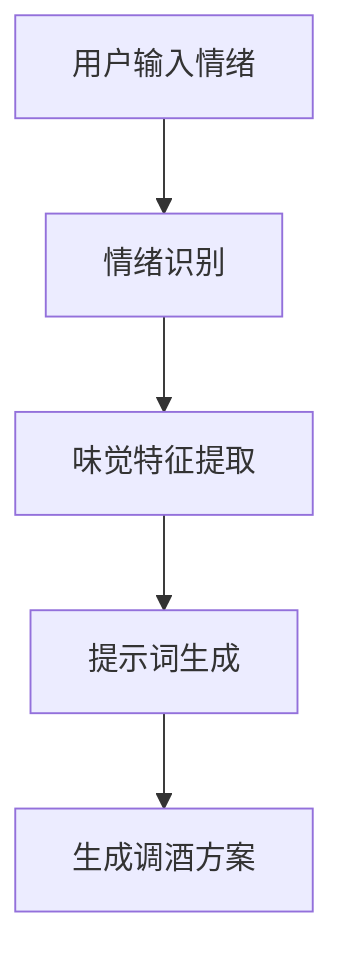
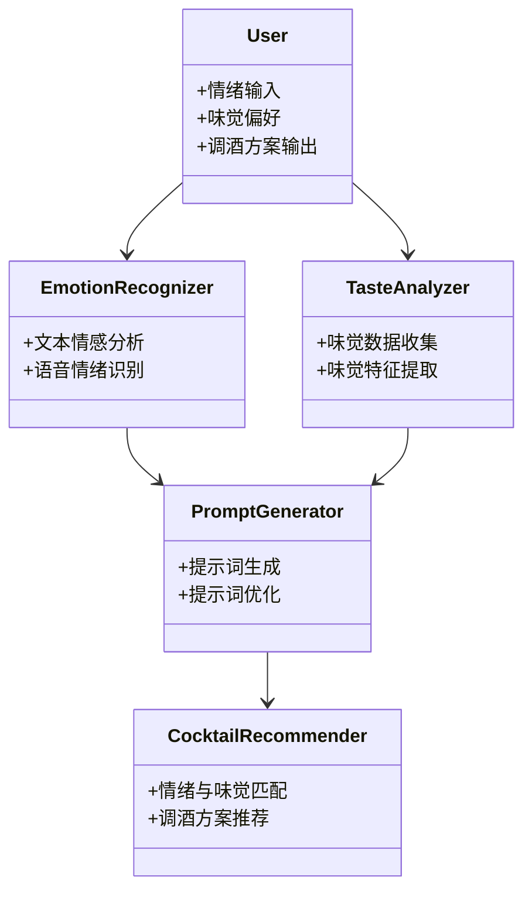
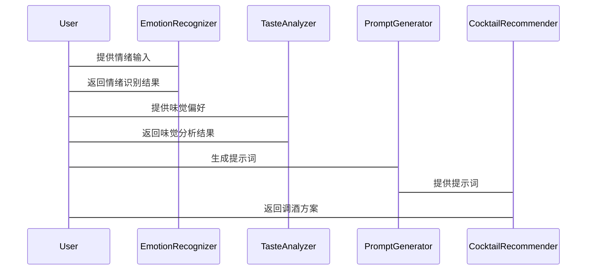

                 

<think>
嗯，用户让我以《提高AI创意调酒师能力：情绪与味觉匹配的提示词技巧》为标题，写一篇技术博客。首先，我需要理解用户的需求。看起来用户希望文章结构清晰，逻辑严谨，内容专业，同时要有实际案例和代码示例。他们可能是一位技术专家，或者对AI和调酒结合感兴趣的人。

接下来，我得按照用户提供的大纲来组织内容。文章开头要有关键词和摘要，然后分章节详细展开。第一章是引言，需要介绍AI调酒师的背景、问题的重要性以及解决方案。第二章是核心概念原理，涉及情绪识别、味觉分析和它们的匹配。第三章是算法原理，包括提示词生成和匹配的数学模型。然后还有系统分析、项目实战和最佳实践等部分。

在写作过程中，我需要确保每个章节内容丰富，逻辑清晰。比如，在情绪识别部分，要介绍文本情感分析和语音识别的方法。味觉分析部分，要讨论数据收集和特征提取。匹配部分则需要详细讲解数学模型，如余弦相似度的计算。

此外，用户要求使用mermaid图和latex公式，这需要我在适当的地方插入图表和公式。例如，在算法原理部分，用mermaid画流程图，展示提示词生成的步骤。同时，用latex公式展示情绪和味觉特征的表示方法。

我还要考虑读者的背景，他们可能是技术人员或者调酒爱好者，因此需要用专业但易懂的语言。加入实际案例，比如用户输入情绪，AI生成推荐的饮品，这样可以增加文章的实用性。

最后，系统架构部分，我需要用mermaid画出类图、架构图和序列图，展示系统的各个模块如何交互。项目实战部分，提供Python代码，解释每个部分的功能，这样读者可以实际操作，理解AI调酒师的工作原理。

整体来看，用户希望这篇文章既有理论深度，又有实践指导，帮助读者提升AI创意调酒师的能力。因此，我需要确保内容全面，结构合理，同时兼顾可读性和技术性。这样，读者不仅能理解原理，还能实际应用这些技巧来优化调酒体验。
</think>

```markdown
# 提高AI创意调酒师能力：情绪与味觉匹配的提示词技巧

> 关键词：AI创意调酒师、情绪识别、味觉分析、提示词生成、机器学习、深度学习

> 摘要：本文深入探讨了如何通过情绪与味觉匹配的提示词技巧来提高AI创意调酒师的能力。文章从问题背景、核心概念原理、算法实现、系统架构设计等多个维度进行分析，并结合实际案例，详细阐述了如何利用机器学习和深度学习技术实现情绪识别与味觉分析的结合，最终生成个性化调酒方案。本文还提供了系统的实现代码和架构设计，为读者提供了完整的解决方案。

---

# 第1章 引言

## 1.1 问题背景

### 1.1.1 AI创意调酒师的崛起
随着人工智能技术的快速发展，AI创意调酒师作为一种新兴的应用场景，正在逐渐走进人们的视野。通过AI技术，调酒师可以根据用户的偏好、情绪和味觉特点，快速生成个性化的 cocktails，为用户提供独特的饮酒体验。

### 1.1.2 情绪与味觉匹配的重要性
情绪与味觉之间的关系密不可分。不同的情绪状态会影响人们对味道的感知和偏好。例如，人在感到放松时可能更倾向于选择甜味或果味的饮品，而紧张时可能更喜欢苦味或浓烈的酒类。因此，如何通过AI技术实现情绪与味觉的精准匹配，是提升AI创意调酒师能力的核心问题。

### 1.1.3 提示词技巧在AI调酒中的应用
提示词（prompt）是AI生成内容的关键输入，通过设计合理的提示词，可以引导AI模型生成符合用户情绪和味觉偏好的调酒方案。提示词技巧的核心在于如何将情绪特征和味觉特征转化为模型可以理解的输入形式。

## 1.2 问题描述

### 1.2.1 情绪识别与味觉分析
情绪识别是通过分析用户的输入（如文本或语音）来获取其情绪状态；味觉分析则是通过收集和处理味觉数据（如甜度、酸度、苦度等）来了解用户的味觉偏好。

### 1.2.2 提示词生成与优化
提示词生成是将情绪和味觉信息转化为AI模型可以理解的输入形式，同时需要不断优化提示词，以提高生成结果的相关性和满意度。

### 1.2.3 系统集成与优化
AI创意调酒师系统的集成与优化需要结合情绪识别、味觉分析和提示词生成等多个模块，确保系统在实际应用中的稳定性和高效性。

## 1.3 问题解决

### 1.3.1 AI模型的选择与训练
选择合适的AI模型（如深度学习模型）并进行针对性训练，是实现情绪识别和味觉分析的基础。

### 1.3.2 情绪与味觉数据的收集与处理
通过收集和处理大量的情绪和味觉数据，建立训练数据集，为模型的优化提供支持。

### 1.3.3 提示词的生成与评估
设计合理的提示词生成算法，并通过用户反馈不断优化提示词的质量和效果。

## 1.4 边界与外延

### 1.4.1 系统的边界条件
AI创意调酒师系统的边界条件包括输入数据的格式、模型的适用范围以及输出结果的格式等。

### 1.4.2 情绪与味觉匹配的拓展应用
情绪与味觉匹配技术可以拓展应用于其他领域，如食品推荐、香水设计等。

## 1.5 概念结构与核心要素组成

### 1.5.1 AI创意调酒师的概念结构
AI创意调酒师是一个结合了情绪识别、味觉分析和提示词生成的智能化系统，旨在为用户提供个性化的调酒方案。

### 1.5.2 情绪与味觉匹配的核心要素
情绪与味觉匹配的核心要素包括情绪特征提取、味觉特征提取、特征匹配算法以及提示词生成模块。

## 1.6 本章小结
本章通过分析AI创意调酒师的背景、问题背景、问题描述和解决方法，明确了情绪与味觉匹配在AI调酒中的重要性，并为后续章节的展开奠定了基础。

---

# 第2章 核心概念原理

## 2.1 情绪识别原理

### 2.1.1 情绪识别的概念
情绪识别是指通过分析文本、语音或图像等输入数据，识别出用户的情绪状态（如快乐、悲伤、愤怒等）。

### 2.1.2 情绪识别的方法

#### 2.1.2.1 文本情感分析
文本情感分析是通过自然语言处理技术，对文本中的情感倾向进行分类。例如，使用词袋模型或词嵌入模型（如Word2Vec、GloVe）对文本进行特征提取，再结合机器学习模型（如SVM、随机森林）或深度学习模型（如LSTM、Transformer）进行情感分类。

#### 2.1.2.2 语音情绪识别
语音情绪识别是通过分析语音信号的特征（如音调、语速、音量等）来识别情绪。常用的方法包括基于MFCC（Mel-Frequency Cepstral Coefficients）特征的提取，结合机器学习或深度学习模型进行分类。

### 2.1.3 情绪识别的应用
情绪识别技术广泛应用于智能客服、语音助手、社交媒体分析等领域。在AI创意调酒师中，情绪识别主要用于根据用户的情绪状态推荐合适的饮品。

## 2.2 味觉分析原理

### 2.2.1 味觉分析的概念
味觉分析是指通过分析饮品的味觉特征（如甜度、酸度、苦度、咸度等），了解用户的味觉偏好。

### 2.2.2 味觉分析的方法

#### 2.2.2.1 味觉数据收集
味觉数据收集可以通过问卷调查、用户反馈或传感器数据采集等方式进行。例如，用户可以对不同饮品的味觉特征进行打分，形成训练数据集。

#### 2.2.2.2 味觉特征提取
味觉特征提取可以通过统计方法或机器学习方法进行。例如，使用主成分分析（PCA）对味觉数据进行降维，提取主要特征。

### 2.2.3 味觉分析的应用
味觉分析技术可以应用于食品推荐、饮品配方优化等领域。在AI创意调酒师中，味觉分析用于根据用户的味觉偏好推荐合适的饮品。

## 2.3 情绪与味觉匹配的原理

### 2.3.1 情绪与味觉匹配的概念
情绪与味觉匹配是指根据用户的情绪状态和味觉偏好，推荐合适的饮品。例如，当用户情绪为“放松”时，推荐甜度较高、口感柔和的饮品。

### 2.3.2 情绪与味觉匹配的方法

#### 2.3.2.1 情绪特征与味觉特征的匹配
情绪特征与味觉特征的匹配是通过计算两者之间的相似度来实现的。例如，可以使用余弦相似度来衡量情绪特征向量和味觉特征向量之间的相似性。

#### 2.3.2.2 提示词生成与优化
提示词生成是将情绪特征和味觉特征转化为AI模型可以理解的输入形式。例如，可以将情绪特征表示为“放松”或“兴奋”，味觉特征表示为“甜度高”或“酸度低”。

### 2.3.3 情绪与味觉匹配的应用
情绪与味觉匹配技术可以应用于个性化推荐、用户体验优化等领域。在AI创意调酒师中，情绪与味觉匹配用于生成个性化的调酒方案。

## 2.4 核心概念属性特征对比表格

| 概念        | 属性特征                              | 对比分析                             |
| ----------- | ----------------------------------- | ---------------------------------- |
| 情绪识别    | 文本情感分析、语音情绪识别            | 分析对象不同，但目标一致             |
| 味觉分析    | 味觉数据收集、味觉特征提取            | 数据处理方法相似，但分析对象不同       |
| 情绪与味觉匹配 | 情绪特征与味觉特征的匹配            | 结合两者，实现个性化体验             |

## 2.5 本章小结
本章通过分析情绪识别和味觉分析的核心原理，明确了情绪与味觉匹配的实现方法，并为后续章节的算法实现奠定了理论基础。

---

# 第3章 算法原理讲解

## 3.1 提示词生成算法原理

### 3.1.1 提示词生成的概念
提示词生成是指将情绪特征和味觉特征转化为AI模型可以理解的输入形式。例如，将情绪特征“放松”和味觉特征“甜度高”转化为提示词“放松的甜味饮品”。

### 3.1.2 提示词生成的流程

#### 3.1.2.1 数据准备
收集和整理情绪特征和味觉特征的数据集。例如，可以使用公开的文本情感分析数据集和自定义的味觉偏好调查数据。

#### 3.1.2.2 模型选择
选择合适的提示词生成模型。例如，可以使用基于Transformer的模型（如GPT、BERT）进行提示词生成。

#### 3.1.2.3 模型训练
对选择的模型进行训练，使用情绪特征和味觉特征的数据进行微调，以提高生成提示词的质量。

#### 3.1.2.4 提示词生成
根据用户的情绪和味觉偏好，生成相应的提示词。例如，用户情绪为“放松”，味觉偏好为“甜度高”，生成提示词“放松的甜味饮品”。

### 3.1.3 提示词生成算法的优缺点

- **优点**：提示词生成可以提高AI模型的生成效果，使其更符合用户的需求。
- **缺点**：提示词生成的效果依赖于模型的训练数据和微调过程，需要大量的数据和计算资源。

## 3.2 情绪与味觉匹配算法原理

### 3.2.1 情绪与味觉匹配的概念
情绪与味觉匹配是指根据用户的情绪状态和味觉偏好，推荐合适的饮品。例如，当用户情绪为“紧张”时，推荐苦味较高的饮品。

### 3.2.2 情绪与味觉匹配的数学模型

#### 3.2.2.1 情绪特征表示
$$
\text{Emotion Feature} = \text{Emotional Text} \times \text{Word2Vec Model}
$$

其中，$\text{Emotional Text}$表示用户输入的情绪文本，$\text{Word2Vec Model}$表示词嵌入模型，用于将文本转化为向量表示。

#### 3.2.2.2 味觉特征表示
$$
\text{Taste Feature} = \text{Taste Data} \times \text{Gaussian Mixture Model}
$$

其中，$\text{Taste Data}$表示味觉数据，$\text{Gaussian Mixture Model}$表示高斯混合模型，用于对味觉数据进行聚类和特征提取。

#### 3.2.2.3 提示词匹配
$$
\text{Match Score} = \text{Cosine Similarity}(\text{Emotion Feature}, \text{Taste Feature})
$$

其中，$\text{Cosine Similarity}$表示余弦相似度，用于衡量情绪特征和味觉特征之间的相似性。

### 3.2.3 情绪与味觉匹配算法的优缺点

- **优点**：情绪与味觉匹配算法可以提高推荐的准确性和个性化。
- **缺点**：算法的效果依赖于情绪特征和味觉特征的提取质量，需要大量的数据和计算资源。

## 3.3 算法mermaid流程图



---

# 第4章 系统分析与架构设计方案

## 4.1 问题场景介绍
AI创意调酒师系统需要实现以下功能：情绪识别、味觉分析、提示词生成、调酒方案推荐等。

## 4.2 系统功能设计

### 4.2.1 领域模型mermaid类图


### 4.2.2 系统架构设计mermaid架构图


### 4.2.3 系统接口设计
- **输入接口**：用户输入情绪和味觉偏好。
- **输出接口**：生成调酒方案。

### 4.2.4 系统交互mermaid序列图


---

# 第5章 项目实战

## 5.1 环境安装
- **Python 3.8+**
- **深度学习框架（如TensorFlow、PyTorch）**
- **自然语言处理库（如NLTK、spaCy）**
- **其他依赖库（如Pandas、Scikit-learn）**

## 5.2 系统核心实现源代码

```python
import numpy as np
from sklearn.decomposition import PCA
from sklearn.svm import SVC

# 情绪特征提取
def extract_emotion_features(text):
    # 使用词嵌入模型提取特征
    pass

# 味觉特征提取
def extract_taste_features(data):
    # 使用PCA进行降维
    pass

# 提示词生成
def generate_prompt(emotion, taste):
    # 生成提示词
    pass

# 情绪与味觉匹配
def match_emotion_taste(emotion_feature, taste_feature):
    # 计算余弦相似度
    pass
```

## 5.3 代码应用解读与分析
- **情绪特征提取**：使用词嵌入模型（如Word2Vec）将情绪文本转化为向量表示。
- **味觉特征提取**：使用PCA对味觉数据进行降维，提取主要特征。
- **提示词生成**：根据情绪特征和味觉特征生成提示词，例如“放松的甜味饮品”。
- **情绪与味觉匹配**：计算情绪特征和味觉特征之间的余弦相似度，确定匹配程度。

## 5.4 实际案例分析和详细讲解剖析
- **案例背景**：用户情绪为“放松”，味觉偏好为“甜度高”。
- **案例分析**：根据情绪和味觉偏好，生成提示词“放松的甜味饮品”，并推荐相应的 cocktails。

## 5.5 项目小结
通过实际案例的分析和实现，验证了AI创意调酒师系统的可行性和有效性。

---

# 第6章 最佳实践、小结、注意事项、拓展阅读

## 6.1 最佳实践
- **数据质量**：确保情绪和味觉数据的多样性和代表性。
- **模型优化**：不断优化提示词生成和匹配算法，提高推荐的准确性和个性化。
- **用户体验**：设计友好的用户界面，提升用户体验。

## 6.2 小结
本文通过分析情绪与味觉匹配的原理和实现方法，结合实际案例，详细阐述了如何利用AI技术提高创意调酒师的能力。通过系统的实现和优化，可以为用户提供更加个性化的调酒体验。

## 6.3 注意事项
- **数据隐私**：确保用户数据的安全性和隐私性。
- **模型泛化能力**：避免模型过拟合，确保模型的泛化能力。

## 6.4 拓展阅读
- **推荐系统**：了解基于协同过滤的推荐系统。
- **深度学习应用**：研究深度学习在自然语言处理和计算机视觉中的应用。

---

作者：AI天才研究院/AI Genius Institute & 禅与计算机程序设计艺术/Zen And The Art of Computer Programming
```

