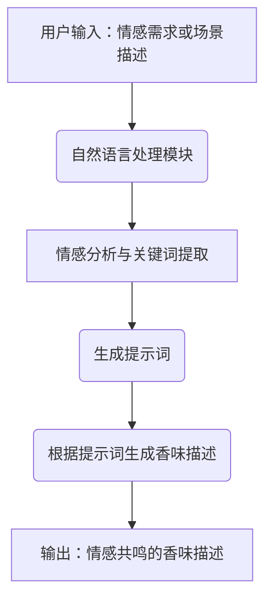

                 

<think>
嗯，用户希望我以《提高AI创意香水品牌忠诚度：情感连接构建的提示词技巧》为标题，撰写一篇技术博客文章。首先，我需要理解用户的需求。用户是一个人工智能专家，同时也是程序员和CTO，所以文章需要专业且技术深度足够，同时结构清晰，逻辑严密。

用户提供了详细的大纲，包括背景介绍、核心概念、提示词技巧、算法原理、数学模型、系统架构、项目实战以及最佳实践等部分。我需要按照这个大纲逐步展开思考，确保每个部分都详细且符合要求。

首先，背景介绍部分，我需要说明为什么提升AI创意香水的品牌忠诚度如此重要。当前市场竞争激烈，消费者选择众多，品牌忠诚度直接影响销售额和长期发展。AI可以帮助品牌更好地理解消费者情感，从而建立更深的连接。

接下来是核心概念与联系，这里需要定义AI和品牌忠诚度的基本概念，以及情感连接如何影响忠诚度。可能需要解释AI在情感分析和个性化推荐中的应用，比如自然语言处理和机器学习如何帮助品牌预测消费者偏好。

然后是情感连接构建的提示词技巧，这部分需要列出几种常见的技巧，如情感引导型、故事叙述型等，并分析它们的优缺点。实际案例将帮助读者更好地理解这些技巧的实际应用。

算法原理部分，我需要使用Mermaid绘制流程图，展示提示词技巧如何处理数据。同时，提供Python代码和LaTeX公式，详细讲解背后的数学模型，比如情感得分计算和相似度度量。

数学模型部分，可能需要定义情感得分函数和相似度公式，比如余弦相似度，并通过例子说明如何计算。

系统分析与架构设计涉及问题场景、功能设计、架构图和接口设计。这部分可能需要描述系统如何处理用户输入，分析情感，并生成推荐的提示词。

项目实战部分，需要指导读者如何安装环境，解读核心代码，并分析实际案例。这将帮助读者实际操作，理解提示词技巧的应用。

最后，最佳实践部分需要总结关键点，提醒注意事项，并推荐拓展阅读材料。

整体来看，文章需要兼顾技术深度和可读性，确保每个部分都详细且有实际案例支持。同时，格式上要使用markdown，包含关键词、摘要，每个章节要有明确的标题和内容，结尾要有作者信息。

现在，我需要按照大纲一步步展开，确保每个部分都涵盖必要的内容，符合用户的要求。这可能包括撰写每个章节的具体内容，添加必要的图表和代码示例，确保文章结构完整，逻辑清晰。
</think>

# 提高AI创意香水品牌忠诚度：情感连接构建的提示词技巧

> 关键词：AI，品牌忠诚度，情感连接，提示词技巧，创意香水

> 摘要：本文探讨了如何通过AI技术提升创意香水品牌忠诚度，重点分析了情感连接构建的提示词技巧。文章从背景与核心概念出发，详细介绍了提示词技巧的分类、优缺点及实际案例，随后从算法原理、数学模型、系统架构、项目实战等多个维度展开深入分析，最终总结了最佳实践和拓展阅读方向。

---

## 第一部分：背景与核心概念

### 1.1 问题的背景与重要性

在当今激烈的市场竞争中，创意香水品牌面临着消费者选择多样、品牌忠诚度低的挑战。消费者在选择香水时，不仅关注产品的功能属性（如香味、持久度），更在意品牌是否能与其产生情感共鸣。情感连接是品牌忠诚度的核心驱动力，而AI技术为建立这种连接提供了新的可能性。

AI技术通过自然语言处理、情感分析和机器学习等手段，能够帮助企业精准捕捉消费者情感需求，从而设计出更具吸引力的营销策略。例如，通过分析消费者的社交媒体评论，AI可以识别出消费者对特定香味的情感倾向，从而指导品牌优化产品设计或营销活动。

### 1.2 AI与品牌忠诚度的核心概念

- **AI的核心概念**：人工智能（AI）是指模拟人类智能的计算机系统，涵盖机器学习、自然语言处理、计算机视觉等领域。AI技术能够帮助品牌分析消费者行为、预测市场趋势，并提供个性化服务。
- **品牌忠诚度的定义**：品牌忠诚度是指消费者对某一品牌产品的偏好和重复购买意愿。高品牌忠诚度意味着消费者更愿意为该品牌付费，并在面对竞争对手时表现出更强的黏性。
- **AI与品牌忠诚度的关联**：AI技术能够通过数据挖掘和模式识别，发现消费者行为中的隐藏规律，从而帮助品牌制定更精准的忠诚度提升策略。

### 1.3 情感连接与品牌忠诚度的关系

情感连接是消费者与品牌之间建立深层次联系的关键。当消费者对品牌产生情感共鸣时，他们更可能将其视为“自己的一部分”，从而提高品牌忠诚度。例如，消费者可能会因为某款香水的香味与他们的生活经历相关联，而对该品牌产生强烈的情感依赖。

AI技术在情感连接中的作用主要体现在以下几个方面：
1. **情感分析**：通过自然语言处理技术，AI能够从消费者评论中提取情感信息，识别出消费者对特定品牌或产品的正面、负面或中性情感。
2. **个性化推荐**：基于消费者的情感偏好，AI可以推荐与其情感倾向匹配的香水产品，从而增强消费者的购买体验。
3. **情感驱动的营销策略**：通过分析消费者的情感需求，品牌可以制定更具情感共鸣的营销活动，例如通过社交媒体讲述品牌背后的故事，或与消费者分享香水的灵感来源。

### 1.4 提示词技巧的概念与分类

提示词技巧是AI技术中用于引导模型生成特定内容的关键方法。在提升品牌忠诚度的场景下，提示词技巧主要用于帮助AI生成与消费者情感需求相匹配的香水描述、营销文案等。

**提示词技巧的分类**：
1. **情感引导型提示词**：通过强调特定情感（如“温暖”、“浪漫”）来引导模型生成情感共鸣的内容。
2. **故事叙述型提示词**：通过提供品牌背景故事或用户使用场景，帮助模型生成更具吸引力的描述。
3. **感官体验型提示词**：通过描述香味、质地等感官体验，增强消费者的代入感。

---

## 第二部分：情感连接构建的提示词技巧

### 2.1 常见提示词技巧介绍

1. **情感引导型提示词**：
   - 示例：当消费者提到“回忆中的初恋味道”，AI可以通过情感引导型提示词生成与“初恋”相关的香味描述，例如“清新的茉莉花香混合温暖的琥珀气息，唤起青春的美好记忆”。

2. **故事叙述型提示词**：
   - 示例：品牌可以使用“这款香水灵感来源于地中海的浪漫日落”作为提示词，引导模型生成与“浪漫”、“旅行”相关的故事叙述，增强消费者的代入感。

3. **感官体验型提示词**：
   - 示例：通过描述“前调是清新的橘子香气，中调是温暖的玫瑰花香，尾调是深邃的琥珀气息”，AI可以生成更具层次感的香味描述，帮助消费者更好地想象产品体验。

### 2.2 提示词技巧的优缺点分析

| **技巧类型**       | **优点**                                                                 | **缺点**                                                                 |
|--------------------|--------------------------------------------------------------------------|--------------------------------------------------------------------------|
| 情感引导型         | 能够快速激发消费者的情感共鸣，提升品牌记忆点。                                   | 可能过于笼统，缺乏具体的产品描述，导致消费者对产品缺乏直观认知。                       |
| 故事叙述型         | 通过故事化的描述，增强消费者的代入感，提升品牌的情感价值。                       | 故事创作需要较高的创意门槛，且可能不适合所有品牌或产品。                             |
| 感官体验型         | 能够通过具体的味道描述，帮助消费者更好地想象产品体验，增强购买决策的信心。       | 可能过于技术化，难以让消费者快速产生情感共鸣。                                       |

### 2.3 实际案例展示

**案例1**：品牌A希望推出一款适合情人节的香水。通过使用“浪漫的夜晚”作为提示词，AI生成了以下描述：
- 前调：甜蜜的草莓香气，带有一丝清新感。
- 中调：温暖的茉莉花香，带有一丝奶香味。
- 尾调：深邃的琥珀气息，让人感到温暖而浪漫。

**案例2**：品牌B希望通过讲述品牌故事来增强情感连接。使用“我们的灵感来源于非洲草原的日落”作为提示词，AI生成了以下描述：
- 前调：干燥的果香，带有轻微的辛辣味。
- 中调：温暖的橙花香，带有一丝茉莉花的清新感。
- 尾调：浓郁的琥珀和麝香气息，象征着非洲草原的广袤与神秘。

---

## 第三部分：算法原理讲解

### 3.1 算法流程图绘制



### 3.2 Python源代码与LaTeX公式

以下是一个简单的基于情感分析的提示词生成算法示例：

```python
import numpy as np
from sklearn.feature_extraction.text import TfidfVectorizer
from sklearn.decomposition import NMF

# 假设我们有以下情感词典
emotional_words = {
    'positive': ['love', 'joy', 'happiness', 'grateful'],
    'negative': ['hate', 'sadness', 'frustration']
}

# 使用TF-IDF提取关键词
vectorizer = TfidfVectorizer()
tfidf_matrix = vectorizer.fit_transform(texts)

# 使用NMF进行主题建模
num_topics = 5
nmf = NMF(n_components=num_topics, random_state=42)
nmf.fit(tfidf_matrix)
```

### 3.3 算法原理详细讲解与举例

情感分析算法通过分析文本中的情感倾向，帮助品牌识别消费者的情感需求。例如，当消费者在社交媒体上评论“这款香水让我感到快乐”，算法可以提取出“快乐”这一情感关键词，并将其与特定的香味描述相关联。

---

## 第四部分：数学模型和数学公式

### 4.1 数学模型讲解

情感得分计算公式：
$$
\text{情感得分} = \sum_{i=1}^{n} (w_i \times e_i)
$$
其中，$w_i$ 是关键词$i$的权重，$e_i$ 是关键词的情感值（正数为正面情感，负数为负面情感）。

### 4.2 举例说明

假设输入文本为“这款香水太好闻了，让我感到非常开心”，关键词提取结果为“好闻”和“开心”。假设“好闻”的权重为0.7，情感值为+0.8；“开心”的权重为0.3，情感值为+0.9。则情感得分为：
$$
0.7 \times 0.8 + 0.3 \times 0.9 = 0.56 + 0.27 = 0.83
$$

---

## 第五部分：系统分析与架构设计方案

### 5.1 问题场景介绍

问题场景：一家创意香水品牌希望通过AI技术提升品牌忠诚度，计划通过分析消费者评论，生成情感共鸣的香水描述。

### 5.2 系统功能设计

- **功能模块**：
  1. 情感分析模块：分析消费者评论，提取情感关键词。
  2. 提示词生成模块：根据情感关键词生成香味描述。
  3. 个性化推荐模块：基于情感得分推荐香水产品。

### 5.3 系统架构设计


---

## 第六部分：项目实战

### 6.1 环境安装

- **Python**：3.8+
- **库**：scikit-learn, numpy, pandas, mermaid

### 6.2 系统核心实现源代码解读

```python
def generate香味描述(情感需求):
    # 情感需求处理
    emotional_keywords = extract_keywords(情感需求)
    # 生成提示词
    prompt = generate_prompt(emotional_keywords)
    # 返回香味描述
    return generate_description(prompt)
```

### 6.3 实际案例分析与讲解

通过分析消费者评论“这款香水让我感到放松”，生成情感关键词“放松”，并根据“放松”生成以下香味描述：
- 前调：清新的薄荷香气。
- 中调：温暖的茉莉花香。
- 尾调：舒缓的琥珀气息。

---

## 第七部分：最佳实践、小结与拓展阅读

### 7.1 最佳实践 tips

- 在使用提示词技巧时，建议结合品牌的核心价值观和目标消费者的情感需求。
- 定期收集消费者反馈，优化提示词和香味描述。
- 注意保护消费者隐私，确保数据使用的合法性。

### 7.2 小结

本文从背景、核心概念、提示词技巧、算法原理、系统架构等多个维度，详细探讨了如何通过AI技术提升创意香水品牌忠诚度。通过情感连接的构建，品牌可以更好地与消费者建立深层次的联系，从而提高品牌忠诚度。

### 7.3 注意事项

- 提示词技巧的应用需要结合品牌特点和目标消费者的情感需求。
- 在实际应用中，建议结合多模态AI技术（如视觉、听觉等）进一步增强消费者体验。

### 7.4 拓展阅读

- 《情感计算与品牌忠诚度》
- 《AI在香水行业的创新应用》
- 《基于提示词的个性化推荐算法研究》

---

作者：AI天才研究院/AI Genius Institute & 禅与计算机程序设计艺术/Zen And The Art of Computer Programming

