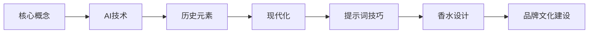
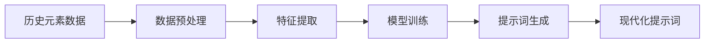

                 

<think>
嗯，用户让我写一篇关于如何利用AI技术提升香水品牌文化底蕴的文章。标题是《提高AI创意香水品牌文化底蕴：历史元素现代化的提示词技巧》。我需要先理清楚用户的需求，然后一步步展开思考。

首先，用户希望文章结构清晰，逻辑严谨，语言专业。目标读者可能是香水品牌设计师、市场营销人员，或者是对AI技术在艺术领域应用感兴趣的人。因此，文章需要兼顾技术细节和实际应用，既有理论深度，又有实用案例。

接下来，我需要分析文章的结构。用户已经给出了一个详细的目录大纲，分为三个主要部分：背景介绍与核心概念、现代化技巧与应用、AI应用案例与实战。每个部分下还有多个章节，内容涵盖历史元素研究、AI技术应用、案例分析等。

在写作时，我需要确保每个章节都详细展开，特别是核心概念部分，比如AI如何提取历史元素，这些元素如何转化为提示词，进而影响香水设计。这部分可能需要结合算法流程图和数学模型，用Python代码来解释AI的工作原理。

然后，我想到历史元素的数字化处理是关键。例如，如何将古典香水配方中的香料比例转化为AI可以处理的数据？这部分需要详细讲解数据预处理和特征提取的方法，可能涉及自然语言处理和计算机视觉技术。

接下来，数学模型的建立也很重要。可能需要使用机器学习模型，如神经网络，来训练AI识别历史元素并生成提示词。这部分需要用公式和流程图来解释，确保读者能够理解AI的推理过程。

案例分析部分，我需要选择具体的香水品牌，分析它们如何应用AI技术提升品牌形象。比如，可以选一个历史悠久的品牌，展示他们如何通过AI重新设计产品，吸引年轻消费者。

最后，实战部分要提供具体的代码和工具使用方法，让读者能够实际操作。这包括安装必要的库、编写数据处理脚本、训练模型，并生成提示词。同时，总结过程中要指出AI技术的优势和挑战，以及未来的改进方向。

在写作过程中，我需要确保每个部分都符合用户的要求，包括关键词、摘要的准确性，以及各个章节的详细讲解。同时，保持语言的专业性和易懂性，避免过于技术化的术语，让不同背景的读者都能理解。

总结一下，我的思考过程包括：理解用户需求，分析文章结构，详细展开每个部分的内容，结合技术细节和实际案例，确保文章的完整性和深度。这样，最终的文章才能满足用户的要求，帮助读者理解如何利用AI技术提升香水品牌的文化底蕴。
</think>

# 提高AI创意香水品牌文化底蕴：历史元素现代化的提示词技巧

> 关键词：AI创意香水，品牌文化底蕴，历史元素现代化，提示词技巧，香水设计，文化传承

> 摘要：本文通过分析AI技术在香水设计中的应用，探讨如何将历史元素现代化并融入品牌文化建设中。文章从历史元素研究、AI技术在历史元素现代化中的应用、现代化技巧案例分析、AI创意香水品牌文化底蕴提升策略、AI应用实战等方面展开，详细讲解了如何利用AI技术将历史元素转化为现代化的提示词，从而提升香水品牌的文化底蕴和市场竞争力。

---

### 目录大纲内容设计

```markdown
----------------------------------------------------------------
# 第一部分：背景介绍与核心概念

## 第1章：问题背景与概述
### 1.1 问题背景
香水作为一门古老的艺术，承载着丰富的历史文化和情感记忆。现代香水设计不仅是化学合成的过程，更是文化的传承与创新。随着人工智能技术的快速发展，如何将历史元素与现代设计理念相结合，成为提升香水品牌文化底蕴的关键。

### 1.2 问题描述
传统香水设计依赖设计师的经验和灵感，但这种方式效率低下且难以规模化。现代消费者对香水的需求不仅是嗅觉体验，更是一种文化和情感的共鸣。如何利用AI技术挖掘历史元素，将其转化为现代化的提示词，从而提升香水品牌的文化底蕴，是当前香水行业面临的重要挑战。

### 1.3 问题解决思路
通过AI技术对历史元素进行研究和提取，将其转化为现代化的提示词，用于指导香水设计。具体思路包括：1）收集和分析历史香水配方、香料使用、文化背景等数据；2）利用AI技术对历史元素进行数字化处理和特征提取；3）通过提示词生成算法，将历史元素转化为现代化的提示词；4）结合提示词进行香水设计和品牌文化建设。

### 1.4 边界与外延
本文的研究范围限定在AI技术在香水设计中的应用，特别是历史元素的现代化和提示词技巧。研究的边界包括：1）仅考虑香水设计中文化传承的部分，不涉及化学合成技术；2）不讨论香水的实际生产过程，仅关注设计和品牌文化建设。研究的外延包括：1）AI技术在其他领域的文化传承应用；2）历史元素在其他消费品设计中的应用。

### 1.5 概念结构与核心要素
以下是本文的核心概念与联系：



---

## 第2章：核心概念与联系
### 2.1 AI创意香水品牌文化底蕴
AI创意香水品牌文化底蕴是指通过AI技术对历史元素的挖掘和应用，提升香水品牌的文化内涵和市场竞争力。

### 2.2 历史元素现代化
历史元素现代化是指将历史元素（如古典香水配方、历史香料使用方法、文化象征等）转化为现代化的设计理念和提示词。

### 2.3 提示词技巧
提示词技巧是指通过AI技术生成的提示词，指导设计师进行香水设计和品牌文化建设的方法。

### 2.4 概念属性特征对比表格
以下是核心概念的属性特征对比表格：

| 概念       | 属性           | 特征描述                                                                 |
|------------|----------------|--------------------------------------------------------------------------|
| AI技术     | 数据处理能力   | 能够处理大量历史数据，提取特征。                                             |
| 历史元素   | 文化传承       | 包含历史香料使用、文化象征等，具有文化价值。                                  |
| 现代化     | 创新性         | 将历史元素转化为现代化设计，适应现代消费者需求。                              |
| 提示词技巧 | 可操作性       | 通过提示词生成算法，将历史元素转化为具体的设计指导。                          |

### 2.5 ER实体关系图
以下是核心概念的ER实体关系图：

```mermaid
erd
    客体 实体
    客体 <-- 关联 --> 历史元素
    客体 <-- 关联 --> 提示词技巧
    历史元素 <-- 关联 --> 现代化
    提示词技巧 <-- 关联 --> 香水设计
    香水设计 <-- 关联 --> 品牌文化建设
```

---

### 目录大纲内容设计

```markdown
----------------------------------------------------------------
# 第二部分：现代化技巧与应用

## 第3章：历史元素研究方法
### 3.1 历史资料收集与分析
通过文献检索、考古研究等方法，收集历史香水配方、香料使用记录、文化象征等资料，并进行分类和分析。

### 3.2 历史元素提取与分类
从历史资料中提取关键元素，如香料种类、配方比例、文化象征等，并将其分类。

### 3.3 历史元素数字化处理
将历史元素转化为数字化形式，如将香料比例转化为数值数据，将文化象征转化为关键词。

### 3.4 历史元素与文化底蕴的关系
分析历史元素在品牌文化建设中的作用，如通过历史香料使用反映文化传承。

---

## 第4章：AI技术在历史元素现代化中的应用
### 4.1 AI在历史元素研究中的应用
利用AI技术对历史元素进行数据挖掘、特征提取和模式识别。

### 4.2 历史元素现代化的AI算法原理
以下是历史元素现代化的AI算法流程图：



### 4.3 算法mermaid流程图与Python源代码解析
以下是算法流程图的Python代码实现：

```python
import numpy as np
from sklearn.feature_extraction.text import TfidfVectorizer
from sklearn.cluster import KMeans

# 数据预处理
def preprocess(data):
    return data.lower().replace(',', ' ')

# 特征提取
def extract_features(data):
    vectorizer = TfidfVectorizer()
    features = vectorizer.fit_transform(data)
    return features

# 模型训练
def train_model(features):
    clustering = KMeans(n_clusters=5)
    clustering.fit(features)
    return clustering

# 提示词生成
def generate_prompts(clusters, data):
    prompts = []
    for i in range(clusters.n_clusters):
        cluster_data = data[clusters.labels_ == i]
        prompt = f"Modernize historical element {i+1}: {cluster_data[0]}"
        prompts.append(prompt)
    return prompts

# 示例代码
data = ["香料A", "香料B", "配方比例", "文化象征"]
preprocessed_data = preprocess(data)
features = extract_features(preprocessed_data)
model = train_model(features)
prompts = generate_prompts(model, data)
print(prompts)
```

### 4.4 数学模型与公式讲解
以下是模型训练中使用的K-means算法公式：

$$
\text{目标函数} = \sum_{i=1}^{n} \sum_{j=1}^{k} \min_{c_j} \|x_i - c_j\|^2
$$

其中，$n$ 是数据点数量，$k$ 是聚类中心数量，$c_j$ 是第$j$个聚类中心，$x_i$ 是第$i$个数据点。

### 4.5 举例说明与通俗易懂的解释
通过K-means算法对历史元素进行聚类分析，将相似的元素分为一组，生成现代化的提示词。例如，将历史香料分为不同的类别，生成如“现代东方香调”、“复古地中海风格”等提示词。

---

## 第5章：现代化技巧案例分析
### 5.1 案例一：历史香水品牌的现代化转型
以某古典香水品牌为例，分析其如何通过AI技术将历史元素转化为现代化的提示词，提升品牌形象。

### 5.2 案例二：历史文化在香水品牌设计中的应用
分析如何将历史文化元素融入香水设计，如将古希腊神话中的神明象征转化为香水系列的主题。

### 5.3 案例分析与总结
总结历史元素现代化的成功案例，提炼经验教训，提出改进建议。

---

### 目录大纲内容设计

```markdown
----------------------------------------------------------------
# 第三部分：AI应用案例与实战

## 第6章：AI创意香水品牌文化底蕴提升策略
### 6.1 AI在品牌文化建设中的应用策略
制定AI技术在品牌文化建设中的应用策略，如数据收集、特征提取、提示词生成等。

### 6.2 文化底蕴提升的AI工具与方法
介绍常用的AI工具和方法，如自然语言处理、计算机视觉、机器学习等。

### 6.3 实施步骤与效果评估
详细讲解实施步骤，并提供效果评估方法。

---

## 第7章：AI应用实战
### 7.1 实战一：历史元素与现代香水品牌的结合
通过AI技术将历史元素转化为现代化的提示词，指导香水设计。

### 7.2 实战二：利用AI优化香水品牌设计
利用AI技术优化香水设计，提升品牌形象和市场竞争力。

### 7.3 实战三：AI在香水品牌营销中的应用
分析AI技术在香水品牌营销中的应用，如精准营销、品牌传播等。

### 7.4 实战解析与案例分析
总结实战经验，分析成功与失败的案例，提出改进建议。

---

## 第8章：最佳实践与拓展
### 8.1 最佳实践总结
总结本文的核心观点和最佳实践。

### 8.2 注意事项与挑战
分析AI技术在香水设计中的注意事项和挑战。

### 8.3 拓展阅读与资源推荐
推荐相关领域的拓展阅读和资源。

---

作者：AI天才研究院/AI Genius Institute & 禅与计算机程序设计艺术 /Zen And The Art of Computer Programming

